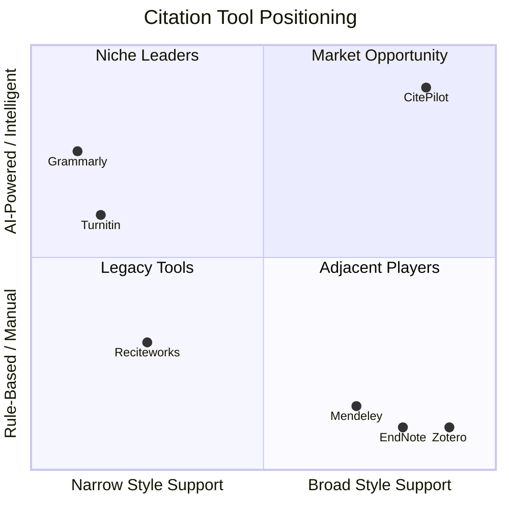

# Competitive Analysis — CitePilot

> **Document ID**: CP-DS-001  
> **Version**: 1.0  
> **Last Updated**: 2026-07-14  
> **Author**: Product Strategy Team  
> **Status**: Approved  
> **Classification**: Internal — Confidential

---

## 1. Executive Summary

CitePilot enters the academic citation-checking market as an AI-native platform competing against a fragmented landscape of rule-based checkers, reference managers, and general writing assistants. The primary direct competitor is **Reciteworks** — the only dedicated citation consistency checker with meaningful market presence. Secondary competitors include reference managers (Zotero, Mendeley, EndNote) that offer limited citation validation, and writing platforms (Grammarly, Turnitin) that tangentially address citation quality.

Our analysis reveals a significant market gap: no existing tool combines AI-powered citation extraction, multi-style support, external source validation, hallucinated citation detection, and actionable correction suggestions in a single product. CitePilot is positioned to capture this gap with a 10x improvement over the current market leader across accuracy, style coverage, and intelligence of feedback.

---

## 2. Market Landscape

### 2.1 Market Segmentation

The academic citation tooling market operates across four functional categories:

| Category | Description | Key Players |
|---|---|---|
| **Citation Consistency Checkers** | Validate in-text citations against reference lists | Reciteworks |
| **Reference Managers** | Organize, store, and auto-generate citations | Zotero, Mendeley, EndNote, Paperpile |
| **Writing Assistants** | Grammar, style, and light citation formatting | Grammarly, ProWritingAid |
| **Plagiarism/Integrity** | Source matching, similarity detection | Turnitin, iThenticate, Copyscape |

CitePilot's primary competitive arena is **Citation Consistency Checkers**, where Reciteworks is the sole established player. However, CitePilot's feature set crosses into reference validation (competing with Crossref-powered tools) and integrity checking (competing with Turnitin's source verification).

### 2.2 Total Addressable Market (TAM)

| Metric | Value | Source |
|---|---|---|
| Global higher education enrollment | 235 million students | UNESCO 2025 |
| Active academic researchers worldwide | 9.2 million | Elsevier/Scopus |
| Professional academic editors (English) | ~120,000 | EFA, CIEP estimates |
| Higher education institutions globally | ~30,000 | WHED |
| Annual academic papers published | 5.5 million | Dimensions 2025 |

**Estimated serviceable addressable market (SAM)**: English-language academic writers actively producing cited documents — approximately 45 million users annually.

**Serviceable obtainable market (SOM)**: With freemium distribution targeting 1% penetration in Year 1 — approximately 450,000 users.

---

## 3. Competitor Deep Dives

### 3.1 Reciteworks (Primary Competitor)

**URL**: [reciteworks.com](https://reciteworks.com)  
**Founded**: ~2015 (UK-based)  
**Business Model**: Freemium SaaS  
**Technology**: Rule-based pattern matching (regex + heuristics)

#### Product Capabilities

- Accepts `.docx` upload or plain text paste
- Detects "References" heading to split body text from reference list
- Extracts in-text citations using regex patterns for author-date formats
- Cross-references each extracted citation against parsed reference list entries
- Flags mismatches: no match found, author mismatch, year mismatch, multiple matches, possible citations
- Performs stylistic checks: missing commas, et al. usage, ampersand vs "and"
- Checks alphabetical ordering of reference lists
- Counts reference occurrences
- Manual "Adjust" feature for correcting reference list boundary detection
- Annotated article view with colour-coded years (green/orange/red)
- Single-column and split-window view options
- Filters: issues only, style warnings, possible citations, by year/author
- Magnifying glass for in-context viewing
- Ignore button per citation
- PDF export (paid)
- Crossref integration (paid)
- Retraction Watch check (paid)
- Google OAuth login
- 36-hour document deletion policy
- Encryption for stored documents

#### Pricing

| Tier | Price | Limits |
|---|---|---|
| Free | $0 | 2 uploads/day, 2,500 words, 50 references |
| Student | $5.99/month | Unlimited uploads, 25,000 words, 500 references |
| Professional | $11.99/month | Unlimited everything, Crossref, Retraction Watch, PDF export |
| Team | $9.99/user/month (min 3) | Professional features + shared workspace |

#### Strengths

- First-mover advantage in dedicated citation checking
- Clean, functional UI with useful colour-coding system
- Reasonable pricing for student market
- GDPR-compliant with document deletion policy
- Crossref and Retraction Watch integrations in paid tier

#### Weaknesses

- **Only 3 citation styles**: APA 6, APA 7, Harvard — all author-date systems only
- **Rule-based engine**: High false-positive rate; flags random 4-digit numbers (e.g., "2020" in "the Covid-19 pandemic in 2020") as citations
- **Fragile reference detection**: Requires exact "References" heading on its own line — fails with "Bibliography", "Works Cited", or non-standard headings
- **Single reference list only**: Breaks entirely on multi-chapter theses or dissertations with per-chapter bibliographies
- **No source verification** in free tier: Cannot verify if a cited paper actually exists without paid Crossref feature
- **No hallucinated citation detection**: Cannot identify fabricated or AI-generated fake references
- **Error flags only**: Reports problems without explanations or suggested corrections
- **No reference type awareness**: Cannot distinguish journal articles from books, websites, or reports — applies same rules to all
- **No quote verification**: Cannot check whether a direct quote actually appears in the cited source
- **No API access**: No programmatic integration for editors or institutional workflows
- **Limited document format support**: Only `.docx` and plain text — no PDF input

#### Market Position

Reciteworks occupies a niche but defensible position as the only dedicated citation consistency checker. Its limitations create significant user frustration (evidenced by Reddit threads, Trustpilot reviews, and academic forum complaints about false positives), but the absence of alternatives has allowed it to maintain its user base. Estimated monthly active users: 15,000–30,000 based on SimilarWeb traffic data and Chrome extension installs.

---

### 3.2 Zotero

**URL**: [zotero.org](https://zotero.org)  
**Type**: Open-source reference manager  
**Business Model**: Freemium (storage tiers)  
**Technology**: Desktop application + browser extension + cloud sync

#### Relevance to CitePilot

Zotero is a reference management tool, not a citation checker. However, it occupies adjacent mindshare: users who manage their references in Zotero may expect citation consistency to be handled there.

#### Key Capabilities

- Browser extension captures references from web, databases, library catalogs
- Local library for organizing references with tags, folders, collections
- Word processor plugins (Word, LibreOffice, Google Docs) for inserting citations
- Supports 10,000+ citation styles via CSL (Citation Style Language)
- PDF annotation and management
- Group libraries for collaborative research
- Free 300 MB cloud storage; paid plans up to unlimited
- Open-source with active community

#### What Zotero Does NOT Do

- Does not validate that in-text citations match the reference list
- Does not detect missing references or orphaned citations
- Does not check for retracted papers
- Does not verify source existence against external databases
- Does not detect hallucinated citations
- Cannot analyze an existing document for citation consistency

#### Competitive Interaction

Zotero is **complementary, not competitive**. CitePilot should integrate with Zotero's API to pull reference libraries and cross-validate. Users who write with Zotero still need CitePilot to verify the final document. Partnership opportunity exists.

**User base**: ~12 million registered users (Zotero's public stats).

---

### 3.3 Mendeley

**URL**: [mendeley.com](https://www.mendeley.com)  
**Type**: Reference manager (Elsevier-owned)  
**Business Model**: Free (Elsevier ecosystem play)  
**Technology**: Desktop + web application

#### Relevance to CitePilot

Similar to Zotero — a reference manager with no citation consistency checking. Mendeley's Elsevier ownership gives it deep Scopus integration but also creates vendor lock-in concerns among academics.

#### Key Capabilities

- Reference library with PDF storage and annotation
- Word processor citation plugin
- Mendeley Cite for Word
- Social/collaborative features: groups, profiles, discover
- Integration with Scopus and ScienceDirect
- Mendeley Data for research data sharing
- Free 2 GB cloud storage; institutional plans available

#### What Mendeley Does NOT Do

- No citation consistency validation
- No detection of missing/orphaned references
- No retraction checking
- No source verification
- No hallucinated citation detection
- Limited citation style flexibility compared to Zotero's CSL system

#### Competitive Interaction

Mendeley is **complementary but with caveats**. Elsevier could build citation checking into Mendeley, making them a future competitive threat. However, Elsevier's history suggests they would monetize this aggressively, creating opportunity for CitePilot's more accessible pricing.

**User base**: ~8 million registered users.

---

### 3.4 EndNote

**URL**: [endnote.com](https://endnote.com)  
**Type**: Reference manager (Clarivate-owned)  
**Business Model**: Paid license ($274.95 one-time or $175/year)  
**Technology**: Desktop application + EndNoteOnline

#### Relevance to CitePilot

EndNote is the premium reference manager for institutional and professional researchers. It does not perform citation consistency checking.

#### Key Capabilities

- Comprehensive reference management with 7,000+ output styles
- Advanced PDF management and annotation
- Manuscript matching (suggests target journals based on content)
- Deep integration with Web of Science (Clarivate's database)
- Cite While You Write for Word
- Library sharing and collaboration
- Institutional site licenses

#### What EndNote Does NOT Do

- No post-hoc citation consistency verification
- No retraction detection
- No hallucinated citation detection
- No reference validation against external databases
- Cannot audit an existing document for errors

#### Competitive Interaction

EndNote serves a high-value professional segment. CitePilot targets the same users for a different workflow stage — after writing, before submission. **No direct competition; strong complementary potential.** Institutional sales channels overlap.

**User base**: ~3 million active users (Clarivate estimates).

---

### 3.5 Grammarly

**URL**: [grammarly.com](https://www.grammarly.com)  
**Type**: AI-powered writing assistant  
**Business Model**: Freemium SaaS ($12/month Premium, $15/month Business)  
**Technology**: NLP/ML-based grammar, style, and tone analysis

#### Relevance to CitePilot

Grammarly is the dominant AI writing assistant but has minimal citation-specific functionality. It may flag basic formatting issues in citations but does not perform systematic citation-reference cross-validation.

#### Key Capabilities

- Grammar, spelling, punctuation correction
- Clarity, engagement, delivery suggestions
- Tone detection and adjustment
- Plagiarism detection (Premium)
- GenAI writing assistance (GrammarlyGO)
- Browser extension, desktop app, Word/Google Docs plugin, mobile keyboard
- Enterprise admin dashboard and analytics

#### What Grammarly Does NOT Do

- No systematic citation consistency checking
- No reference list validation
- No citation style enforcement beyond basic formatting
- No retraction detection
- No source verification
- No hallucinated citation detection
- Cannot parse in-text citations or match them to references

#### Competitive Interaction

Grammarly is **adjacent, not competitive**. However, Grammarly's massive user base (30M+ DAU) and AI capabilities mean they *could* build citation checking features. This is a medium-term competitive threat. CitePilot's depth of citation-specific functionality would be difficult to replicate as a Grammarly add-on.

**User base**: 30+ million daily active users.

---

### 3.6 Turnitin / iThenticate

**URL**: [turnitin.com](https://www.turnitin.com)  
**Type**: Academic integrity / plagiarism detection  
**Business Model**: Institutional licensing  
**Technology**: Text similarity matching against 99B+ web pages, 1.8B student papers

#### Relevance to CitePilot

Turnitin detects text similarity (plagiarism) but does not validate citation accuracy or consistency. However, Turnitin's institutional relationships and recent AI-detection features make it a relevant ecosystem player.

#### Key Capabilities

- Similarity checking against massive database
- AI writing detection (GPT, Claude, etc.)
- Feedback Studio for instructor grading
- Gradescope for assessment
- iThenticate for researcher/publisher use
- Integration with 100+ LMS platforms
- Institutional licensing model

#### What Turnitin Does NOT Do

- No citation consistency checking (does not verify in-text citations match reference list)
- No citation style validation
- No retraction detection
- No source existence verification
- No hallucinated citation detection
- Cannot identify orphaned references or missing citations

#### Competitive Interaction

Turnitin is **complementary but occupies the institutional budget**. Universities that pay for Turnitin may view CitePilot as an additional cost. However, the use cases are distinct: Turnitin checks for plagiarism, CitePilot checks for citation accuracy. **Partnership opportunity**: Turnitin could integrate CitePilot's citation checking into their platform. This is both an opportunity and a risk if Turnitin builds this functionality in-house.

**User base**: 40+ million students across 16,000+ institutions.

---

## 4. Feature Comparison Matrix

| Feature | CitePilot | Reciteworks | Zotero | Mendeley | EndNote | Grammarly | Turnitin |
|---|:---:|:---:|:---:|:---:|:---:|:---:|:---:|
| **Citation-Reference Matching** | ✅ AI-powered | ✅ Rule-based | ❌ | ❌ | ❌ | ❌ | ❌ |
| **Citation Styles Supported** | 9+ | 3 | N/A | N/A | N/A | N/A | N/A |
| **APA 7** | ✅ | ✅ | N/A | N/A | N/A | N/A | N/A |
| **APA 6** | ✅ | ✅ | N/A | N/A | N/A | N/A | N/A |
| **Harvard** | ✅ | ✅ | N/A | N/A | N/A | N/A | N/A |
| **Vancouver** | ✅ | ❌ | N/A | N/A | N/A | N/A | N/A |
| **Chicago** | ✅ | ❌ | N/A | N/A | N/A | N/A | N/A |
| **MLA** | ✅ | ❌ | N/A | N/A | N/A | N/A | N/A |
| **IEEE** | ✅ | ❌ | N/A | N/A | N/A | N/A | N/A |
| **OSCOLA** | ✅ | ❌ | N/A | N/A | N/A | N/A | N/A |
| **Turabian** | ✅ | ❌ | N/A | N/A | N/A | N/A | N/A |
| **Numeric Citation Support** | ✅ | ❌ | N/A | N/A | N/A | N/A | N/A |
| **Footnote Citation Support** | ✅ | ❌ | N/A | N/A | N/A | N/A | N/A |
| **False-Positive Reduction (AI)** | ✅ | ❌ | N/A | N/A | N/A | N/A | N/A |
| **Flexible Ref Section Detection** | ✅ AI-based | ⚠️ Heading only | N/A | N/A | N/A | N/A | N/A |
| **Multi-Reference-List Support** | ✅ | ❌ | N/A | N/A | N/A | N/A | N/A |
| **Reference Type Awareness** | ✅ | ❌ | N/A | N/A | N/A | N/A | N/A |
| **AI Explanations & Suggestions** | ✅ | ❌ | N/A | N/A | N/A | N/A | N/A |
| **Crossref Validation** | ✅ (Paid) | ✅ (Paid) | ❌ | ❌ | ❌ | ❌ | ❌ |
| **OpenAlex Validation** | ✅ | ❌ | ❌ | ❌ | ❌ | ❌ | ❌ |
| **PubMed Validation** | ✅ | ❌ | ❌ | ❌ | ❌ | ❌ | ❌ |
| **DOI Resolution** | ✅ | ❌ | ✅ | ✅ | ✅ | ❌ | ❌ |
| **Retraction Watch Integration** | ✅ (Paid) | ✅ (Paid) | ❌ | ❌ | ❌ | ❌ | ❌ |
| **Hallucinated Citation Detection** | ✅ | ❌ | ❌ | ❌ | ❌ | ❌ | ❌ |
| **Document Upload (.docx)** | ✅ | ✅ | N/A | N/A | N/A | ✅ | ✅ |
| **Document Upload (.pdf)** | ✅ | ❌ | N/A | N/A | N/A | ❌ | ✅ |
| **Plain Text Input** | ✅ | ✅ | N/A | N/A | N/A | ✅ | ❌ |
| **PDF Export of Results** | ✅ (Paid) | ✅ (Paid) | N/A | N/A | N/A | N/A | ✅ |
| **API Access** | ✅ (Pro) | ❌ | ✅ | ✅ | ❌ | ✅ | ✅ |
| **Institutional/SSO** | ✅ | ❌ | ❌ | ✅ | ✅ | ✅ | ✅ |
| **Reference Manager** | ❌ | ❌ | ✅ | ✅ | ✅ | ❌ | ❌ |
| **Grammar/Style Checking** | ❌ | ❌ | ❌ | ❌ | ❌ | ✅ | ❌ |
| **Plagiarism Detection** | ❌ | ❌ | ❌ | ❌ | ❌ | ✅ | ✅ |
| **AI Writing Detection** | ❌ | ❌ | ❌ | ❌ | ❌ | ❌ | ✅ |

---

## 5. SWOT Analysis — CitePilot

### 5.1 Strengths

| # | Strength | Impact |
|---|---|---|
| S1 | AI-native architecture — LLM-powered extraction dramatically reduces false positives and enables contextual understanding | High |
| S2 | 9+ citation style support covering author-date, numeric, and footnote systems — 3x more than nearest competitor | High |
| S3 | Hallucinated citation detection — unique feature with no competitor offering | High |
| S4 | Multi-database validation (Crossref, OpenAlex, PubMed, DOI.org) — most comprehensive source verification in market | High |
| S5 | AI-generated explanations and correction suggestions — transforms error flags into actionable guidance | Medium |
| S6 | Multi-reference-list support — enables thesis and dissertation workflows | Medium |
| S7 | Modern tech stack (Next.js, FastAPI, GPT-4o) — fast iteration, strong developer experience | Medium |
| S8 | Flexible reference section detection — AI finds reference lists regardless of heading format | Medium |
| S9 | Reference type awareness — different validation rules for journals, books, websites, reports | Medium |
| S10 | API access for professional workflows — enables editor toolchain integration | Low |

### 5.2 Weaknesses

| # | Weakness | Mitigation |
|---|---|---|
| W1 | No brand recognition — entering market as unknown against established tools | Aggressive content marketing, academic community engagement, free tier viral loop |
| W2 | AI inference costs create higher per-unit costs than rule-based competitors | Tiered AI usage — use fast heuristics for obvious cases, reserve LLM calls for ambiguous cases; aggressive caching |
| W3 | LLM latency — AI processing is slower than regex pattern matching | Async processing with progress indicators; optimize with streaming results and parallel API calls |
| W4 | Dependency on OpenAI/Claude APIs — third-party reliability and pricing risk | Multi-provider strategy with fallback; evaluate fine-tuned open-source models (Llama) for cost reduction over time |
| W5 | No existing institutional relationships — Turnitin and Elsevier have entrenched university contracts | Start with individual users and grassroots adoption; institutional sales in Phase 2 |
| W6 | No reference management features — users need separate tools for organizing references | Position as complementary; build integrations with Zotero/Mendeley via API |

### 5.3 Opportunities

| # | Opportunity | Likelihood | Impact |
|---|---|---|---|
| O1 | AI-hallucinated citations becoming a widespread problem as LLM usage in academic writing grows — drives urgent demand for detection tools | High | High |
| O2 | University mandates for citation checking before submission — create institutional sales pipeline | Medium | High |
| O3 | Integration partnerships with Zotero, Overleaf, Google Docs — massive distribution channels | Medium | High |
| O4 | Academic publisher partnerships (Elsevier, Springer, Wiley) — citation pre-screening before peer review | Medium | High |
| O5 | Expansion into non-English academic markets (Mandarin, Spanish, Portuguese, Arabic) | Low | High |
| O6 | Browser extension for real-time citation checking while writing | Medium | Medium |
| O7 | LMS integration (Canvas, Moodle, Blackboard) — reach students through existing platforms | Medium | Medium |
| O8 | Open-access compliance checking — verify that cited sources meet funder OA requirements | Low | Medium |

### 5.4 Threats

| # | Threat | Likelihood | Impact | Mitigation |
|---|---|---|---|---|
| T1 | Grammarly adds citation checking features | Medium | High | Build deep domain expertise that's difficult to replicate as a feature add-on; establish brand as the specialist tool |
| T2 | Turnitin builds citation consistency checking into their platform | Medium | High | Differentiate on AI quality and user experience; pursue OEM/white-label partnership with Turnitin |
| T3 | Reciteworks adopts AI and expands style support | Medium | Medium | Move fast — ship and iterate; build network effects (institutional accounts, user data moat) |
| T4 | OpenAI/Anthropic pricing increases erode unit economics | Medium | Medium | Multi-provider strategy; invest in fine-tuning smaller models; optimize prompt engineering to reduce token usage |
| T5 | Academic pushback against AI tools in academic integrity context | Low | Medium | Position as verification tool (checking accuracy, not generating content); transparent about AI usage |
| T6 | Free open-source alternative emerges | Low | Low | SaaS convenience, enterprise features, and continuous AI improvement create defensible value |

---

## 6. Pricing Comparison

| Feature / Limit | CitePilot Free | CitePilot Student | CitePilot Pro | Reciteworks Free | Reciteworks Student | Reciteworks Pro |
|---|---|---|---|---|---|---|
| **Price** | $0 | $4.99/mo | $12.99/mo | $0 | $5.99/mo | $11.99/mo |
| **Uploads/day** | 3 | Unlimited | Unlimited | 2 | Unlimited | Unlimited |
| **Word limit** | 5,000 | 50,000 | Unlimited | 2,500 | 25,000 | Unlimited |
| **Reference limit** | 100 | 1,000 | Unlimited | 50 | 500 | Unlimited |
| **Citation styles** | 3 (APA 7, Harvard, MLA) | All 9+ | All 9+ | 3 (APA 6/7, Harvard) | 3 | 3 |
| **AI explanations** | ❌ | ✅ | ✅ | ❌ | ❌ | ❌ |
| **Crossref validation** | ❌ | ❌ | ✅ | ❌ | ❌ | ✅ |
| **Retraction check** | ❌ | ❌ | ✅ | ❌ | ❌ | ✅ |
| **Hallucination detection** | ❌ | ✅ | ✅ | ❌ | ❌ | ❌ |
| **PDF export** | ❌ | ✅ | ✅ | ❌ | ❌ | ✅ |
| **API access** | ❌ | ❌ | ✅ | ❌ | ❌ | ❌ |
| **Multi-ref-list** | ❌ | ✅ | ✅ | ❌ | ❌ | ❌ |
| **SSO/Institutional** | ❌ | ❌ | Custom | ❌ | ❌ | ❌ |

**Pricing Strategy Rationale**: CitePilot is priced $1/month below Reciteworks at the Student tier while offering dramatically more features (AI explanations, hallucination detection, 9+ styles, multi-reference-list support). The Professional tier is priced $1/month above Reciteworks but includes API access, which Reciteworks does not offer at any tier. The free tier is 2x more generous (5,000 vs 2,500 words; 100 vs 50 references; 3 vs 2 daily uploads) to maximize top-of-funnel volume.

---

## 7. Gap Analysis

### 7.1 Gaps in Current Market (Opportunities for CitePilot)

| Gap ID | Gap Description | Current Market State | CitePilot Solution | Priority |
|---|---|---|---|---|
| G1 | No tool supports numeric citation styles (Vancouver, IEEE) | Reciteworks supports author-date only | Full Vancouver, IEEE, OSCOLA support in MVP | Critical |
| G2 | No tool detects AI-hallucinated/fabricated citations | Zero market coverage | Multi-database verification + AI plausibility scoring | Critical |
| G3 | Citation checkers don't explain errors or suggest fixes | Reciteworks only flags errors | GPT-4o generates natural-language explanations and corrections | High |
| G4 | Multi-chapter documents with separate reference lists are unsupported | Reciteworks handles single list only | AI-based document structure detection with multi-list support | High |
| G5 | Reference section detection requires exact heading match | Reciteworks requires "References" on its own line | AI-based section detection handles any heading or format | High |
| G6 | No tool combines multiple external databases for source verification | Reciteworks uses Crossref only (paid) | Crossref + OpenAlex + PubMed + DOI.org in a unified verification pipeline | High |
| G7 | No false-positive reduction using contextual AI | Rule-based systems flag any 4-digit number as potential citation | LLM understands context — knows "2020" in "the year 2020" is not a citation | High |
| G8 | Citation checkers don't identify reference types | All references treated identically | AI classifies each reference (journal article, book, chapter, website, report, thesis) and applies type-specific rules | Medium |
| G9 | No tool checks whether quoted text appears in the cited source | Zero market coverage | Future feature: full-text verification against open-access sources | Future |
| G10 | No PDF input support for citation checking | Reciteworks accepts .docx only | PDF parsing via pdfplumber/Apache Tika | Medium |

### 7.2 Feature Parity Requirements (Match Reciteworks)

These are features CitePilot must match to avoid competitive disadvantage:

| Parity ID | Feature | Status |
|---|---|---|
| P1 | .docx file upload | MVP |
| P2 | Plain text paste input | MVP |
| P3 | Color-coded results (green/orange/red) | MVP |
| P4 | Author mismatch detection | MVP |
| P5 | Year mismatch detection | MVP |
| P6 | Missing reference detection | MVP |
| P7 | Orphaned reference detection (in list but never cited) | MVP |
| P8 | "et al." usage validation | MVP |
| P9 | Ampersand vs "and" checking | MVP |
| P10 | Alphabetical order check | MVP |
| P11 | Reference occurrence counting | MVP |
| P12 | Annotated document view | MVP |
| P13 | Filter by issue type | MVP |
| P14 | Split-window view | MVP |
| P15 | Ignore button per citation | MVP |
| P16 | PDF export | V1.1 |
| P17 | Crossref integration | V1.1 |
| P18 | Retraction Watch integration | V1.1 |
| P19 | Google OAuth | MVP |
| P20 | Document auto-deletion policy | MVP |

---

## 8. Market Positioning Strategy

### 8.1 Positioning Statement

> **For** academic writers, researchers, and editors **who need** accurate citation consistency checking, **CitePilot is** an AI-powered citation verification platform **that** intelligently matches in-text citations to reference lists across 9+ citation styles, detects fabricated sources, and provides actionable correction suggestions. **Unlike** Reciteworks and manual proofreading, **CitePilot** uses large language models to understand citation context, dramatically reducing false positives while catching errors that rule-based tools miss.

### 8.2 Positioning Map

### 8.3 Key Differentiators (Messaging Hierarchy)

1. **Primary**: "AI-powered accuracy — not just pattern matching" → Dramatically fewer false positives, contextual understanding
2. **Secondary**: "Every citation style, one platform" → 9+ styles including numeric and footnote systems
3. **Tertiary**: "Catch what others can't" → Hallucinated citation detection, multi-database source verification
4. **Supporting**: "Fixes, not just flags" → AI-generated explanations and suggested corrections

### 8.4 Competitive Response Playbook

| If Competitor Does... | CitePilot Response |
|---|---|
| Reciteworks adds more styles | Emphasize AI accuracy advantage and hallucination detection — style count is necessary but not sufficient |
| Reciteworks adds AI features | Highlight CitePilot's deeper AI integration, multi-model architecture, and faster iteration cycle |
| Grammarly adds citation checking | Position as specialist vs generalist; emphasize depth of citation analysis, multi-database verification, institutional features |
| Turnitin adds citation checking | Pursue partnership discussions; if competitive, emphasize superior UX and individual user accessibility |
| New AI-native competitor enters | Accelerate feature development; leverage existing user base and institutional relationships; compete on accuracy benchmarks |

---

## 9. Competitive Intelligence Monitoring Plan

| Signal | Source | Frequency | Owner |
|---|---|---|---|
| Reciteworks feature releases | Product page, changelog, social media | Weekly | Product |
| Grammarly academic features | Blog, press releases, App Store updates | Bi-weekly | Product |
| Turnitin product announcements | Press, EdTech conferences, LMS forums | Monthly | Business Development |
| Academic tool discussions | Reddit r/AskAcademia, r/GradSchool, Twitter/X | Daily (automated alerts) | Marketing |
| New competitor launches | Product Hunt, TechCrunch, Google Alerts | Daily (automated) | Product |
| Patent filings (citation checking) | Google Patents, USPTO | Quarterly | Legal |
| Pricing changes across competitors | Competitor pricing pages | Monthly | Product |
| Academic publisher partnerships | Publisher press releases, conference proceedings | Quarterly | Business Development |

---

## 10. Strategic Recommendations

### 10.1 Immediate (Pre-Launch)

1. **Build and publish accuracy benchmarks** comparing CitePilot vs Reciteworks on standardized test documents across all supported styles — this becomes primary marketing ammunition
2. **Secure early-access users** from PhD student communities (Reddit r/GradSchool, Twitter academic communities) for beta testing and testimonials
3. **Develop "Why CitePilot?" comparison page** for SEO capture of "Reciteworks alternative" search queries
4. **Create integration partnerships** with Zotero and Overleaf to establish distribution channels before launch

### 10.2 Short-Term (Months 1–3 Post-Launch)

1. **Aggressive free tier** to maximize user acquisition — more generous limits than Reciteworks at every dimension
2. **Content marketing blitz**: blog posts on citation best practices, style guides, "how to avoid citation errors" targeting long-tail SEO
3. **Academic conference presence** at key education technology events
4. **Freemium conversion optimization** — use in-product prompts showing users what paid features would have caught

### 10.3 Medium-Term (Months 4–12)

1. **Institutional sales pilot** with 5–10 universities for enterprise validation
2. **API partnerships** with academic publishers for pre-submission citation screening
3. **Expand language support** to capture non-English academic markets
4. **Develop accuracy moat** through continuous model fine-tuning on user correction data (with consent)

---

*Document End — CP-DS-001 v1.0*
