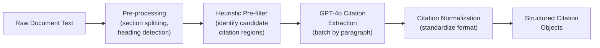
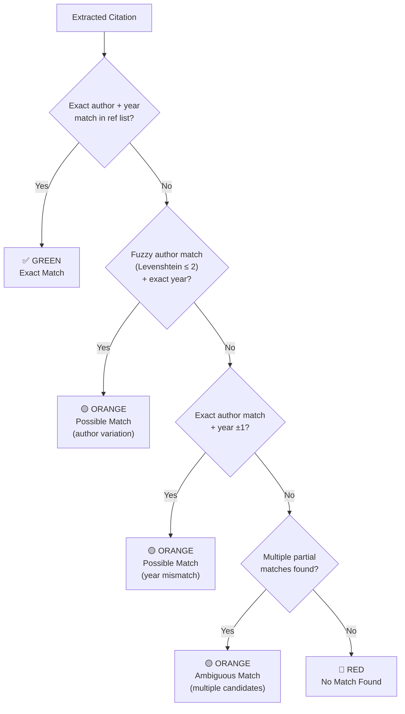
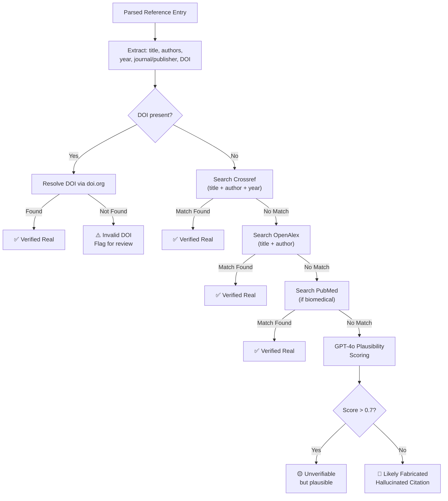
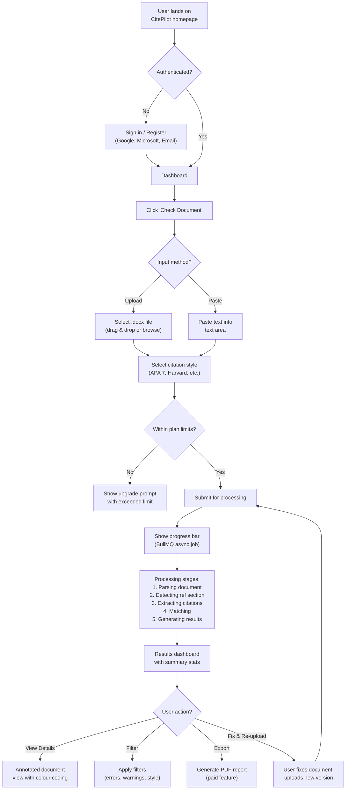
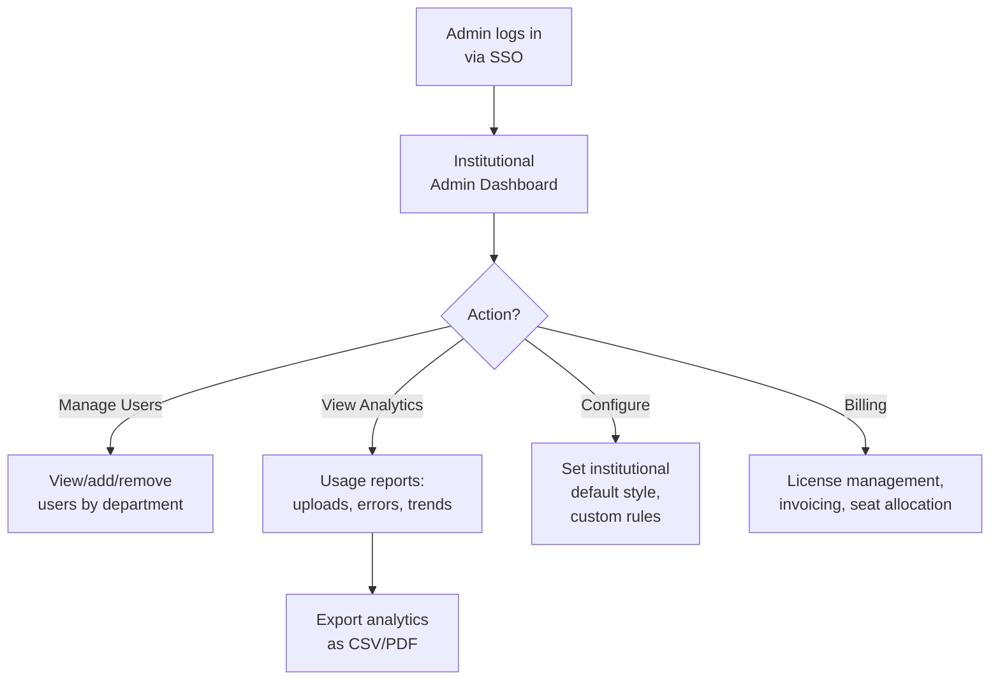
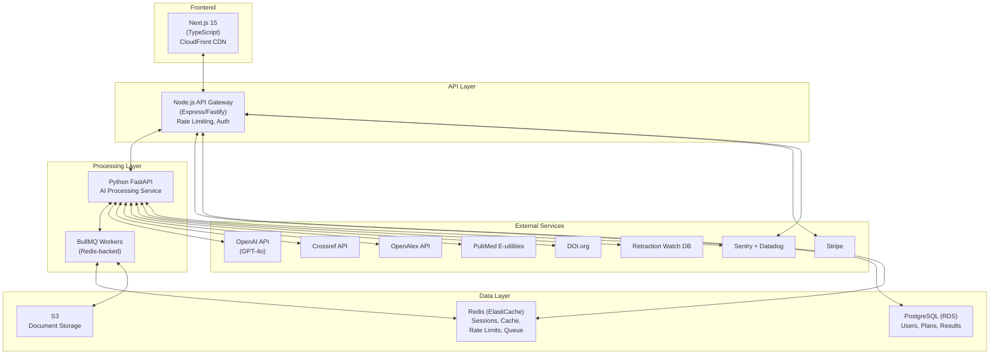

# Product Requirements Document — CitePilot

> **Document ID**: CP-DS-002  
> **Version**: 1.0  
> **Last Updated**: 2026-07-14  
> **Author**: Product Team  
> **Status**: Approved  
> **Classification**: Internal — Confidential

---

## 1. Executive Summary

CitePilot is an AI-powered academic citation consistency checker that verifies in-text citations match reference list entries across 9+ citation styles, detects fabricated sources, validates references against external databases, and provides AI-generated correction suggestions. It targets students, researchers, editors, and institutions with a freemium SaaS model.

This PRD defines the complete product requirements for CitePilot from MVP through future vision, organized by MoSCoW prioritization with measurable success criteria.

---

## 2. Problem Statement

### 2.1 The Core Problem

Academic writers — students, researchers, and professionals — spend significant time manually verifying that every in-text citation correctly corresponds to an entry in their reference list, and vice versa. This process is:

- **Error-prone**: Studies estimate 25–40% of published academic papers contain at least one citation error (Sievert & Andrews, 1991; Harzing, 2002). These range from misspelled author names to entirely missing references.
- **Time-consuming**: Manual citation checking for a 10,000-word dissertation with 150 references takes 2–4 hours.
- **Increasingly complex**: The proliferation of citation styles (APA 7, Chicago, Vancouver, IEEE, MLA, Harvard, OSCOLA, Turabian) means writers must master style-specific rules.
- **Compounded by AI writing tools**: LLMs (ChatGPT, Claude, Gemini) generate plausible-looking but entirely fabricated citations — a phenomenon termed "citation hallucination." These fake references are virtually impossible to detect by manual reading.

### 2.2 Why Existing Solutions Fail

The sole dedicated citation checker (Reciteworks) uses rule-based pattern matching that:
- Supports only 3 citation styles (APA 6, APA 7, Harvard)
- Generates excessive false positives by flagging any 4-digit number as a potential citation
- Cannot verify if cited sources actually exist
- Cannot detect AI-hallucinated references
- Provides error flags without explanations or corrections
- Fails on documents with non-standard reference section headings or multiple reference lists

Reference managers (Zotero, Mendeley, EndNote) organize sources but do not validate the final document for citation consistency.

### 2.3 The Opportunity

CitePilot uses large language models (GPT-4o with Claude fallback) to understand citation context, extract citations with near-human accuracy, match them intelligently against reference lists, and validate sources against external databases — delivering a 10x improvement in accuracy, style coverage, and actionability over existing solutions.

---

## 3. Target Users & Personas

### 3.1 Persona 1: Sarah — Undergraduate Student

| Attribute | Detail |
|---|---|
| **Name** | Sarah Chen |
| **Age** | 21 |
| **Role** | 3rd-year Psychology undergraduate, University of Leeds |
| **Tech Comfort** | High — uses Grammarly, Google Docs, Canva daily |
| **Citation Experience** | Basic — learned APA 7 in Year 1, still makes frequent errors |
| **Document Types** | Essays (2,000–5,000 words), lab reports, literature reviews |
| **Pain Points** | Loses marks for citation errors she doesn't know how to fix; confused by APA 7 rules for different source types; spends hours re-checking citations before submission; used ChatGPT to help write a paper and isn't sure if the references are real |
| **Willingness to Pay** | Low — would use free tier; might pay $4.99/month during dissertation period |
| **Success Metric** | "I submitted my essay and got zero citation errors flagged by my lecturer" |
| **Usage Frequency** | 2–4 times per month during term, daily during dissertation period |
| **Key Feature Needs** | Basic citation matching, AI explanations of errors, APA 7 support, hallucination detection |

**User Journey**: Sarah writes her essay in Google Docs, exports to .docx, uploads to CitePilot, reviews colour-coded results, reads AI explanations, fixes errors, re-uploads to verify, submits essay.

### 3.2 Persona 2: Dr. James — PhD Researcher

| Attribute | Detail |
|---|---|
| **Name** | Dr. James Okafor |
| **Age** | 29 |
| **Role** | PhD candidate in Biomedical Engineering, Imperial College London |
| **Tech Comfort** | Very high — uses LaTeX, Overleaf, Zotero, R, Python |
| **Citation Experience** | Advanced — proficient in Vancouver/IEEE for engineering journals, APA for interdisciplinary work |
| **Document Types** | Journal manuscripts (8,000–12,000 words), PhD thesis chapters (15,000+ words each), conference papers |
| **Pain Points** | Thesis has 6 chapters with separate reference lists — no tool handles this; switching between Vancouver (for engineering journals) and APA (for psychology collaborations) is error-prone; reviewers have flagged citation inconsistencies in submissions; needs to verify 400+ references across his thesis before viva |
| **Willingness to Pay** | Medium — $4.99/month easily justified; would pay $12.99/month during thesis writing (6+ months) |
| **Success Metric** | "My thesis passed citation review with zero errors across all 6 chapters" |
| **Usage Frequency** | Weekly during active writing; daily in the month before thesis submission |
| **Key Feature Needs** | Multi-reference-list support, Vancouver/IEEE styles, Crossref validation, PDF input, batch processing |

**User Journey**: James exports each thesis chapter from Overleaf as .docx, uploads the full thesis document to CitePilot, selects Vancouver style, CitePilot detects 6 separate reference lists and validates each independently, James reviews results per chapter, applies corrections in Overleaf, exports and re-validates.

### 3.3 Persona 3: Professor Williams — Academic Editor

| Attribute | Detail |
|---|---|
| **Name** | Margaret Williams |
| **Age** | 54 |
| **Role** | Freelance academic editor and proofreader, 15 years experience |
| **Tech Comfort** | Moderate — proficient in Word, basic familiarity with online tools |
| **Citation Experience** | Expert — works across all major styles; APA 7, Chicago, Harvard, MLA, Vancouver, IEEE |
| **Document Types** | Client manuscripts across all disciplines, 5–15 documents per week |
| **Pain Points** | Manually checking citations is the most time-consuming part of editing — takes 30–60 minutes per document; different clients use different styles; needs a reliable tool that doesn't generate false positives (wastes billable time investigating non-issues); current tools (Reciteworks) miss too many real errors in non-APA styles; needs PDF export to include with her editing report; wants API access to integrate with her workflow |
| **Willingness to Pay** | High — $12.99/month is a business expense; would pay more for guaranteed accuracy |
| **Success Metric** | "I catch every citation error in half the time" |
| **Usage Frequency** | Daily, multiple documents per day |
| **Key Feature Needs** | All 9+ styles, high accuracy (low false positives), PDF export, API access, fast processing, batch upload |

**User Journey**: Margaret receives a client manuscript in Word, uploads to CitePilot, selects the client's required style, reviews results (expects <5% false positive rate), exports PDF report with annotations, includes in her editing package to the client, invoices client.

### 3.4 Persona 4: Dr. Patel — Institutional Administrator

| Attribute | Detail |
|---|---|
| **Name** | Dr. Ananya Patel |
| **Age** | 42 |
| **Role** | Director of Academic Integrity, University of Melbourne |
| **Tech Comfort** | High — manages institutional SaaS tools, LMS integrations |
| **Citation Experience** | Policy-level — sets university citation standards, doesn't personally check citations |
| **Document Types** | Oversees citation checking across 40,000 students and 3,000 researchers |
| **Pain Points** | University pays for Turnitin (plagiarism) but has no citation accuracy tool; students submit papers with fabricated AI-generated references; lecturers spend hours manually checking citations; needs institutional-level solution with SSO, usage analytics, and per-department reporting; must comply with university data governance policy (Australian data residency requirements) |
| **Willingness to Pay** | High — institutional budget $15,000–$50,000/year for university-wide license |
| **Success Metric** | "Citation errors in student submissions decreased by 60% within one semester" |
| **Usage Frequency** | Dashboard access weekly; tool used by 40,000 students throughout the year |
| **Key Feature Needs** | SSO (SAML/OIDC), admin dashboard, usage analytics, per-department reporting, bulk licensing, data governance controls, LMS integration (Canvas) |

**User Journey**: Dr. Patel evaluates CitePilot in a pilot with the School of Engineering (2,000 students), reviews usage analytics and error reduction metrics after one semester, presents ROI to IT procurement committee, negotiates institutional license, rolls out university-wide with SSO integration through Canvas LMS.

### 3.5 Persona 5: Marcus — Dissertation Coach

| Attribute | Detail |
|---|---|
| **Name** | Marcus Rivera |
| **Age** | 36 |
| **Role** | Independent dissertation coach, works with 15–25 PhD students simultaneously |
| **Tech Comfort** | High — uses Zoom, Notion, Google Workspace daily |
| **Citation Experience** | Advanced — works across APA, Chicago, Harvard; advises students on citation practices |
| **Document Types** | Reviews student thesis chapters, provides feedback on citation quality |
| **Pain Points** | Spends 20% of coaching time on citation issues rather than content/methodology; needs to quickly identify citation problems in student drafts; students use different styles depending on their department; wants to share a tool recommendation with students that they can use independently; needs a professional-looking report to include in coaching feedback |
| **Willingness to Pay** | Medium — $12.99/month as business expense; would love a referral/affiliate program |
| **Success Metric** | "I can identify all citation issues in a student's chapter in 5 minutes instead of 45" |
| **Usage Frequency** | 3–5 times per week |
| **Key Feature Needs** | Fast processing, multiple styles, PDF export, sharable results link, possibly team/group features |

---

## 4. Feature Requirements

### 4.1 Feature List — MoSCoW Prioritization

#### Must Have (MVP — Launch)

| ID | Feature | Description | Persona(s) |
|---|---|---|---|
| F-001 | Document upload (.docx) | Accept Microsoft Word .docx files up to 100,000 words | All |
| F-002 | Plain text paste input | Accept plain text via paste or text area input | Sarah, James |
| F-003 | Citation style selection | User selects citation style before analysis; support APA 7, APA 6, Harvard in MVP | All |
| F-004 | AI-powered citation extraction | Use GPT-4o to extract in-text citations with contextual understanding, avoiding false positives on non-citation numbers/dates | All |
| F-005 | Reference list detection | AI-based detection of reference section regardless of heading format ("References", "Bibliography", "Works Cited", etc.) | All |
| F-006 | Citation-reference matching | Match extracted in-text citations against parsed reference list entries; detect: exact match, author mismatch, year mismatch, no match, possible match | All |
| F-007 | Missing citation detection | Flag references in the list that are never cited in the body text (orphaned references) | All |
| F-008 | Missing reference detection | Flag in-text citations that have no corresponding reference list entry | All |
| F-009 | Colour-coded results view | Display results with green (matched), orange (possible match/warning), red (no match/error) colour coding | All |
| F-010 | Annotated document view | Show the original document with inline annotations highlighting each citation and its match status | All |
| F-011 | Split-window view | Side-by-side view of document body and reference list with linked scrolling | All |
| F-012 | Issue filtering | Filter results by issue type (errors only, warnings only, matched only), by author, by year | All |
| F-013 | Ignore function | Allow users to dismiss/ignore individual citation flags they've reviewed | All |
| F-014 | Stylistic checks | Check for common style errors: comma placement, "et al." usage, ampersand vs "and", page number formatting | All |
| F-015 | Alphabetical order check | Validate that reference list entries are in correct alphabetical order per style rules | All |
| F-016 | Reference occurrence counting | Count how many times each reference is cited in the body text | All |
| F-017 | User authentication | Google OAuth, Microsoft OAuth, email/password registration via NextAuth.js | All |
| F-018 | Free tier rate limiting | Enforce free tier limits: 3 uploads/day, 5,000 words, 100 references | All |
| F-019 | Document auto-deletion | Delete uploaded documents and analysis results after 48 hours; user can manually delete earlier | All |
| F-020 | Responsive web UI | Fully responsive Next.js frontend with mobile-friendly layout | All |
| F-021 | Async processing with progress | Documents are processed asynchronously via BullMQ; show real-time progress bar | All |
| F-022 | Results summary dashboard | Overview page showing total citations found, matched, warnings, errors, with expandable detail | All |

#### Should Have (V1.1 — Month 2-3)

| ID | Feature | Description | Persona(s) |
|---|---|---|---|
| F-023 | AI explanations | GPT-4o generates natural-language explanations for each flagged issue, explaining what's wrong and why | Sarah, Marcus |
| F-024 | AI correction suggestions | For each error, suggest the correct citation format or reference entry | Sarah, James, Marcus |
| F-025 | Vancouver style support | Full support for Vancouver (numeric) citation style | James |
| F-026 | IEEE style support | Full support for IEEE citation style | James |
| F-027 | Chicago style support | Full support for Chicago (notes-bibliography and author-date) | Margaret |
| F-028 | MLA style support | Full support for MLA citation style | Sarah, Margaret |
| F-029 | OSCOLA style support | Full support for OSCOLA legal citation style | Margaret |
| F-030 | Turabian style support | Full support for Turabian citation style | Margaret |
| F-031 | PDF document upload | Accept PDF files as input using pdfplumber/Apache Tika | James, Margaret |
| F-032 | Multi-reference-list support | Detect and independently validate multiple reference lists (e.g., per-chapter bibliographies) | James |
| F-033 | Reference type classification | AI identifies each reference as journal article, book, chapter, website, report, thesis, conference paper, etc. | Margaret |
| F-034 | Crossref validation | Verify reference entries against Crossref API — confirm DOI, title, authors, year | James, Margaret |
| F-035 | OpenAlex validation | Cross-reference citations against OpenAlex database for existence verification | James, Margaret |
| F-036 | PubMed validation | Validate biomedical references against PubMed E-utilities | James |
| F-037 | DOI resolution | Resolve and validate DOIs against doi.org registry | James, Margaret |
| F-038 | Hallucinated citation detection | Combine multi-database lookup + AI plausibility scoring to flag likely fabricated references | Sarah, James, Dr. Patel |
| F-039 | Retraction Watch integration | Check all references against Retraction Watch database for retracted papers | James, Margaret |
| F-040 | PDF export | Export analysis results as formatted PDF report with annotations, summary, and issue details | Margaret, Marcus |
| F-041 | Subscription management | Stripe-powered subscription management: upgrade, downgrade, cancel, billing history | All paid |
| F-042 | Student plan features | Unlock student tier features: unlimited uploads, all styles, AI explanations, 50,000 word limit | Sarah, James |
| F-043 | Professional plan features | Unlock pro tier: Crossref, retraction check, PDF export, API, unlimited words | Margaret, Marcus |

#### Could Have (V2 — Month 4-8)

| ID | Feature | Description | Persona(s) |
|---|---|---|---|
| F-044 | API access (REST) | RESTful API with API key auth for programmatic citation checking | Margaret |
| F-045 | Batch document upload | Upload and process multiple documents in a single session | Margaret |
| F-046 | Analysis history | Store and retrieve past analysis results (within retention period) | All paid |
| F-047 | Sharable results link | Generate a read-only link to share analysis results with others | Marcus, James |
| F-048 | Document comparison | Compare two versions of a document to show citation improvements | James, Sarah |
| F-049 | Browser extension (Chrome) | Chrome extension for real-time citation checking in Google Docs | Sarah |
| F-050 | Institutional admin dashboard | Admin portal with user management, usage analytics, department grouping | Dr. Patel |
| F-051 | SSO integration (SAML/OIDC) | Single sign-on for institutional deployments | Dr. Patel |
| F-052 | Usage analytics & reporting | Per-department usage reports, error trends, adoption metrics | Dr. Patel |
| F-053 | Bulk licensing | Manage seat-based institutional licenses | Dr. Patel |
| F-054 | LMS integration (Canvas) | Integration with Canvas LMS for assignment-level citation checking | Dr. Patel |
| F-055 | Custom style rules | Allow institutional admins to define custom citation style rules | Dr. Patel |
| F-056 | Zotero integration | Import reference libraries from Zotero for cross-validation | James |
| F-057 | Mendeley integration | Import reference libraries from Mendeley | James |
| F-058 | Overleaf integration | Direct integration with Overleaf for LaTeX document checking | James |
| F-059 | Multi-language UI | Internationalize UI for Spanish, Portuguese, Mandarin, Arabic | All |

#### Won't Have (Future / Out of Scope for V1-V2)

| ID | Feature | Description | Rationale |
|---|---|---|---|
| F-060 | Reference management | Full reference library management (competing with Zotero/Mendeley) | Out of scope — complementary market; integrate instead |
| F-061 | Grammar/style checking | General grammar and writing style checking | Out of scope — complementary market (Grammarly) |
| F-062 | Plagiarism detection | Text similarity checking against document databases | Out of scope — complementary market (Turnitin) |
| F-063 | Full-text quote verification | Verify that direct quotes appear in the cited source | Requires full-text access to cited papers — legal and technical barriers; evaluate in Year 2 |
| F-064 | Citation generation | Auto-generate citation strings from a DOI or URL | Adjacent feature — consider for V3 if strategically valuable |
| F-065 | Manuscript formatting | Format manuscripts to target journal requirements | Out of scope — different problem space |

---

## 5. Detailed Feature Specifications

### 5.1 F-004: AI-Powered Citation Extraction

**Priority**: Must Have (MVP)  
**Complexity**: High  
**Dependencies**: OpenAI API, document parser

#### Description

The system uses GPT-4o to extract in-text citations from the document body. Unlike rule-based regex extraction, the AI understands context and can:

- Distinguish actual citations from incidental author names, dates, and numbers
- Handle all citation formats: parenthetical `(Smith, 2023)`, narrative `Smith (2023)`, numeric `[1]`, footnote superscripts, ibid references
- Recognize citations with multiple authors, page numbers, and "et al."
- Avoid false positives: "in the year 2020" is not a citation; "Smith described the process" without a year may or may not be a citation depending on style

#### Processing Pipeline



#### Output Schema

```json
{
  "citations": [
    {
      "id": "cit-001",
      "raw_text": "(Smith & Jones, 2023, p. 45)",
      "authors": ["Smith", "Jones"],
      "year": "2023",
      "page": "45",
      "type": "parenthetical",
      "style_detected": "APA7",
      "position": {
        "paragraph": 3,
        "char_start": 245,
        "char_end": 278
      },
      "confidence": 0.97
    }
  ]
}
```

#### Acceptance Criteria

- Citation extraction precision ≥ 95% (≤5% false positives)
- Citation extraction recall ≥ 98% (≤2% missed citations)
- Processes 10,000-word document in ≤ 30 seconds
- Correctly ignores non-citation dates, numbers, and author names in narrative context
- Handles at least APA 7, APA 6, and Harvard in MVP

### 5.2 F-006: Citation-Reference Matching

**Priority**: Must Have (MVP)  
**Complexity**: High  
**Dependencies**: F-004 (citation extraction), F-005 (reference list detection)

#### Description

The matching engine compares each extracted in-text citation against parsed reference list entries to determine match status.

#### Matching Algorithm



#### Match Result Categories

| Category | Colour | Description | Action |
|---|---|---|---|
| Exact Match | 🟢 Green | Citation perfectly matches a reference entry | No action needed |
| Possible Match — Author | 🟡 Orange | Year matches, author name is similar but not exact (e.g., "Smyth" vs "Smith") | Review suggested; AI shows both entries |
| Possible Match — Year | 🟡 Orange | Author matches, year is off by 1 (e.g., "2023" in text, "2024" in reference) | Review suggested; common pre-print/publication date discrepancy |
| Ambiguous Match | 🟡 Orange | Multiple reference entries could match (e.g., Smith 2023a, Smith 2023b without suffix in citation) | Review suggested; show all candidates |
| No Match | 🔴 Red | No reference list entry matches the citation | Error — missing reference or typo |
| Orphaned Reference | 🔴 Red | Reference exists in list but is never cited in body text | Error — unused reference |
| Style Warning | 🟡 Orange | Citation matched but has style formatting issues (comma, et al., ampersand) | Style warning with correction suggestion |

#### Acceptance Criteria

- Matching accuracy ≥ 97% on test corpus of 500 documents across APA 7, APA 6, Harvard
- False match rate ≤ 1% (incorrectly marking a citation as matched when it doesn't correspond to the listed reference)
- Processing time ≤ 5 seconds for matching phase (separate from extraction)
- Correctly handles multi-author citations, "et al." variations, and same-author-same-year disambiguation

### 5.3 F-038: Hallucinated Citation Detection

**Priority**: Should Have (V1.1)  
**Complexity**: Very High  
**Dependencies**: F-034 (Crossref), F-035 (OpenAlex), F-036 (PubMed), F-037 (DOI)

#### Description

Detects citations that appear legitimate but reference papers that do not exist — a growing problem as AI writing assistants generate fabricated references.

#### Detection Pipeline



#### AI Plausibility Scoring Factors

- Does the journal name actually exist?
- Is the journal in the correct discipline for the topic?
- Are the author names associated with real researchers in this field (via OpenAlex)?
- Is the volume/issue/page number format plausible for the stated journal?
- Are there temporal inconsistencies (e.g., citing a 2025 paper in a journal that ceased publication in 2020)?

#### Acceptance Criteria

- Detects ≥ 90% of known hallucinated citations in test corpus
- False accusation rate ≤ 3% (real papers incorrectly flagged as potentially hallucinated)
- Provides clear explanation of why a citation is flagged as potentially fabricated
- Completes verification for 100-reference document in ≤ 60 seconds (parallel API calls)
- Gracefully handles API rate limits and failures with retry logic

---

## 6. User Flows

### 6.1 Primary User Flow — Document Upload and Analysis



### 6.2 Institutional Admin Flow



---

## 7. Non-Functional Requirements

### 7.1 Performance

| Metric | Target | Measurement |
|---|---|---|
| Document processing time (5,000 words) | ≤ 15 seconds | End-to-end from upload to results display |
| Document processing time (50,000 words) | ≤ 90 seconds | End-to-end |
| API response time (non-AI endpoints) | ≤ 200ms p95 | Application monitoring |
| Frontend Time to Interactive | ≤ 2.5 seconds | Lighthouse |
| Concurrent document processing | 100 simultaneous jobs | Load testing |
| External API validation (100 references) | ≤ 60 seconds | Parallel requests with rate limiting |

### 7.2 Scalability

| Dimension | Target |
|---|---|
| Registered users | Support 500,000 in Year 1 |
| Monthly active users | Support 50,000 MAU |
| Daily document uploads | Support 10,000/day |
| Peak concurrent users | 2,000 |
| Database size | 500 GB (PostgreSQL RDS) |
| File storage | 2 TB (S3, auto-archived after deletion window) |

### 7.3 Security & Privacy

| Requirement | Implementation |
|---|---|
| Data encryption at rest | AES-256 via AWS RDS encryption and S3 SSE |
| Data encryption in transit | TLS 1.3 for all connections |
| Document auto-deletion | Automated deletion 48 hours after upload; user can trigger immediate deletion |
| Authentication | NextAuth.js with OAuth 2.0 (Google, Microsoft) and bcrypt-hashed email/password |
| Authorization | Role-based access control (RBAC): user, admin, super-admin |
| API authentication | API key + rate limiting per key |
| GDPR compliance | Right to deletion, data export, consent management, EU data residency option |
| SOC 2 readiness | Architecture designed for SOC 2 Type II compliance by Year 2 |
| Document isolation | Each user's documents and results are isolated; no cross-user data access |
| AI data policy | Documents are NOT used to train AI models; OpenAI API used with data processing agreement (zero retention) |

### 7.4 Reliability

| Metric | Target |
|---|---|
| Uptime SLA | 99.9% (8.76 hours downtime/year max) |
| Recovery Time Objective (RTO) | 1 hour |
| Recovery Point Objective (RPO) | 5 minutes |
| Error rate (5xx) | < 0.1% of requests |
| Job failure rate | < 0.5% of processing jobs |
| Failover | Multi-AZ deployment in AWS |

### 7.5 Accessibility

| Standard | Target |
|---|---|
| WCAG compliance | WCAG 2.1 AA |
| Screen reader support | Full semantic HTML, ARIA labels, keyboard navigation |
| Color contrast | 4.5:1 minimum for all text |
| Colour-blind accommodations | Pattern/icon indicators in addition to colour coding |
| Focus indicators | Visible focus rings on all interactive elements |
| Touch targets | Minimum 44×44px for all interactive elements |

---

## 8. Technical Architecture

### 8.1 System Architecture



### 8.2 Technology Stack Summary

| Layer | Technology | Rationale |
|---|---|---|
| Frontend | Next.js 15, TypeScript, Tailwind CSS | SSR for SEO, React ecosystem, type safety |
| API Gateway | Node.js (Fastify) | Efficient request routing, auth middleware, rate limiting |
| AI Processing | Python FastAPI | Python ecosystem for NLP/AI/document parsing libraries |
| Queue | BullMQ (Redis-backed) | Reliable async job processing with retry, priority queues |
| Primary DB | PostgreSQL (AWS RDS) | Relational data, ACID compliance, mature tooling |
| Cache / Sessions | Redis (AWS ElastiCache) | Sub-ms latency for sessions, rate limiting, caching |
| File Storage | AWS S3 | Scalable object storage with lifecycle policies |
| CDN | AWS CloudFront | Global edge caching for frontend assets |
| Compute | AWS ECS/Fargate | Serverless containers, auto-scaling, no server management |
| AI Models | OpenAI GPT-4o (primary), Claude (fallback) | Best-in-class accuracy for citation analysis |
| Doc Parsing | python-docx, pdfplumber, Apache Tika | Comprehensive format support |
| Auth | NextAuth.js | Battle-tested auth with OAuth provider support |
| Payments | Stripe | Industry standard for SaaS billing |
| Monitoring | Datadog (infra), Sentry (errors) | Full-stack observability |
| CI/CD | GitHub Actions | Native GitHub integration, marketplace actions |

---

## 9. Success Metrics & KPIs

### 9.1 Product Metrics

| KPI | Target (Month 3) | Target (Month 6) | Target (Month 12) |
|---|---|---|---|
| Registered users | 5,000 | 25,000 | 100,000 |
| Monthly active users (MAU) | 1,500 | 8,000 | 35,000 |
| Daily uploads | 200 | 1,200 | 5,000 |
| Free → Paid conversion rate | 3% | 5% | 7% |
| Paid subscriber count | 150 | 1,250 | 7,000 |
| Monthly recurring revenue (MRR) | $750 | $8,750 | $56,000 |
| Churn rate (monthly) | <10% | <8% | <5% |
| Net Promoter Score (NPS) | 30 | 45 | 55 |

### 9.2 Quality Metrics

| KPI | Target |
|---|---|
| Citation extraction precision | ≥ 95% |
| Citation extraction recall | ≥ 98% |
| Citation-reference matching accuracy | ≥ 97% |
| False positive rate (overall) | ≤ 5% |
| Hallucinated citation detection recall | ≥ 90% |
| Hallucinated citation false accusation rate | ≤ 3% |
| User-reported false positive rate | ≤ 3% (after 6 months of model tuning) |

### 9.3 Operational Metrics

| KPI | Target |
|---|---|
| Uptime | ≥ 99.9% |
| Average processing time (5K words) | ≤ 15 seconds |
| P95 API response time | ≤ 200ms |
| Error rate (5xx) | < 0.1% |
| Support ticket resolution time | < 24 hours |
| Deployment frequency | Daily (CI/CD) |
| Mean time to recovery (MTTR) | < 1 hour |

---

## 10. Constraints

| Constraint | Description | Impact |
|---|---|---|
| AI API costs | GPT-4o costs ~$5/$15 per 1M input/output tokens; each document analysis uses 2,000–20,000 tokens | Limits free tier generosity; requires cost optimization |
| External API rate limits | Crossref (50 req/s polite pool), PubMed (3 req/s without API key), OpenAlex (10 req/s) | Limits throughput for reference validation; requires queuing and caching |
| LLM latency | GPT-4o responses take 1–5 seconds per call | Document processing cannot be real-time; requires async architecture |
| Document format limitations | PDF text extraction is imperfect (especially for scanned PDFs, complex layouts) | May produce lower accuracy on PDF inputs vs .docx; communicate to users |
| Citation style complexity | Each citation style has 100+ rules and edge cases | Requires extensive test corpora per style; phased style rollout |
| Data privacy regulations | GDPR (EU), FERPA (US education), Australian Privacy Act | Constrains data retention, processing location, and third-party sharing |
| Bootstrap budget | Pre-revenue; limited runway for infrastructure costs | Start with minimal infrastructure, scale with revenue |

---

## 11. Assumptions

| Assumption | Risk if Invalid | Validation Plan |
|---|---|---|
| GPT-4o can accurately extract citations across all major styles with >95% precision | Core product value proposition fails | Beta testing with 500-document test corpus; benchmark against manual expert extraction |
| Students and researchers will pay $4.99–$12.99/month for citation checking | Revenue model fails | Free tier usage data → conversion experiments; survey-based willingness-to-pay analysis |
| Hallucinated citations are a growing problem that users care about | Key differentiator lacks market demand | Track LLM usage in academic writing; survey academics on AI citation concerns |
| External API integrations (Crossref, OpenAlex, PubMed) remain free or low-cost | Source validation feature becomes cost-prohibitive | Monitor API terms of service; build caching layer to reduce API calls |
| Users will upload documents rather than expecting real-time in-editor checking | Limits adoption among users who want inline tools | Plan browser extension for V2; monitor feature request frequency |
| Institutional buyers will adopt after individual user traction | Enterprise revenue stream delayed or absent | Early pilot programs with 3–5 universities; validate procurement process |

---

## 12. Dependencies

| Dependency | Type | Risk Level | Mitigation |
|---|---|---|---|
| OpenAI GPT-4o API | External service | Medium | Claude fallback; evaluate open-source models quarterly |
| Crossref REST API | External service | Low | Well-established API; cache results aggressively |
| OpenAlex API | External service | Low | Free, reliable API; cache results |
| PubMed E-utilities | External service | Low | NCBI-managed; requires API key for higher rate limits |
| Retraction Watch database | External data | Medium | Negotiate data access agreement; fallback to manual checks |
| Stripe | External service | Low | Industry standard; mature API |
| AWS infrastructure | Cloud provider | Low | Multi-AZ deployment; infrastructure-as-code for portability |
| python-docx library | Open source | Low | Mature, well-maintained library |
| pdfplumber / Apache Tika | Open source | Low | Multiple fallback options for PDF parsing |
| NextAuth.js | Open source | Low | Active community; well-documented |

---

## 13. Release Plan

### Phase 1: MVP (Month 0–2)

**Goal**: Launch with core citation checking for APA 7, APA 6, and Harvard. Establish product-market fit.

**Features**: F-001 through F-022 (all Must Have features)

**Success Gate**: 1,000 registered users, 200 MAU, <8% false positive rate on APA 7

### Phase 2: V1.1 (Month 2–4)

**Goal**: Expand style support, add AI explanations, integrate external databases, launch paid tiers.

**Features**: F-023 through F-043 (all Should Have features)

**Success Gate**: 10,000 registered users, 3,000 MAU, 100 paid subscribers, <5% false positive rate across all styles

### Phase 3: V2 (Month 4–8)

**Goal**: Enterprise readiness, API launch, integrations, institutional pilot.

**Features**: F-044 through F-058 (all Could Have features)

**Success Gate**: 50,000 registered users, 15,000 MAU, 2,000 paid subscribers, 3 institutional pilots

### Phase 4: Scale (Month 8–12)

**Goal**: International expansion, LMS integrations, platform partnerships.

**Features**: F-059 + features informed by user feedback

**Success Gate**: 100,000 registered users, 35,000 MAU, 7,000 paid subscribers, $56K MRR

---

## 14. Open Questions

| # | Question | Owner | Due Date | Status |
|---|---|---|---|---|
| 1 | Should we support LaTeX (.tex) input in MVP or V2? | Product | 2026-08-01 | Open |
| 2 | What is the optimal document size limit for the free tier to balance acquisition vs cost? | Product + Finance | 2026-08-01 | Decided: 5,000 words |
| 3 | Should the AI explanations feature be gated to paid tiers only? | Product | 2026-08-15 | Decided: Paid only |
| 4 | What Retraction Watch data access model works — API, database dump, or partnership? | Engineering + BD | 2026-09-01 | Open |
| 5 | Should we build a Word add-in or browser extension first for V2? | Product | 2026-10-01 | Open |
| 6 | What is our data residency strategy for non-US institutional customers? | Legal + Engineering | 2026-09-15 | Open |

---

## 15. Glossary

| Term | Definition |
|---|---|
| **In-text citation** | A reference to a source within the body of a document, formatted according to a citation style (e.g., "(Smith, 2023)" in APA) |
| **Reference list** | The list of full bibliographic entries at the end of a document (also called "bibliography" or "works cited") |
| **Orphaned reference** | A reference list entry that is never cited in the body text |
| **Hallucinated citation** | A fabricated reference that does not correspond to any real published source, typically generated by AI writing tools |
| **Citation style** | A standardized system of rules for formatting citations and references (e.g., APA 7, Harvard, Vancouver) |
| **Author-date system** | Citation styles where in-text citations use author surname and publication year (e.g., APA, Harvard, Chicago author-date) |
| **Numeric system** | Citation styles where in-text citations use numbers (e.g., Vancouver, IEEE) |
| **Footnote system** | Citation styles where in-text citations use footnotes (e.g., Chicago notes-bibliography, OSCOLA) |
| **False positive** | A citation flagged as an error that is actually correct |
| **False negative** | A citation error that the system fails to detect |
| **DOI** | Digital Object Identifier — a unique persistent identifier for published works |
| **Crossref** | A registration agency for scholarly DOIs and metadata |
| **OpenAlex** | An open catalog of scholarly papers, authors, and institutions |
| **BullMQ** | A Node.js/Redis-based message queue for async job processing |

---

*Document End — CP-DS-002 v1.0*
