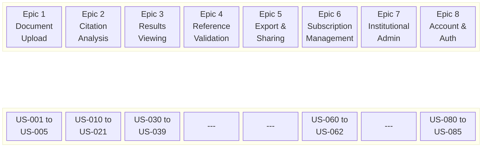
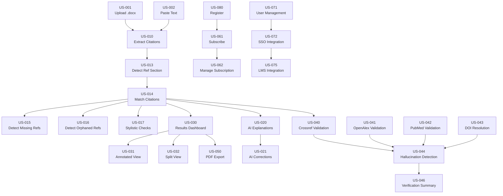

# User Story Map — CitePilot

> **Document ID**: CP-DS-003  
> **Version**: 1.0  
> **Last Updated**: 2026-07-14  
> **Author**: Product Team  
> **Status**: Approved  
> **Classification**: Internal — Confidential

---

## 1. Overview

This document contains the complete user story map for CitePilot, organized by epics. Each story follows the format:

> **As a** [persona], **I want to** [action] **so that** [benefit].

Stories include acceptance criteria and are tagged with:
- **Persona**: Sarah (Student), James (Researcher), Margaret (Editor), Dr. Patel (Institutional Admin), Marcus (Coach)
- **Priority**: MVP, V1.1, V2, Future
- **Story Points**: Relative complexity estimate (1–13, Fibonacci)

---

## 2. Story Map Visual

---

## 3. Epic 1: Document Upload & Input

### US-001: Upload Word Document
**Priority**: MVP | **Points**: 3

> **As a** student (Sarah), **I want to** upload my .docx essay file **so that** CitePilot can check my citations for errors before I submit.

**Acceptance Criteria**:
- User can select a .docx file via file browser or drag-and-drop
- System accepts files up to 100,000 words / 50 MB
- System validates file format before processing (rejects non-.docx with clear error message)
- Upload progress indicator is displayed for files > 1 MB
- File is stored in S3 with encryption at rest
- System extracts text content, preserving paragraph structure and heading hierarchy
- User sees confirmation with document name, word count, and detected reference count

---

### US-002: Paste Plain Text
**Priority**: MVP | **Points**: 2

> **As a** student (Sarah), **I want to** paste my essay text directly into a text area **so that** I can quickly check citations without exporting to a file.

**Acceptance Criteria**:
- Text area accepts up to 100,000 characters (approximately 16,000 words)
- Character/word count is displayed in real-time as user types or pastes
- User can clear and re-paste text
- System processes pasted text identically to uploaded .docx content
- Pasted text is stored temporarily with the same encryption and deletion policy as uploaded files

---

### US-003: Upload PDF Document
**Priority**: V1.1 | **Points**: 5

> **As a** researcher (James), **I want to** upload a PDF of my manuscript **so that** I can check citations in documents I receive from collaborators or download from preprint servers.

**Acceptance Criteria**:
- System accepts PDF files up to 50 MB
- Text extraction handles multi-column layouts, footnotes, and headers/footers
- System detects and warns if PDF appears to be a scanned image (no embedded text)
- Extracted text preserves paragraph boundaries and heading hierarchy where possible
- If text extraction quality is low (< 80% readable characters), user is warned and offered option to proceed or abort
- Processing time for PDF extraction is communicated to user (may be slower than .docx)

---

### US-004: Select Citation Style
**Priority**: MVP | **Points**: 2

> **As a** editor (Margaret), **I want to** select the citation style my client's document uses **so that** the analysis applies the correct formatting rules for that specific style.

**Acceptance Criteria**:
- Style selector presents all available styles with full names and brief descriptions
- MVP styles: APA 7th Edition, APA 6th Edition, Harvard
- V1.1 styles: Vancouver, IEEE, Chicago (Author-Date), Chicago (Notes-Bibliography), MLA, OSCOLA, Turabian
- Selected style is applied to all extraction, matching, and stylistic checks
- System remembers user's last-used style as default for next upload
- Style can be changed after upload, triggering re-analysis

---

### US-005: Auto-Detect Citation Style
**Priority**: V1.1 | **Points**: 8

> **As a** student (Sarah), **I want** CitePilot to automatically detect which citation style my document uses **so that** I don't have to figure out the style name myself.

**Acceptance Criteria**:
- System analyzes first 10 citations and reference entries to infer citation style
- Detection confidence score is displayed to user (e.g., "Detected: APA 7 — 92% confidence")
- If confidence is below 75%, user is prompted to manually select the style
- User can override the auto-detected style at any time
- Detection accuracy ≥ 90% across all supported styles on test corpus

---

### US-006: Upload Multi-Chapter Document
**Priority**: V1.1 | **Points**: 8

> **As a** researcher (James), **I want to** upload my full PhD thesis (with 6 chapters, each with its own reference list) **so that** CitePilot checks citations within each chapter against its own reference list.

**Acceptance Criteria**:
- System detects chapter boundaries using heading hierarchy (H1/H2 patterns)
- System detects multiple reference lists within a single document
- Each chapter's in-text citations are matched only against that chapter's reference list
- Results are organized per chapter with a cross-chapter summary
- User can manually adjust chapter/reference-list boundaries if auto-detection is incorrect
- System handles at least 10 separate reference lists per document

---

### US-007: Drag-and-Drop Upload
**Priority**: MVP | **Points**: 1

> **As a** student (Sarah), **I want to** drag my file directly onto the page **so that** uploading is fast and intuitive.

**Acceptance Criteria**:
- Drop zone is visually highlighted when user drags a file over the page
- Drop zone accepts .docx files (and .pdf when supported)
- Invalid file types show a clear rejection message upon drop
- Drop zone works on desktop browsers (Chrome, Firefox, Safari, Edge)
- Keyboard-accessible alternative (file browse button) is always available

---

### US-008: Batch Document Upload
**Priority**: V2 | **Points**: 5

> **As an** editor (Margaret), **I want to** upload multiple client documents at once **so that** I can queue them for analysis without uploading one at a time.

**Acceptance Criteria**:
- User can select up to 10 files in a single upload action
- Each file is processed as an independent analysis job
- Progress is shown per-file with individual status indicators
- User can select a different citation style per document, or apply one style to all
- Results for each document are accessible independently
- Available to Professional plan subscribers only

---

### US-009: Upload from URL
**Priority**: Future | **Points**: 5

> **As a** researcher (James), **I want to** provide a URL to a preprint (e.g., arXiv, SSRN) **so that** CitePilot can fetch and analyze the document without me downloading it first.

**Acceptance Criteria**:
- System accepts URLs from supported preprint servers (arXiv, SSRN, bioRxiv, medRxiv)
- System downloads the PDF and processes it using the PDF extraction pipeline
- User is informed of the fetched document's title and word count before analysis begins
- System handles URL errors (404, timeout) gracefully with actionable error messages

---

## 4. Epic 2: Citation Analysis & Matching

### US-010: Extract In-Text Citations
**Priority**: MVP | **Points**: 8

> **As a** student (Sarah), **I want** CitePilot to automatically find all the in-text citations in my essay **so that** I don't have to manually identify them.

**Acceptance Criteria**:
- System extracts all parenthetical citations (e.g., "(Smith, 2023)")
- System extracts all narrative citations (e.g., "Smith (2023) argued...")
- System correctly handles multi-author citations (e.g., "(Smith & Jones, 2023)")
- System correctly handles "et al." citations (e.g., "(Smith et al., 2023)")
- System correctly handles multiple citations in one parenthetical (e.g., "(Smith, 2023; Jones, 2024)")
- System correctly handles page numbers (e.g., "(Smith, 2023, p. 45)")
- System does NOT flag non-citation dates (e.g., "in the year 2020") as citations
- System does NOT flag non-citation numbers (e.g., "Table 3", "Figure 2") as citations
- Extraction precision ≥ 95%, recall ≥ 98%

---

### US-011: Extract Numeric Citations
**Priority**: V1.1 | **Points**: 5

> **As a** researcher (James), **I want** CitePilot to correctly extract numeric citations like [1], [2-5], and superscript numbers **so that** I can check Vancouver and IEEE formatted papers.

**Acceptance Criteria**:
- System extracts bracketed numeric citations: [1], [2], [1-3], [1,3,5]
- System extracts superscript numeric citations when detectable from document formatting
- System maps numeric citations to numbered reference list entries
- System handles citation ranges (e.g., [1-5] maps to references 1 through 5)
- System does NOT flag footnote numbers or equation references as citations

---

### US-012: Extract Footnote Citations
**Priority**: V1.1 | **Points**: 5

> **As an** editor (Margaret), **I want** CitePilot to handle footnote-based citations (Chicago Notes-Bibliography, OSCOLA) **so that** I can check legal and humanities documents.

**Acceptance Criteria**:
- System extracts footnote markers from document body
- System reads footnote content and parses citation information from each footnote
- System handles "ibid." and "op. cit." references
- System handles short-form subsequent references (author surname only)
- System matches footnote citations against the bibliography/reference list

---

### US-013: Detect Reference Section
**Priority**: MVP | **Points**: 5

> **As a** student (Sarah), **I want** CitePilot to automatically find my reference list **so that** I don't have to manually mark where it starts.

**Acceptance Criteria**:
- System detects reference sections with any of: "References", "Reference List", "Bibliography", "Works Cited", "Literature Cited", or non-English equivalents
- System handles reference headings at any heading level (H1, H2, H3)
- System detects reference sections even without a heading (by recognizing reference list formatting patterns)
- System correctly identifies where body text ends and the reference list begins
- If detection confidence is low, user is prompted to manually specify the boundary
- User can always override the detected reference section boundary

---

### US-014: Match Citations to References
**Priority**: MVP | **Points**: 8

> **As a** student (Sarah), **I want** CitePilot to tell me which citations match which references **so that** I know which ones are correct and which have errors.

**Acceptance Criteria**:
- Each in-text citation is matched to zero or more reference list entries
- Match result categories: Exact Match (green), Possible Match (orange), No Match (red)
- Author name matching uses fuzzy matching (handles "MacDonald" vs "Macdonald", "O'Brien" vs "OBrien")
- Year matching accounts for ±1 year discrepancy (pre-print vs published date)
- Same-author-same-year citations (e.g., Smith, 2023a and Smith, 2023b) are correctly disambiguated
- Multi-author citations with "et al." are matched to full author lists in references
- Matching accuracy ≥ 97% on test corpus

---

### US-015: Detect Missing References
**Priority**: MVP | **Points**: 3

> **As a** researcher (James), **I want** to be alerted when I cite a source in my text but forgot to include it in my reference list **so that** I can add the missing reference before submission.

**Acceptance Criteria**:
- Every in-text citation with no matching reference list entry is flagged as "Missing Reference"
- Flag includes the exact citation text and its location in the document
- Flag severity is RED
- System distinguishes between "definitely missing" and "possible match exists" (orange vs red)

---

### US-016: Detect Orphaned References
**Priority**: MVP | **Points**: 3

> **As a** researcher (James), **I want** to know which references in my list are never cited in the body text **so that** I can remove unnecessary references or add missing citations.

**Acceptance Criteria**:
- Every reference list entry with no corresponding in-text citation is flagged as "Orphaned Reference"
- Flag includes the full reference text and its position in the reference list
- Flag severity is RED
- System accounts for "et al." — a reference by Smith, Jones, and Williams is not orphaned if cited as "Smith et al."

---

### US-017: Stylistic Checks
**Priority**: MVP | **Points**: 5

> **As a** student (Sarah), **I want** CitePilot to check for common citation formatting mistakes **so that** I don't lose marks for small style errors I don't know about.

**Acceptance Criteria**:
- Checks comma placement in citations (e.g., "(Smith, 2023)" not "(Smith 2023)" in APA)
- Checks "et al." usage rules (e.g., APA 7 requires "et al." for 3+ authors from first citation)
- Checks ampersand vs "and" usage (e.g., "&" inside parenthetical, "and" in narrative text for APA)
- Checks semicolon usage for multiple citations within one parenthetical
- Checks page number formatting (e.g., "p." for single page, "pp." for page range in APA)
- Each style warning includes the specific rule being violated and the correct format
- Style checks are specific to the selected citation style (rules differ between APA, Harvard, etc.)

---

### US-018: Alphabetical Order Check
**Priority**: MVP | **Points**: 2

> **As a** student (Sarah), **I want** CitePilot to verify my reference list is in the correct alphabetical order **so that** I don't have to manually sort it.

**Acceptance Criteria**:
- System checks that reference entries are alphabetically ordered by first author's surname
- Handles prefixes (de, van, von, al-) according to the selected style's rules
- Identifies specific entries that are out of order, showing where they should be placed
- For numeric styles (Vancouver, IEEE), verifies references are in numerical order of first citation
- Flag severity is ORANGE (style warning)

---

### US-019: Reference Count Summary
**Priority**: MVP | **Points**: 1

> **As a** student (Sarah), **I want** to see how many times each reference is cited in my essay **so that** I can identify over-relied-upon or under-utilized sources.

**Acceptance Criteria**:
- Each reference entry displays a citation count (number of times cited in body text)
- References can be sorted by citation count (ascending/descending)
- References with 0 citations are highlighted as orphaned (see US-016)
- Summary includes total reference count and total citation count

---

### US-020: AI Explanation of Errors
**Priority**: V1.1 | **Points**: 5

> **As a** student (Sarah), **I want** CitePilot to explain what's wrong with each flagged citation in plain English **so that** I can understand and learn from my mistakes.

**Acceptance Criteria**:
- Each flagged issue includes a natural-language explanation generated by GPT-4o
- Explanation describes what the error is, why it's an error, and what the correct format should be
- Explanations reference the specific citation style rule being violated
- Tone is educational and non-judgmental (appropriate for students)
- Explanations are generated asynchronously and may appear 1–3 seconds after initial results
- Available to Student and Professional plan subscribers only

**Example Explanation**:
> "This citation uses 'and' between authors inside parentheses: (Smith and Jones, 2023). In APA 7th Edition, the ampersand '&' should be used within parenthetical citations, while 'and' is used in narrative citations. The correct format is: (Smith & Jones, 2023)."

---

### US-021: AI Correction Suggestions
**Priority**: V1.1 | **Points**: 5

> **As a** editor (Margaret), **I want** CitePilot to suggest the correct citation format for each error **so that** I can apply fixes quickly without looking up style guides.

**Acceptance Criteria**:
- Each flagged issue includes a suggested correction where applicable
- Suggestions are copy-pasteable text strings
- Suggestions are specific to the selected citation style
- For "missing reference" errors, system suggests the reference entry format if the source can be found via Crossref/OpenAlex
- For author name mismatches, system shows both the in-text version and the reference version with the suggested fix
- Available to Student and Professional plan subscribers only

---

### US-022: Reference Type Classification
**Priority**: V1.1 | **Points**: 5

> **As an** editor (Margaret), **I want** CitePilot to identify what type of source each reference is (journal article, book, website, etc.) **so that** I can verify style-specific formatting rules are applied correctly.

**Acceptance Criteria**:
- System classifies each reference as one of: journal article, book, edited book chapter, conference paper, thesis/dissertation, website, report, newspaper/magazine article, government document, legal document, personal communication, other
- Classification is displayed as a tag/badge on each reference entry
- Classification accuracy ≥ 90%
- Style-specific formatting rules are applied based on reference type (e.g., book titles italicized, article titles not in APA)

---

### US-023: Detect Duplicate References
**Priority**: V1.1 | **Points**: 3

> **As a** researcher (James), **I want** CitePilot to flag duplicate entries in my reference list **so that** I can consolidate them and avoid confusion.

**Acceptance Criteria**:
- System detects references that appear to be duplicates (same authors, same title, same or very similar year)
- Handles near-duplicates: same paper listed with and without DOI, or with slightly different title formatting
- Flag severity is ORANGE with both entries highlighted
- Each duplicate flag shows both reference entries side by side

---

## 5. Epic 3: Results Viewing & Interaction

### US-030: Results Summary Dashboard
**Priority**: MVP | **Points**: 5

> **As a** student (Sarah), **I want** to see a summary of all citation issues at a glance **so that** I know the overall quality of my citations before diving into details.

**Acceptance Criteria**:
- Dashboard displays: total citations found, exact matches (green count), possible matches (orange count), no matches (red count), orphaned references count, style warnings count
- Visual breakdown using progress bar or donut chart
- One-click navigation to view each issue category
- Dashboard loads within 1 second of processing completion
- Overall "citation health score" (percentage of citations correctly matched)

---

### US-031: Annotated Document View
**Priority**: MVP | **Points**: 8

> **As a** student (Sarah), **I want** to see my document with citations highlighted in context **so that** I can understand each issue in the context of my writing.

**Acceptance Criteria**:
- Document text is displayed with each citation highlighted using colour coding (green/orange/red)
- Clicking a highlighted citation reveals a detail panel with: match status, matched reference (if any), explanation, and suggested correction
- Document preserves paragraph structure and heading hierarchy
- Smooth scrolling between citation highlights
- Keyboard navigation between citations (next/previous issue)
- Accessible: colour coding is supplemented with icons (✓, ⚠, ✗) for colour-blind users

---

### US-032: Split-Window View
**Priority**: MVP | **Points**: 5

> **As a** researcher (James), **I want** to see my document body and reference list side by side **so that** I can visually compare citations with their reference entries.

**Acceptance Criteria**:
- Left pane displays document body with highlighted citations
- Right pane displays reference list with highlighted match status
- Clicking a citation in the left pane scrolls to and highlights the matched reference in the right pane
- Clicking a reference in the right pane scrolls to and highlights its first citation in the left pane
- Pane widths are adjustable via drag handle
- Responsive: collapses to single-column on mobile with tab switching

---

### US-033: Filter Results
**Priority**: MVP | **Points**: 3

> **As an** editor (Margaret), **I want** to filter the results to show only errors, only warnings, or only matched citations **so that** I can focus on the most important issues first.

**Acceptance Criteria**:
- Filter options: All, Errors Only (red), Warnings Only (orange), Matched Only (green), Style Warnings
- Filter by author name (text search)
- Filter by year (dropdown or range)
- Filters apply immediately without page reload
- Active filter count is displayed
- "Clear All Filters" button resets to default view
- Filter state persists during the session

---

### US-034: Ignore Citation Flag
**Priority**: MVP | **Points**: 2

> **As a** researcher (James), **I want** to dismiss a citation flag that I've reviewed and determined is correct **so that** my results view only shows remaining unresolved issues.

**Acceptance Criteria**:
- Each flagged issue has an "Ignore" button
- Ignored issues are visually dimmed but not removed
- "Show Ignored" toggle allows viewing ignored items again
- Ignored state can be reversed (un-ignore)
- Ignored count is displayed in the summary dashboard
- Ignored state persists within the session

---

### US-035: In-Context Citation Viewer
**Priority**: MVP | **Points**: 3

> **As a** student (Sarah), **I want** to see a zoomed-in view of the paragraph surrounding a flagged citation **so that** I can understand the context without scrolling through the entire document.

**Acceptance Criteria**:
- Clicking a magnifying glass icon on any flagged issue shows a modal/popover with the surrounding paragraph
- The flagged citation is highlighted within the paragraph context
- Modal shows 1 paragraph before and 1 paragraph after the flagged citation
- Modal is dismissible with Escape key or clicking outside

---

### US-036: Citation Detail Panel
**Priority**: MVP | **Points**: 3

> **As an** editor (Margaret), **I want** to see detailed information about each citation match **so that** I can make informed decisions about whether to fix it.

**Acceptance Criteria**:
- Detail panel shows: raw citation text, extracted authors, extracted year, match status, matched reference entry (if any), confidence score
- For possible matches: shows the reference entry and highlights the discrepancy (author spelling, year difference)
- For style warnings: shows the rule violated and the correct format
- For paid users: shows AI explanation and suggested correction
- Panel is accessible via click from annotated view, split view, or results list

---

### US-037: Sort Results
**Priority**: MVP | **Points**: 2

> **As an** editor (Margaret), **I want** to sort citation results by different criteria **so that** I can work through them efficiently.

**Acceptance Criteria**:
- Sort options: by position in document (default), by severity (errors first), by author name, by year, by citation count
- Sort order can be toggled ascending/descending
- Current sort selection is visually indicated
- Sorting applies immediately without page reload

---

### US-038: Keyboard Navigation
**Priority**: MVP | **Points**: 3

> **As a** researcher (James), **I want** to navigate between citation issues using keyboard shortcuts **so that** I can review results quickly without using the mouse.

**Acceptance Criteria**:
- `J` / `K` or `↓` / `↑` keys navigate to next/previous citation issue
- `Enter` opens the detail panel for the selected citation
- `I` ignores the selected citation
- `Escape` closes the detail panel
- `F` opens the filter panel
- Keyboard shortcuts are documented in a help modal (accessible via `?` key)
- Shortcuts do not interfere with browser defaults or screen readers

---

### US-039: Mobile Results View
**Priority**: MVP | **Points**: 3

> **As a** student (Sarah), **I want** to view my citation check results on my phone **so that** I can review issues while away from my laptop.

**Acceptance Criteria**:
- Results view is fully responsive on screens ≥ 320px wide
- Summary dashboard adapts to single-column layout
- Split view is replaced with tabbed view (body text / reference list)
- Touch targets are ≥ 44×44px
- Colour-coded highlighting is clearly visible on mobile screens
- Swipe gestures navigate between citation issues

---

## 6. Epic 4: Reference Validation & Verification

### US-040: Crossref Source Validation
**Priority**: V1.1 | **Points**: 5

> **As a** researcher (James), **I want** CitePilot to verify my references against Crossref **so that** I know each cited paper actually exists with the correct metadata.

**Acceptance Criteria**:
- System queries Crossref REST API for each reference with a DOI or title+author
- Verified references display a "Verified ✓" badge with source (Crossref)
- Metadata discrepancies are flagged (e.g., year in reference doesn't match Crossref record)
- Verification results include a link to the Crossref record
- System handles Crossref rate limits (50 requests/second with polite pool)
- Available to Professional plan subscribers only

---

### US-041: OpenAlex Source Validation
**Priority**: V1.1 | **Points**: 3

> **As a** researcher (James), **I want** CitePilot to check OpenAlex for references that aren't found in Crossref **so that** more of my references can be verified.

**Acceptance Criteria**:
- System queries OpenAlex API as a fallback when Crossref returns no results
- Uses title + author fuzzy matching
- Verified references display "Verified ✓" badge with source (OpenAlex)
- OpenAlex verification is included in the hallucination detection pipeline
- System respects OpenAlex rate limits (10 requests/second)

---

### US-042: PubMed Validation
**Priority**: V1.1 | **Points**: 3

> **As a** researcher (James), **I want** CitePilot to validate biomedical references against PubMed **so that** I can be confident my medical/scientific citations are accurate.

**Acceptance Criteria**:
- System queries PubMed E-utilities when the detected citation style or reference content suggests a biomedical context
- PubMed IDs (PMIDs) are resolved and displayed when found
- Metadata from PubMed is compared against the reference entry
- Available to Professional plan subscribers only

---

### US-043: DOI Resolution & Validation
**Priority**: V1.1 | **Points**: 2

> **As a** researcher (James), **I want** CitePilot to check that DOIs in my references actually resolve to real papers **so that** I can catch typos in DOIs.

**Acceptance Criteria**:
- System extracts DOIs from reference entries
- Each DOI is resolved against doi.org
- Invalid/non-resolving DOIs are flagged with RED severity
- If DOI resolves but metadata doesn't match the reference entry, discrepancy is flagged as ORANGE
- Successful DOI resolution contributes to "Verified" status

---

### US-044: Hallucinated Citation Detection
**Priority**: V1.1 | **Points**: 13

> **As a** student (Sarah), **I want** CitePilot to tell me if any of my references might be fake **so that** I don't submit a paper with AI-generated fabricated sources.

**Acceptance Criteria**:
- System runs multi-database verification pipeline (Crossref → OpenAlex → PubMed → DOI) for each reference
- References not found in any database are flagged for AI plausibility scoring
- GPT-4o assesses: Does the journal exist? Is the author a real researcher? Is the volume/issue/page format plausible?
- Hallucination confidence score is assigned (0.0–1.0)
- References with score > 0.7 are flagged as "Likely Fabricated" (RED)
- References with score 0.4–0.7 are flagged as "Unverifiable" (ORANGE)
- References with score < 0.4 are flagged as "Likely Real (but not in our databases)" (GREEN with note)
- Clear explanation is provided for each hallucination flag
- Detection recall ≥ 90% on test corpus of known hallucinated citations

---

### US-045: Retraction Watch Check
**Priority**: V1.1 | **Points**: 3

> **As a** researcher (James), **I want** CitePilot to check if any of my cited papers have been retracted **so that** I don't unknowingly cite discredited research.

**Acceptance Criteria**:
- System checks each reference against the Retraction Watch database
- Retracted papers are flagged with RED severity and a "RETRACTED" badge
- Flag includes the retraction reason (if available) and a link to the retraction notice
- Check runs in parallel with other validation steps
- Available to Professional plan subscribers only

---

### US-046: Verification Summary Report
**Priority**: V1.1 | **Points**: 3

> **As a** researcher (James), **I want** a summary showing how many of my references were verified, unverifiable, and flagged **so that** I have a quick overview of my reference quality.

**Acceptance Criteria**:
- Summary shows: total references, verified count, unverifiable count, likely fabricated count, retracted count
- Visual breakdown (chart/progress bar)
- Each category is expandable to show individual references
- Verification rate (% of references verified) is displayed prominently

---

## 7. Epic 5: Export & Sharing

### US-050: PDF Report Export
**Priority**: V1.1 | **Points**: 5

> **As an** editor (Margaret), **I want** to export the analysis results as a formatted PDF **so that** I can include the citation report in the editing package I deliver to my client.

**Acceptance Criteria**:
- PDF includes: document title, analysis date, citation style, summary statistics, full issue list with explanations
- Issues are organized by severity (errors → warnings → matched)
- Each issue shows: citation text, location, status, explanation, and suggested correction
- PDF is professionally formatted with CitePilot branding
- PDF can be generated for the full report or filtered view (e.g., errors only)
- Generation completes within 10 seconds for a 200-issue report
- Available to Student and Professional plan subscribers

---

### US-051: CSV Data Export
**Priority**: V2 | **Points**: 3

> **As an** editor (Margaret), **I want** to export citation results as CSV **so that** I can analyze patterns across multiple documents in a spreadsheet.

**Acceptance Criteria**:
- CSV includes columns: citation ID, raw text, authors, year, match status, matched reference, issue type, location (paragraph number), explanation
- UTF-8 encoding with BOM for Excel compatibility
- Export includes all citations (not just errors)
- Available to Professional plan subscribers

---

### US-052: Sharable Results Link
**Priority**: V2 | **Points**: 3

> **As a** coach (Marcus), **I want** to generate a read-only link to my analysis results **so that** I can share the citation report with my student without them needing an account.

**Acceptance Criteria**:
- "Share" button generates a unique, unguessable URL (UUID-based)
- Shared link provides read-only access to the full results view
- No authentication required to view shared results
- Shared link expires after 7 days or when the document is auto-deleted (whichever comes first)
- Shared link can be revoked by the owner at any time
- Shared view does not reveal the user's account information

---

### US-053: Copy Citation Issues as Text
**Priority**: V1.1 | **Points**: 1

> **As a** student (Sarah), **I want** to copy a specific citation issue and its explanation to my clipboard **so that** I can paste it into my notes or share with my tutor.

**Acceptance Criteria**:
- Each issue in the results view has a "Copy" button
- Copied text includes: issue type, citation text, explanation, and suggested correction
- Copied text is formatted as plain text for universal compatibility
- Visual confirmation (toast notification) upon successful copy

---

## 8. Epic 6: Subscription & Billing

### US-060: View Pricing Plans
**Priority**: MVP | **Points**: 2

> **As a** student (Sarah), **I want** to see a clear comparison of free and paid plans **so that** I can decide if upgrading is worth it for me.

**Acceptance Criteria**:
- Pricing page displays all tiers (Free, Student, Professional) with feature lists
- Current plan is highlighted if user is logged in
- Feature comparison table shows exactly what's included in each tier
- Student and annual discounts are clearly displayed
- "Upgrade" button on each paid plan leads to checkout
- Pricing page loads without authentication (public page for SEO)

---

### US-061: Subscribe to Paid Plan
**Priority**: MVP | **Points**: 5

> **As a** student (Sarah), **I want** to subscribe to the Student plan **so that** I can unlock AI explanations, all citation styles, and unlimited uploads.

**Acceptance Criteria**:
- Stripe Checkout flow for plan selection and payment
- Supports credit/debit card and Google Pay / Apple Pay
- Monthly and annual billing options (annual = 2 months free)
- Subscription activates immediately upon successful payment
- Confirmation email with receipt is sent via Stripe
- User's plan status updates in real-time in the app
- Promo code / coupon field available at checkout

---

### US-062: Manage Subscription
**Priority**: MVP | **Points**: 3

> **As a** researcher (James), **I want** to upgrade, downgrade, or cancel my subscription **so that** I can adjust my plan based on my current needs.

**Acceptance Criteria**:
- Account settings page shows current plan and billing cycle
- "Change Plan" opens plan comparison with upgrade/downgrade options
- Upgrade takes effect immediately; prorated charge applied
- Downgrade takes effect at end of current billing cycle
- Cancel takes effect at end of current billing cycle; features remain until then
- Billing history shows all past invoices (via Stripe Customer Portal)
- Reactivation is possible after cancellation if within the same billing cycle

---

### US-063: Free Tier Upgrade Prompts
**Priority**: V1.1 | **Points**: 3

> **As a** student (Sarah), **I want** to understand what paid features I'm missing on the free tier **so that** I can make an informed decision about upgrading.

**Acceptance Criteria**:
- When a free user's analysis would benefit from a paid feature (e.g., hallucination detection found 3 suspicious references), show an in-context prompt: "3 references could not be verified. Upgrade to Student to check if they're real →"
- Prompts are contextual and non-intrusive (inline, not modal)
- Maximum 2 upgrade prompts per analysis session
- Prompts can be dismissed and won't reappear for that session
- Each prompt shows the specific value the user would get from upgrading

---

### US-064: Usage Tracking & Limits
**Priority**: MVP | **Points**: 3

> **As a** student (Sarah), **I want** to see how many uploads I have left today **so that** I know if I can check another document.

**Acceptance Criteria**:
- Dashboard displays remaining daily uploads (e.g., "2 of 3 uploads used today")
- If word limit is approaching, show warning before upload
- If limit is exceeded, show clear message with the specific limit and upgrade option
- Limits reset at midnight UTC
- Paid users see "Unlimited" for their plan's unlimited features

---

## 9. Epic 7: Institutional Administration

### US-070: Institutional Admin Dashboard
**Priority**: V2 | **Points**: 8

> **As an** institutional admin (Dr. Patel), **I want** a dashboard showing organization-wide CitePilot usage **so that** I can track adoption and demonstrate ROI to stakeholders.

**Acceptance Criteria**:
- Dashboard shows: total users, active users (last 30 days), total documents processed, total issues found, average citation health score
- Data filterable by department/faculty, date range, citation style
- Trend charts showing usage over time (daily, weekly, monthly)
- Top issues breakdown (most common error types)
- Dashboard data is updated in near-real-time (≤ 15 minutes delay)
- Exportable as CSV or PDF

---

### US-071: User Management
**Priority**: V2 | **Points**: 5

> **As an** institutional admin (Dr. Patel), **I want** to manage which users have access to CitePilot under our institutional license **so that** I can control costs and ensure only authorized users access the tool.

**Acceptance Criteria**:
- Admin can invite users by email (individual or CSV bulk upload)
- Admin can assign users to departments/faculties
- Admin can revoke user access
- Admin can set role: standard user, department admin, or institutional admin
- User count against license seat limit is displayed
- Users provisioned via SSO are auto-created on first login

---

### US-072: SSO Integration
**Priority**: V2 | **Points**: 8

> **As an** institutional admin (Dr. Patel), **I want** CitePilot to integrate with our university's single sign-on system **so that** users can log in with their university credentials.

**Acceptance Criteria**:
- Support SAML 2.0 and OpenID Connect (OIDC) protocols
- Admin can configure SSO provider with metadata URL or manual configuration
- Attribute mapping for user email, name, department, and role
- Just-in-time user provisioning on first SSO login
- Force SSO: option to require all institutional users to authenticate via SSO (disable email/password)
- SSO configuration is self-service via admin dashboard

---

### US-073: Usage Analytics & Reporting
**Priority**: V2 | **Points**: 5

> **As an** institutional admin (Dr. Patel), **I want** detailed usage reports by department **so that** I can identify which faculties are using CitePilot and where citation quality needs improvement.

**Acceptance Criteria**:
- Reports available by: department, user, date range, citation style
- Metrics: uploads per department, most common error types per department, average citation health score per department, adoption rate (% of licensed users who have used the tool)
- Reports exportable as CSV and PDF
- Scheduled report delivery via email (weekly or monthly digest)

---

### US-074: Institutional Default Settings
**Priority**: V2 | **Points**: 3

> **As an** institutional admin (Dr. Patel), **I want** to set default citation styles for each department **so that** students automatically get the right style selected for their discipline.

**Acceptance Criteria**:
- Admin can configure default citation style per department (e.g., Engineering → IEEE, Psychology → APA 7)
- Default is pre-selected when a user from that department uploads a document
- User can override the default for individual uploads
- Admin can set document retention period (default 48 hours, configurable up to 30 days)

---

### US-075: LMS Integration
**Priority**: V2 | **Points**: 13

> **As an** institutional admin (Dr. Patel), **I want** CitePilot to integrate with our Canvas LMS **so that** students can check citations directly from their assignment workflow.

**Acceptance Criteria**:
- LTI 1.3 integration with Canvas LMS
- Students can launch CitePilot from within a Canvas assignment
- Citation check results are optionally visible to the instructor
- Integration requires institutional plan subscription
- Setup is self-service via admin dashboard with Canvas API key configuration

---

## 10. Epic 8: Account & Authentication

### US-080: Register with Email
**Priority**: MVP | **Points**: 3

> **As a** student (Sarah), **I want** to create an account with my email and password **so that** I can save my analysis history and manage my subscription.

**Acceptance Criteria**:
- Registration form: name, email, password
- Password requirements: minimum 8 characters, at least 1 uppercase, 1 lowercase, 1 number
- Email verification required before account is fully activated
- Verification email sent within 30 seconds of registration
- Duplicate email addresses are rejected with clear message
- Password is hashed with bcrypt (cost factor 12)

---

### US-081: Sign In with Google
**Priority**: MVP | **Points**: 2

> **As a** student (Sarah), **I want** to sign in with my Google account **so that** I don't need to create another password.

**Acceptance Criteria**:
- "Sign in with Google" button on login and registration pages
- Google OAuth 2.0 flow via NextAuth.js
- If Google email matches an existing account, accounts are linked
- If no account exists, a new account is created with Google profile data
- No password is required for Google-authenticated users

---

### US-082: Sign In with Microsoft
**Priority**: MVP | **Points**: 2

> **As a** researcher (James), **I want** to sign in with my university Microsoft account **so that** I can use my institutional credentials.

**Acceptance Criteria**:
- "Sign in with Microsoft" button on login and registration pages
- Microsoft OAuth 2.0 (Azure AD) flow via NextAuth.js
- Handles both personal Microsoft accounts and organizational (university/work) accounts
- If Microsoft email matches an existing account, accounts are linked

---

### US-083: Password Reset
**Priority**: MVP | **Points**: 2

> **As a** student (Sarah), **I want** to reset my password if I forget it **so that** I can regain access to my account.

**Acceptance Criteria**:
- "Forgot password?" link on login page
- Reset email is sent within 30 seconds
- Reset link is valid for 1 hour and single-use
- New password must meet the same requirements as registration
- After reset, all existing sessions are invalidated
- Rate limit: maximum 3 reset requests per email per hour

---

### US-084: Delete Account
**Priority**: MVP | **Points**: 2

> **As a** student (Sarah), **I want** to delete my account and all associated data **so that** I can exercise my right to be forgotten (GDPR).

**Acceptance Criteria**:
- Account deletion is available in account settings
- Deletion requires password confirmation (or OAuth re-authentication)
- All user data is permanently deleted within 30 days: documents, analysis results, account data
- Active subscription is cancelled upon deletion (final billing cycle is honoured)
- Confirmation email is sent upon successful deletion
- Deletion is irreversible — clear warning is shown before proceeding

---

### US-085: Profile Management
**Priority**: MVP | **Points**: 2

> **As a** researcher (James), **I want** to update my name, email, and notification preferences **so that** my account information stays current.

**Acceptance Criteria**:
- Profile page shows: name, email, account type (email/Google/Microsoft), current plan, member since
- Name can be updated freely
- Email change requires verification of the new email address
- Notification preferences: email me about new features, email me about usage summaries, email me about billing
- Profile photo is pulled from OAuth provider (not uploadable)

---

## 11. Epic 9: API Access

### US-090: API Key Management
**Priority**: V2 | **Points**: 3

> **As an** editor (Margaret), **I want** to generate API keys for my account **so that** I can integrate CitePilot into my editing workflow.

**Acceptance Criteria**:
- API key generation in account settings
- User can create up to 5 API keys
- Each key can be named for identification (e.g., "Production", "Testing")
- Keys can be revoked individually
- Key is shown only once at creation time (must be copied immediately)
- Rate limits per key match the user's plan limits
- Available to Professional plan subscribers only

---

### US-091: API Document Analysis
**Priority**: V2 | **Points**: 5

> **As an** editor (Margaret), **I want** to submit documents for citation checking via API **so that** I can build it into my automated workflow.

**Acceptance Criteria**:
- `POST /api/v1/check` endpoint accepts .docx file upload or plain text body
- Request parameters: `style` (citation style), `options` (which checks to run)
- Response includes job ID for async polling
- `GET /api/v1/check/{job_id}` returns job status and results when complete
- Webhook option: provide a URL to receive results when processing completes
- API documentation available at `/docs` (OpenAPI/Swagger)
- Rate limits: 100 requests/hour for Professional plan

---

### US-092: API Results Retrieval
**Priority**: V2 | **Points**: 3

> **As an** editor (Margaret), **I want** to retrieve analysis results via API in a structured format **so that** I can process and format them for my clients.

**Acceptance Criteria**:
- `GET /api/v1/check/{job_id}/results` returns structured JSON
- JSON includes all citation matches, issues, explanations, and suggestions
- Results include metadata: document word count, reference count, citation count, processing time
- Pagination for large result sets (>100 issues)
- Results are available until the document's auto-deletion time

---

## 12. Story Priority Summary

| Priority | Story Count | Story IDs |
|---|---|---|
| **MVP** | 30 | US-001, US-002, US-004, US-007, US-010, US-013, US-014, US-015, US-016, US-017, US-018, US-019, US-030, US-031, US-032, US-033, US-034, US-035, US-036, US-037, US-038, US-039, US-060, US-061, US-062, US-064, US-080, US-081, US-082, US-083, US-084, US-085 |
| **V1.1** | 18 | US-003, US-005, US-006, US-011, US-012, US-020, US-021, US-022, US-023, US-040, US-041, US-042, US-043, US-044, US-045, US-046, US-050, US-053, US-063 |
| **V2** | 14 | US-008, US-051, US-052, US-070, US-071, US-072, US-073, US-074, US-075, US-090, US-091, US-092 |
| **Future** | 1 | US-009 |
| **Total** | 63 | — |

---

## 13. Story Dependency Map

---

*Document End — CP-DS-003 v1.0*
