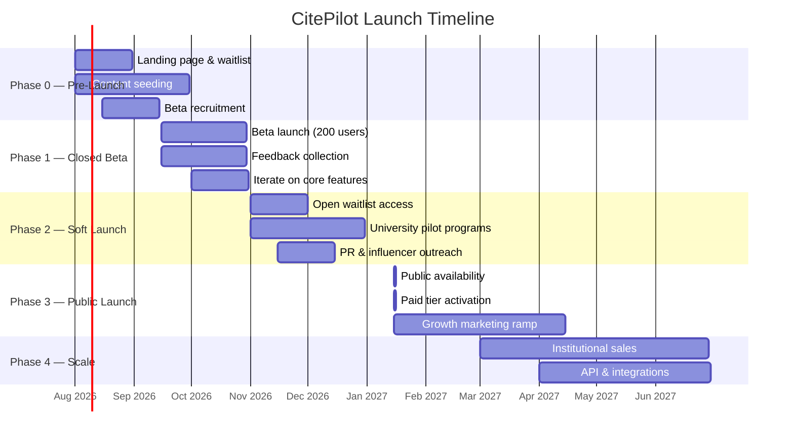
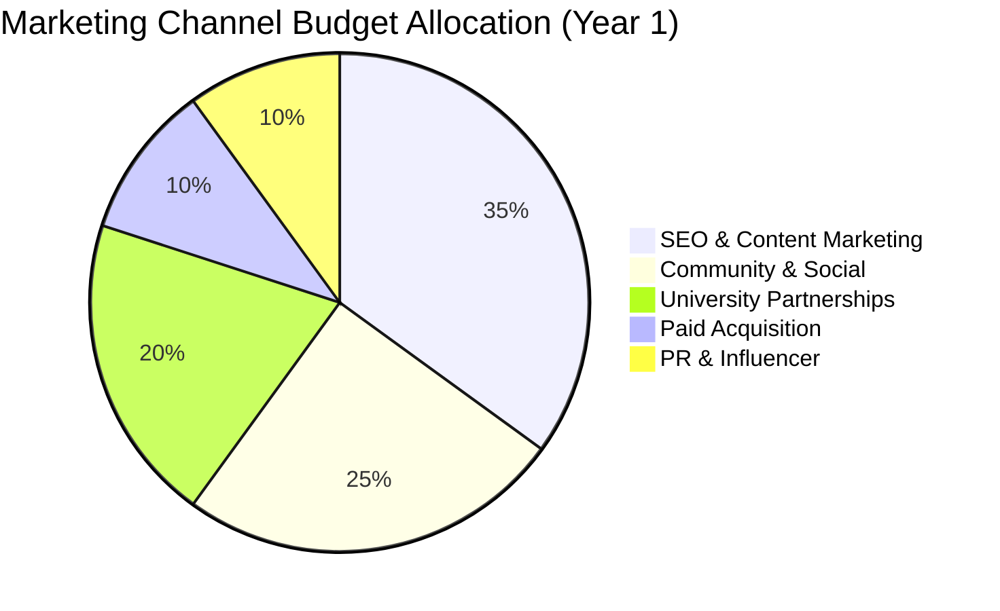
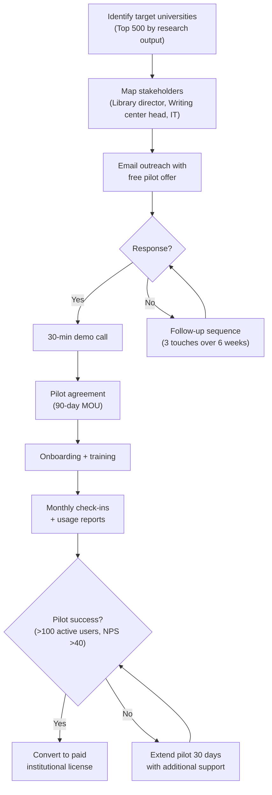

# Go-to-Market Strategy

**Document ID**: CITE-GTM-004  
**Version**: 1.0  
**Last Updated**: 2026-07-15  
**Owner**: Growth & Marketing  
**Status**: Draft — Pending Stakeholder Review

---

## 1. Executive Summary

CitePilot enters the academic citation checking market as the first AI-native platform in a space dominated by rule-based incumbents. Our GTM strategy targets the **63 million+ global academic researchers and students** who manually verify citations or rely on error-prone pattern-matching tools. We will launch through a phased approach — closed beta with PhD students and academic editors, soft launch via university partnerships, and public launch amplified through organic academic community channels. The freemium model drives adoption; AI-powered accuracy drives conversion.

---

## 2. Target Market Segmentation

### 2.1 Total Addressable Market (TAM)

| Metric | Value | Source |
|--------|-------|--------|
| Global higher education students | 235 million | UNESCO 2025 |
| Graduate/postgraduate students | ~42 million | UNESCO 2025 |
| Active academic researchers | ~9 million | Scopus/Elsevier |
| Academic editors & proofreaders | ~500,000 | IBISWorld |
| Academic institutions (universities) | ~30,000 | WHED |
| **Estimated TAM** | **$2.4B/year** | Internal estimate |

### 2.2 Serviceable Addressable Market (SAM)

Researchers, students, and editors in English-language institutions who actively use citation-heavy writing workflows:

| Segment | Size | Willingness to Pay |
|---------|------|---------------------|
| English-speaking grad students | ~8 million | Low–Medium ($5–$15/mo) |
| Researchers submitting to journals | ~3.2 million | Medium ($10–$20/mo) |
| Academic editors/proofreaders | ~200,000 | High ($15–$30/mo) |
| Dissertation coaches | ~50,000 | High ($15–$30/mo) |
| Institutions (university licenses) | ~6,000 | High ($500–$50,000/yr) |
| **Estimated SAM** | **$680M/year** | Internal estimate |

### 2.3 Serviceable Obtainable Market (SOM) — Year 1

Conservative target capturing 0.05% of SAM within 12 months:

| Segment | Target Users | Revenue Target |
|---------|-------------|----------------|
| Free tier users | 50,000 | $0 (lead gen) |
| Student Plan ($4.99/mo) | 3,000 | $179,640/yr |
| Professional Plan ($12.99/mo) | 800 | $124,704/yr |
| Institutional (avg $5,000/yr) | 10 | $50,000/yr |
| **Year 1 SOM** | **53,810 users** | **~$354,344/yr** |

### 2.4 Primary Segments — Prioritized

```
┌─────────────────────────────────────────────────────────────┐
│  PRIORITY 1 (Launch)     │  PRIORITY 2 (Month 3+)          │
│                          │                                  │
│  • PhD/Masters students  │  • Academic editors              │
│  • Postdocs writing      │  • Dissertation coaches          │
│    journal papers        │  • Research groups               │
│                          │                                  │
├──────────────────────────┼──────────────────────────────────┤
│  PRIORITY 3 (Month 6+)  │  PRIORITY 4 (Month 9+)          │
│                          │                                  │
│  • Undergrad students    │  • University libraries          │
│  • Independent researchers│ • Publishers (API integration)  │
│                          │  • LMS integrations              │
└─────────────────────────────────────────────────────────────┘
```

### 2.5 Ideal Customer Profiles (ICPs)

#### ICP 1: The Anxious PhD Candidate
- **Demographics**: 25–35 years old, STEM or social sciences, writing dissertation
- **Pain points**: Spending 8–15 hours manually checking 200+ citations, fear of committee rejection over formatting errors, supervisor flagged citation issues in last draft
- **Current solution**: Manual checking, Reciteworks free tier (hits 2500-word limit immediately), Zotero (manages refs but doesn't validate consistency)
- **Trigger event**: Approaching thesis submission deadline, received feedback about citation errors
- **Channels**: Reddit r/GradSchool, r/AskAcademia, Twitter #AcademicTwitter, university writing centers

#### ICP 2: The Prolific Academic Editor
- **Demographics**: 30–55 years old, freelance or agency, handles 5–20 papers/week
- **Pain points**: Citation checking is the most tedious part of editing, needs to check multiple citation styles, clients expect fast turnaround
- **Current solution**: Manual checking, Reciteworks Pro (limited to APA/Harvard), custom regex scripts
- **Trigger event**: New client using Chicago or Vancouver style, error found in published paper they edited
- **Channels**: EFA (Editorial Freelancers Association), LinkedIn, academic editing forums, CIEP

#### ICP 3: The University Library Director
- **Demographics**: 40–60 years old, manages writing support services
- **Pain points**: Students submit poorly cited work, writing center staff overwhelmed, need scalable tools
- **Current solution**: Manual workshops, Grammarly institutional license (no citation checking), Turnitin (plagiarism only)
- **Trigger event**: Budget cycle for next academic year, accreditation review, student satisfaction surveys
- **Channels**: ACRL conferences, library consortia newsletters, direct outreach, RFP responses

---

## 3. Competitive Positioning

### 3.1 Positioning Statement

> **For academic writers and editors** who need to ensure citation accuracy before submission, **CitePilot** is the **AI-powered citation consistency platform** that **intelligently validates in-text citations against reference lists, verifies sources exist in academic databases, and detects fabricated citations** — unlike Reciteworks, which relies on pattern matching limited to two citation styles and cannot verify whether cited sources are real.

### 3.2 Competitive Landscape Matrix

| Capability | CitePilot | Reciteworks | Grammarly | Zotero | Turnitin |
|-----------|-----------|-------------|-----------|--------|----------|
| Citation consistency check | ✅ AI-powered | ✅ Rule-based | ❌ | ❌ | ❌ |
| Citation styles supported | 9+ | 3 (APA 6/7, Harvard) | N/A | N/A | N/A |
| Source existence validation | ✅ All tiers | ⚠️ Paid only (Crossref) | ❌ | ❌ | ❌ |
| Hallucinated citation detection | ✅ | ❌ | ❌ | ❌ | ❌ |
| Retraction Watch integration | ✅ | ⚠️ Paid only | ❌ | ❌ | ❌ |
| AI-generated corrections | ✅ | ❌ (flags only) | ❌ | ❌ | ❌ |
| Multi-reference-list support | ✅ | ❌ | N/A | N/A | N/A |
| False-positive reduction | ✅ AI context | ❌ Flags 4-digit nums | N/A | N/A | N/A |
| Free tier word limit | 5,000 | 2,500 | N/A | N/A | N/A |

### 3.3 Key Differentiators (Messaging Hierarchy)

1. **Lead message**: "AI-powered citation checking that actually understands your paper" — emphasizes intelligence over pattern matching
2. **Supporting proof point**: "Validates your sources exist using Crossref, OpenAlex, and PubMed — and catches AI-hallucinated citations"
3. **Style breadth**: "Supports APA, Harvard, Vancouver, Chicago, MLA, IEEE, OSCOLA, Turabian, and more"
4. **Ease differentiator**: "Get suggested corrections, not just error flags"
5. **Trust signal**: "Used by researchers at [X universities] — documents deleted after 36 hours, never stored unencrypted"

### 3.4 Positioning by Segment

| Segment | Primary Message | Secondary Message |
|---------|----------------|-------------------|
| PhD students | "Submit with confidence — catch every citation error before your committee does" | "Free for short papers, affordable for dissertations" |
| Researchers | "Journal-ready citations in minutes, not hours" | "Validates against Crossref and PubMed — catches what Zotero misses" |
| Editors | "Check 9+ citation styles from one dashboard" | "Process more papers with AI-suggested corrections" |
| Institutions | "Reduce citation-related rejections across your university" | "Admin dashboard, SSO, usage analytics, institutional pricing" |

---

## 4. Launch Phases

### 4.1 Phase Overview



### 4.2 Phase 0: Pre-Launch (Aug 2026)

**Objective**: Build awareness, capture early demand, seed organic content.

| Action | Target | Owner |
|--------|--------|-------|
| Launch landing page with email capture | 2,000 waitlist signups | Marketing |
| Publish "Why Citation Checking is Broken" blog post | 5,000 views | Content |
| Create demo video showing CitePilot vs manual checking | 10,000 views | Marketing |
| Post to r/GradSchool, r/AskAcademia, r/PhD | 500 upvotes combined | Community |
| Twitter/X thread comparing citation tools | 1,000 impressions | Social |
| Begin SEO content program (10 articles) | Index top 20 for target keywords | SEO |
| Recruit beta testers via academic Twitter | 500 applications | Community |

**Landing page value proposition**: "Stop spending hours checking citations manually. CitePilot uses AI to verify every citation in your paper — including whether the sources actually exist."

### 4.3 Phase 1: Closed Beta (Sep–Oct 2026)

**Objective**: Validate core product, collect testimonials, fix critical issues.

| Parameter | Value |
|-----------|-------|
| Beta cohort size | 200 users |
| Composition | 100 PhD students, 50 postdocs, 30 academic editors, 20 dissertation coaches |
| Recruitment channels | Academic Twitter, Reddit, university writing centers, direct outreach |
| Beta duration | 6 weeks |
| Feedback cadence | Weekly surveys + monthly 1:1 calls with 20 users |
| Success metrics | NPS ≥ 50, task completion rate ≥ 85%, accuracy ≥ 90% |

**Beta user requirements**:
- Must upload at least 3 documents during beta
- Must complete weekly feedback surveys
- Must agree to testimonial usage (with opt-out)

**Key beta milestones**:
1. Week 1–2: Core upload → results flow validation
2. Week 3–4: AI accuracy tuning based on real documents
3. Week 5–6: Feature refinement, UX polish, performance optimization

### 4.4 Phase 2: Soft Launch (Nov–Dec 2026)

**Objective**: Controlled scaling, prove conversion funnel, secure university pilots.

| Action | Target |
|--------|--------|
| Open waitlist access (drip) | 2,000 active users |
| Launch 3 university pilot programs | 3 signed MOUs |
| Publish beta results & case studies | 5 published pieces |
| Academic influencer reviews | 10 reviews/threads |
| Product Hunt launch | Top 5 of the day |
| Conference booth at a regional ACRL event | 200 leads |

**University pilot structure**:
- Free 90-day institutional access for writing center staff + 500 student accounts
- Designated university champion (librarian or writing center director)
- Co-branded landing page
- Quarterly usage reports
- Conversion to paid institutional license after pilot

### 4.5 Phase 3: Public Launch (Jan 2027)

**Objective**: Full public availability with paid tiers, growth marketing at scale.

| Action | Target |
|--------|--------|
| Remove waitlist — open registration | 10,000 signups in month 1 |
| Activate Stripe billing (Student + Professional) | 5% conversion rate |
| Launch referral program | 15% of signups via referral |
| Run Google Ads campaign (academic keywords) | $2,000/month budget, $8 CAC |
| Academic blog SEO ramp (20 articles/month) | 50,000 organic monthly visits by month 3 |
| Launch Chrome extension (Google Docs integration) | 2,000 installs |

### 4.6 Phase 4: Scale (Mar 2027+)

**Objective**: Institutional sales engine, API partnerships, international expansion.

| Action | Target |
|--------|--------|
| Hire institutional sales rep | 1 FTE |
| Launch institutional plan with SSO | 20 institutional contracts by end of year |
| API launch for publisher integrations | 5 API customers |
| Localization (Spanish, Portuguese, German, Mandarin) | 4 languages |
| ORCID integration | Live |
| LMS integration (Canvas, Moodle, Blackboard) | 2 integrations |

---

## 5. Marketing Channels

### 5.1 Channel Strategy Overview



### 5.2 SEO & Content Marketing (35% of budget)

**Strategy**: Dominate long-tail academic search queries that signal citation-checking intent.

#### Target Keywords (Priority Order)

| Keyword Cluster | Monthly Search Volume (est.) | Difficulty | Priority |
|----------------|------------------------------|-----------|----------|
| "citation checker" | 8,100 | Medium | P0 |
| "APA citation checker" | 14,800 | High | P0 |
| "check citations in paper" | 2,400 | Low | P0 |
| "reference list checker" | 1,900 | Low | P0 |
| "Harvard referencing checker" | 3,600 | Medium | P1 |
| "Vancouver citation checker" | 1,200 | Low | P1 |
| "Chicago citation checker" | 2,800 | Medium | P1 |
| "reciteworks alternative" | 320 | Low | P1 |
| "AI citation checker" | 880 | Low | P0 |
| "check if citation exists" | 720 | Low | P0 |
| "hallucinated citations AI" | 1,600 | Low | P0 |
| "dissertation citation checking" | 590 | Low | P1 |

#### Content Calendar (First 3 Months)

**Month 1 — Foundation**:
- "The Complete Guide to Citation Consistency Checking" (pillar page, 4,000 words)
- "APA 7th Edition Citation Rules: The Definitive Reference" (SEO target)
- "How to Check if an Academic Citation is Real" (addresses hallucination concern)
- "CitePilot vs Reciteworks: Feature Comparison" (comparison page)
- "5 Common Citation Errors That Get Papers Rejected" (awareness content)

**Month 2 — Style Guides**:
- One comprehensive guide per supported citation style (9 articles)
- "Multi-Chapter Thesis Citation Guide" (unique content, no competitor covers this)
- "How AI is Changing Academic Writing Tools" (thought leadership)

**Month 3 — Use Cases**:
- "How PhD Students Use CitePilot to Save 10+ Hours Before Submission"
- "Academic Editor's Guide to Batch Citation Checking"
- "How Universities Are Reducing Citation Errors at Scale"
- "What Are AI-Hallucinated Citations and Why Should You Care?"
- Interactive tool: "Free APA Citation Format Validator" (lead gen widget)

### 5.3 Community & Social Media (25% of budget)

#### Reddit Strategy
| Subreddit | Subscribers | Strategy |
|-----------|-------------|----------|
| r/GradSchool | 470K | Value-first posts about citation tips, product mentions in relevant threads |
| r/AskAcademia | 350K | Answer citation questions, link to free tool |
| r/PhD | 120K | Thesis preparation tips, beta invitations |
| r/academia | 90K | Research workflow discussions |
| r/AcademicWriting | 15K | Citation style guides, tool recommendations |
| r/Professors | 80K | Institutional perspective, tool awareness |

**Reddit rules of engagement**:
- Never post direct ads — community-first approach
- Founder account with transparent "I'm building CitePilot" flair
- Post genuine value (citation tips, style guides) with product mention only when relevant
- Engage in comments on existing citation-related threads
- Share beta access as genuine offers, not spam

#### Twitter/X Strategy
- Primary hashtags: #AcademicTwitter, #PhDLife, #AcademicWriting, #CitationCheck
- Content mix: 40% citation tips, 25% product updates, 20% user testimonials, 15% academic humor
- Target following of academic influencers, journal editors, writing center accounts
- Weekly "Citation Tip Tuesday" thread series
- Monthly "Citation Style Spotlight" deep-dive threads

#### LinkedIn Strategy
- Target academic editors, university administrators, library directors
- Publish articles on academic writing workflow optimization
- Join and engage in: Academic Editing, Higher Education Technology, University Librarians groups
- Direct outreach to writing center directors at top 200 universities

### 5.4 University Partnerships (20% of budget)

#### Partnership Tiers

| Tier | Structure | Target | Value to University |
|------|-----------|--------|---------------------|
| **Pilot Partner** | Free 90-day trial, 500 student accounts | 10 universities | Risk-free evaluation, student satisfaction |
| **Affiliate Partner** | Revenue share on student conversions from .edu referral links | 50 universities | Passive income, student value-add |
| **Institutional Licensee** | Paid annual contract, SSO, admin dashboard | 20 universities (Year 1) | Full platform access, usage analytics, reduced rejection rates |
| **Research Partner** | Co-development of citation AI, co-authored papers | 3 universities | Research output, grant funding eligibility |

#### University Outreach Funnel



#### Conference Strategy

| Conference | Date (est.) | Audience | Strategy |
|-----------|------------|----------|----------|
| ACRL (Association of College & Research Libraries) | Mar 2027 | University librarians | Booth, demo sessions, sponsored workshop |
| SSP (Society for Scholarly Publishing) | May 2027 | Publishers, editors | API demo, partnership meetings |
| IWCA (Intl Writing Centers Association) | Oct 2027 | Writing center directors | Workshop on AI tools for citation support |
| Council of Science Editors (CSE) | May 2027 | Science editors | Product demo, editorial workflow integration |

### 5.5 Paid Acquisition (10% of budget)

**Budget**: $2,000/month starting at public launch, scaling to $5,000/month based on ROI.

| Channel | Monthly Budget | Target CPA | Expected Conversions |
|---------|---------------|------------|---------------------|
| Google Ads (Search) | $1,200 | $6–$10 | 120–200 free signups |
| Google Ads (Display, academic sites) | $400 | $3–$5 | 80–130 free signups |
| Twitter/X Ads | $400 | $4–$8 | 50–100 free signups |

**Google Ads keyword groups**:
- Brand: "citepilot", "cite pilot"
- Competitor: "reciteworks alternative", "reciteworks vs"
- Intent: "check my citations", "citation consistency tool", "reference checker"
- Style-specific: "APA citation checker online", "Harvard reference checker"

### 5.6 PR & Influencer (10% of budget)

**Academic influencer outreach**:
- Identify 50 academic Twitter accounts with 10K+ followers who discuss writing/productivity
- Offer free Professional Plan for 1 year in exchange for honest review
- Provide custom affiliate links (15% revenue share on conversions)

**Press targets**:
- Inside Higher Ed
- Times Higher Education
- The Chronicle of Higher Education
- Nature Careers
- Science Careers
- TechCrunch (AI tools vertical)

**Press angles**:
1. "New AI tool catches hallucinated academic citations" (AI/integrity angle)
2. "Citation checking startup challenges decade-old incumbents" (David vs Goliath)
3. "Universities adopt AI citation checker to reduce paper rejections" (institutional angle)

---

## 6. Pricing Strategy

### 6.1 Pricing Tiers

| Feature | Free | Student ($4.99/mo) | Professional ($12.99/mo) | Institutional (Custom) |
|---------|------|---------------------|--------------------------|------------------------|
| Uploads per day | 3 | Unlimited | Unlimited | Unlimited |
| Word limit per document | 5,000 | 25,000 | 100,000 | 100,000 |
| Reference limit per document | 100 | 500 | 2,000 | 2,000 |
| Citation styles | APA 7, Harvard, MLA | All 9+ styles | All 9+ styles | All 9+ styles |
| Basic citation matching | ✅ | ✅ | ✅ | ✅ |
| AI explanations | ❌ | ✅ | ✅ | ✅ |
| AI suggested corrections | ❌ | ✅ | ✅ | ✅ |
| Crossref/OpenAlex validation | ❌ | ❌ | ✅ | ✅ |
| PubMed validation | ❌ | ❌ | ✅ | ✅ |
| Retraction Watch check | ❌ | ❌ | ✅ | ✅ |
| Hallucinated citation detection | ❌ | Basic | Advanced | Advanced |
| Multi-reference-list support | ❌ | ✅ | ✅ | ✅ |
| PDF export | ❌ | ✅ | ✅ | ✅ |
| API access | ❌ | ❌ | ✅ (1,000 calls/mo) | ✅ (custom limits) |
| SSO integration | ❌ | ❌ | ❌ | ✅ |
| Admin dashboard | ❌ | ❌ | ❌ | ✅ |
| Usage analytics | ❌ | ❌ | ❌ | ✅ |
| Priority support | ❌ | Email | Email + chat | Dedicated account manager |
| Document retention | 36 hours | 7 days | 30 days | Configurable |

### 6.2 Pricing Rationale

1. **Free tier at 5,000 words** (vs Reciteworks' 2,500): Large enough to process a typical undergraduate essay, creating a meaningful experience that demonstrates value. Too small for a full thesis chapter, creating natural upgrade pressure.

2. **Student Plan at $4.99/month**: Priced below the psychological $5 threshold. Below a single coffee, framed as "less than a latte." Annual option at $3.99/month ($47.88/year) for lock-in. Positioned against the alternative: hours of manual checking or risk of rejection.

3. **Professional Plan at $12.99/month**: Comparable to Grammarly Premium ($12/month). Includes source validation — the features that provide the highest perceived value. API access enables workflow integration for power users. Annual option at $9.99/month ($119.88/year).

4. **Institutional pricing**: Custom per-seat pricing starting at $3/student/year for 500+ seats. Volume discounts: 500–2,000 seats at $3/student, 2,000–10,000 at $2.25/student, 10,000+ at $1.50/student. Annual contracts only.

### 6.3 Pricing Competitive Analysis

| Product | Free Tier | Paid Tier | Key Limitation |
|---------|-----------|-----------|----------------|
| **CitePilot** | 5,000 words, 3/day | $4.99–$12.99/mo | New entrant, unproven at scale |
| **Reciteworks** | 2,500 words, 2/day | $2.99–$6.99/mo | Only APA/Harvard, rule-based |
| **Grammarly** | Basic grammar only | $12/mo | No citation checking |
| **Turnitin** | No free tier | Institutional only | Plagiarism only, no citation check |

**Price premium justification**: CitePilot commands a ~70% premium over Reciteworks because it provides AI-powered analysis (not rule-based), supports 9+ citation styles (not 3), includes source validation and hallucination detection in paid tiers, and provides actionable corrections rather than error flags.

---

## 7. Freemium Conversion Funnel

### 7.1 Funnel Architecture

```mermaid
flowchart TD
    A["Awareness<br/>SEO, Social, Reddit, Ads"] -->|Visit site| B["Landing Page<br/>100% of visitors"]
    B -->|Sign up (target: 15%)| C["Free Account<br/>15% of visitors"]
    C -->|Upload first doc (target: 60%)| D["First Upload<br/>9% of visitors"]
    D -->|View results (target: 90%)| E["Results Viewed<br/>8.1% of visitors"]
    E -->|Hit limit or see upgrade prompt| F{"Upgrade Decision"}
    F -->|Convert (target: 8%)| G["Paid User<br/>0.65% of visitors"]
    F -->|Stay free| H["Free User<br/>(nurture via email)"]
    H -->|Re-engage| F

    style G fill:#22c55e,color:#fff
    style H fill:#f59e0b,color:#fff
```

### 7.2 Conversion Triggers

| Trigger | Mechanism | Target Segment |
|---------|-----------|----------------|
| **Word limit reached** | "Your document has 8,200 words. Upgrade to Student Plan to check the full document." | Students with longer papers |
| **Style not available** | "Vancouver style is available on Student Plan and above." | Users needing non-default styles |
| **AI explanation locked** | Show truncated AI explanation: "This citation may have an issue because... [Upgrade to see full explanation]" | Users who found errors |
| **Source validation preview** | "We found 3 citations that may not exist in academic databases. Upgrade to Professional to verify." | Researchers concerned about accuracy |
| **Multi-ref-list needed** | "Your document appears to have multiple reference lists. Upgrade to Student Plan for multi-list support." | Thesis writers |
| **PDF export** | "Download annotated PDF report — available on Student Plan and above." | Users wanting sharable reports |

### 7.3 Conversion Optimization Tactics

1. **Time-limited trial**: Offer 7-day free trial of Student Plan after 3rd free upload
2. **Academic calendar alignment**: Email campaigns before submission deadlines (Dec, Apr, Aug)
3. **Usage-based nudges**: "You've checked 12 documents this month. You'd save $X with a Student Plan."
4. **Social proof**: "87% of users who upgraded found additional errors in their first document"
5. **Referral incentive**: "Give a friend 14 days of Student Plan, get 14 days free yourself"

### 7.4 Retention Strategy

| Metric | Target | Tactic |
|--------|--------|--------|
| Day 1 retention | 40% | Onboarding email with tips, first-upload CTA |
| Day 7 retention | 25% | "Your citation style guide" personalized email |
| Day 30 retention | 15% | Feature highlight email, usage summary |
| Monthly active rate (paid) | 60% | In-app prompts, new feature announcements |
| Annual renewal rate | 75% | 30-day pre-expiry discount offer, annual savings highlight |
| Churn recovery | 10% | "We miss you" email with limited-time discount |

---

## 8. Content Strategy

### 8.1 Content Pillars

| Pillar | Purpose | Content Types | Frequency |
|--------|---------|---------------|-----------|
| **Citation Style Guides** | SEO, authority building | Blog posts, interactive tools | 2/week |
| **Academic Writing Tips** | Community building, top-of-funnel | Blog, social threads, videos | 3/week |
| **Product Education** | Adoption, feature discovery | Tutorials, how-tos, videos | 1/week |
| **Research Integrity** | Thought leadership, PR | White papers, data studies, op-eds | 1/month |
| **Case Studies** | Social proof, conversion | User stories, university pilots | 2/month |

### 8.2 Content Distribution

| Channel | Content Type | Frequency | KPI |
|---------|-------------|-----------|-----|
| Blog (citepilot.com/blog) | All pillars | 5/week | Organic traffic, time on page |
| Twitter/X | Tips, threads, product updates | Daily | Impressions, engagement rate |
| Reddit | Value posts, AMAs, tool shares | 3/week | Upvotes, referral traffic |
| LinkedIn | Case studies, institutional content | 2/week | Leads, connection requests |
| YouTube | Tutorials, comparisons, demos | 1/week | Views, subscriber growth |
| Email newsletter | Curated tips + product updates | Weekly | Open rate (>30%), click rate (>5%) |

### 8.3 Lead Magnets

1. **"The Ultimate Citation Checklist"** — Downloadable PDF for each citation style
2. **"How to Spot AI-Hallucinated Citations"** — Whitepaper (email gate)
3. **"Citation Style Quick Reference Card"** — Printable one-pager (shareable)
4. **Free APA/Harvard format checker widget** — Embeddable on writing center sites

---

## 9. Partnership Strategy

### 9.1 Technology Partnerships

| Partner | Type | Value to CitePilot | Value to Partner | Status |
|---------|------|-------------------|------------------|--------|
| **Crossref** | API integration | Metadata validation for 140M+ records | Usage of REST API, potential featured integration | API available, apply for Metadata Plus |
| **OpenAlex** | API integration | Open-access metadata for 250M+ works | Showcase of API in production tool | API available (free) |
| **PubMed/NCBI** | API integration | Biomedical source validation | E-utilities usage | API available (API key needed) |
| **Retraction Watch** | Data licensing | Retracted paper database access | Revenue from licensing, expanded reach | Contact for licensing terms |
| **ORCID** | Authentication + data | Researcher identity verification | Increased ORCID adoption | Open API, membership optional |

### 9.2 Academic Partnerships

| Partner Type | Value Proposition | Target Count (Year 1) |
|-------------|-------------------|----------------------|
| University writing centers | Free tool for staff, discounted student access | 25 |
| University libraries | Institutional license, embed in research guides | 10 |
| Graduate schools | Thesis submission workflow integration | 5 |
| Academic publishers | API for pre-submission citation checking | 3 |
| Reference managers (Zotero, Mendeley) | Plugin/integration for export-to-check workflow | 2 |

### 9.3 Distribution Partnerships

| Partner | Integration | Revenue Model |
|---------|-------------|---------------|
| **Zotero** | "Check citations with CitePilot" button in Zotero | Affiliate referral |
| **Overleaf** | LaTeX document citation check integration | Co-branded, revenue share |
| **Google Docs** | Chrome extension with sidebar | Free distribution channel |
| **Microsoft Word** | Office Add-in | Free distribution channel |
| **Canvas/Moodle LMS** | LTI integration for assignment submission | Institutional licensing |

---

## 10. Metrics & KPIs

### 10.1 North Star Metric

**Documents checked per week** — This single metric captures user acquisition, activation, retention, and value delivery. Target: 5,000 documents/week by month 6 post-launch.

### 10.2 KPI Dashboard

| Category | Metric | Month 1 Target | Month 6 Target | Month 12 Target |
|----------|--------|-----------------|-----------------|------------------|
| **Acquisition** | Weekly signups | 500 | 2,000 | 5,000 |
| **Acquisition** | CAC (blended) | $12 | $8 | $6 |
| **Activation** | First upload rate | 50% | 60% | 65% |
| **Activation** | Time to first result | <90 seconds | <60 seconds | <45 seconds |
| **Revenue** | MRR | $5,000 | $25,000 | $60,000 |
| **Revenue** | Free-to-paid conversion | 4% | 6% | 8% |
| **Retention** | 30-day retention (free) | 15% | 20% | 25% |
| **Retention** | Monthly churn (paid) | 8% | 5% | 4% |
| **Retention** | NPS | 40 | 50 | 55 |
| **Product** | Documents checked/week | 500 | 5,000 | 15,000 |
| **Product** | Avg citations per document | 30 | 35 | 40 |
| **Product** | Accuracy (precision) | 88% | 92% | 95% |

### 10.3 Funnel Metrics

```
Visitors → Signups → First Upload → Paid Conversion → Retained Paid
100%       15%        9%             0.65%              0.5%
```

---

## 11. Risk Mitigation

| Risk | Probability | Impact | Mitigation |
|------|------------|--------|------------|
| Reciteworks adds AI features | Medium | High | Move fast, build defensible data moats (accuracy benchmarks), patent AI matching algorithm |
| Grammarly enters citation space | Low | Critical | Differentiate on depth (source validation, style breadth), build institutional relationships |
| Low free-to-paid conversion | Medium | High | A/B test upgrade triggers, adjust free tier limits, offer annual discounts |
| AI costs exceed projections | Medium | Medium | Implement aggressive caching, use smaller models for simple checks, batch API calls |
| University sales cycle too long | High | Medium | Focus on pilot conversions, target writing centers (faster decision), attend conferences |
| Negative academic reception of AI tools | Low | Medium | Emphasize tool-assisted (not AI-written) positioning, transparency about AI usage, human-in-the-loop framing |

---

## 12. Budget Summary (Year 1)

| Category | Monthly | Annual |
|----------|---------|--------|
| Content creation (writers, designers) | $3,000 | $36,000 |
| Paid acquisition (Google, Twitter) | $2,500 | $30,000 |
| Community management | $1,000 | $12,000 |
| PR & influencer outreach | $1,500 | $18,000 |
| Conference attendance (2 events) | — | $15,000 |
| University partnership development | $500 | $6,000 |
| Tools & subscriptions (analytics, email) | $500 | $6,000 |
| **Total Marketing Budget** | **$9,000** | **$123,000** |

---

## Appendix A: Launch Checklist

### Pre-Launch (2 weeks before)
- [ ] Landing page live with email capture
- [ ] Google Analytics 4 + conversion tracking configured
- [ ] Email sequences built (welcome, onboarding, upgrade)
- [ ] 10 SEO articles published and indexed
- [ ] Social accounts created and seeded with content
- [ ] Beta testers confirmed and onboarding scheduled
- [ ] Press kit prepared (screenshots, founder bio, fact sheet)
- [ ] Competitive comparison page published

### Launch Day
- [ ] Product Hunt listing submitted
- [ ] Twitter/X announcement thread posted
- [ ] Reddit posts in 3 target subreddits
- [ ] Email blast to waitlist
- [ ] LinkedIn announcement
- [ ] Press embargo lifts — journalist outreach
- [ ] Monitor error rates, performance, signup flow
- [ ] Founder available for real-time community engagement

### Post-Launch (Week 1)
- [ ] Respond to all Product Hunt comments
- [ ] Publish "Launch Day" blog post with metrics
- [ ] Send thank-you emails to beta testers
- [ ] Collect and publish first testimonials
- [ ] Analyze funnel metrics, identify drop-off points
- [ ] Schedule 1:1 calls with first 10 paid customers
