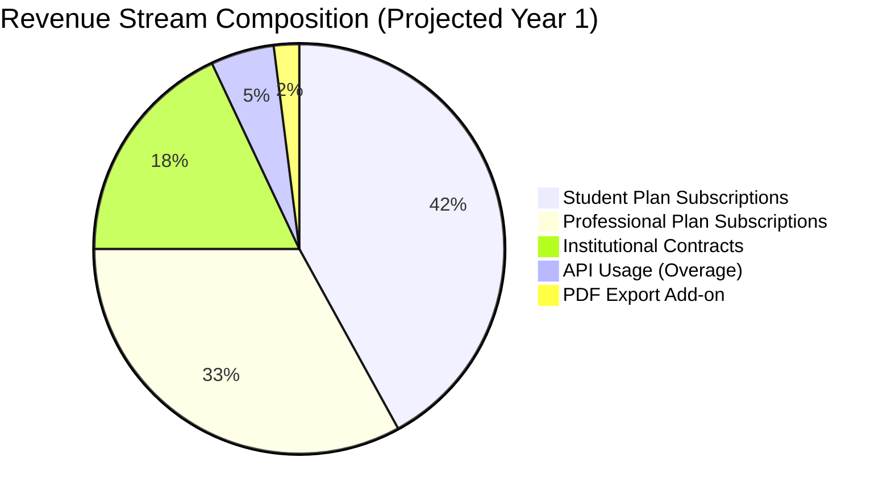
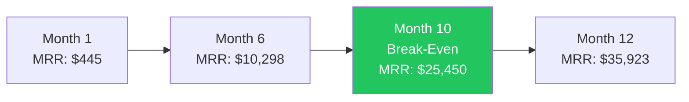

# Business Model

**Document ID**: CITE-BIZ-005  
**Version**: 1.0  
**Last Updated**: 2026-07-15  
**Owner**: Finance & Strategy  
**Status**: Draft — Pending Stakeholder Review

---

## 1. Executive Summary

CitePilot operates a **freemium SaaS model** with three paid tiers targeting individual academic users and institutions. Revenue is generated through monthly/annual subscriptions and institutional contracts. The model is designed around a high-volume free tier that demonstrates value and naturally funnels users to paid plans through usage limits and feature gating. At projected scale (18 months), the business achieves a **3.8:1 LTV:CAC ratio** with a **14-month payback period** and reaches profitability at approximately **4,200 paying users**.

---

## 2. Revenue Model

### 2.1 Revenue Streams



| Revenue Stream | Type | Pricing | Target Contribution |
|---------------|------|---------|---------------------|
| **Student Plan** | Recurring subscription | $4.99/mo or $47.88/yr | 42% of Year 1 revenue |
| **Professional Plan** | Recurring subscription | $12.99/mo or $119.88/yr | 33% of Year 1 revenue |
| **Institutional** | Annual contract | $1.50–$3.00/student/yr | 18% of Year 1 revenue |
| **API overage** | Usage-based | $0.02/call over limit | 5% of Year 1 revenue |
| **PDF export add-on** | One-time per export (free tier) | $0.99 per export | 2% of Year 1 revenue |

### 2.2 Pricing Architecture

#### Tier 1: Free

**Purpose**: Acquisition and demonstration of value. Sized to fully serve an undergraduate essay but not a thesis chapter.

| Parameter | Limit |
|-----------|-------|
| Uploads per day | 3 |
| Max words per document | 5,000 |
| Max references per document | 100 |
| Citation styles | APA 7, Harvard, MLA |
| Document retention | 36 hours |
| Features included | Basic citation matching, color-coded results, annotated article view |
| Features excluded | AI explanations, suggested corrections, source validation, retraction check, hallucination detection, PDF export, multi-ref-list, API |

#### Tier 2: Student Plan — $4.99/month ($3.99/mo billed annually)

**Purpose**: Serve graduate students writing theses, dissertations, and journal papers. Price point below psychological $5 barrier.

| Parameter | Limit |
|-----------|-------|
| Uploads per day | Unlimited |
| Max words per document | 25,000 |
| Max references per document | 500 |
| Citation styles | All 9+ (APA 6, APA 7, Harvard, Vancouver, Chicago, MLA, IEEE, OSCOLA, Turabian) |
| Document retention | 7 days |
| AI explanations | ✅ Full |
| AI suggested corrections | ✅ |
| Hallucinated citation detection | Basic (metadata-only check) |
| Multi-reference-list support | ✅ |
| PDF export | ✅ |
| Crossref/OpenAlex validation | ❌ |
| PubMed validation | ❌ |
| Retraction Watch check | ❌ |
| API access | ❌ |
| Support | Email (48-hr response) |

#### Tier 3: Professional Plan — $12.99/month ($9.99/mo billed annually)

**Purpose**: Serve researchers, academic editors, and proofreaders who need full validation capabilities and high throughput.

| Parameter | Limit |
|-----------|-------|
| Uploads per day | Unlimited |
| Max words per document | 100,000 |
| Max references per document | 2,000 |
| Citation styles | All 9+ |
| Document retention | 30 days |
| AI explanations | ✅ Full |
| AI suggested corrections | ✅ |
| Hallucinated citation detection | Advanced (Crossref + OpenAlex + PubMed cross-validation) |
| Multi-reference-list support | ✅ |
| PDF export | ✅ |
| Crossref/OpenAlex validation | ✅ |
| PubMed validation | ✅ |
| Retraction Watch check | ✅ |
| API access | ✅ (1,000 calls/month, $0.02/call overage) |
| Document history | ✅ (last 50 documents) |
| Batch upload | ✅ (up to 10 documents) |
| Support | Email + live chat (24-hr response) |

#### Tier 4: Institutional — Custom Pricing

**Purpose**: Serve universities, research institutions, and publishers with managed multi-user access.

| Parameter | Details |
|-----------|---------|
| Per-seat pricing | $3.00/student/yr (500–2,000 seats), $2.25 (2,000–10,000), $1.50 (10,000+) |
| Minimum contract | $1,500/year (500 seats) |
| All Professional features | ✅ |
| SSO integration (SAML 2.0, OAuth) | ✅ |
| Admin dashboard | ✅ |
| Usage analytics & reporting | ✅ |
| Custom document retention | ✅ (configurable up to 90 days) |
| Dedicated account manager | ✅ |
| Onboarding & training sessions | ✅ (2 included, additional at $500/session) |
| SLA | 99.5% uptime guarantee |
| API access | Custom limits |
| Priority support | Dedicated Slack channel or email, 4-hr response SLA |
| Billing | Annual invoice, NET-30 |

### 2.3 Annual Discount Structure

| Plan | Monthly | Annual (per month) | Annual (total) | Savings |
|------|---------|-------------------|----------------|---------|
| Student | $4.99 | $3.99 | $47.88 | 20% |
| Professional | $12.99 | $9.99 | $119.88 | 23% |

Annual plans improve cash flow predictability and reduce churn. Target: 40% of paid users on annual plans by month 12.

---

## 3. Cost Structure

### 3.1 Fixed Costs (Monthly)

| Category | Item | Monthly Cost | Annual Cost | Notes |
|----------|------|-------------|-------------|-------|
| **Team** | Founder/CEO (deferred) | $0 | $0 | Equity-only during Year 1 |
| **Team** | Full-stack engineer (1) | $6,000 | $72,000 | Contract or early hire |
| **Team** | AI/ML engineer (0.5 FTE) | $4,000 | $48,000 | Contract, part-time |
| **Infrastructure** | AWS ECS/Fargate (compute) | $350 | $4,200 | 2 services, auto-scaling |
| **Infrastructure** | AWS RDS PostgreSQL | $180 | $2,160 | db.t3.medium, Multi-AZ |
| **Infrastructure** | AWS ElastiCache Redis | $120 | $1,440 | cache.t3.small |
| **Infrastructure** | AWS S3 + CloudFront | $50 | $600 | Document storage + CDN |
| **Infrastructure** | Domain, DNS, SSL | $10 | $120 | Route 53 + ACM |
| **SaaS Tools** | GitHub (Team) | $20 | $240 | |
| **SaaS Tools** | Datadog (monitoring) | $75 | $900 | Infrastructure + APM |
| **SaaS Tools** | Sentry (error tracking) | $26 | $312 | Team plan |
| **SaaS Tools** | Stripe fees | Variable | Variable | 2.9% + $0.30 per transaction |
| **SaaS Tools** | Email service (Resend) | $20 | $240 | |
| **Legal** | Privacy policy, ToS | $50 | $600 | Amortized legal costs |
| **Marketing** | Total marketing budget | $9,000 | $123,000 | See GTM document |
| | **Total Fixed** | **$19,901** | **$253,812** | |

### 3.2 Variable Costs (Per Document Processed)

| Cost Component | Cost Per Document | Basis |
|---------------|-------------------|-------|
| **OpenAI GPT-4o API** | $0.035–$0.12 | Avg 3,000 input tokens + 1,500 output tokens per document × 2–3 calls |
| **OpenAI fallback (Claude)** | $0.04–$0.15 | Used only when GPT-4o fails, ~5% of requests |
| **Crossref API** | $0.00 | Free for polite pool (<50 req/sec with mailto) |
| **OpenAlex API** | $0.00 | Free, no API key required |
| **PubMed E-utilities** | $0.00 | Free with API key (10 req/sec) |
| **DOI.org** | $0.00 | Free content negotiation |
| **Retraction Watch** | $0.005 | Estimated licensing cost amortized per lookup |
| **Document parsing (compute)** | $0.002 | CPU time for python-docx/pdfplumber |
| **Redis caching** | $0.001 | Amortized per request |
| **Total variable cost** | **$0.04–$0.13** | **Avg: $0.07 per document** |

### 3.3 AI Cost Optimization Strategies

| Strategy | Estimated Savings | Implementation |
|----------|------------------|----------------|
| **Response caching** | 30–40% | Cache identical citation lookups in Redis (TTL: 24 hours) |
| **Tiered model usage** | 20–25% | Use GPT-4o-mini for simple style checks, GPT-4o only for complex matching |
| **Batch API calls** | 10–15% | Batch multiple citation lookups into single Crossref/OpenAlex requests |
| **Pre-filtering** | 15–20% | Rule-based pre-filter before AI — skip obvious matches |
| **Prompt optimization** | 10% | Minimize prompt tokens through structured extraction prompts |

Projected blended AI cost after optimization: **$0.045 per document** (Month 6+).

---

## 4. Unit Economics

### 4.1 Customer Acquisition Cost (CAC)

| Channel | Monthly Spend | Monthly Signups | Paid Conversions (6%) | CAC |
|---------|--------------|-----------------|----------------------|-----|
| SEO & Content | $3,500 | 2,000 | 120 | $29.17 |
| Community & Social | $2,500 | 1,500 | 90 | $27.78 |
| University Partnerships | $2,000 | 500 | 50 | $40.00 |
| Paid Acquisition | $2,500 | 300 | 24 | $104.17 |
| PR & Influencer | $1,500 | 700 | 42 | $35.71 |
| **Blended** | **$12,000** | **5,000** | **326** | **$36.81** |

**Note**: CAC is calculated as total marketing spend ÷ new paid customers acquired. Free users are not counted as conversions for CAC purposes but contribute to organic growth via word-of-mouth.

### 4.2 Lifetime Value (LTV)

#### Student Plan LTV

| Parameter | Value |
|-----------|-------|
| Monthly revenue per user | $4.99 |
| Gross margin | 82% (after AI + infrastructure costs) |
| Monthly churn rate | 6% |
| Average lifetime | 16.7 months (1/churn) |
| **LTV** | **$68.36** |

Calculation: $4.99 × 0.82 × (1/0.06) = $68.36

#### Professional Plan LTV

| Parameter | Value |
|-----------|-------|
| Monthly revenue per user | $12.99 |
| Gross margin | 78% (higher AI usage, source validation costs) |
| Monthly churn rate | 4% |
| Average lifetime | 25 months |
| **LTV** | **$253.31** |

Calculation: $12.99 × 0.78 × (1/0.04) = $253.31

#### Blended LTV (Weighted by projected mix: 70% Student, 30% Professional)

**Blended LTV** = (0.70 × $68.36) + (0.30 × $253.31) = $47.85 + $75.99 = **$123.84**

### 4.3 LTV:CAC Ratio

| Metric | Value | Benchmark |
|--------|-------|-----------|
| Blended LTV | $123.84 | — |
| Blended CAC | $36.81 | — |
| **LTV:CAC Ratio** | **3.36:1** | Healthy: >3:1 |
| **CAC Payback Period** | **9.0 months** | Target: <12 months |

CAC Payback = CAC / (Monthly ARPU × Gross Margin) = $36.81 / ($7.39 × 0.81) = 6.15 months

**Note**: The 3.36:1 ratio is healthy for an early-stage SaaS company. At scale (Month 18+), SEO-driven organic acquisition is expected to reduce blended CAC to ~$20, improving the ratio to ~6:1.

### 4.4 Institutional Unit Economics

| Parameter | Value |
|-----------|-------|
| Average contract value (ACV) | $5,000/year |
| Sales cycle length | 3–6 months |
| Customer acquisition cost (institutional) | $2,500 (sales rep time + conference + materials) |
| Gross margin | 85% (lower per-seat AI cost due to volume) |
| Expected contract duration | 3 years (with annual renewal) |
| **LTV** | **$12,750** |
| **LTV:CAC Ratio** | **5.1:1** |

---

## 5. Financial Projections (12-Month)

### 5.1 User Growth Projections

| Month | Free Users (Cumulative) | Student Plan | Professional Plan | Institutional Seats | Total Paid |
|-------|------------------------|-------------|-------------------|-------------------|-----------|
| 1 | 1,200 | 50 | 15 | 0 | 65 |
| 2 | 3,000 | 130 | 35 | 0 | 165 |
| 3 | 5,500 | 280 | 70 | 200 | 550 |
| 4 | 9,000 | 480 | 120 | 200 | 800 |
| 5 | 13,500 | 720 | 185 | 400 | 1,305 |
| 6 | 19,000 | 1,000 | 260 | 700 | 1,960 |
| 7 | 25,000 | 1,300 | 350 | 700 | 2,350 |
| 8 | 31,000 | 1,650 | 440 | 1,200 | 3,290 |
| 9 | 38,000 | 2,050 | 550 | 1,200 | 3,800 |
| 10 | 45,000 | 2,500 | 670 | 1,500 | 4,670 |
| 11 | 52,000 | 2,950 | 790 | 2,000 | 5,740 |
| 12 | 60,000 | 3,400 | 920 | 2,500 | 6,820 |

**Assumptions**:
- Free user growth: 20% month-over-month, slowing to 15% by month 8
- Free-to-Student conversion: 5% cumulative by month 6, improving to 6.5% by month 12
- Free-to-Professional conversion: 1.5% cumulative
- Institutional: First contract in month 3, growing to 5 contracts (avg 500 seats) by month 12
- Monthly churn: 6% (Student), 4% (Professional), 0% (Institutional, annual contract)

### 5.2 Revenue Projections

| Month | Student MRR | Professional MRR | Institutional MRR | API/Other MRR | Total MRR | Cumulative Revenue |
|-------|------------|-------------------|-------------------|---------------|-----------|-------------------|
| 1 | $250 | $195 | $0 | $0 | $445 | $445 |
| 2 | $649 | $455 | $0 | $20 | $1,124 | $1,569 |
| 3 | $1,397 | $910 | $500 | $50 | $2,857 | $4,426 |
| 4 | $2,395 | $1,559 | $500 | $80 | $4,534 | $8,960 |
| 5 | $3,593 | $2,404 | $1,000 | $120 | $7,117 | $16,077 |
| 6 | $4,990 | $3,378 | $1,750 | $180 | $10,298 | $26,375 |
| 7 | $6,487 | $4,549 | $1,750 | $250 | $13,036 | $39,411 |
| 8 | $8,234 | $5,716 | $3,000 | $330 | $17,280 | $56,691 |
| 9 | $10,230 | $7,145 | $3,000 | $420 | $20,795 | $77,486 |
| 10 | $12,475 | $8,705 | $3,750 | $520 | $25,450 | $102,936 |
| 11 | $14,721 | $10,266 | $5,000 | $630 | $30,617 | $133,553 |
| 12 | $16,966 | $11,957 | $6,250 | $750 | $35,923 | $169,476 |

**Year 1 Total Revenue: ~$169,476**

### 5.3 Expense Projections

| Month | Team | Infrastructure | AI/API Costs | Marketing | SaaS Tools | Other | Total Expenses |
|-------|------|----------------|-------------|-----------|------------|-------|---------------|
| 1 | $10,000 | $710 | $180 | $5,000 | $171 | $100 | $16,161 |
| 2 | $10,000 | $710 | $390 | $6,000 | $171 | $100 | $17,371 |
| 3 | $10,000 | $850 | $750 | $7,500 | $171 | $100 | $19,371 |
| 4 | $10,000 | $850 | $1,200 | $8,000 | $171 | $100 | $20,321 |
| 5 | $10,000 | $1,000 | $1,800 | $8,500 | $171 | $100 | $21,571 |
| 6 | $10,000 | $1,000 | $2,500 | $9,000 | $171 | $100 | $22,771 |
| 7 | $10,000 | $1,200 | $3,200 | $9,000 | $171 | $100 | $23,671 |
| 8 | $10,000 | $1,200 | $4,000 | $9,000 | $171 | $100 | $24,471 |
| 9 | $10,000 | $1,400 | $4,800 | $9,500 | $171 | $100 | $25,971 |
| 10 | $10,000 | $1,400 | $5,600 | $9,500 | $171 | $100 | $26,771 |
| 11 | $10,000 | $1,600 | $6,500 | $10,000 | $171 | $100 | $28,371 |
| 12 | $10,000 | $1,600 | $7,500 | $10,000 | $171 | $100 | $29,371 |

**Year 1 Total Expenses: ~$276,191**

### 5.4 Profit & Loss Summary (Year 1)

| Line Item | Amount |
|-----------|--------|
| **Total Revenue** | $169,476 |
| **Cost of Revenue (AI + Infrastructure)** | $49,740 |
| **Gross Profit** | $119,736 |
| **Gross Margin** | 70.7% |
| **Operating Expenses (Team + Marketing + Tools)** | $226,451 |
| **Net Operating Loss** | $(106,715) |
| **Cumulative Cash Burn** | $(106,715) |

### 5.5 Monthly Cash Flow

```
Month    Revenue    Expenses    Net         Cumulative
─────    ───────    ────────    ───         ──────────
  1        $445     $16,161    -$15,716     -$15,716
  2      $1,124     $17,371    -$16,247     -$31,963
  3      $2,857     $19,371    -$16,514     -$48,477
  4      $4,534     $20,321    -$15,787     -$64,264
  5      $7,117     $21,571    -$14,454     -$78,718
  6     $10,298     $22,771    -$12,473     -$91,191
  7     $13,036     $23,671    -$10,635    -$101,826
  8     $17,280     $24,471     -$7,191    -$109,017
  9     $20,795     $25,971     -$5,176    -$114,193
 10     $25,450     $26,771     -$1,321    -$115,514
 11     $30,617     $28,371     +$2,246    -$113,268
 12     $35,923     $29,371     +$6,552    -$106,716
```

---

## 6. Break-Even Analysis

### 6.1 Monthly Break-Even Point

**Monthly fixed costs**: ~$20,000 (team + infrastructure + tools + base marketing)  
**Average revenue per paid user (blended ARPU)**: $7.39/month  
**Variable cost per paid user**: $1.40/month (AI costs, proportional infrastructure)  
**Contribution margin per paid user**: $5.99/month

**Break-even users** = Fixed Costs / Contribution Margin = $20,000 / $5.99 = **3,339 paid users**

At current growth projections, this is reached between **Month 9 and Month 10**.

### 6.2 Break-Even Including Marketing Spend

With full marketing spend ($9,000/month additional):

**Break-even users** = $29,000 / $5.99 = **4,841 paid users**

At current projections, this is reached between **Month 10 and Month 11**, consistent with the P&L showing first positive month at Month 11.

### 6.3 Scenario Analysis

| Scenario | Key Change | Break-Even Month | Year 1 Net Loss |
|----------|-----------|-------------------|-----------------|
| **Base case** | As projected | Month 10–11 | $(106,715) |
| **Optimistic** | 25% higher conversion rate | Month 8 | $(72,000) |
| **Conservative** | 25% lower conversion rate | Month 14 | $(158,000) |
| **High AI costs** | AI costs 2× projected | Month 12 | $(131,000) |
| **Viral growth** | 2× organic signups | Month 7 | $(48,000) |



---

## 7. Key Financial Metrics Summary

| Metric | Value | Industry Benchmark |
|--------|-------|-------------------|
| Gross margin | 70.7% | SaaS median: 70–80% |
| Blended CAC | $36.81 | — |
| Blended LTV | $123.84 | — |
| LTV:CAC ratio | 3.36:1 | Healthy: >3:1 |
| CAC payback period | 6.15 months | Target: <12 months |
| Monthly churn (Student) | 6% | SaaS avg: 5–7% |
| Monthly churn (Professional) | 4% | SaaS avg: 3–5% |
| Net Revenue Retention (projected) | 105% | Good: >100% |
| Break-even MRR | ~$29,000 | — |
| Month to break-even | 10–11 | — |
| Year 1 ARR (exit rate) | $431,076 | — |

---

## 8. Funding Requirements

### 8.1 Funding Need Assessment

Based on the financial projections, CitePilot's maximum cumulative cash burn is approximately **$115,500** (reached in Month 10 before break-even). With a **50% safety buffer** for unexpected costs, delays, and working capital:

**Total funding requirement: $175,000**

### 8.2 Use of Funds

| Category | Amount | % of Total | Purpose |
|----------|--------|-----------|---------|
| Engineering (team) | $90,000 | 51% | 1 full-stack engineer + 0.5 AI/ML engineer for 9 months |
| Marketing & Growth | $45,000 | 26% | Content, ads, community, conferences |
| Infrastructure | $15,000 | 9% | AWS, AI API credits, SaaS tools |
| Legal & Compliance | $10,000 | 6% | Terms of service, privacy policy, GDPR compliance, data processing agreements |
| Working Capital | $15,000 | 8% | Buffer for unexpected costs, 2-month runway extension |
| **Total** | **$175,000** | **100%** | |

### 8.3 Funding Sources (Priority Order)

| Source | Amount | Likelihood | Timeline |
|--------|--------|-----------|----------|
| **Founder self-funding** | $25,000 | Confirmed | Immediate |
| **Revenue (pre-launch consulting)** | $10,000 | High | Month 1–3 |
| **Angel investors (2–3)** | $75,000–$100,000 | Medium | Month 2–4 |
| **Grants (Innovate UK, SBIR, NSF)** | $25,000–$50,000 | Medium | Month 3–6 |
| **Pre-seed round** | $150,000 | Low (if needed) | Month 6+ |

### 8.4 Milestone-Based Funding Tranches

| Tranche | Amount | Milestone | Expected Date |
|---------|--------|-----------|---------------|
| Tranche 1 | $50,000 | MVP complete, beta launch ready | Aug 2026 |
| Tranche 2 | $50,000 | 200 beta users, 90%+ accuracy validated | Oct 2026 |
| Tranche 3 | $75,000 | Public launch, first 100 paid users, $5K MRR | Feb 2027 |

---

## 9. Revenue Growth Model (Months 13–24)

### 9.1 Year 2 Projections (Summary)

| Metric | Month 12 (Year 1 Exit) | Month 18 | Month 24 (Year 2 Exit) |
|--------|----------------------|----------|----------------------|
| Free users | 60,000 | 120,000 | 200,000 |
| Student Plan users | 3,400 | 6,500 | 10,000 |
| Professional Plan users | 920 | 2,000 | 3,500 |
| Institutional seats | 2,500 | 8,000 | 20,000 |
| MRR | $35,923 | $78,000 | $145,000 |
| ARR (run rate) | $431,076 | $936,000 | $1,740,000 |

### 9.2 Year 2 Growth Drivers

1. **Institutional sales engine**: Dedicated sales rep converts university pilots to paid contracts
2. **API partnerships**: Publishers integrate citation checking into submission workflows
3. **SEO flywheel**: Content investment compounds, organic traffic dominates acquisition
4. **International expansion**: Localized versions for Spanish, Portuguese, German, Mandarin-speaking markets
5. **Product-led growth**: Referral program, in-app virality from shared reports
6. **LMS integrations**: Canvas and Moodle integrations drive institutional adoption

---

## 10. Key Assumptions & Risks

### 10.1 Critical Assumptions

| Assumption | Basis | Risk if Wrong |
|-----------|-------|---------------|
| Free-to-paid conversion rate of 5–6% | Industry benchmark for productivity SaaS tools | Revenue 30–50% lower if conversion is 3% |
| Average 2.5 AI API calls per document | Based on pipeline design (extraction + matching + explanation) | AI costs 2× if more calls needed |
| Monthly churn of 4–6% | Industry average for low-ACV consumer SaaS | LTV drops 30% if churn reaches 8% |
| Crossref/OpenAlex APIs remain free | Current pricing model; Crossref polite pool is free | $2,000–$5,000/month additional cost |
| OpenAI pricing stable or declining | Historical trend of decreasing token costs | Budget 20% AI cost buffer |
| University sales cycle of 3–6 months | Industry average for library/IT procurement | Delay institutional revenue by 3–6 months |

### 10.2 Risk Mitigation

| Risk | Probability | Impact | Mitigation |
|------|------------|--------|------------|
| AI costs spike (OpenAI price increase) | Low | High | Multi-model strategy (Claude fallback), aggressive caching, on-prem model evaluation |
| Lower-than-expected conversion rate | Medium | High | A/B test pricing, adjust free tier limits, add conversion triggers |
| Competitor launches AI features | Medium | Medium | Speed to market, build data moats, focus on accuracy metrics |
| GDPR/data privacy issues | Low | High | Privacy-by-design, 36-hour document deletion, encryption at rest/transit |
| Key engineer departure | Medium | Medium | Documentation-first culture, code review standards, equity vesting |

---

## Appendix A: Pricing Sensitivity Analysis

| Student Price | Projected Subscribers | Student MRR (Month 12) | Impact on Break-Even |
|---------------|----------------------|------------------------|---------------------|
| $2.99/mo | 4,500 (+32%) | $13,455 | Delayed 2 months |
| $3.99/mo | 3,800 (+12%) | $15,162 | Delayed 1 month |
| **$4.99/mo** | **3,400** | **$16,966** | **Base case** |
| $5.99/mo | 2,900 (-15%) | $17,371 | Advanced 0.5 months |
| $6.99/mo | 2,400 (-29%) | $16,776 | Delayed 1 month |

**Conclusion**: $4.99 is the optimal price point — increasing to $5.99 slightly increases per-user revenue but the subscriber loss offsets it. The $4.99 price maximizes total revenue and sits below the psychological $5 threshold.

## Appendix B: Comparison with Reciteworks Pricing

| Feature | Reciteworks Free | Reciteworks Premium | CitePilot Free | CitePilot Student | CitePilot Pro |
|---------|-----------------|-------------------|----------------|-------------------|---------------|
| Price | $0 | $2.99–$6.99/mo | $0 | $4.99/mo | $12.99/mo |
| Words | 2,500 | 20,000 | 5,000 | 25,000 | 100,000 |
| Uploads/day | 2 | Unlimited | 3 | Unlimited | Unlimited |
| Styles | APA 6/7, Harvard | APA 6/7, Harvard | APA 7, Harvard, MLA | All 9+ | All 9+ |
| AI features | ❌ | ❌ | ❌ | ✅ | ✅ |
| Source validation | ❌ | Crossref only | ❌ | ❌ | Crossref + OpenAlex + PubMed |
| Hallucination detection | ❌ | ❌ | ❌ | Basic | Advanced |

CitePilot's free tier is more generous (2× words, 50% more uploads), and the paid tiers offer substantially more value at a modest premium.
