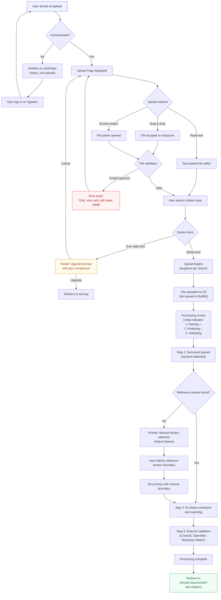
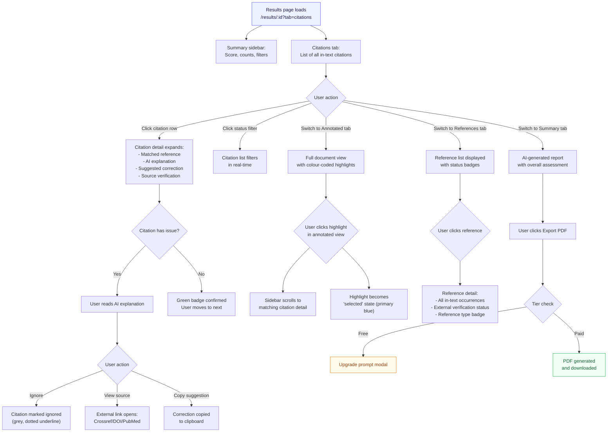
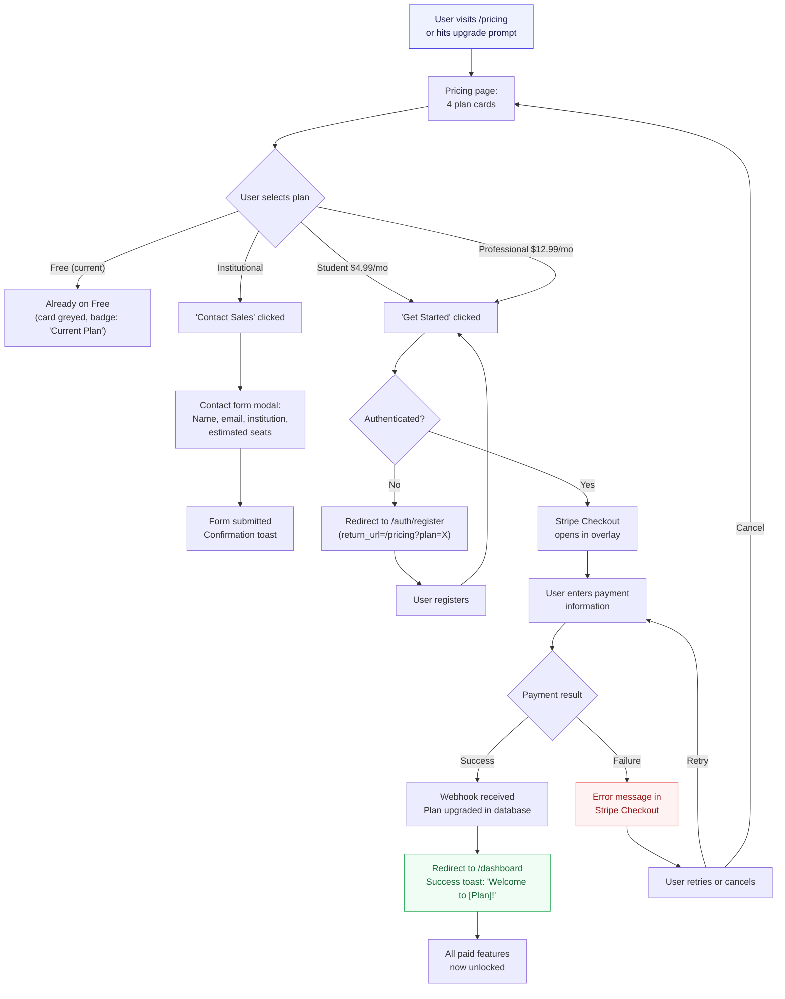
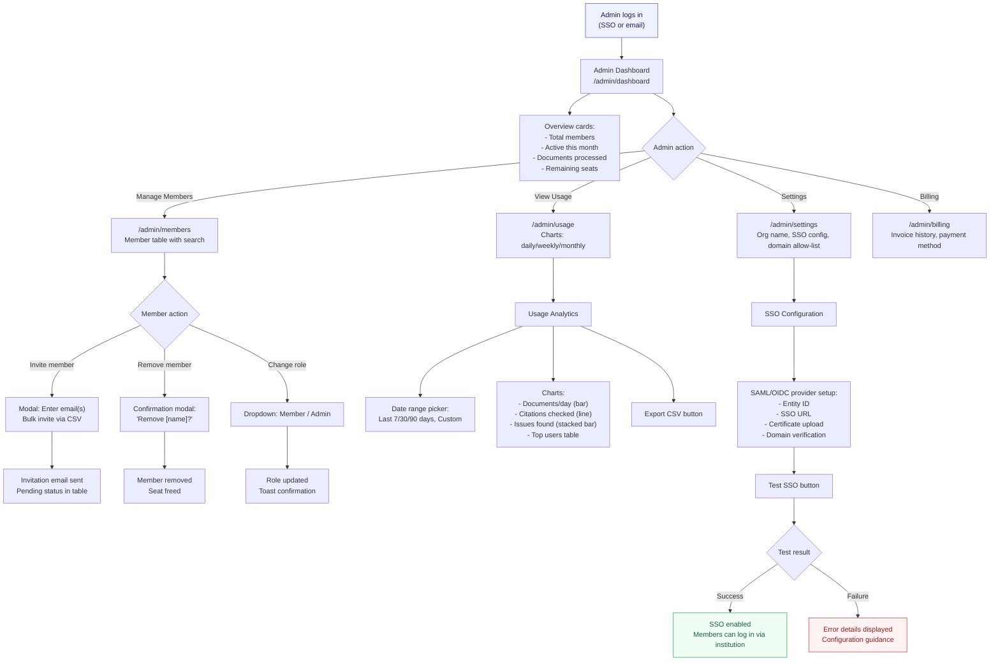
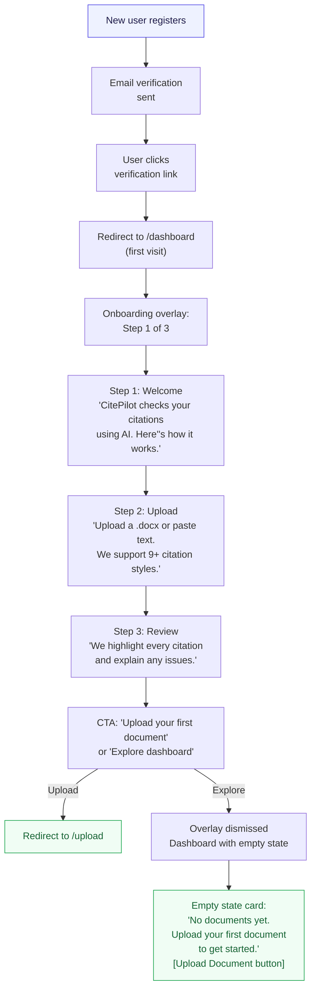

# CitePilot Information Architecture

**Version:** 1.0.0
**Last Updated:** 2026-07-14
**Status:** Production-Ready
**Audience:** Product Managers, Frontend Engineers, UX Designers

---

## 1. Sitemap

### 1.1 Complete Page Hierarchy

```
citepilot.com/
├── / ................................. Landing Page (public)
├── /pricing ......................... Pricing & Plans (public)
├── /about ........................... About CitePilot (public)
├── /blog ............................ Blog Index (public)
│   └── /blog/:slug ................. Blog Post (public)
├── /docs ............................ Documentation Index (public)
│   ├── /docs/getting-started ....... Getting Started Guide
│   ├── /docs/citation-styles ....... Supported Citation Styles
│   ├── /docs/api ................... API Reference
│   └── /docs/:category/:slug ...... Doc Article
├── /changelog ....................... Product Changelog (public)
├── /contact ......................... Contact / Support (public)
│
├── /auth
│   ├── /auth/login ................. Login Page
│   ├── /auth/register .............. Registration Page
│   ├── /auth/forgot-password ....... Password Reset Request
│   ├── /auth/reset-password ........ Password Reset Form (token-gated)
│   ├── /auth/verify-email .......... Email Verification (token-gated)
│   └── /auth/sso/callback .......... SSO Callback (institutional)
│
├── /dashboard ....................... User Dashboard (authenticated)
│   ├── /dashboard/uploads .......... Upload History
│   └── /dashboard/usage ............ Usage & Quota Overview
│
├── /upload .......................... New Document Upload (authenticated)
│
├── /results
│   └── /results/:documentId ........ Results View (authenticated)
│       ├── ?tab=citations .......... In-Text Citations Panel (default)
│       ├── ?tab=references ......... Reference List Panel
│       ├── ?tab=annotated .......... Annotated Article View
│       └── ?tab=summary ............ AI Summary Report
│
├── /account
│   ├── /account/profile ............ Profile Settings
│   ├── /account/security ........... Password & 2FA
│   ├── /account/billing ............ Subscription & Invoices
│   ├── /account/api-keys ........... API Key Management (Professional+)
│   └── /account/preferences ........ Display Preferences (theme, defaults)
│
├── /admin (Institutional Admins)
│   ├── /admin/dashboard ............ Institutional Dashboard
│   ├── /admin/members .............. Member Management
│   ├── /admin/usage ................ Institutional Usage Analytics
│   ├── /admin/settings ............. Org Settings & SSO Configuration
│   └── /admin/billing .............. Institutional Billing
│
├── /api/v1 .......................... REST API (programmatic access)
│   ├── POST /api/v1/documents ...... Upload document
│   ├── GET  /api/v1/documents/:id .. Get results
│   ├── GET  /api/v1/documents/:id/export .. Export report
│   ├── GET  /api/v1/usage .......... Usage stats
│   └── GET  /api/v1/styles ......... List supported styles
│
├── /legal
│   ├── /legal/terms ................ Terms of Service
│   ├── /legal/privacy .............. Privacy Policy
│   └── /legal/cookies .............. Cookie Policy
│
└── /404 ............................. Not Found Page
```

### 1.2 Page Classification

| Page                    | Auth Required | Tier Access            | SEO Indexed |
|-------------------------|---------------|------------------------|-------------|
| Landing                 | No            | All                    | Yes         |
| Pricing                 | No            | All                    | Yes         |
| About                   | No            | All                    | Yes         |
| Blog                    | No            | All                    | Yes         |
| Docs                    | No            | All                    | Yes         |
| Changelog               | No            | All                    | Yes         |
| Contact                 | No            | All                    | Yes         |
| Auth pages              | No            | All                    | No          |
| Dashboard               | Yes           | All                    | No          |
| Upload                  | Yes           | All                    | No          |
| Results                 | Yes           | All (features vary)    | No          |
| Account                 | Yes           | All                    | No          |
| Admin                   | Yes           | Institutional only     | No          |
| Legal                   | No            | All                    | Yes         |

---

## 2. Navigation Model

### 2.1 Top Navigation Bar (Global)

The top navigation bar is persistent across all pages, fixed to the top of the viewport at `64px` height.

**Unauthenticated State:**

```
┌──────────────────────────────────────────────────────────────────────────┐
│ [Logo]  CitePilot    Features  Pricing  Docs  Blog    [Login] [Sign Up]│
└──────────────────────────────────────────────────────────────────────────┘
```

| Position    | Element          | Behaviour                                          |
|-------------|------------------|----------------------------------------------------|
| Left        | Logo + Wordmark  | Links to `/`                                        |
| Centre-left | Features         | Anchor scroll to features section on `/`, or link to `/#features` |
| Centre-left | Pricing          | Links to `/pricing`                                  |
| Centre-left | Docs             | Links to `/docs`                                     |
| Centre-left | Blog             | Links to `/blog`                                     |
| Right       | Login            | Ghost button, links to `/auth/login`                  |
| Right       | Sign Up          | Primary button, links to `/auth/register`             |

**Authenticated State:**

```
┌──────────────────────────────────────────────────────────────────────────┐
│ [Logo]  CitePilot    Dashboard   Docs            [Upload ↑] [🔔] [👤▾] │
└──────────────────────────────────────────────────────────────────────────┘
```

| Position    | Element          | Behaviour                                          |
|-------------|------------------|----------------------------------------------------|
| Left        | Logo + Wordmark  | Links to `/dashboard`                                |
| Centre-left | Dashboard        | Links to `/dashboard`                                |
| Centre-left | Docs             | Links to `/docs`                                     |
| Right       | Upload button    | Primary button with upload icon, links to `/upload`   |
| Right       | Notifications    | Bell icon with unread count badge, opens dropdown     |
| Right       | User avatar      | Opens dropdown menu (Profile, Settings, Billing, Theme toggle, Logout) |

**Mobile (< 768px):** Navigation items collapse into a hamburger menu (3-line icon, right side). The menu opens as a full-height slide-in panel from the right. Upload button remains visible outside the hamburger.

### 2.2 Results Page Sidebar

The results page uses a specialised navigation model with a left sidebar and main content area. The sidebar is only present on the `/results/:documentId` route.

```
┌──────────────────────────────────────────────────────────────────────────┐
│                         Top Navigation Bar                              │
├──────────────┬───────────────────────────────────────────────────────────┤
│              │                                                          │
│  Summary     │                                                          │
│  ───────     │              Main Content Area                           │
│  Score: 87%  │          (tab-controlled content)                        │
│              │                                                          │
│  Filters     │                                                          │
│  ───────     │                                                          │
│  ☑ Matched   │                                                          │
│  ☑ Possible  │                                                          │
│  ☑ No Match  │                                                          │
│  ☑ Style     │                                                          │
│              │                                                          │
│  Ref Sections│                                                          │
│  ───────     │                                                          │
│  ▸ References│                                                          │
│  ▸ Chapter 2 │                                                          │
│              │                                                          │
│  Actions     │                                                          │
│  ───────     │                                                          │
│  [Export PDF]│                                                          │
│  [Re-check] │                                                          │
│  [Delete]    │                                                          │
│              │                                                          │
├──────────────┴───────────────────────────────────────────────────────────┤
│                              Footer                                     │
└──────────────────────────────────────────────────────────────────────────┘
```

**Sidebar Sections:**

1. **Summary Card:** Overall match score (percentage), total citations, matched count, issue count. Always visible.
2. **Status Filters:** Checkbox toggles for each citation status type (Matched, Possible, No Match, Style Issue, Retracted, Hallucinated). Applied in real-time to all tabs.
3. **Reference Sections:** For multi-reference-list documents, shows each detected reference section. Clicking filters to that section only.
4. **Actions:** Export PDF, Re-run check, Delete document buttons.

**Sidebar Responsive Behaviour:**
- `≥ 1024px`: Sidebar visible, 320px fixed width
- `768px–1023px`: Sidebar collapsed to 48px (icon-only). Clicking expands as overlay.
- `< 768px`: Sidebar hidden. Filters accessible via a floating filter button (bottom-right FAB). Actions move to a "..." overflow menu in the top navigation.

### 2.3 Footer (Global)

Present on all public pages. Hidden on authenticated app pages (dashboard, results, upload) to maximise vertical space.

```
┌──────────────────────────────────────────────────────────────────────────┐
│  CitePilot                Product        Resources        Legal         │
│  AI citation checking     Features       Docs             Terms         │
│  for academia             Pricing        Blog             Privacy       │
│                           Changelog      Contact          Cookies       │
│  [Twitter] [LinkedIn]     About          API Reference                  │
│                                                                          │
│  © 2026 CitePilot. All rights reserved.                                  │
└──────────────────────────────────────────────────────────────────────────┘
```

### 2.4 Breadcrumbs

Breadcrumbs are shown on pages with depth > 1 within the app. Positioned immediately below the top navigation bar with a `--bg-surface-sunken` background strip of `40px` height.

| Page                           | Breadcrumb                                         |
|--------------------------------|----------------------------------------------------|
| `/dashboard/uploads`           | Dashboard / Upload History                         |
| `/results/:id`                 | Dashboard / Results / [Document Name]              |
| `/account/billing`             | Account / Billing                                  |
| `/admin/members`               | Admin / Members                                    |
| `/docs/citation-styles`        | Docs / Citation Styles                             |
| `/blog/:slug`                  | Blog / [Post Title]                                |

---

## 3. URL Structure

### 3.1 URL Conventions

- All URLs are lowercase with hyphens as word separators
- No trailing slashes (Next.js configured with `trailingSlash: false`)
- Dynamic segments use descriptive identifiers, not opaque UUIDs in the URL bar (internally mapped)
- Query parameters are used for non-navigational state (filters, tab selection, sort order)
- Hash fragments are used for in-page anchors only

### 3.2 URL Pattern Reference

| Pattern                          | Example                                      | Notes                              |
|----------------------------------|----------------------------------------------|------------------------------------|
| `/`                              | `citepilot.com/`                             | Landing page                       |
| `/pricing`                       | `citepilot.com/pricing`                      | Static route                       |
| `/auth/:action`                  | `citepilot.com/auth/login`                   | Auth flow pages                    |
| `/dashboard`                     | `citepilot.com/dashboard`                    | User home                         |
| `/upload`                        | `citepilot.com/upload`                       | Upload flow                       |
| `/results/:documentId`           | `citepilot.com/results/doc-8f3k2m`           | Prefixed short ID                  |
| `/results/:documentId?tab=X`     | `citepilot.com/results/doc-8f3k2m?tab=annotated` | Tab state in query param       |
| `/results/:documentId?tab=citations&status=error` | `...?tab=citations&status=error` | Filter state in query param |
| `/account/:section`              | `citepilot.com/account/billing`              | Account sub-sections               |
| `/admin/:section`                | `citepilot.com/admin/members`                | Admin sub-sections                 |
| `/docs/:category/:slug`          | `citepilot.com/docs/guides/apa-7-overview`   | Documentation content              |
| `/blog/:slug`                    | `citepilot.com/blog/detecting-hallucinated-citations` | Blog content             |
| `/api/v1/:resource`              | `citepilot.com/api/v1/documents`             | REST API                          |

### 3.3 Document ID Format

Document IDs displayed in URLs use a short, human-readable format: `doc-` prefix + 6-character alphanumeric string (base-36 encoding of an internal auto-incrementing integer, zero-padded). Example: `doc-8f3k2m`. The full UUID is used internally and in API responses but never exposed in the browser URL bar.

### 3.4 Query Parameter Standards

| Parameter   | Type      | Values                                                  | Used On              |
|-------------|-----------|----------------------------------------------------------|----------------------|
| `tab`       | enum      | `citations`, `references`, `annotated`, `summary`        | `/results/:id`       |
| `status`    | enum[]    | `matched`, `possible`, `error`, `style`, `retracted`, `hallucinated` | `/results/:id` |
| `section`   | string    | Reference section identifier                              | `/results/:id`       |
| `sort`      | enum      | `position`, `status`, `author`, `year`                    | `/results/:id`       |
| `search`    | string    | Free-text search within results                           | `/results/:id`       |
| `page`      | integer   | Pagination index (1-based)                                | `/dashboard/uploads` |
| `plan`      | enum      | `student`, `professional`, `institutional`                | `/pricing`           |

All query parameters are optional. Default values:
- `tab`: `citations`
- `status`: all enabled
- `sort`: `position`
- `page`: `1`

---

## 4. User Flows

### 4.1 Document Upload Flow

This is the primary user flow — the critical path from document to results.



**Timing expectations communicated to user:**
- Upload: 1–5 seconds (depending on file size)
- Parsing: 2–8 seconds
- AI Analysis: 5–20 seconds (depending on document length and number of citations)
- External Validation: 3–10 seconds (parallel API calls)
- Total: 11–43 seconds typical, up to 90 seconds for large documents (>50,000 words)

### 4.2 Results Browsing Flow



### 4.3 Subscription Flow



### 4.4 Institutional Admin Flow



### 4.5 First-Time User Onboarding Flow



---

## 5. Content Model

### 5.1 Landing Page (`/`)

| Section                | Content                                                                 | Priority |
|------------------------|-------------------------------------------------------------------------|----------|
| Hero                   | Headline, sub-headline, CTA (Upload or Sign Up), animated demo          | Critical |
| Social Proof           | University logos, user count, document count                             | High     |
| Problem Statement      | Pain points of manual citation checking                                  | High     |
| Feature Grid           | 6 key features with icons and descriptions                               | Critical |
| Style Support          | Visual grid of 9+ citation style logos/names                             | High     |
| How It Works           | 3-step visual: Upload → AI Analyzes → Review Results                     | Critical |
| Comparison Table       | CitePilot vs Reciteworks feature comparison                              | High     |
| Testimonials           | 3 user quotes with avatar, name, role, institution                       | Medium   |
| Pricing Preview        | 3 plan cards (Free, Student, Professional) with CTA                      | High     |
| FAQ                    | 8–10 frequently asked questions in accordion                             | Medium   |
| CTA Banner             | Final call-to-action with email capture or sign-up button                | High     |

### 5.2 Pricing Page (`/pricing`)

| Section                | Content                                                                 |
|------------------------|-------------------------------------------------------------------------|
| Header                 | "Choose your plan" headline, billing toggle (monthly/annual with savings)|
| Plan Cards             | 4 cards: Free, Student, Professional, Institutional                      |
| Feature Comparison     | Full feature matrix table with checkmarks per plan                       |
| FAQ                    | Pricing-specific FAQ (cancellation, refunds, student verification)       |
| Enterprise CTA         | "Need a custom plan?" with contact form                                  |

**Plan Card Content Model:**

| Field                  | Free          | Student       | Professional  | Institutional |
|------------------------|---------------|---------------|---------------|---------------|
| Price                  | $0            | $4.99/mo      | $12.99/mo     | Custom        |
| Annual Price           | —             | $47.88/yr     | $124.68/yr    | Custom        |
| Annual Savings Badge   | —             | "Save 20%"    | "Save 20%"    | —             |
| Tagline                | "Get started" | "For students" | "For professionals" | "For institutions" |
| Upload limit           | 3/day         | Unlimited     | Unlimited     | Unlimited     |
| Word limit             | 5,000         | 50,000        | 100,000       | 100,000       |
| Reference limit        | 100           | 500           | 1,000         | 1,000         |
| Citation styles        | 3 (APA 7, Harvard, Chicago) | All 9+ | All 9+  | All 9+        |
| AI explanations        | ✕             | ✓             | ✓             | ✓             |
| Suggested corrections  | ✕             | ✓             | ✓             | ✓             |
| Multi-ref-list support | ✕             | ✓             | ✓             | ✓             |
| Crossref validation    | ✕             | ✕             | ✓             | ✓             |
| Retraction Watch       | ✕             | ✕             | ✓             | ✓             |
| Hallucination detection| ✕             | Basic         | Advanced      | Advanced      |
| PDF export             | ✕             | ✕             | ✓             | ✓             |
| API access             | ✕             | ✕             | ✓             | ✓             |
| SSO                    | ✕             | ✕             | ✕             | ✓             |
| Admin dashboard        | ✕             | ✕             | ✕             | ✓             |
| CTA Button             | "Start Free"  | "Get Started" | "Get Started" | "Contact Sales"|

### 5.3 Dashboard (`/dashboard`)

| Section                | Content                                                                 |
|------------------------|-------------------------------------------------------------------------|
| Welcome banner         | "Welcome back, [Name]" + quick upload CTA                               |
| Usage summary          | Cards: Uploads today (X/Y), Words checked this month, Plan badge        |
| Recent documents       | Table: Document name, date, status count, score, citation style, actions |
| Quick actions          | Upload new document, View usage, Manage account                          |
| Empty state            | Illustration + "Upload your first document" CTA (first-time users only) |

**Document Table Columns:**

| Column         | Type      | Sortable | Width  |
|----------------|-----------|----------|--------|
| Document name  | text      | Yes      | flex   |
| Citation style | badge     | Yes      | 100px  |
| Date uploaded  | relative  | Yes      | 120px  |
| Word count     | number    | Yes      | 80px   |
| Score          | percentage| Yes      | 80px   |
| Issues         | number    | Yes      | 60px   |
| Status         | badge     | No       | 100px  |
| Actions        | menu      | No       | 48px   |

### 5.4 Upload Page (`/upload`)

| Section                | Content                                                                 |
|------------------------|-------------------------------------------------------------------------|
| Page title             | "Check Your Citations"                                                   |
| Upload method tabs     | "Upload File" | "Paste Text"                                           |
| File dropzone          | Drag-and-drop area with file type and size requirements                  |
| Text editor            | Plain text area with word counter (shown when Paste Text tab active)     |
| Citation style selector| Dropdown with all supported styles, auto-detect option at top            |
| Advanced options       | Collapsible: Reference section heading override, language, strictness    |
| Upload button          | Primary button: "Check Citations" (disabled until file/text provided)    |
| Quota display          | "X of Y uploads remaining today" (Free tier only)                        |

### 5.5 Results Page (`/results/:documentId`)

This is the most complex page in the application. Content is organised across 4 tabs with a persistent sidebar.

**Tab: Citations (default)**

| Element               | Content                                                                 |
|------------------------|-------------------------------------------------------------------------|
| Search bar             | Filter citations by text content                                         |
| Sort dropdown          | Sort by: Position in text, Status, Author, Year                          |
| Citation list          | Scrollable list of citation cards with status badges                     |
| Citation card (collapsed) | Status badge + Citation text `(Author, Year)` + Reference match preview |
| Citation card (expanded)  | Matched reference full text, AI explanation, suggested correction, external verification links, ignore button |

**Tab: References**

| Element               | Content                                                                 |
|------------------------|-------------------------------------------------------------------------|
| Reference list         | Numbered list of all references from the reference section               |
| Reference card         | Full reference text, type badge (Journal, Book, Website, etc.), in-text occurrences count, Crossref/DOI verification status, retraction status |
| Alphabetical order     | Warning banner if references are not alphabetical (for styles that require it) |
| Orphan references      | References with zero in-text citations flagged with warning badge         |

**Tab: Annotated Article**

| Element               | Content                                                                 |
|------------------------|-------------------------------------------------------------------------|
| Document text          | Full document text with inline citation highlights (colour-coded)        |
| Highlight interaction  | Click to reveal citation detail popover, bidirectional scroll sync with sidebar |
| Legend                 | Floating legend showing colour meanings                                   |
| Zoom controls          | Font size adjuster (A- A A+)                                              |

**Tab: Summary**

| Element               | Content                                                                 |
|------------------------|-------------------------------------------------------------------------|
| Overall score          | Large percentage display with circular progress ring                     |
| Statistics grid        | Cards: Total citations, Matched, Possible matches, No matches, Style issues, Retracted, Hallucinated |
| AI summary             | Natural language paragraph summarising the document's citation health     |
| Top issues             | Prioritised list of the most critical issues to address                   |
| Style compliance       | Overall adherence to the selected citation style with specific violations |
| Export options          | PDF report, CSV data, clipboard copy                                      |

### 5.6 Account Settings (`/account`)

| Sub-page         | Content                                                                    |
|------------------|----------------------------------------------------------------------------|
| Profile          | Avatar upload, display name, email (read-only), institution, role dropdown  |
| Security         | Current password, new password, confirm password, 2FA toggle (TOTP), active sessions list with revoke |
| Billing          | Current plan card, upgrade/downgrade buttons, Stripe billing portal link, invoice history table |
| API Keys         | Key list (name, prefix, created, last used), create new key, revoke key. Professional+ only. |
| Preferences      | Theme (Light/Dark/System), default citation style, email notification toggles, data retention preference |

### 5.7 Institutional Admin Dashboard (`/admin`)

| Sub-page         | Content                                                                    |
|------------------|----------------------------------------------------------------------------|
| Dashboard        | KPI cards (members, active users, documents, quota), usage chart (7/30/90 day), top users table |
| Members          | Searchable/filterable member table (name, email, role, status, last active, documents), invite modal, bulk CSV import, remove/role change actions |
| Usage            | Date-range analytics: documents/day bar chart, citations checked line chart, issues breakdown stacked bar, style distribution pie chart, CSV export |
| Settings         | Organisation name, logo upload, domain allow-list for SSO, SSO provider configuration (SAML 2.0 / OIDC), test connection button |
| Billing          | Current plan summary, seat count, per-seat pricing, add/remove seats, invoice history, payment method (Stripe) |

---

## 6. Information Scent & Wayfinding

### 6.1 Active State Indicators

| Navigation Level    | Indicator                                                    |
|---------------------|--------------------------------------------------------------|
| Top nav item        | `--primary-600` text + 2px bottom border underline            |
| Sidebar section     | `--primary-50` background + `--primary-600` left 3px border   |
| Tab (active)        | `--primary-600` text + 2px bottom border (animated slide)      |
| Breadcrumb (current)| `--text-primary` + `font-weight: --font-semibold`              |
| Card (selected)     | `--primary-200` border + `--primary-50` background             |

### 6.2 Page Title Pattern

Every page sets a descriptive `<title>` following this pattern:

```
[Page Name] — CitePilot
```

Examples:
- `Dashboard — CitePilot`
- `Results: Dissertation_Chapter3.docx — CitePilot`
- `Pricing — CitePilot`
- `APA 7 Citation Guide — Docs — CitePilot`

### 6.3 Empty States

Every list/table surface has a designed empty state with:

1. A relevant illustration (consistent style — line art, primary colour accent)
2. A headline explaining the empty state
3. A description with guidance
4. A primary CTA button

| Surface                 | Headline                        | CTA                        |
|-------------------------|---------------------------------|----------------------------|
| Dashboard (no docs)     | "No documents yet"              | "Upload your first document"|
| Results (all filtered)  | "No citations match filters"    | "Clear all filters"         |
| Admin members (none)    | "No team members yet"           | "Invite members"            |
| API keys (none)         | "No API keys created"           | "Create API key"            |
| Search (no results)     | "No results for '[query]'"      | "Try a different search"    |

---

## 7. Search & Discovery

### 7.1 In-App Search

A search bar is available on:

| Page              | Scope                              | Behaviour                                    |
|-------------------|------------------------------------|----------------------------------------------|
| Dashboard         | Document names                     | Client-side filter of loaded documents        |
| Results citations | Citation text, author, year         | Client-side filter + highlight matching text  |
| Results references| Reference text, author, title       | Client-side filter                            |
| Admin members     | Member name, email                  | Server-side search (debounced 300ms)          |
| Docs              | Documentation content               | Full-text search via Algolia (server-side)    |

### 7.2 Sorting

Sortable columns are indicated by a sort icon (chevron up/down) next to the column header. Clicking cycles: ascending → descending → default. Only one sort active at a time.

### 7.3 Filtering

The results page filters use the pill tabs pattern (see Design System 7.11). Filters are applied via query parameters for deep-linkability and browser back/forward support.

---

## 8. Data Lifecycle & Retention Visibility

| Data Type         | Retention                     | User Visibility                                     |
|-------------------|-------------------------------|------------------------------------------------------|
| Uploaded documents| 36 hours (free), 30 days (paid)| Banner on results page with countdown                |
| Analysis results  | 36 hours (free), 30 days (paid)| Same banner                                          |
| Account data      | Until deletion                 | Account settings → Delete Account                    |
| API logs          | 90 days                       | Not exposed to users                                 |
| Usage analytics   | 12 months (rolling)            | Dashboard usage cards, admin analytics                |

The results page header displays: `"This document will be automatically deleted on [date]."` as a subtle info banner.
