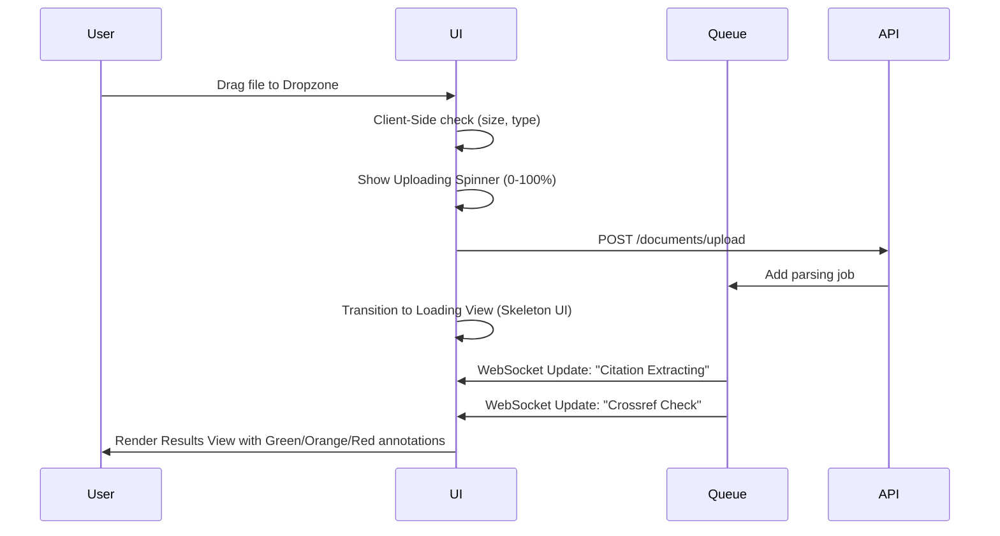

# UX Specification & Interaction Design

This document details the user experience behavior, interactive states, validation parameters, and accessibility models for the CitePilot interface.

---

## 1. Global Interactive States

All interactive elements (buttons, inputs, checkboxes, list items) must implement standard state styling:

| State | CSS / Behavioral Specification | Focus Ring / ARIA |
|---|---|---|
| **Default** | Primary theme tokens, text readability meets contrast rules. | Default state. |
| **Hover** | background lightness shift of 8-10%, mouse cursor changes to pointer. | `outline: none` (managed programmatically). |
| **Focus** | Distinct boundary focus indicator ring (2px solid primary, 2px offset). | `outline: 2px solid var(--focus-ring)`. |
| **Active** | 4% background scale-down / compression visual feedback. | — |
| **Disabled** | Opacity: 40-50%, `cursor: not-allowed`, click handler returns null. | `aria-disabled="true"`. |
| **Loading** | Inline micro-spinner or skeletal pulse animation, text disabled. | `aria-busy="true"`. |

---

## 2. Document Upload Interaction Cycle

---

## 3. Results Page Complex Interactions

### 3.1 Split View Panel Synchronization
- **Interaction**: Clicking a citation entry in the "In-Text Citations" list automatically scrolls the "Annotated Document" panel to the specific line context and flashes the highlighted text block.
- **Scroll Behavior**: Smooth scrolling with standard deceleration (`scroll-behavior: smooth`), offset by 120px to prevent header overlap.

### 3.2 Citation Highlights (Annotated Document)
Each inline year highlight supports hover/touch tooltips:
- **Green (Match)**: Tooltip shows: `"Matched Reference # [Index] - [Author, Year] - Status: Confirmed"`.
- **Orange (Warning)**: Tooltip shows: `"Warning: Author Spelling Discrepancy (e.g. Smithe vs Smith). Click to see AI suggestion"`.
- **Red (Error)**: Tooltip shows: `"Error: Reference Entry Not Found. Click to search online registries"`.
- **Gray (Unintentional Year / Non-Citation)**: Hover details explanation: `"Neutral: Date excluded by context parsing"`.

---

## 4. Keyboard Navigation Mapping

To ensure compliance with WCAG 2.1 AA accessibility standards:
- **Tab / Shift+Tab**: Sequential navigation through panels (Citations → Document → Reference List).
- **Arrow Keys**:
  - Up/Down: Navigate within lists (Citations list, Reference entries list).
  - Left/Right: Collapse/expand grouped multi-citations or suggestion details.
- **Enter / Space**: Activate selected suggestions, open context dialogs, or toggle checkboxes.
- **Escape**: Closes all overlay elements, tooltips, modals, and detail panels.

---

## 5. Form Validation & Error Mitigation

### 5.1 Invalid Upload Scenarios
- **Wrong Format**: Show immediate alert toast: `"Unsupported File Format. Please upload a .docx, .pdf, or .txt file"`.
- **Exceeded Word Count (Free Tier)**: Modal notification explaining limits and presenting direct upgrade/Student plan activation.
- **Corrupted Document**: Toast warning: `"Failed to read document contents. Please check if the file is password-protected or corrupt"`.

### 5.2 Form Fields
- Validate email formats inline with standard error patterns.
- Clear inline focus validation on error state reset.
- Dynamic error texts linked to elements via `aria-describedby` for screen reader usability.
