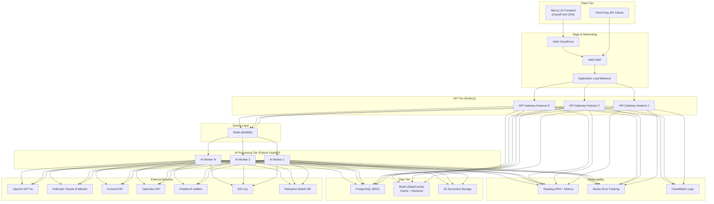
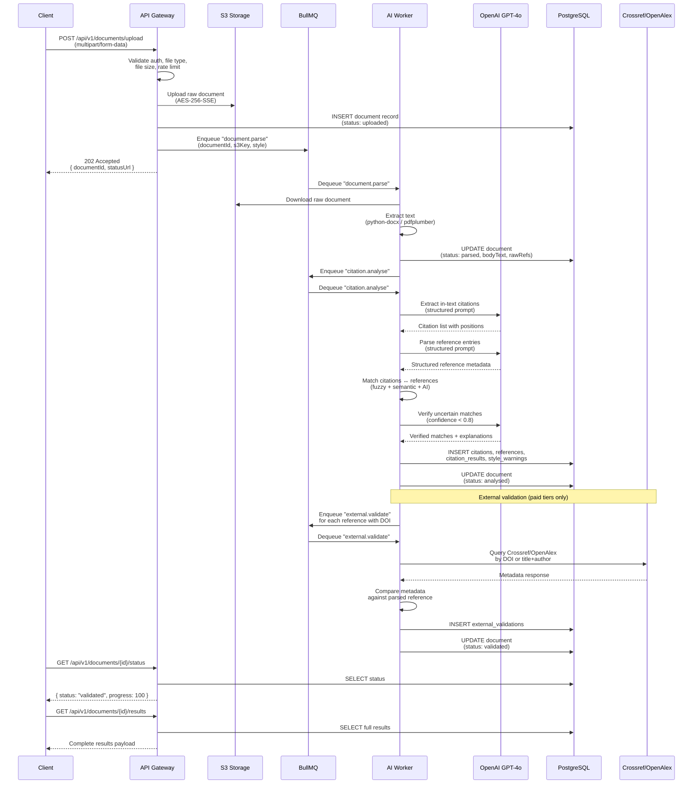
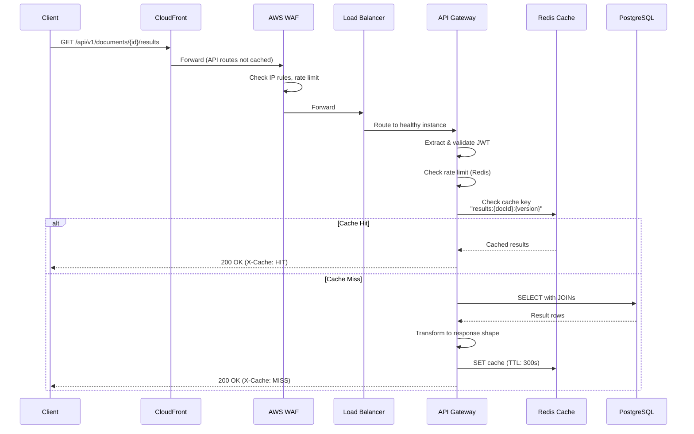
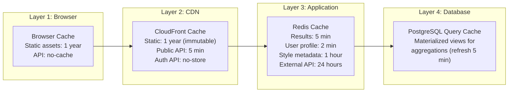
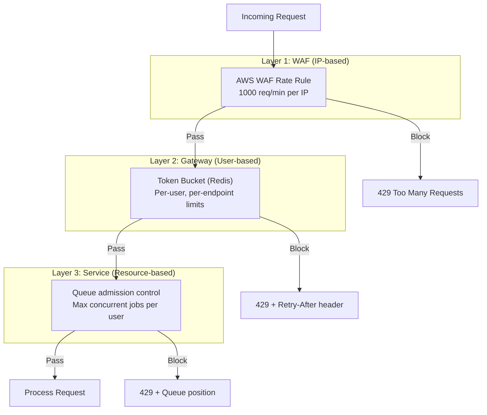

# CitePilot — System Architecture

> **Document ID:** CP-ARCH-010  
> **Version:** 1.0.0  
> **Last Updated:** 2026-07-14  
> **Status:** Approved  
> **Owner:** Engineering — Platform Team  
> **Classification:** Internal

---

## 1. Architecture Overview

CitePilot is a distributed, event-driven system built on a microservices-inspired architecture. The platform separates concerns into four logical tiers: client presentation, API gateway, AI processing, and data persistence. Asynchronous processing via Redis-backed queues decouples the latency-sensitive API layer from the computationally expensive AI analysis pipeline, enabling independent horizontal scaling of each tier.

### 1.1 Design Principles

| Principle | Implementation |
|---|---|
| **Separation of concerns** | Node.js API gateway handles auth, routing, rate limiting; Python FastAPI handles all AI/NLP workloads |
| **Async-first processing** | Document analysis is queue-driven; clients poll or receive webhooks for results |
| **Stateless services** | All application state lives in PostgreSQL/Redis; containers are ephemeral |
| **Fail-safe degradation** | External API failures (Crossref, PubMed) degrade gracefully — core citation matching continues |
| **Defence in depth** | Auth at gateway, re-validated at service level; encryption at rest and in transit |
| **Observable by default** | Structured logging, distributed tracing, and metric emission on every request |

### 1.2 High-Level Architecture Diagram



---

## 2. Component Responsibilities

### 2.1 Client Tier — Next.js 15 Frontend

| Responsibility | Detail |
|---|---|
| Server-side rendering | Initial page loads rendered on the server for SEO and performance |
| Document upload UI | Drag-and-drop `.docx`/`.pdf` upload, plain-text paste, progress indicators |
| Results dashboard | Annotated article view, split-window view, colour-coded citations |
| Polling / SSE | Polls `GET /api/v1/documents/{id}/status` every 3 seconds during analysis; upgrades to Server-Sent Events when available |
| Client-side filtering | Filters results by severity, author, year, style warning type without additional API calls |
| Auth flows | Login/register via NextAuth.js (Google, Microsoft, email/password) |
| Stripe checkout | Embeds Stripe Elements for subscription management |

### 2.2 Edge & Networking

| Component | Responsibility |
|---|---|
| **CloudFront** | Serves static frontend assets (JS bundles, CSS, images) from 450+ edge locations; caches public API responses (style metadata, pricing) with 5-minute TTL |
| **AWS WAF** | Blocks SQL injection, XSS, and known-bad IPs; enforces geographic restrictions if data residency requires it; rate-limits at the IP level (1000 req/min per IP) |
| **Application Load Balancer** | Layer-7 routing to API gateway containers; health check on `GET /health` every 10 seconds; sticky sessions disabled (stateless design) |

### 2.3 API Gateway — Node.js (Express)

The API gateway is the single entry point for all client requests. It owns:

- **Authentication & Authorization** — Validates JWT access tokens, checks subscription tier permissions, enforces role-based access for institutional admin endpoints.
- **Request Validation** — JSON Schema validation on all request bodies via `ajv`. File upload validation (MIME type, file size, magic byte checks).
- **Rate Limiting** — Per-user, per-IP, and per-endpoint rate limits enforced via Redis token bucket algorithm.
- **Request Routing** — Synchronous reads (list documents, get results) handled directly by the gateway querying PostgreSQL. Write operations that trigger AI processing (upload, re-analyse) enqueue jobs to BullMQ.
- **Response Formatting** — Normalises all responses into a consistent envelope: `{ data, meta, errors }`.
- **Webhook Dispatch** — For API consumers on Professional/Institutional tiers, dispatches webhook notifications when analysis completes.

### 2.4 Queue Layer — BullMQ (Redis-backed)

| Queue Name | Purpose | Concurrency | Priority |
|---|---|---|---|
| `document.parse` | Raw document → structured text extraction | 10 workers | Normal |
| `citation.analyse` | AI-powered citation extraction and matching | 5 workers | Normal |
| `external.validate` | Crossref/OpenAlex/PubMed lookups | 20 workers | Low |
| `retraction.check` | Retraction Watch database queries | 10 workers | Low |
| `export.generate` | PDF/CSV report generation | 3 workers | Low |
| `document.cleanup` | Scheduled deletion of documents older than 36 hours | 1 worker | Background |

Each queue supports:

- **Retry with exponential backoff** — 3 retries with delays of 5s, 30s, 120s.
- **Dead letter queue** — Failed jobs after all retries land in `*.dlq` for manual review.
- **Job progress tracking** — Workers emit progress events (0–100%) stored in Redis, enabling real-time progress bars in the UI.
- **Priority lanes** — Paid-tier users' jobs are enqueued with higher priority than free-tier jobs.

### 2.5 AI Processing Tier — Python FastAPI

The Python service runs as long-lived Fargate tasks that consume from BullMQ queues. It contains:

- **Document Parser** — Extracts structured text from `.docx` (python-docx), `.pdf` (pdfplumber), and fallback via Apache Tika for complex layouts.
- **Citation Extractor** — LLM-powered extraction of in-text citations across 9+ citation styles.
- **Reference Section Detector** — AI-driven identification of reference list boundaries, independent of heading text.
- **Reference Parser** — Segments individual reference entries and extracts structured metadata (authors, title, year, journal, DOI).
- **Citation Matcher** — Multi-signal matching engine combining fuzzy string matching, semantic similarity, and AI verification.
- **External Validator** — Queries Crossref, OpenAlex, PubMed to verify cited works exist and metadata matches.
- **Retraction Checker** — Queries Retraction Watch database via DOI/PMID lookup.
- **Hallucination Detector** — Determines if a cited paper is fabricated by cross-referencing multiple databases.
- **Style Checker** — Hybrid rule-based and AI-powered checks for citation formatting compliance.

### 2.6 Data Tier

| Component | Engine | Purpose |
|---|---|---|
| **PostgreSQL 16** | AWS RDS (Multi-AZ) | Primary relational datastore for users, documents, citations, references, results, subscriptions, audit logs |
| **Redis 7** | AWS ElastiCache (Cluster Mode) | Session storage, rate limit counters, BullMQ job queues, result caching, pub/sub for real-time progress |
| **S3** | AWS S3 (Standard) | Raw uploaded documents stored encrypted (AES-256-SSE); lifecycle policy auto-deletes after 36 hours |

---

## 3. Communication Patterns

### 3.1 Synchronous (Request-Response)

Used for operations that must return data immediately:

```
Client → ALB → API Gateway → PostgreSQL → API Gateway → Client
```

**Examples:**
- `GET /api/v1/documents` — List user's documents
- `GET /api/v1/documents/{id}/results` — Fetch completed analysis results
- `POST /api/v1/auth/login` — Authenticate user
- `GET /api/v1/user/subscription` — Fetch subscription details

**Timeout:** 10 seconds gateway-side; circuit breaker trips after 5 consecutive timeouts.

### 3.2 Asynchronous (Queue-Based)

Used for operations involving AI processing or external API calls:

```
Client → API Gateway → BullMQ Queue → AI Worker → PostgreSQL
                                                 → (notify) → Client polls / webhook
```

**Examples:**
- `POST /api/v1/documents/upload` — Enqueues `document.parse` → `citation.analyse`
- `POST /api/v1/documents/{id}/validate` — Enqueues `external.validate`
- `POST /api/v1/documents/{id}/export/pdf` — Enqueues `export.generate`

### 3.3 Event-Driven (Pub/Sub)

Redis pub/sub channels provide real-time status updates:

| Channel Pattern | Publisher | Subscriber | Payload |
|---|---|---|---|
| `doc:{id}:progress` | AI Worker | API Gateway (SSE) | `{ stage, percent, message }` |
| `doc:{id}:complete` | AI Worker | API Gateway (SSE + Webhook) | `{ documentId, resultsSummary }` |
| `doc:{id}:error` | AI Worker | API Gateway (SSE + Webhook) | `{ documentId, error, retryable }` |

### 3.4 Service-to-External Communication

All external API calls from AI workers follow a resilient pattern:

```
AI Worker → Circuit Breaker → Rate Limiter → HTTP Client → External API
                                                         ← Response
           ← Cached Result (on circuit open)
```

| External API | Rate Limit (self-imposed) | Circuit Breaker Threshold | Timeout |
|---|---|---|---|
| OpenAI GPT-4o | 500 RPM | 10 failures / 60s | 30s |
| Anthropic Claude | 200 RPM | 10 failures / 60s | 30s |
| Crossref | 50 RPM (polite pool) | 5 failures / 60s | 15s |
| OpenAlex | 100 RPM | 5 failures / 60s | 10s |
| PubMed E-utilities | 10 RPS (with API key) | 5 failures / 60s | 10s |
| DOI.org | 50 RPM | 5 failures / 60s | 10s |
| Retraction Watch | 30 RPM | 5 failures / 60s | 10s |

---

## 4. Data Flow Diagrams

### 4.1 Document Upload → Parse → AI Analysis → Results



### 4.2 Request/Response Lifecycle (Synchronous Read)



---

## 5. Scalability Strategy

### 5.1 Horizontal Scaling by Tier

| Tier | Scaling Mechanism | Min Instances | Max Instances | Scale Trigger |
|---|---|---|---|---|
| API Gateway | ECS Service Auto Scaling | 2 | 20 | CPU > 60% for 3 min OR request count > 1000/min |
| AI Workers | ECS Service Auto Scaling | 2 | 30 | Queue depth > 50 jobs for 2 min OR CPU > 70% |
| PostgreSQL | RDS Read Replicas | 1 primary + 1 replica | 1 primary + 5 replicas | Read IOPS > 10,000 for 5 min |
| Redis | ElastiCache Cluster | 3 shards | 10 shards | Memory > 75% OR connections > 5,000 |

### 5.2 Queue-Based Load Levelling

The queue architecture provides natural load levelling:

1. **Traffic spikes** — API gateway accepts uploads instantly (sub-200ms response), queuing work for later processing. Users receive a `202 Accepted` with a polling URL.
2. **Worker backpressure** — If workers are saturated, jobs accumulate in Redis queues. Auto-scaling adds workers within 60 seconds.
3. **Priority queueing** — Paid-tier jobs use BullMQ priority levels (1–10, where 1 is highest). Free-tier jobs default to priority 5; Professional-tier jobs to priority 2; Institutional-tier to priority 1.
4. **Batch processing** — External validation jobs are batched: up to 20 DOI lookups per Crossref request using the works endpoint with a `filter` parameter.

### 5.3 Database Scaling

| Strategy | Implementation |
|---|---|
| **Read replicas** | All read queries (list documents, fetch results) routed to replicas via `pg-pool` with `replication` target |
| **Connection pooling** | PgBouncer (transaction mode) sitting between application and RDS; max 200 server connections, 2000 client connections |
| **Partitioning** | `documents` table partitioned by `created_at` (monthly range partitions); `usage_logs` partitioned by `logged_at` |
| **Indexing** | Composite indexes on high-cardinality query patterns; partial indexes for `status = 'pending'` queries; GIN indexes on JSONB columns |

### 5.4 Projected Capacity

| Metric | Launch (Month 1) | Growth (Month 6) | Scale (Month 18) |
|---|---|---|---|
| Daily active users | 500 | 5,000 | 50,000 |
| Documents processed/day | 1,000 | 15,000 | 200,000 |
| Concurrent AI worker tasks | 10 | 50 | 300 |
| PostgreSQL storage | 10 GB | 100 GB | 1 TB |
| Redis memory | 512 MB | 2 GB | 8 GB |
| S3 storage (rolling 36h) | 5 GB | 50 GB | 500 GB |

---

## 6. Caching Strategy

### 6.1 Cache Layers



### 6.2 Cache Key Patterns

| Data Type | Cache Key | TTL | Invalidation |
|---|---|---|---|
| Document results | `results:{documentId}:{version}` | 300s | On re-analysis or ignore/unignore action |
| User profile | `user:{userId}` | 120s | On profile update |
| Subscription status | `sub:{userId}` | 60s | On Stripe webhook |
| Citation style metadata | `style:{styleName}` | 3600s | On deployment |
| Crossref lookup | `crossref:{doi}` | 86400s | Never (DOI metadata is stable) |
| OpenAlex lookup | `openalex:{workId}` | 86400s | Never |
| Rate limit counter | `ratelimit:{userId}:{endpoint}:{window}` | Window duration | Automatic expiry |
| Session data | `session:{sessionId}` | 86400s | On logout |

### 6.3 Cache Invalidation Strategy

- **Write-through** — On any data mutation (ignore citation, re-analyse), the API gateway deletes the relevant cache keys before writing to PostgreSQL.
- **Version stamping** — Each document has a `result_version` counter (incremented on re-analysis). Cache keys include the version, so stale results are never served.
- **TTL as safety net** — All cache entries have a TTL. Even if explicit invalidation fails, stale data expires within the TTL window.
- **No caching of in-progress data** — Documents with `status != 'validated'` are never cached.

---

## 7. CDN Strategy

### 7.1 CloudFront Distribution Configuration

| Origin | Path Pattern | Cache Policy | TTL |
|---|---|---|---|
| S3 (frontend build) | `/_next/static/*` | `Managed-CachingOptimized` | 365 days |
| S3 (frontend build) | `/fonts/*`, `/images/*` | `Managed-CachingOptimized` | 365 days |
| S3 (frontend build) | `/*.html` | Custom: `s-maxage=0, must-revalidate` | 0 (always revalidate) |
| ALB (API) | `/api/*` | `Managed-CachingDisabled` | Pass-through |
| ALB (API) | `/api/v1/styles` | Custom: `s-maxage=300` | 300s |

### 7.2 Performance Optimizations

- **Brotli compression** enabled for all text-based assets (HTML, JS, CSS, JSON).
- **HTTP/2 and HTTP/3 (QUIC)** enabled at CloudFront edge.
- **Origin Shield** enabled in `eu-west-1` to reduce origin load from multi-region edge cache misses.
- **Real-time logs** streamed to Kinesis Data Firehose → S3 for access analytics.

---

## 8. Rate Limiting Architecture

### 8.1 Multi-Layer Rate Limiting



### 8.2 Per-Tier Rate Limits

| Endpoint Category | Free | Student | Professional | Institutional |
|---|---|---|---|---|
| `POST /documents/upload` | 3/day | 50/day | 500/day | 2000/day |
| `POST /documents/paste` | 3/day | 50/day | 500/day | 2000/day |
| `GET /documents/*` (reads) | 60/min | 120/min | 300/min | 600/min |
| `GET /results/*` (reads) | 60/min | 120/min | 300/min | 600/min |
| `POST /export/*` | 0 (not available) | 10/day | 100/day | 500/day |
| API key access | Not available | Not available | 1000/day | 10,000/day |

### 8.3 Token Bucket Implementation

```
Algorithm: Token Bucket (Redis-based)
- Key: ratelimit:{userId}:{bucketName}
- Data structure: Redis hash { tokens: number, lastRefill: timestamp }
- Atomic operations via Lua script to prevent race conditions
- Refill rate calculated per-tier from configuration
- Response headers on every request:
    X-RateLimit-Limit: 60
    X-RateLimit-Remaining: 45
    X-RateLimit-Reset: 1720972800
    Retry-After: 30 (only on 429)
```

### 8.4 Concurrent Job Limits

To prevent a single user from monopolising worker capacity:

| Tier | Max Concurrent Analysis Jobs | Max Queue Depth |
|---|---|---|
| Free | 1 | 2 |
| Student | 3 | 10 |
| Professional | 5 | 25 |
| Institutional | 10 per user, 50 per org | 100 per org |

---

## 9. Fault Tolerance & Resilience

### 9.1 Failure Domains

| Failure | Impact | Mitigation |
|---|---|---|
| API Gateway instance crash | Requests to that instance fail | ALB health checks remove unhealthy instances within 20s; min 2 instances ensures availability |
| AI Worker crash mid-job | Job processing stops | BullMQ automatically retries the job on another worker after `stalledInterval` (30s) |
| PostgreSQL primary failure | All writes fail | RDS Multi-AZ automatic failover (< 60s); read replicas continue serving reads |
| Redis failure | Cache misses, queue stalls | ElastiCache Multi-AZ with automatic failover; application falls back to direct DB queries |
| OpenAI API outage | AI analysis halts | Automatic fallback to Anthropic Claude; queue jobs wait with exponential backoff |
| Crossref/OpenAlex outage | External validation fails | External validation marked as `unavailable`; core citation matching unaffected |
| S3 outage | Document retrieval fails | S3 has 99.999999999% durability; multi-region replication not required at launch |

### 9.2 Circuit Breaker Configuration

All external API clients use a circuit breaker (implemented via `opossum` in Node.js, `pybreaker` in Python):

```
States: CLOSED → OPEN → HALF-OPEN → CLOSED
- CLOSED: Normal operation, requests pass through
- OPEN: All requests fail immediately with cached/fallback response
- HALF-OPEN: Allow 1 probe request every 30s to test recovery

Thresholds:
- volumeThreshold: 10 (min requests before evaluating)
- errorThresholdPercentage: 50%
- resetTimeout: 30000ms
```

### 9.3 Health Check Endpoints

| Endpoint | Checks | Interval |
|---|---|---|
| `GET /health` | Process alive | 10s (ALB) |
| `GET /health/ready` | PostgreSQL connection, Redis connection | 30s (Kubernetes readiness) |
| `GET /health/detailed` | All dependencies + queue depths + latency percentiles | 60s (Datadog synthetic) |

---

## 10. Monitoring & Observability

### 10.1 Key Metrics

| Metric | Source | Alert Threshold |
|---|---|---|
| API response latency (p99) | Datadog APM | > 2s for 5 min |
| Error rate (5xx) | Datadog APM | > 1% for 3 min |
| Queue depth (all queues) | Redis + Datadog | > 200 jobs for 5 min |
| Queue job processing time (p95) | BullMQ metrics | > 60s for `document.parse` |
| AI analysis accuracy | Custom metric | < 95% match rate on test corpus |
| PostgreSQL connection pool utilisation | PgBouncer stats | > 80% for 5 min |
| Redis memory usage | ElastiCache metrics | > 75% |
| S3 storage (rolling) | CloudWatch | > 1 TB |
| OpenAI API latency (p95) | Datadog APM | > 10s |
| Monthly AI cost | Datadog + billing tags | > $5,000 (early warning) |

### 10.2 Distributed Tracing

Every request receives a trace ID (`X-Trace-Id` header) that propagates through:

1. CloudFront → ALB → API Gateway (Node.js `dd-trace`)
2. API Gateway → BullMQ job metadata
3. BullMQ → AI Worker (Python `ddtrace`)
4. AI Worker → External API calls

This enables end-to-end latency analysis from user click to final database write.

### 10.3 Structured Logging Format

All services emit JSON-structured logs:

```json
{
  "timestamp": "2026-07-14T18:25:00.123Z",
  "level": "info",
  "service": "api-gateway",
  "traceId": "abc123def456",
  "userId": "usr_789",
  "method": "POST",
  "path": "/api/v1/documents/upload",
  "statusCode": 202,
  "durationMs": 145,
  "documentId": "doc_456",
  "queueJobId": "job_012",
  "message": "Document upload accepted"
}
```

---

## 11. Architecture Decision Records

### ADR-001: Separate Node.js Gateway from Python AI Layer

**Context:** The system requires both high-throughput API handling and computationally intensive AI processing.

**Decision:** Use Node.js for the API gateway (auth, routing, rate limiting) and Python FastAPI for AI/NLP workloads.

**Rationale:**
- Node.js excels at high-concurrency I/O-bound work (API serving), handling 10,000+ concurrent connections per instance.
- Python has the richest ecosystem for NLP, AI, and document processing (python-docx, pdfplumber, spaCy, OpenAI SDK).
- Decoupling allows independent scaling: API instances scale based on request count; AI workers scale based on queue depth.
- Teams can specialise: frontend/API engineers work in TypeScript; ML/NLP engineers work in Python.

**Consequences:** Adds operational complexity of managing two runtimes. Mitigated by containerisation and unified CI/CD.

### ADR-002: Queue-Based Async Processing Over Synchronous

**Context:** Document analysis involves multiple LLM calls (each 2–15s) and external API lookups (each 1–5s). Total processing time per document: 15–90 seconds.

**Decision:** All document analysis is asynchronous. The upload endpoint returns `202 Accepted` immediately. Clients poll for results.

**Rationale:**
- HTTP timeouts would force premature connection closure on long analyses.
- Queue-based processing enables retry logic, priority management, and progress tracking.
- Workers can be scaled independently of API servers.
- Users can close their browser and return later; results persist in the database.

**Consequences:** Adds polling complexity to the frontend. Mitigated by SSE for real-time progress updates and clear UI feedback.

### ADR-003: Redis for Both Caching and Queues

**Context:** The system needs a message queue (BullMQ) and a cache layer.

**Decision:** Use a single Redis deployment (ElastiCache) for both purposes, with logical database separation.

**Rationale:**
- Redis 7 with cluster mode supports multiple logical databases and sufficient throughput for both workloads.
- Reduces operational overhead compared to running separate Redis instances or introducing RabbitMQ/SQS.
- BullMQ is battle-tested with Redis and provides excellent monitoring via Bull Board.
- ElastiCache provides managed failover, backups, and encryption.

**Consequences:** A Redis outage affects both caching and queuing. Mitigated by ElastiCache Multi-AZ and application-level fallback (bypass cache, direct DB queries). Queue data is persisted to Redis AOF, so in-flight jobs survive restarts.
