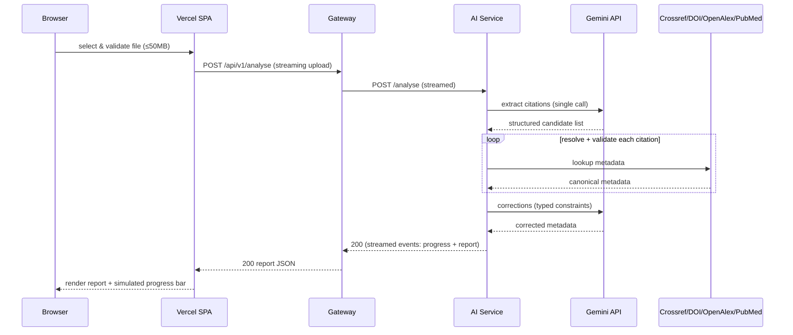
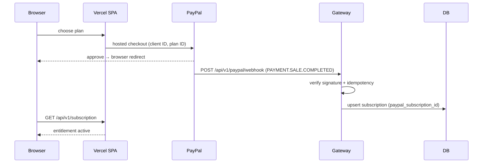

# CitePilot — System Architecture

> **Document ID:** CP-ARCH-010  
> **Version:** 2.0.0  
> **Last Updated:** 2026-08-11  
> **Status:** Approved  
> **Owner:** Engineering — Platform Team  
> **Classification:** Internal

---

## 1. Architecture Overview

CitePilot is a hosted SaaS application for citation checking of academic documents. The system is built from three polyrepos (`citepilot-web`, `citepilot-gateway`, `citepilot-ai`) deployed as managed services: **Vercel** (frontend) and **Railway** (gateway + AI service), with **Vercel Postgres** as the database. There is no self-managed infrastructure, no queue infrastructure, and no document storage — document content is held in memory only while an analysis is in progress and deleted within 36 hours.

The core user journey — upload a document, get a citation report — is processed **synchronously in a single pass**: the gateway streams a request to the AI service, which parses the document, extracts citations, resolves and validates references against public APIs, and returns a complete report. Analysis runs take tens of seconds, not minutes, so no asynchronous queue or polling is required in the MVP.

### 1.1 Design Principles

| Principle | Implementation |
|---|---|
| **Synchronous single-pass analysis** | The AI service performs one request-scoped pipeline per document; results are returned to the client in the same HTTP request (see ADR-011). No message queues in the MVP. |
| **Serverless-by-default hosting** | Everything runs on managed platforms (Vercel, Railway). No EC2/VMs, no Kubernetes, no Terraform. |
| **Sessionless by design** | The MVP has no user accounts and no server-side sessions; anonymous usage keeps the privacy surface minimal (see ADR-001). |
| **No document retention** | Uploaded documents exist in memory only and are wiped after each analysis; nothing is written to disk or to the database. |
| **Fail-safe degradation** | If an external API fails (Gemini, Crossref, DOI.org, OpenAlex, PubMed), the pipeline degrades gracefully — validation simply reports "unable to validate" rather than failing the whole analysis. |
| **Observable by default** | Structured JSON logs, request tracing IDs, and gauges (Sentry + Prometheus/Grafana via Railway) on every request; internal dashboards, no public monitoring surface. |
| **Least-power external calls** | The AI model receives only the citation-relevant portion of the text and is instructed to treat references as opaque data objects, never to invent metadata (see `14-ai-nlp-design.md`). |

### 1.2 High-Level Architecture Diagram

```mermaid
graph TB
    U[Browser / SPA] -->|HTTPS| V[Vercel - citepilot-web<br/>Next.js 16 SPA + API routes]
    V -->|/api/v1 REST| G[Railway - citepilot-gateway<br/>Node.js 22 Express 5 + Drizzle]
    G -->|/analyse (sync stream)| AI[Railway - citepilot-ai<br/>Python 3.12 FastAPI]
    V -->|read-only lookups| DB[(Vercel Postgres<br/>audits, citations, plans)]
    G -->|read/write| DB
    AI -->|HTTP| GEM[Gemini API<br/>citation model]
    AI -->|HTTPS| XR[Crossref REST API]
    AI -->|HTTPS| DOI[doi.org / Content Negotiation]
    AI -->|HTTPS| OA[OpenAlex API]
    AI -->|HTTPS| PM[PubMed E-utilities]
    V -->|hosted checkout| PP[PayPal - Billing + Webhooks]
    PP -->|webhook| G
```

### 1.3 Tiering

| Tier | Purpose |
|---|---|
| **Client tier** | Next.js SPA on Vercel — UI, client-side file validation, simulated progress display, report rendering, BibTeX/CSV export generation. |
| **API tier** | Express 5 gateway on Railway — REST API (`/api/v1`), rate limiting, webhook handling, report persistence, plan/subscription state. |
| **AI tier** | FastAPI service on Railway — the single-pass citation analysis pipeline (parse → extract → resolve → validate → correlate → correct) using the Gemini API. |
| **Data tier** | Vercel Postgres — permanent storage for analytics results and subscription records only. |

---

## 2. Component Architecture

### 2.1 Frontend — `citepilot-web`

- **Stack:** Next.js 16.2 (TypeScript 7.0, Tailwind CSS 4, Vitest), deployed to Vercel as an SPA with API routes.
- **Responsibilities:**
  - File upload with client-side validation (`.docx`, `.pdf`, `.txt`, `.rtf`, `.bib`; ≤ 50 MB; extension + magic-byte checks).
  - Calling `POST /api/v1/analyse` with a streaming upload; rendering progress events as they arrive.
  - Report views (overview, citation list, filters, source type tabs), BibTeX/CSV export generated locally.
  - Gemini catalog comparison feature: user-facing results compared against the model's output using the same `/analyse` endpoint shape.
  - Subscription checkout: redirects to PayPal hosted checkout; verifies entitlement via `/api/v1/plans`.
- **No NextAuth, no cookies, no analytics SDKs.** The app is fully serverless; any state lives in the browser (localStorage) or the gateway.

### 2.2 API Gateway — `citepilot-gateway`

- **Stack:** Node.js 22 LTS, Express 5, Drizzle ORM, run on Railway (single instance; scales horizontally if needed).
- **Endpoints** (full contract in `12-api-specification.md`):
  - `POST /api/v1/analyse` — streams the multipart upload to the AI service and returns the completed report (synchronous).
  - `POST /api/v1/analysis` (persist) / `GET /api/v1/analysis/:token` — report persistence keyed by an unguessable anonymous token.
  - `GET /api/v1/keywords/search` — persisted document keywords (no text) after analysis.
  - Plans & entitlements: `GET /api/v1/plans`, `GET /api/v1/billing/status`, `GET /api/v1/subscription`.
  - Webhook: `POST /api/v1/paypal/webhook` — validates PayPal signatures and activates/revokes plans.
- **Responsibilities:** rate limiting (in-memory, per-IP), request tracing, CORS allowlist (see `src/server.ts`), graceful error mapping, and orchestration of the AI service call with retry/backoff.
- **Not present (by ADR):** Redis, BullMQ job queues, cron workers, auth middleware.

### 2.3 AI Service — `citepilot-ai`

- **Stack:** Python 3.12, FastAPI 0.115, pytest; run on Railway. Stateless — each request spawns a self-contained pipeline.
- **Pipeline (single pass, per document):**
  1. **Parse** — `.docx`/`.pdf`/`.txt`/`.rtf`/`.bib` → structured text with footnote positions.
  2. **Extract** — Gemini extracts citation records (footnotes, inline citations, bibliography entries) with requested metadata fields.
  3. **Resolve** — Crossref/DOI.org/OpenAlex/PubMed lookups to find canonical metadata (DOIs, authors, year, venues).
  4. **Validate** — matching, retraction detection via Crossref `is-retracted-by`, reference-property validation.
  5. **Correlate** — map footnotes to bibliography entries; distinguish academic sources from AI-Human content.
  6. **Correct** — Gemini generates corrected metadata suggestions, restricted by hard type constraints.
  7. **Report** — assembles the JSON report with per-citation status, confidence, and audit verdicts.
- **External calls only:** Gemini API, Crossref, doi.org, OpenAlex, PubMed. No other databases.
- Pipeline details, prompts, and rate-limit behavior are in `14-ai-nlp-design.md`.

### 2.4 Data Persistence

- **Database:** Vercel Postgres (PostgreSQL 16). Schema in `13-database-schema.md`.
- **Stored permanently:** analysis metadata/reports (citation data — public facts), plan/subscription records, PayPal order/webhook records.
- **Never stored:** uploaded documents, extracted raw text, user identity (the MVP has no accounts), payment card data (PayPal handles all payment processing).
- **Retention mandate:** any document bytes or processed text held in memory during analysis are wiped when the request ends, or within 36 hours at the latest. No document content is ever written to disk or database.

### 2.5 External Services

| Service | Role | Notes |
|---|---|---|
| **Gemini API** | Citation extraction/correction LLM | Sole AI provider per ADR-008. No fallback provider in MVP. |
| **Crossref** | Reference resolution, retraction status | `is-retracted-by` for retraction detection |
| **doi.org** | DOI resolution / content negotiation | |
| **OpenAlex** | Open-access reference resolution | |
| **PubMed E-utilities** | Biomedical reference resolution | |
| **PayPal** | Subscriptions, checkout, billing webhooks | Sole payment processor per ADR-010 |
| **Vercel** | Frontend hosting, Postgres | |
| **Railway** | Gateway + AI service hosting | Railpack builds; includes Grafana.com and Sentry integrations |

---

## 3. Request Flows

### 3.1 Analyse a Document (synchronous)

```mermaid
sequenceDiagram
    participant U as Browser
    participant V as Vercel SPA
    participant G as Gateway
    participant AI as AI Service
    participant GEM as Gemini API
    participant XR as Crossref/DOI/OpenAlex/PubMed
    U->>V: select & validate file (≤50MB)
    V->>G: POST /api/v1/analyse (streaming upload)
    G->>AI: POST /analyse (streamed)
    AI->>GEM: extract citations (single call)
    GEM-->>AI: structured candidate list
    loop resolve + validate each citation
        AI->>XR: lookup metadata
        XR-->>AI: canonical metadata
    end
    AI->>GEM: corrections (typed constraints)
    GEM-->>AI: corrected metadata
    AI-->>G: 200 (streamed events: progress + report)
    G-->>V: 200 report JSON
    V-->>U: render report + simulated progress bar
```

- The gateway returns `200 OK` with the completed report in a single response (default `202 → 200` behaviour is **removed**; ADR-011). Mid-flight progress is conveyed via optimistic client-side simulation synchronized to real pipeline stages (see `17-engineering-guidelines.md`).
- **Timeouts:** gateway client timeout 120 s; AI service Gemini calls use exponential backoff with jitter for `429`/`5xx`. If the model is unavailable beyond retries, analysis is abandoned with a clear `503` "AI temporarily unavailable" error — the client may retry.
- **Graceful degradation:** a Crossref/OpenAlex/PubMed outage does not fail the analysis; affected citations are marked `CANNOT_VALIDATE` with reason `Source unavailable`.

### 3.2 Subscribe (PayPal)

```mermaid
sequenceDiagram
    participant U as Browser
    participant V as Vercel SPA
    participant PP as PayPal
    participant G as Gateway
    U->>V: choose plan
    V->>PP: hosted checkout (client ID, plan ID)
    PP-->>U: approve → browser redirect
    PP->>G: POST /api/v1/paypal/webhook (PAYMENT.SALE.COMPLETED)
    G->>G: verify signature + idempotency
    G->>DB: upsert subscription (paypal_subscription_id)
    U->>V: GET /api/v1/subscription
    V-->>U: entitlement active
```

### 3.3 Export Citations

- Report tables are rendered client-side. BibTeX and CSV are generated entirely in the browser from the report JSON already in hand; no additional server call.

---

## 4. Error Handling & Reliability

| Failure | Behaviour |
|---|---|
| Gemini 429 / 5xx | Retry with exponential backoff + jitter (up to N attempts); then `503` with retriable signal. |
| Crossref / DOI.org / OpenAlex / PubMed down | Per-citation graceful degradation: `CANNOT_VALIDATE`, reason `Source unavailable`. Report still produced. |
| Upload > 50 MB or bad magic bytes | Rejected at client and re-validated at gateway (`413`/`415`). |
| Gateway instance restart mid-analysis | In-flight analysis fails (`502`); client auto-retries once with `Retry-After`. Nothing persisted mid-flight. |
| PayPal webhook replay / dupes | Signature verification + idempotency key on `paypal_order_id`; duplicates are no-ops. |
| Railway/Vercel incident | Platform SLAs; DNS and TLS managed by platform; status pages linked in `25-runbooks.md`. |

## 5. Non-Functional Requirements

| Requirement | Target |
|---|---|
| Analyse latency (p95, typical 20–40-page paper) | ≤ 120 s end-to-end |
| First progress feedback | < 3 s (immediate with streaming) |
| Availability | Platform-granted (Vercel: 99.99% edge; Railway: 99.95% + health-check restarts) |
| Capacity | CPU/RAM-bound: single gateway + AI instances serve ~4–5 concurrent analyses; horizontal scale-out via Railway when plan growth requires |
| Cost profile | See `05-business-model.md` and `15-infrastructure-deployment.md` §8 |

---

## 7. Security Highlights

- Sessionless and accountless MVP — no credential material, no sessions, no auth cookies (see `16-security-architecture.md`).
- Document content in memory only, wiped within 36 hours; hot-path data is never written to disk.
- Secrets via platform env vars (Vercel/Railway), never in code or build output.
- TLS everywhere (platform-managed), signature-verified PayPal webhooks, unguessable analysis tokens.
- Upload validation: extension allow-list + magic-byte sniffing at client, gateway, and AI service.

Full details: `16-security-architecture.md`.

---

## 8. Deployment Model

- **Vercel:** web app + Postgres. Root Directory `citepilot-web/`; deploy from monorepo root with `npx vercel --prod`.
- **Railway:** gateway + AI services built with Railpack (Node and Python detected automatically); health checks and auto-restarts; Dashboard-managed env vars and redeploys.
- **Env vars** (full list in `15-infrastructure-deployment.md` §7): `GEMINI_API_KEY`, `PAYPAL_CLIENT_ID`/`CLIENT_SECRET`/`WEBHOOK_ID`, `DATABASE_URL`, `GATEWAY_ORIGIN`, AI-service keys for Crossref/OpenAlex.
- **CORS:** `citepilot-gateway/src/server.ts` maintains an explicit allowlist (production domain + localhost dev origins).

---

## 9. Future Considerations

Explicitly deferred from the MVP (tracked as ADR/MVP scope decisions, see `18-architecture-decision-records.md`):

| Item | Trigger to revisit |
|---|---|
| Async queue-based processing (Superseded ADR-002) | Gemini batch API maturity; large-document throughput demands; then adopt a managed queue (e.g. Railway volumes + BullMQ or Cloud Tasks), **not** self-hosted Redis. |
| Redis/caching (Superseded ADR-003) | Cache hot Crossref/DOI lookups when volume justifies it; prefer managed options. |
| Accounts & OAuth (NextAuth) | Institutional tier requiring multi-user workspaces, document libraries, team billing. |
| Object storage for documents | Only if a "save your analysis" history feature ships; then per-region S3-compatible storage with short TTL + encryption. |
| Multi-provider AI fallback | Monthly cost/quality benchmarking per ADR-008; a fallback provider would need its own privacy review. |
| Self-hosted infrastructure | Explicitly out of scope; managed platforms remain the default (ADR-009). |

---

## 10. ADR Reference

All architecture decisions referenced above live in the registry: `18-architecture-decision-records.md` (ADR-001 sessionless, ADR-008 Gemini, ADR-009 managed hosting, ADR-010 PayPal, ADR-011 synchronous analysis, and the superseded ADR-002/ADR-003 which are recorded there for provenance).