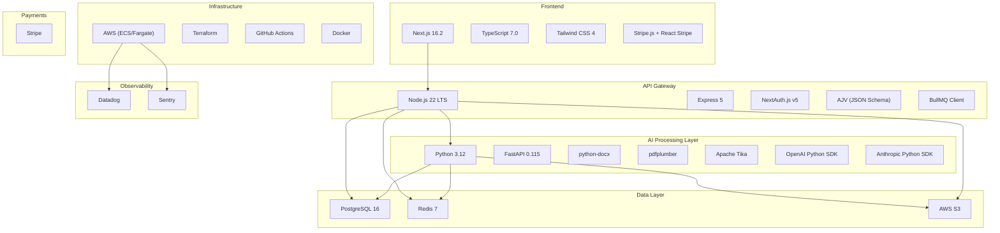

# CitePilot — Technology Stack Decisions

> **Document ID:** CP-ARCH-011  
> **Version:** 1.0.0  
> **Last Updated:** 2026-07-14  
> **Status:** Approved  
> **Owner:** Engineering — Platform Team  
> **Classification:** Internal

---

## 1. Overview

This document records every technology choice for CitePilot with full rationale, including alternatives considered and reasons for rejection. Each decision is final for the v1.0 launch and will be revisited during quarterly architecture reviews.

---

## 2. Technology Stack Summary



---

## 3. Frontend

### 3.1 Next.js 16.2 + TypeScript

| Attribute | Detail |
|---|---|
| **Technology** | Next.js 16.2 (App Router) |
| **Language** | TypeScript 7.0 (strict mode, Go native compiler / Project Corsa) |
| **Styling** | Tailwind CSS 4.0 |
| **State Management** | React Server Components + TanStack Query v5 for client-side cache |
| **Forms** | React Hook Form + Zod validation |
| **Testing** | Vitest (unit) + Playwright (E2E) |

**Why Next.js 16.2:**

- **Server Components** reduce client bundle size by keeping data-fetching logic server-side, critical for the document results view which may contain hundreds of annotated citations.
- **App Router** provides nested layouts for the dashboard (sidebar navigation, document list, results pane) without full page reloads.
- **Server Actions** simplify form submissions (login, document upload) without writing separate API route handlers on the frontend.
- **Built-in image/font optimisation** and automatic code splitting reduce initial load time to under 1.5 seconds.
- **Streaming SSR** allows progressive rendering of analysis results — the document header and metadata appear instantly while citation results stream in.
- **Vercel-independent** — deployed as a standalone Docker container on ECS, not locked to Vercel's platform.

**Alternatives Considered:**

| Alternative | Why Rejected |
|---|---|
| **Remix** | Smaller ecosystem; lacks the Server Components model that reduces bundle size; weaker community support for UI component libraries. |
| **SvelteKit** | Excellent performance, but the TypeScript ecosystem and hiring pool for Svelte are significantly smaller than React/Next.js. |
| **Angular 19** | Heavier framework, longer onboarding for new developers, less suited to the component-driven UI patterns we need. |
| **Vite + React SPA** | No SSR without additional setup; worse SEO for marketing pages; requires separate backend for API routes. |
| **Astro** | Designed for content sites, not interactive applications. The results dashboard requires heavy client-side interactivity. |

### 3.2 Tailwind CSS 4.0

**Why Tailwind:**

- Utility-first approach produces consistent styling without CSS naming conventions debates.
- JIT compiler generates only used classes, keeping CSS under 30 KB.
- Integrates with headless UI component libraries (Radix UI) for accessible components.
- Design tokens (colours, spacing, typography) defined in `tailwind.config.ts` enforce brand consistency.

**Alternatives Considered:**

| Alternative | Why Rejected |
|---|---|
| **CSS Modules** | More CSS to write and maintain; lacks utility-class velocity for rapid iteration. |
| **Styled Components** | Runtime CSS-in-JS has measurable performance cost; harder to extract static styles. |
| **shadcn/ui** | Used *alongside* Tailwind (not instead of). shadcn/ui provides accessible component primitives styled with Tailwind. |

---

## 4. API Gateway — Node.js

### 4.1 Node.js 22 LTS + Express 5

| Attribute | Detail |
|---|---|
| **Runtime** | Node.js 22.x LTS (Active LTS until April 2027) |
| **Framework** | Express 5.1 |
| **Language** | TypeScript 7.0 (compiled with `@typescript/typescript6` compatibility shim or native `tsc` v7.0) |
| **ORM** | Drizzle ORM (type-safe, SQL-first) |
| **Validation** | AJV 8 with JSON Schema Draft 2020-12 |
| **HTTP Client** | `undici` (Node.js built-in) |
| **Testing** | Vitest + Supertest |

**Why Node.js for the API Gateway:**

- **Non-blocking I/O** — The gateway is I/O-bound (database queries, Redis lookups, queue enqueue). Node.js's event loop handles 10,000+ concurrent connections per instance efficiently.
- **TypeScript end-to-end** — Shared types between frontend and API gateway reduce contract drift. `zod` schemas generate both JSON Schema for runtime validation and TypeScript types.
- **BullMQ client** — BullMQ is Node.js-native, providing first-class queue management, job scheduling, and Bull Board monitoring UI.
- **Ecosystem maturity** — `passport`, `express-rate-limit`, `helmet`, `cors`, `multer` are battle-tested middleware for auth, security, and file uploads.
- **Team alignment** — Frontend engineers can contribute to the API gateway without context-switching languages.

**Why Express 5 (not other Node.js frameworks):**

| Alternative | Why Rejected |
|---|---|
| **Fastify** | Marginally faster, but Express 5 closes the performance gap with async middleware. Express's ecosystem and middleware compatibility is broader. |
| **NestJS** | Too much abstraction (decorators, DI container, modules) for what is fundamentally a thin routing/auth/queue-enqueue layer. Adds learning curve without proportional benefit. |
| **Hono** | Excellent for edge functions, but lacks Express's middleware ecosystem for `multer` (file upload), `passport` (auth), and `express-rate-limit`. |
| **tRPC** | Type-safe API layer is compelling, but CitePilot needs a public REST API for third-party consumers. tRPC is RPC, not REST. |

### 4.2 Drizzle ORM

**Why Drizzle:**

- **SQL-first** — Generates readable SQL, unlike Prisma's opaque query builder. Critical for debugging performance issues.
- **Type inference** — Schema definitions produce TypeScript types automatically. No code generation step (unlike Prisma's `prisma generate`).
- **Migration system** — `drizzle-kit` generates SQL migration files that can be reviewed, edited, and version-controlled.
- **Performance** — No runtime query engine. Drizzle compiles queries at build time, producing raw SQL with parameterised values.

**Alternatives Considered:**

| Alternative | Why Rejected |
|---|---|
| **Prisma** | Adds a Rust-based query engine binary to the Docker image (+50 MB). Schema DSL is non-standard. Migration system is less transparent. |
| **Knex.js** | Query builder only, no type-safe schema definition. Requires separate type maintenance. |
| **TypeORM** | Decorator-heavy, tied to class-based patterns. Active Record style conflicts with our functional architecture. |
| **Raw SQL (pg)** | Maximum control but zero type safety. High maintenance burden for 30+ tables. |

---

## 5. AI Processing Layer — Python FastAPI

### 5.1 Python 3.12 + FastAPI

| Attribute | Detail |
|---|---|
| **Runtime** | Python 3.12.5 |
| **Framework** | FastAPI 0.115 |
| **AI SDKs** | `openai` 1.52, `anthropic` 0.39 |
| **NLP** | spaCy 3.8 (tokenisation, NER fallback) |
| **HTTP Client** | `httpx` (async) |
| **Validation** | Pydantic v2 |
| **Testing** | pytest + pytest-asyncio |
| **Package Manager** | uv |

**Why Python:**

- **AI/ML ecosystem dominance** — OpenAI, Anthropic, LangChain, spaCy, NLTK, scikit-learn, and every major AI library has Python as its primary SDK.
- **Document processing libraries** — `python-docx` and `pdfplumber` are Python-native with no equivalent quality in Node.js.
- **Research-to-production pipeline** — NLP researchers prototype in Python. Using Python in production eliminates the translation step.
- **Async support** — FastAPI + `asyncio` supports async HTTP calls to external APIs (OpenAI, Crossref) without blocking workers.

**Why FastAPI:**

- **Pydantic integration** — Request/response models are validated automatically with detailed error messages.
- **Async-native** — Built on Starlette and `asyncio`, supporting concurrent external API calls within a single request.
- **Auto-generated OpenAPI docs** — Useful for internal debugging and testing the AI layer endpoints.
- **Performance** — Benchmarks show FastAPI handling 5,000+ requests/second, more than sufficient for queue-driven workloads.

**Alternatives Considered:**

| Alternative | Why Rejected |
|---|---|
| **Django** | ORM-centric, synchronous by default, too heavyweight for a queue-consumer service. |
| **Flask** | No async support without hacks. No built-in validation. FastAPI is Flask's spiritual successor. |
| **Node.js (unified)** | Python's AI/NLP library ecosystem is irreplaceable. `python-docx` has no Node.js equivalent. |
| **Go** | Excellent performance, but Go's AI/NLP library ecosystem is minimal. Would require shelling out to Python anyway. |

### 5.2 Document Parsing Libraries

| Library | Format | Purpose | Version |
|---|---|---|---|
| **python-docx** | `.docx` | Primary DOCX parser. Extracts paragraphs, headings, tables, footnotes with full formatting metadata. | 1.1.2 |
| **pdfplumber** | `.pdf` | PDF text extraction with layout-aware positioning. Handles multi-column layouts, tables, and embedded fonts. | 0.11.4 |
| **Apache Tika** | Fallback (any) | Server-mode fallback for malformed documents that python-docx/pdfplumber cannot handle. Supports 1000+ file formats. | 2.9.2 |

**Parser Selection Logic:**

```
1. File is .docx → python-docx (fastest, most reliable)
2. File is .pdf → pdfplumber
3. pdfplumber fails (scanned PDF, corrupt) → Apache Tika
4. Tika fails → Return error to user with suggestion to paste text instead
```

**Alternatives Considered:**

| Alternative | Why Rejected |
|---|---|
| **PyMuPDF (fitz)** | AGPL licensed — incompatible with our commercial SaaS model. |
| **pypdf** | Less accurate text extraction than pdfplumber, particularly for multi-column academic papers. |
| **mammoth** | DOCX to HTML converter, not a structured text extractor. Loses paragraph-level metadata. |
| **LibreOffice (headless)** | Heavy dependency (800 MB container image). Conversion-based approach loses structural metadata. |
| **Unstructured.io** | Promising but still maturing. Adds a large dependency tree. Will be re-evaluated at v2.0. |

---

## 6. AI / LLM Layer

### 6.1 OpenAI GPT-4o (Primary)

| Attribute | Detail |
|---|---|
| **Model** | `gpt-4o-2025-05-13` (pinned version) |
| **Purpose** | Citation extraction, reference parsing, fuzzy match verification, style checking, error explanations |
| **Input token limit** | 128,000 tokens |
| **Output token limit** | 16,384 tokens |
| **Structured output** | JSON mode with Pydantic schema enforcement via `response_format` |
| **Cost** | $2.50 / 1M input tokens, $10.00 / 1M output tokens |

**Why GPT-4o:**

- **Accuracy** — Internal benchmarks on a 500-document test corpus show GPT-4o achieving 97.2% citation extraction accuracy vs 89.1% for GPT-4o-mini and 94.8% for Claude 3.5 Sonnet.
- **Structured output** — Native JSON mode with schema enforcement eliminates post-processing parsing failures.
- **Speed** — Average response time of 2.3 seconds for citation extraction prompts (vs 3.8 seconds for GPT-4-turbo).
- **Context window** — 128K tokens supports entire dissertations (up to ~90,000 words) in a single context window.

### 6.2 Anthropic Claude 3.5 Sonnet (Fallback)

| Attribute | Detail |
|---|---|
| **Model** | `claude-sonnet-4-20250514` |
| **Purpose** | Fallback when OpenAI is unavailable or rate-limited |
| **Context window** | 200,000 tokens |
| **Cost** | $3.00 / 1M input tokens, $15.00 / 1M output tokens |

**Fallback Trigger Conditions:**

1. OpenAI API returns HTTP 5xx for 3 consecutive requests.
2. OpenAI API latency exceeds 30 seconds.
3. OpenAI rate limit (429) received and retry budget exhausted.
4. Manual override via feature flag for A/B testing.

**Why Claude as Fallback (not another OpenAI model):**

- **Provider diversity** — Using a different provider insulates against full OpenAI outages.
- **200K context window** — Handles even the longest dissertations that may exceed GPT-4o's 128K limit.
- **Comparable accuracy** — 94.8% citation extraction accuracy is acceptable for fallback scenarios.

**Alternatives Considered for AI:**

| Alternative | Why Rejected |
|---|---|
| **GPT-4o-mini** | 89.1% accuracy is too low for production. Acceptable for style-checking sub-tasks only. |
| **Google Gemini 2.0** | Strong model but the API stability and structured output support lag behind OpenAI. Will re-evaluate. |
| **Open-source (Llama 3.1 70B)** | Requires GPU infrastructure ($2–5/hour per GPU). Accuracy on citation-specific tasks is 15–20 points below GPT-4o. Not viable at launch. |
| **Fine-tuned model** | Planned for v2.0. Requires 10,000+ labelled citation examples. Currently insufficient training data. |
| **Rule-based only (no LLM)** | Reciteworks' approach. Produces excessive false positives (flags "2020" in prose, misparses non-standard reference formats). Core competitive disadvantage we're solving. |

---

## 7. Queue System — BullMQ

| Attribute | Detail |
|---|---|
| **Library** | BullMQ 5.x |
| **Backing store** | Redis 7 (ElastiCache) |
| **Monitoring** | Bull Board (admin UI) |
| **Client language** | TypeScript (API gateway enqueues), Python (workers consume via `redis-py` + custom BullMQ-compatible consumer) |

**Why BullMQ:**

- **Redis-native** — Uses existing Redis infrastructure, no additional service to manage.
- **Priority queues** — Paid-tier jobs processed before free-tier jobs using numeric priority levels.
- **Job progress** — Built-in progress events enable real-time UI progress bars.
- **Delayed jobs** — Used for scheduled document cleanup (36-hour lifecycle).
- **Rate limiting** — Built-in group-based rate limiting for external API call jobs.
- **Retry with backoff** — Configurable retry strategies per queue.
- **Battle-tested** — Used in production by Salesforce, Microsoft, and thousands of Node.js applications.

**Python Worker Compatibility:**

BullMQ queues store jobs as Redis data structures. Python workers consume jobs using a custom consumer built on `redis-py` that reads from the same Redis lists and hashes. The consumer implements the BullMQ protocol (job locking, progress reporting, completion signalling).

**Alternatives Considered:**

| Alternative | Why Rejected |
|---|---|
| **AWS SQS** | No priority queues (standard queue). No built-in progress tracking. No admin UI. FIFO queues limited to 300 TPS. |
| **RabbitMQ** | Another service to manage, monitor, and scale. Redis already provides what we need. |
| **Celery (Python)** | Python-only. Would require the Node.js gateway to use a different queue client. |
| **Kafka** | Extreme overkill for job-queue patterns. Designed for event streaming, not task processing. Operational complexity is significant. |
| **AWS Step Functions** | State machine approach adds latency per transition. Pricing at scale ($0.025/transition) is expensive for high-volume document processing. |

---

## 8. Database Layer

### 8.1 PostgreSQL 16

| Attribute | Detail |
|---|---|
| **Hosting** | AWS RDS for PostgreSQL 16.4 |
| **Instance** | `db.r6g.xlarge` (4 vCPU, 32 GB RAM) — production |
| **Storage** | gp3, 100 GB initial, auto-scaling to 1 TB |
| **Backups** | Automated daily snapshots, 30-day retention |
| **Replication** | Multi-AZ standby + 1 read replica |
| **Extensions** | `pg_trgm` (fuzzy text search), `uuid-ossp`, `pgcrypto` |

**Why PostgreSQL:**

- **JSONB support** — Citation results, reference metadata, and AI explanations are stored as structured JSONB, enabling flexible schema evolution without migrations for every field addition.
- **Full-text search** — `tsvector` indexes enable searching documents by content, author, or citation without a separate search service.
- **`pg_trgm` extension** — Trigram-based similarity matching used for fuzzy author name comparison during citation matching.
- **Partitioning** — Native range partitioning on `created_at` keeps query performance stable as the documents table grows.
- **Mature ecosystem** — PgBouncer for connection pooling, pgBackRest for backup management, `pg_stat_statements` for query performance analysis.
- **AWS RDS** — Managed service with automated patching, backups, failover, and encryption.

**Alternatives Considered:**

| Alternative | Why Rejected |
|---|---|
| **MySQL 8** | Weaker JSONB support (JSON type exists but no GIN indexing). No `pg_trgm` equivalent for fuzzy matching. Partitioning syntax is less ergonomic. |
| **MongoDB** | Document database is appealing for flexible citation schemas, but we need relational integrity (user → documents → citations → results). JOINs across collections are inefficient. Transactions are limited. |
| **CockroachDB** | Distributed SQL is unnecessary at our scale. Adds operational complexity. PostgreSQL with read replicas handles our projected load. |
| **Supabase** | Managed PostgreSQL + auth + realtime is compelling, but we need finer control over connection pooling, extensions, and RDS configuration for production workloads. |

### 8.2 Redis 7

| Attribute | Detail |
|---|---|
| **Hosting** | AWS ElastiCache for Redis 7.x |
| **Instance** | `cache.r6g.large` (2 vCPU, 13 GB RAM) — production |
| **Cluster mode** | Enabled (3 shards, 1 replica per shard) |
| **Persistence** | AOF (append-only file) for queue durability |
| **Encryption** | In-transit (TLS) + at-rest (AES-256) |

**Use Cases:**

| Use Case | Redis Data Structure | Database Index |
|---|---|---|
| BullMQ job queues | Lists, Hashes, Sorted Sets | db0 |
| Session storage | Hashes (key: session ID) | db1 |
| Rate limit counters | Strings with EXPIRY | db2 |
| API response cache | Strings (JSON serialised) | db3 |
| Real-time pub/sub | Pub/Sub channels | db0 |

**Alternatives Considered:**

| Alternative | Why Rejected |
|---|---|
| **Memcached** | No persistence (can't back BullMQ). No pub/sub. No data structure support beyond key-value. |
| **AWS DynamoDB** | Not suitable as a message queue. Expensive for high-throughput cache operations. |
| **Valkey** | Redis fork with compatible API. Still maturing; ElastiCache doesn't yet support Valkey in all regions. Will monitor. |
| **Dragonfly** | Redis-compatible with better multi-threading. Not available as a managed AWS service. Self-hosting adds operational burden. |

---

## 9. Authentication — NextAuth.js v5

| Attribute | Detail |
|---|---|
| **Library** | NextAuth.js v5 (Auth.js) |
| **Providers** | Google OAuth 2.0, Microsoft Entra ID, Email/Password (credentials) |
| **Session strategy** | JWT (stateless, stored in httpOnly cookie) |
| **Database adapter** | Drizzle adapter for PostgreSQL |
| **Token rotation** | Access token: 15 min; Refresh token: 7 days |

**Why NextAuth.js:**

- **Next.js integration** — First-class middleware support for route protection. Server Components access session directly without API calls.
- **Multi-provider** — Google and Microsoft OAuth are the primary login methods for academic users. Email/password serves institutions with SSO restrictions.
- **JWT strategy** — Stateless tokens reduce Redis load. The API gateway validates tokens without database lookups on every request.
- **Open-source** — No per-user pricing. Auth0 and Clerk charge $0.02–$0.05 per MAU beyond free tier.

**Alternatives Considered:**

| Alternative | Why Rejected |
|---|---|
| **Auth0** | $240/month for 1,000 MAU on Essential plan. At 50,000 MAU (18-month target), cost exceeds $2,500/month. Vendor lock-in risk. |
| **Clerk** | Excellent DX, but $0.02/MAU pricing at scale is significant. Limited customisation of auth flows. |
| **Supabase Auth** | Tied to Supabase ecosystem. We're using RDS PostgreSQL, not Supabase-hosted. |
| **Firebase Auth** | Google-only ecosystem. Limited customisation. Would couple us to GCP services. |
| **Custom JWT implementation** | Significant security risk. Auth is a solved problem — use a maintained library. |

---

## 10. External APIs

### 10.1 Crossref REST API

| Attribute | Detail |
|---|---|
| **Base URL** | `https://api.crossref.org/works/` |
| **Auth** | Polite pool (send `mailto` parameter with contact email for higher rate limits) |
| **Rate limit** | 50 requests/second (polite pool) |
| **Use case** | Verify DOI metadata, look up works by title+author, confirm publication year and journal |
| **Cost** | Free |

### 10.2 OpenAlex API

| Attribute | Detail |
|---|---|
| **Base URL** | `https://api.openalex.org/works` |
| **Auth** | API key via `mailto` parameter (free, higher rate limits) |
| **Rate limit** | 100,000 requests/day |
| **Use case** | Fallback for Crossref failures, broader coverage of non-DOI sources, open access status |
| **Cost** | Free |

### 10.3 PubMed E-utilities

| Attribute | Detail |
|---|---|
| **Base URL** | `https://eutils.ncbi.nlm.nih.gov/entrez/eutils/` |
| **Auth** | NCBI API key (free, 10 requests/second vs 3/second without) |
| **Use case** | Biomedical literature verification, PMID-based lookups, MeSH term validation |
| **Cost** | Free |

### 10.4 DOI.org

| Attribute | Detail |
|---|---|
| **Base URL** | `https://doi.org/` |
| **Use case** | DOI resolution, content negotiation for metadata in various formats (JSON-LD, BibTeX, Citeproc) |
| **Cost** | Free |

### 10.5 Retraction Watch Database

| Attribute | Detail |
|---|---|
| **Access** | Via Crossref REST API (`is-retracted` field) + Retraction Watch website API |
| **Use case** | Flag references to retracted papers |
| **Cost** | Free for academic use; commercial use requires The Center for Scientific Integrity licence |

---

## 11. Hosting — AWS

### 11.1 AWS Service Map

| Service | Component | Purpose |
|---|---|---|
| **ECS / Fargate** | API Gateway, AI Workers | Serverless container hosting; no EC2 instance management |
| **RDS** | PostgreSQL | Managed relational database with Multi-AZ |
| **ElastiCache** | Redis | Managed Redis with cluster mode |
| **S3** | Documents, frontend build | Object storage with server-side encryption |
| **CloudFront** | Frontend CDN | Global edge caching for static assets |
| **ALB** | Load balancer | Layer-7 routing to ECS services |
| **WAF** | Firewall | IP-based rate limiting, SQL injection blocking |
| **ECR** | Container registry | Private Docker image storage |
| **Secrets Manager** | Secrets | API keys, database credentials, JWT signing keys |
| **CloudWatch** | Logging | Centralised log aggregation |
| **Route 53** | DNS | Domain management, health-check-based failover |
| **ACM** | TLS | Managed TLS certificates for all endpoints |
| **SES** | Email | Transactional emails (verification, password reset, usage alerts) |

**Why AWS (not alternatives):**

| Alternative | Why Rejected |
|---|---|
| **Google Cloud (GCP)** | Smaller market share in enterprise/academic sector. GKE is excellent but we don't need Kubernetes at launch scale. |
| **Azure** | Strong in enterprise but heavier operational overhead. Cost structure less predictable for variable workloads. |
| **Vercel** | Frontend-only. Cannot host Python workers, PostgreSQL, or Redis. Would still need AWS for backend. |
| **Railway / Render** | Simpler deployment but limited auto-scaling, no WAF, no multi-AZ database, no fine-grained IAM policies. Insufficient for production SaaS. |
| **Self-hosted (bare metal)** | Requires dedicated DevOps team. No auto-scaling, no managed backups. Unacceptable operational risk for a startup. |

---

## 12. Payments — Stripe

| Attribute | Detail |
|---|---|
| **Integration** | Stripe Checkout (hosted payment page) + Stripe Customer Portal (self-service subscription management) |
| **Libraries** | `stripe` Node.js SDK (server), `@stripe/react-stripe-js` (client) |
| **Webhook events** | `checkout.session.completed`, `invoice.paid`, `invoice.payment_failed`, `customer.subscription.updated`, `customer.subscription.deleted` |
| **Products** | 3 Stripe Products (Student, Professional, Institutional) with monthly and annual Price objects |
| **Tax** | Stripe Tax for automatic VAT/GST calculation |
| **Cost** | 2.9% + $0.30 per transaction |

**Why Stripe:**

- **Checkout + Customer Portal** — No custom payment UI to build or maintain. PCI compliance handled entirely by Stripe.
- **Subscription lifecycle** — Automatic invoicing, proration on plan changes, dunning for failed payments.
- **Stripe Tax** — Automated tax calculation across 50+ countries. Essential for a global academic user base.
- **Webhooks** — Reliable webhook delivery with built-in retry logic. Event signatures prevent spoofing.

**Alternatives Considered:**

| Alternative | Why Rejected |
|---|---|
| **Paddle** | Acts as Merchant of Record (handles VAT/sales tax), but takes 5% + $0.50 per transaction — nearly double Stripe's cost. |
| **LemonSqueezy** | Merchant of Record model appealing, but limited API capabilities and no support for metered billing. |
| **PayPal** | Poor developer experience. Higher fraud rates. Academic users prefer card payments. |

---

## 13. Monitoring & Observability

### 13.1 Datadog

| Feature | Use Case |
|---|---|
| **APM** | Distributed tracing across Node.js gateway → BullMQ → Python workers |
| **Metrics** | Custom metrics: queue depth, AI processing time, citation match rate, external API latency |
| **Dashboards** | Real-time system health, business KPIs (documents processed, revenue, tier distribution) |
| **Alerts** | PagerDuty integration for P1/P2 incidents |
| **Logs** | Centralised log management with correlation to traces |
| **Synthetics** | Scheduled API tests to detect regressions before users report them |

### 13.2 Sentry

| Feature | Use Case |
|---|---|
| **Error tracking** | Automatic capture of unhandled exceptions with stack traces, breadcrumbs, and user context |
| **Release tracking** | Correlate errors with specific deployments to identify regressions |
| **Performance** | Frontend Web Vitals (LCP, FID, CLS) monitoring |
| **Session replay** | (Disabled by default for privacy; opt-in for debugging specific user issues) |

**Why both Datadog AND Sentry:**

- Datadog excels at infrastructure metrics, APM, and dashboarding. Sentry excels at error tracking with rich context (stack traces, breadcrumbs, source maps). Using both provides comprehensive observability without compromise.

**Alternatives Considered:**

| Alternative | Why Rejected |
|---|---|
| **New Relic** | Comparable to Datadog but more expensive at scale. Data ingest pricing model is unpredictable. |
| **Grafana Cloud + Loki + Tempo** | Open-source stack requires more setup and maintenance. Datadog's managed service is worth the cost at our stage. |
| **AWS CloudWatch only** | Basic metrics and logs only. No APM, no distributed tracing, no error tracking with context. |
| **Honeycomb** | Excellent for observability, but lacks Datadog's breadth (infrastructure metrics, synthetics, log management). |

---

## 14. CI/CD — GitHub Actions

| Attribute | Detail |
|---|---|
| **Platform** | GitHub Actions |
| **Runners** | GitHub-hosted `ubuntu-latest` (standard); self-hosted ARM runner for Docker builds |
| **Workflows** | `ci.yml` (lint, test, build), `deploy-staging.yml`, `deploy-production.yml` |
| **Container registry** | AWS ECR (images pushed on merge to `main`) |
| **Infrastructure** | Terraform (applied via `terraform-plan.yml` on PR, `terraform-apply.yml` on merge) |
| **Secrets** | GitHub Actions Secrets (linked to AWS Secrets Manager via OIDC) |

**Why GitHub Actions:**

- **Native GitHub integration** — PR checks, branch protection rules, deployment environments with approval gates.
- **Matrix builds** — Test across Node.js 20/22 and Python 3.11/3.12 in parallel.
- **OIDC federation** — Assume AWS IAM roles without storing long-lived credentials.
- **Cost** — 2,000 free minutes/month for private repos. Additional minutes at $0.008/min.

**Alternatives Considered:**

| Alternative | Why Rejected |
|---|---|
| **CircleCI** | More powerful caching, but separate platform from GitHub. One more account to manage. |
| **GitLab CI** | Would require migrating repos to GitLab. No benefit over GitHub Actions for our use case. |
| **AWS CodePipeline** | AWS-native but clunky UI, slow iteration cycle, limited community action ecosystem. |
| **Buildkite** | Excellent for large-scale builds, but overkill for a team of 5–10 engineers. |

---

## 15. Version Matrix

| Technology | Version | End of Support | Upgrade Path |
|---|---|---|---|
| Node.js | 22 LTS | April 2027 | Node.js 24 LTS (October 2027) |
| Python | 3.12 | October 2028 | Python 3.13 (October 2026 release) |
| Next.js | 15.1 | Community-supported | Next.js 16 (track Canary channel) |
| PostgreSQL | 16.4 | November 2028 | PostgreSQL 17 (September 2026) |
| Redis | 7.x | Community-supported | Redis 8 (when ElastiCache supports it) |
| TypeScript | 5.5 | Community-supported | TypeScript 5.6+ (non-breaking) |
| FastAPI | 0.115 | Community-supported | Track minor releases |
| Terraform | 1.9 | HashiCorp-supported | OpenTofu if licence changes |

---

## 16. Dependency Security

| Practice | Implementation |
|---|---|
| **Automated vulnerability scanning** | GitHub Dependabot for npm and pip; Snyk for container image scanning |
| **Lock files** | `package-lock.json` (npm), `uv.lock` (Python) committed to repository |
| **Pinned versions** | All production dependencies pinned to exact versions; `^` ranges only in devDependencies |
| **Container base images** | `node:22-slim` and `python:3.12-slim` (Debian-based, minimal attack surface) |
| **Licence compliance** | `license-checker` (npm) and `pip-licenses` (Python) run in CI; AGPL dependencies blocked |
| **Supply chain** | npm `--ignore-scripts` in CI; only run post-install scripts for known packages |
