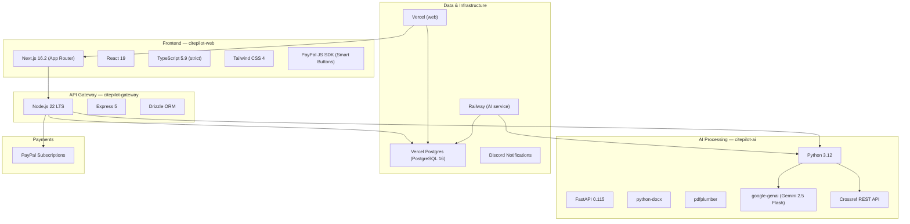

# CitePilot — Technology Stack Decisions

> **Document ID:** CP-ARCH-011  
> **Version:** 1.1.0  
> **Last Updated:** 2026-08-11  
> **Status:** Approved  
> **Owner:** Engineering — Platform Team  
> **Classification:** Internal

---

## 1. Overview

This document records every technology choice for CitePilot with full rationale, including alternatives considered and reasons for rejection. Each decision reflects the **live MVP** (web on Vercel, AI service on Railway, Gemini 2.5 Flash, PayPal, Vercel Postgres + Drizzle) and the near-term roadmap. Earlier designs assumed AWS (ECS/RDS/S3/CloudFront), OpenAI/Claude, and Stripe; those have been superseded — see ADR-008 (Gemini), ADR-009 (Vercel/Railway), ADR-010 (PayPal), and ADR-011 (synchronous vs queue) in `04-engineering-standards/18-architecture-decision-records.md`.

---

## 2. Technology Stack Summary

```mermaid
graph TB
    subgraph "Frontend — citepilot-web"
        NEXT["Next.js 16.2 (App Router)"]
        REACT["React 19"]
        TS["TypeScript 5.9 (strict)"]
        TW["Tailwind CSS 4"]
        PAYPAL_JS["PayPal JS SDK (Smart Buttons)"]
    end

    subgraph "API Gateway — citepilot-gateway"
        NODE["Node.js 22 LTS"]
        EXPRESS["Express 5"]
        DRIZZLE["Drizzle ORM"]
    end

    subgraph "AI Processing — citepilot-ai"
        PYTHON["Python 3.12"]
        FASTAPI["FastAPI 0.115"]
        DOCX["python-docx"]
        PDF["pdfplumber"]
        GENAI["google-genai (Gemini 2.5 Flash)"]
        CROSSREF["Crossref REST API"]
    end

    subgraph "Data & Infrastructure"
        PG["Vercel Postgres (PostgreSQL 16)"]
        VERCEL["Vercel (web)"]
        RAILWAY["Railway (AI service)"]
        DISCB["Discord Notifications"]
    end

    subgraph "Payments"
        PAYPAL["PayPal Subscriptions"]
    end

    NEXT --> NODE
    NODE --> PYTHON
    NODE --> PG
    PYTHON --> GENAI
    PYTHON --> CROSSREF
    NODE --> PAYPAL
    VERCEL --> NEXT
    RAILWAY --> PYTHON
    VERCEL --> PG
    RAILWAY --> PG
```

**Not in the MVP** (roadmap only): Redis/BullMQ queue, object storage (S3), authentication (NextAuth.js), APM/error tracking (Sentry), analytics, and a public status page.

---

## 3. Frontend

### 3.1 Next.js 16.2 + React 19 + TypeScript

| Attribute | Detail |
|---|---|
| **Technology** | Next.js 16.2 (App Router) |
| **Language** | TypeScript 5.9 (strict) |
| **Styling** | Tailwind CSS 4.0 |
| **State Management** | React hooks / client components (plain React; no external state library) |
| **HTTP Client** | Native `fetch` against the gateway API |
| **Testing** | Vitest 3 (unit); E2E (Playwright) on roadmap |

**Why Next.js 16.2:**

- **App Router** provides the landing pages and `/dashboard` workspace with shared layouts and per-route code splitting.
- **React Server Components** keep marketing pages (hero, pricing, FAQ, terms) fast and SEO-friendly.
- **Zero-config deployment on Vercel** — `vercel --prod` from the monorepo root (Vercel Root Directory = `citepilot-web/`) is the entire deploy process; preview deployments from every PR.
- **Client-side document handling** — upload, progress simulation, and result rendering are interactive without a custom bundler setup.

**Alternatives Considered:**

| Alternative | Why Rejected |
|---|---|
| **Remix / SvelteKit** | Smaller ecosystems and hiring pools than React/Next.js; no meaningful benefit for this app. |
| **Vite + React SPA** | No SSR for marketing pages; requires a separate web server; worse SEO. |
| **Astro** | Content-first; the results dashboard needs heavy interactivity. |

### 3.2 Tailwind CSS 4.0

- Utility-first styling with design tokens defined in `app/globals.css` (`--color-ink`, `--color-paper`, `--color-card`, `--color-rule`, `--color-accent`).
- JIT compilation keeps the CSS bundle small.
- No component library dependency — the Paper & Ink design system (see `02-design/06-design-system.md`, superseded banner) is implemented directly.

---

## 4. API Gateway — Node.js

### 4.1 Node.js 22 LTS + Express 5

| Attribute | Detail |
|---|---|
| **Runtime** | Node.js 22.x LTS (Active LTS until April 2027) |
| **Framework** | Express 5 |
| **Language** | TypeScript |
| **ORM** | Drizzle ORM (type-safe, SQL-first) |
| **Testing** | Vitest + Supertest |

**Why Node.js for the gateway:**

- **Shared language with the frontend** — one codebase culture, shared types (`@citepilot/shared-types`).
- **Non-blocking I/O** — gateway is I/O-bound (database, proxying to the AI service, PayPal IPN).
- **Proxying the AI service** — the gateway abstracts paywalled features (paywall flag, configured via env) and exposes REST endpoints to the web app.

**Why Express 5:**

| Alternative | Why Rejected |
|---|---|
| **Fastify** | Marginally faster; Express's middleware ecosystem is broader and better known. |
| **NestJS** | Too much abstraction for a thin routing/proxy layer. |
| **Hono** | Geared to edge runtimes; no benefit over Express on Railway. |

### 4.2 Drizzle ORM

- **SQL-first** — readable SQL migrations via `drizzle-kit`, reviewed and version-controlled.
- **Type inference** — schema definitions produce TypeScript types without a code-generation step (unlike Prisma).

**Alternatives Considered:**

| Alternative | Why Rejected |
|---|---|
| **Prisma** | Opaque query engine binary; less transparent migrations. |
| **Knex.js** | Query builder only; no type-safe schema. |
| **TypeORM** | Decorator-heavy; conflicts with our functional style. |

---

## 5. AI Processing Layer — Python FastAPI

### 5.1 Python 3.12 + FastAPI

| Attribute | Detail |
|---|---|
| **Runtime** | Python 3.12 |
| **Framework** | FastAPI 0.115 |
| **AI SDK** | `google-genai` (Gemini 2.5 Flash) |
| **Document parsing** | `python-docx` (`.docx`), `pdfplumber` (`.pdf`), plain-text extraction for `.txt`/`.rtf`/`.bib` |
| **HTTP Client** | `httpx` (async) |
| **Validation** | Pydantic v2 (request/response schemas) |
| **Testing** | pytest + pytest-asyncio |
| **Package Manager** | uv |

**Why Python:**

- **Document processing libraries** — `python-docx` and `pdfplumber` have no equivalent quality in Node.js.
- **AI SDK maturity** — `google-genai` provides first-class Gemini access with structured output support.
- **FastAPI** — async-native, Pydantic-validated, auto OpenAPI docs; ideal for a single-process AI service.

**Alternatives Considered:**

| Alternative | Why Rejected |
|---|---|
| **Django / Flask** | Not async-native; heavier than needed. |
| **Node.js (unified)** | `python-docx`/`pdfplumber` have no Node.js equivalents. |
| **Go** | No AI/NLP ecosystem; would shell out to Python anyway. |

### 5.2 Document Parsing

| Library | Format | Purpose |
|---|---|---|
| **python-docx** | `.docx` | Primary parser for manuscripts (paragraphs, headings, tables). |
| **pdfplumber** | `.pdf` | Layout-aware PDF text extraction. |
| **Plain text** | `.txt` / `.rtf` / `.bib` | Extracted/read directly; BibTeX entries parsed from `.bib`. |

Uploads are capped at **50 MB**. Documents are held in memory for the duration of the audit and discarded — **no object storage**.

---

## 6. AI / LLM Layer — Google Gemini 2.5 Flash

| Attribute | Detail |
|---|---|
| **Model** | `gemini-2.5-flash` (via `google-genai`) |
| **Purpose** | Citation extraction, reference parsing, fuzzy matching, style checking, AI explanations, hallucination plausibility scoring |
| **Auth** | `GOOGLE_API_KEY` (env var on Railway) |
| **Cost** | ~$0.30 / 1M input tokens, ~$2.50 / 1M output tokens (at 2026-08 pricing); see `01-discovery-strategy/05-business-model.md` |

**Why Gemini 2.5 Flash:**

- **Cost-efficient at document scale** — a 5,000-word manuscript costs well under $0.01 per audit, making the free tier viable.
- **Structured output** — Pydantic-enforced JSON responses keep parsing reliable.
- **Speed** — fast enough for synchronous, single-shot processing (target: full audit in seconds for short documents, ≤ 3 minutes for theses).
- **Single provider simplicity** — one API key, one SDK, no fallback matrix to operate.

**Alternatives Considered:**

| Alternative | Why Rejected |
|---|---|
| **OpenAI GPT-4o** | Superseded by ADR-008: higher cost per audit and no meaningful accuracy advantage for citation-evaluation tasks. |
| **Anthropic Claude 3.5 Sonnet** | Same story as GPT-4o; two-provider fallback adds operational complexity with no launch benefit. |
| **Gemini 2.5 Pro** | Overkill for MVP; revisit if accuracy issues emerge on long structured documents. |
| **Open-source (Llama etc.)** | Requires GPU infrastructure; no fit for a pay-per-audit SaaS at launch scale. |
| **Fine-tuned model** | Requires 10,000+ labelled citation examples; planned for v2.0. |

**Degradation policy:** if Gemini returns errors or quota is exceeded, the audit fails openly with a retry prompt — there is **no silent fallback provider** in the MVP (see `06-operations/25-runbooks.md`).

---

## 7. Processing Model — Synchronous (no queue in MVP)

| Attribute | Detail |
|---|---|
| **Mode** | Synchronous single-shot analysis per request |
| **Progress** | Client-side simulated progress steps (25 → 70 → 100%) matched to real pipeline stages |
| **Real-time updates** | Not in MVP — no web socket consumed by the UI (the AI service exposes `/ws/analyse`; UI adoption is on roadmap) |

**Design points:**

- The web client uploads via `/analyse` (multipart `citation_style`/`text`) and waits for the complete result: citations, references, style warnings, Crossref validation, retraction flags, recency, and the top-3 findings.
- Long documents may take up to ~3 minutes; the client shows progress and enforces its own timeouts.
- Document data is never persisted — results live in the browser session only.

**Alternatives Considered:**

| Alternative | Why Rejected |
|---|---|
| **BullMQ + Redis queue** | Adds a queue, worker fleet, and Redis to operate for MVP traffic. Revisit when real-time progress/job persistence is required (ADR-011). |
| **Async job with polling** | No benefit over synchronous at single-digit-to-hundreds of audits per day. |
| **Web socket progress** | Already partially built (`/ws/analyse`); UI adoption scheduled as a UX upgrade, not a launch blocker. |

---

## 8. Database Layer

### 8.1 Vercel Postgres (PostgreSQL 16) + Drizzle

| Attribute | Detail |
|---|---|
| **Hosting** | Vercel Postgres (PostgreSQL 16) |
| **Schema** | Drizzle schema + SQL migrations in `supabase/migrations/` |
| **Usage (current)** | Minimal — the MVP is sessionless; the database powers paywall flags, subscription state mirrors, and future features |
| **Backups** | Platform-managed daily backups (Vercel dashboard) |

**Why PostgreSQL on Vercel Postgres:**

- **Managed with zero ops** — no RDS setup, patching, or connection-pool tuning for a team of two.
- **SQL + JSONB** — flexible structured storage for future citation-history features.
- **Drizzle** — type-safe schema and migrations without a query-engine binary.

**Alternatives Considered:**

| Alternative | Why Rejected |
|---|---|
| **AWS RDS** | Full management overhead; no benefit at MVP scale. |
| **Supabase** | Evaluated; Vercel Postgres is bundled with our web host and sufficient. |
| **SQLite/Turso** | Interesting for edge, but we already run managed Postgres. |
| **MongoDB** | No relational integrity needed today; JOINs would be worse. |

### 8.2 No Redis / No S3

- **Redis** — not in MVP: no queue, no sessions, no cache layer (see §7). Crossref lookups hit the API directly; a cache is roadmap.
- **S3 / object storage** — documents are held in memory during analysis and discarded; nothing persistent to store.

---

## 9. Authentication — None in MVP (Sessionless)

| Attribute | Detail |
|---|---|
| **Current state** | No sign-in, no accounts, no cookies. The workspace is open to anyone with the URL. |
| **Limits** | Free-tier caps (3 uploads/day, 5,000 words, 100 references) enforced client-side via localStorage |
| **Payments** | PayPal manages subscription identity; the paywall flag (`PAYWALL_ENABLED` env) is cosmetic in MVP — subscription status is not yet linked to feature gating |

**Roadmap:** Auth.js (NextAuth v5) with Google + institutional identity providers when accounts, history, and plan-linked gating ship (see `01-discovery-strategy/02-prd.md` §0 target-state).

---

## 10. External APIs

### 10.1 Crossref REST API — live

| Attribute | Detail |
|---|---|
| **Base URL** | `https://api.crossref.org/` |
| **Auth** | Polite pool (`mailto` parameter) |
| **Rate limit** | 50 requests/second (polite pool) |
| **Use cases** | Verify DOI/title/author/year/journal metadata; retraction flags via `is-retracted-by`; hallucination plausibility lookup |
| **Cost** | Free |

### 10.2 DOI.org — live

| Attribute | Detail |
|---|---|
| **Base URL** | `https://doi.org/` |
| **Use case** | DOI resolution and content negotiation |
| **Cost** | Free |

### 10.3 Roadmap integrations

| Service | Status | Use case |
|---|---|---|
| **OpenAlex** | Roadmap | Fallback metadata coverage beyond Crossref |
| **PubMed E-utilities** | Roadmap | Biomedical reference validation |
| **Retraction Watch database** | Roadmap | Supplementary retraction data beyond Crossref `is-retracted-by` |

---

## 11. Hosting — Vercel + Railway

| Service | Component | Purpose |
|---|---|---|
| **Vercel** | `citepilot-web` | Frontend hosting, CDN, preview deployments, Vercel Postgres |
| **Railway** | `citepilot-ai` | Python FastAPI service with `GOOGLE_API_KEY` env var |
| **Vercel Postgres** | Database | Managed PostgreSQL for gateway + AI service |

**Why Vercel + Railway:**

- **Zero-ops deploys** — `vercel --prod` from the web repo; `railway up` / dashboard deploys for the AI service.
- **Managed infrastructure** — TLS certs, scaling, and backups handled by the platforms (built on SOC 2 / ISO 27001 certified data centres).
- **Right-sized for MVP** — no Kubernetes, no IAM, no VPC diagrams to maintain for a two-person team.

**Alternatives Considered:**

| Alternative | Why Rejected |
|---|---|
| **AWS (ECS/RDS/S3/CloudFront)** | Superseded (ADR-009): weeks of infra work for zero MVP benefit; superseded docs removed. |
| **Render / Fly.io** | Viable substitutes; Railway chosen for its Postgres integrations and simplicity. |
| **Self-hosted / Kubernetes** | Requires a DevOps hire; unacceptable risk and cost at launch. |

---

## 12. Payments — PayPal Subscriptions

| Attribute | Detail |
|---|---|
| **Integration** | PayPal JS SDK Smart Buttons (client-side) with a hardcoded subscription plan ID |
| **Plan** | Professional — `P-00697875B1151583ANJV3VOY` (monthly, target price **$12.99** — must be updated in the PayPal dashboard to match the landing page) |
| **Live flag** | `SHOW_PAYWALL` env variable — the subscription button renders only when enabled |
| **Waitlist** | Student tier ($4.99, coming soon) via `mailto:support@citepilot.ai` |
| **Cancellation** | Users cancel from their PayPal account (self-service; no in-app billing history) |

**Why PayPal:**

- **Zero merchant-account setup for MVP** — PayPal Subscriptions handles recurring billing, dunning, and PCI scope.
- **Global reach** — broad international coverage for a student/researcher audience.

**Alternatives Considered:**

| Alternative | Why Rejected |
|---|---|
| **Stripe** | Superseded (ADR-010): richer API but more integration work (Checkout, Customer Portal, webhooks) than MVP needs; revisit when accounts and self-service billing ship. |
| **Paddle / LemonSqueezy** | Merchant-of-record model has appeal (tax handled), but at higher fees and with weaker subscription APIs for our case. |

---

## 13. Monitoring & Observability — MVP

| Practice | Implementation |
|---|---|
| **Health checks** | `/health` (shallow) and `/health/deep` (DB connectivity) on the AI service |
| **Logs** | Structured JSON logs; reviewed via Vercel and Railway platform logs |
| **Uptime** | Platform-level monitoring from Vercel/Railway; manual spot checks |
| **Roadmap** | Sentry (client + server errors), scheduled uptime checks, alert runbooks (see `06-operations/26-incident-response.md`) |

No Datadog, PagerDuty, or status page in the MVP — see `04-engineering-standards/20-monitoring-observability.md`.

---

## 14. CI/CD — GitHub Actions + platform CLIs

| Attribute | Detail |
|---|---|
| **Platform** | GitHub Actions |
| **Web checks** | `npm run typecheck` + `npm test` (typescript + vitest); `npm run lint` is **not** used (Next 16 removed `next lint`; no `eslint.config.*` committed) |
| **AI checks** | `uv run pytest` (offline, mocked Gemini + Crossref) + `uv run ruff check` |
| **Deploys** | Web: `npx vercel --prod` from the monorepo root; AI: Railway dashboard / `railway up` |
| **Secrets** | Environment variables in Vercel and Railway dashboards (never committed) |

No Docker images, ECR, or Terraform in the MVP — deployments are platform-native.

---

## 15. Version Matrix (live versions)

| Technology | Version | Notes |
|---|---|---|
| Node.js | 22 LTS | Active LTS until April 2027 |
| Python | 3.12 | `requires-python = ">=3.12"` |
| Next.js | 16.2 | App Router |
| React | 19.1 | |
| TypeScript | 5.9 | strict |
| Tailwind CSS | 4.1 | |
| Vitest | 3.1 | unit tests |
| FastAPI | 0.115 | |
| google-genai | 1.x | Gemini 2.5 Flash |
| PostgreSQL | 16 | Vercel Postgres |
| Drizzle ORM | latest | SQL-first, drizzle-kit migrations |

---

## 16. Dependency Security

| Practice | Implementation |
|---|---|
| **Automated vulnerability scanning** | GitHub Dependabot (`npm audit` / `pip-audit`); `npm run typecheck` in CI |
| **Lock files** | `package-lock.json` (npm) and `uv.lock` (Python) committed |
| **Python tooling** | Ruff (`uv run ruff check`) + pytest with mocked external APIs (69 offline tests) |
| **Supply chain** | Minimal dependencies by design; no opaque runtime engines (no Prisma binary, no Tika server) |