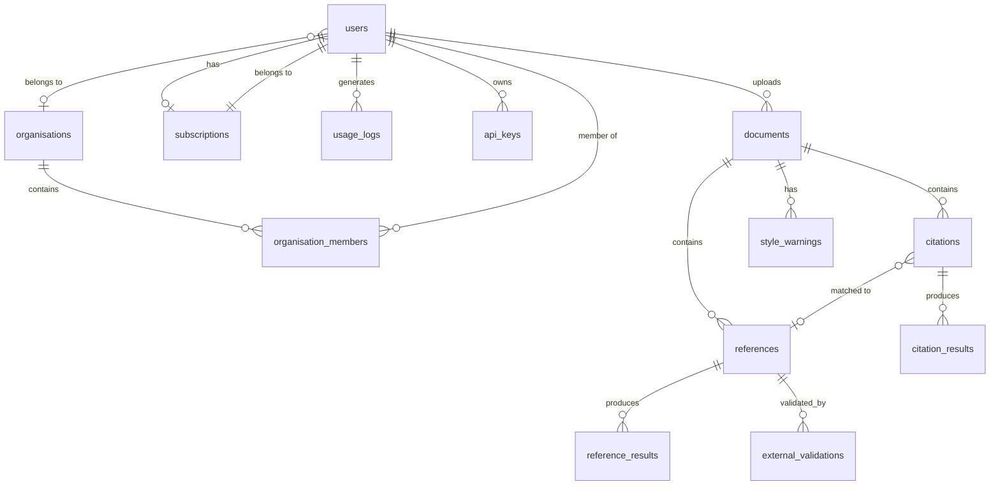

# CitePilot — Database Schema

> **Document ID:** CP-ARCH-013  
> **Version:** 1.0.0  
> **Last Updated:** 2026-07-14  
> **Status:** Approved  
> **Owner:** Engineering — Data Team  
> **Classification:** Internal

---

## 1. Entity Relationship Diagram



---

## 2. Table Definitions

### 2.1 `users`

Primary user accounts for all authentication methods.

| Column | Type | Nullable | Default | Description |
|---|---|---|---|---|
| `id` | `TEXT` | NO | `'usr_' \|\| nanoid(20)` | Primary key, prefixed identifier |
| `email` | `VARCHAR(320)` | NO | — | Unique email address |
| `email_verified` | `BOOLEAN` | NO | `FALSE` | Whether email has been verified |
| `password_hash` | `TEXT` | YES | `NULL` | bcrypt hash; NULL for OAuth-only users |
| `name` | `VARCHAR(200)` | NO | — | Display name |
| `role` | `VARCHAR(30)` | NO | `'user'` | `user`, `institutional_admin`, `super_admin` |
| `tier` | `VARCHAR(20)` | NO | `'free'` | `free`, `student`, `professional`, `institutional` |
| `avatar_url` | `TEXT` | YES | `NULL` | Profile image URL from OAuth provider |
| `oauth_provider` | `VARCHAR(20)` | YES | `NULL` | `google`, `microsoft`, or NULL for email/password |
| `oauth_provider_id` | `VARCHAR(255)` | YES | `NULL` | Provider's unique user ID |
| `organisation_id` | `TEXT` | YES | `NULL` | FK → organisations.id |
| `preferences` | `JSONB` | NO | `'{}'` | User preferences (default style, dark mode, notifications) |
| `last_login_at` | `TIMESTAMPTZ` | YES | `NULL` | Timestamp of most recent login |
| `created_at` | `TIMESTAMPTZ` | NO | `NOW()` | Account creation timestamp |
| `updated_at` | `TIMESTAMPTZ` | NO | `NOW()` | Last profile update timestamp |
| `deleted_at` | `TIMESTAMPTZ` | YES | `NULL` | Soft delete timestamp |

**Indexes:**

```sql
CREATE UNIQUE INDEX idx_users_email ON users (email) WHERE deleted_at IS NULL;
CREATE UNIQUE INDEX idx_users_oauth ON users (oauth_provider, oauth_provider_id) WHERE oauth_provider IS NOT NULL;
CREATE INDEX idx_users_organisation ON users (organisation_id) WHERE organisation_id IS NOT NULL;
CREATE INDEX idx_users_tier ON users (tier);
CREATE INDEX idx_users_created_at ON users (created_at);
```

**Constraints:**

```sql
ALTER TABLE users ADD CONSTRAINT chk_users_role CHECK (role IN ('user', 'institutional_admin', 'super_admin'));
ALTER TABLE users ADD CONSTRAINT chk_users_tier CHECK (tier IN ('free', 'student', 'professional', 'institutional'));
ALTER TABLE users ADD CONSTRAINT chk_users_oauth_complete CHECK (
  (oauth_provider IS NULL AND oauth_provider_id IS NULL) OR
  (oauth_provider IS NOT NULL AND oauth_provider_id IS NOT NULL)
);
```

---

### 2.2 `organisations`

Institutional accounts that group multiple users under a single subscription.

| Column | Type | Nullable | Default | Description |
|---|---|---|---|---|
| `id` | `TEXT` | NO | `'org_' \|\| nanoid(20)` | Primary key |
| `name` | `VARCHAR(200)` | NO | — | Organisation display name |
| `slug` | `VARCHAR(100)` | NO | — | URL-safe identifier |
| `domain` | `VARCHAR(255)` | YES | `NULL` | Email domain for auto-provisioning |
| `max_seats` | `INTEGER` | NO | `100` | Maximum allowed members |
| `sso_provider` | `VARCHAR(20)` | YES | `NULL` | `saml`, `oidc`, or NULL |
| `sso_config` | `JSONB` | YES | `NULL` | SSO configuration (entity ID, SSO URL, certificate) |
| `settings` | `JSONB` | NO | `'{}'` | Org-level settings (auto-provision, allowed styles) |
| `created_at` | `TIMESTAMPTZ` | NO | `NOW()` | |
| `updated_at` | `TIMESTAMPTZ` | NO | `NOW()` | |

**Indexes:**

```sql
CREATE UNIQUE INDEX idx_organisations_slug ON organisations (slug);
CREATE UNIQUE INDEX idx_organisations_domain ON organisations (domain) WHERE domain IS NOT NULL;
```

---

### 2.3 `organisation_members`

Join table linking users to organisations with role information.

| Column | Type | Nullable | Default | Description |
|---|---|---|---|---|
| `id` | `TEXT` | NO | `'om_' \|\| nanoid(20)` | Primary key |
| `organisation_id` | `TEXT` | NO | — | FK → organisations.id |
| `user_id` | `TEXT` | NO | — | FK → users.id |
| `role` | `VARCHAR(20)` | NO | `'member'` | `member`, `admin` |
| `status` | `VARCHAR(20)` | NO | `'active'` | `invited`, `active`, `suspended` |
| `invited_by` | `TEXT` | YES | `NULL` | FK → users.id (who invited this member) |
| `joined_at` | `TIMESTAMPTZ` | YES | `NULL` | When the invitation was accepted |
| `created_at` | `TIMESTAMPTZ` | NO | `NOW()` | |

**Indexes:**

```sql
CREATE UNIQUE INDEX idx_org_members_unique ON organisation_members (organisation_id, user_id);
CREATE INDEX idx_org_members_user ON organisation_members (user_id);
CREATE INDEX idx_org_members_status ON organisation_members (organisation_id, status);
```

---

### 2.4 `documents`

Uploaded documents undergoing citation analysis. Partitioned by `created_at` (monthly range).

| Column | Type | Nullable | Default | Description |
|---|---|---|---|---|
| `id` | `TEXT` | NO | `'doc_' \|\| nanoid(20)` | Primary key |
| `user_id` | `TEXT` | NO | — | FK → users.id |
| `filename` | `VARCHAR(500)` | YES | `NULL` | Original filename; NULL for pasted text |
| `label` | `VARCHAR(200)` | YES | `NULL` | User-assigned label |
| `mime_type` | `VARCHAR(100)` | NO | — | `application/vnd.openxmlformats-officedocument.wordprocessingml.document`, `application/pdf`, or `text/plain` |
| `file_size` | `INTEGER` | NO | — | File size in bytes |
| `s3_key` | `TEXT` | YES | `NULL` | S3 object key for uploaded file; NULL for pasted text |
| `citation_style` | `VARCHAR(30)` | NO | — | Selected citation style |
| `multi_ref_list` | `BOOLEAN` | NO | `FALSE` | Whether multi-reference-list mode is enabled |
| `status` | `VARCHAR(20)` | NO | `'uploaded'` | Processing status |
| `progress` | `SMALLINT` | NO | `0` | Processing progress 0–100 |
| `word_count` | `INTEGER` | YES | `NULL` | Total word count (populated after parsing) |
| `body_text` | `TEXT` | YES | `NULL` | Extracted body text (before reference section) |
| `result_version` | `INTEGER` | NO | `1` | Incremented on each re-analysis (cache key component) |
| `error_message` | `TEXT` | YES | `NULL` | Error details if status = 'failed' |
| `processing_time_ms` | `INTEGER` | YES | `NULL` | Total processing time in milliseconds |
| `created_at` | `TIMESTAMPTZ` | NO | `NOW()` | Upload timestamp |
| `expires_at` | `TIMESTAMPTZ` | NO | `NOW() + INTERVAL '36 hours'` | Auto-deletion timestamp |
| `deleted_at` | `TIMESTAMPTZ` | YES | `NULL` | Soft delete or auto-deletion timestamp |

**Indexes:**

```sql
CREATE INDEX idx_documents_user_created ON documents (user_id, created_at DESC);
CREATE INDEX idx_documents_status ON documents (status) WHERE status NOT IN ('validated', 'failed');
CREATE INDEX idx_documents_expires ON documents (expires_at) WHERE deleted_at IS NULL;
CREATE INDEX idx_documents_user_status ON documents (user_id, status);
```

**Constraints:**

```sql
ALTER TABLE documents ADD CONSTRAINT chk_documents_status CHECK (
  status IN ('uploaded', 'parsing', 'parsed', 'analysing', 'analysed', 'validating', 'validated', 'failed')
);
ALTER TABLE documents ADD CONSTRAINT chk_documents_style CHECK (
  citation_style IN ('apa7', 'apa6', 'harvard', 'vancouver', 'chicago-author-date', 'chicago-notes', 'mla9', 'ieee', 'oscola', 'turabian')
);
ALTER TABLE documents ADD CONSTRAINT chk_documents_progress CHECK (progress BETWEEN 0 AND 100);
```

**Partitioning:**

```sql
CREATE TABLE documents (
  -- columns as above
) PARTITION BY RANGE (created_at);

CREATE TABLE documents_2026_07 PARTITION OF documents
  FOR VALUES FROM ('2026-07-01') TO ('2026-08-01');
CREATE TABLE documents_2026_08 PARTITION OF documents
  FOR VALUES FROM ('2026-08-01') TO ('2026-09-01');
-- Partitions created automatically by pg_partman extension
```

---

### 2.5 `citations`

Individual in-text citations extracted from the document body.

| Column | Type | Nullable | Default | Description |
|---|---|---|---|---|
| `id` | `TEXT` | NO | `'cit_' \|\| nanoid(20)` | Primary key |
| `document_id` | `TEXT` | NO | — | FK → documents.id |
| `raw_text` | `TEXT` | NO | — | Exact citation text as it appears in the document |
| `normalised_text` | `TEXT` | NO | — | Normalised version (lowercase, whitespace-trimmed) |
| `extracted_authors` | `TEXT[]` | NO | — | Array of extracted author surnames |
| `extracted_year` | `SMALLINT` | YES | `NULL` | Extracted year; NULL for numeric styles (e.g., [1], [2]) |
| `citation_number` | `SMALLINT` | YES | `NULL` | For numeric styles (IEEE, Vancouver) — the reference number |
| `paragraph_index` | `INTEGER` | NO | — | Zero-indexed paragraph position in document |
| `char_start` | `INTEGER` | NO | — | Character offset start within paragraph |
| `char_end` | `INTEGER` | NO | — | Character offset end within paragraph |
| `context` | `TEXT` | NO | — | Surrounding text (±100 characters) |
| `citation_type` | `VARCHAR(20)` | NO | — | `parenthetical`, `narrative`, `numeric`, `footnote` |
| `matched_reference_id` | `TEXT` | YES | `NULL` | FK → references.id (NULL if no match) |
| `status` | `VARCHAR(20)` | NO | `'pending'` | `pending`, `matched`, `possible_match`, `no_match`, `ignored` |
| `confidence` | `REAL` | YES | `NULL` | Match confidence score 0.0–1.0 |
| `ignored` | `BOOLEAN` | NO | `FALSE` | Whether user has chosen to ignore this citation |
| `ignore_reason` | `TEXT` | YES | `NULL` | User-provided reason for ignoring |
| `created_at` | `TIMESTAMPTZ` | NO | `NOW()` | |

**Indexes:**

```sql
CREATE INDEX idx_citations_document ON citations (document_id);
CREATE INDEX idx_citations_status ON citations (document_id, status);
CREATE INDEX idx_citations_reference ON citations (matched_reference_id) WHERE matched_reference_id IS NOT NULL;
CREATE INDEX idx_citations_authors ON citations USING GIN (extracted_authors);
CREATE INDEX idx_citations_year ON citations (document_id, extracted_year);
```

---

### 2.6 `references`

Individual reference entries from the reference list(s).

| Column | Type | Nullable | Default | Description |
|---|---|---|---|---|
| `id` | `TEXT` | NO | `'ref_' \|\| nanoid(20)` | Primary key |
| `document_id` | `TEXT` | NO | — | FK → documents.id |
| `list_index` | `SMALLINT` | NO | `0` | Which reference list (0 = primary, 1+ = subsequent lists for multi-ref-list docs) |
| `position` | `SMALLINT` | NO | — | Order within the reference list (1-indexed) |
| `raw_entry` | `TEXT` | NO | — | Full reference entry text as it appears |
| `parsed_authors` | `JSONB` | NO | — | `[{"family": "Smith", "given": "A. B."}, ...]` |
| `parsed_year` | `SMALLINT` | YES | `NULL` | Publication year |
| `parsed_title` | `TEXT` | YES | `NULL` | Work title |
| `parsed_journal` | `VARCHAR(500)` | YES | `NULL` | Journal or source name |
| `parsed_volume` | `VARCHAR(20)` | YES | `NULL` | Volume number |
| `parsed_issue` | `VARCHAR(20)` | YES | `NULL` | Issue number |
| `parsed_pages` | `VARCHAR(50)` | YES | `NULL` | Page range |
| `parsed_doi` | `VARCHAR(255)` | YES | `NULL` | DOI if present |
| `parsed_url` | `TEXT` | YES | `NULL` | URL if present |
| `parsed_isbn` | `VARCHAR(20)` | YES | `NULL` | ISBN if present |
| `parsed_pmid` | `VARCHAR(20)` | YES | `NULL` | PubMed ID if present |
| `reference_type` | `VARCHAR(30)` | NO | `'unknown'` | Type classification |
| `citation_count` | `SMALLINT` | NO | `0` | Number of in-text citations pointing to this reference |
| `status` | `VARCHAR(20)` | NO | `'pending'` | `pending`, `cited`, `orphaned` |
| `alphabetical_expected` | `SMALLINT` | YES | `NULL` | Expected position if alphabetised |
| `alphabetical_correct` | `BOOLEAN` | YES | `NULL` | Whether the position matches expected |
| `created_at` | `TIMESTAMPTZ` | NO | `NOW()` | |

**Indexes:**

```sql
CREATE INDEX idx_references_document ON references (document_id);
CREATE INDEX idx_references_document_list ON references (document_id, list_index, position);
CREATE INDEX idx_references_doi ON references (parsed_doi) WHERE parsed_doi IS NOT NULL;
CREATE INDEX idx_references_type ON references (document_id, reference_type);
CREATE INDEX idx_references_status ON references (document_id, status);
CREATE INDEX idx_references_authors ON references USING GIN (parsed_authors jsonb_path_ops);
```

**Constraints:**

```sql
ALTER TABLE references ADD CONSTRAINT chk_references_type CHECK (
  reference_type IN ('journal_article', 'book', 'chapter', 'conference', 'thesis', 'website', 'report', 'legal', 'dataset', 'software', 'other', 'unknown')
);
ALTER TABLE references ADD CONSTRAINT uq_references_doc_list_pos UNIQUE (document_id, list_index, position);
```

---

### 2.7 `citation_results`

Detailed match results and AI-generated explanations for each citation.

| Column | Type | Nullable | Default | Description |
|---|---|---|---|---|
| `id` | `TEXT` | NO | `'cr_' \|\| nanoid(20)` | Primary key |
| `citation_id` | `TEXT` | NO | — | FK → citations.id |
| `document_id` | `TEXT` | NO | — | FK → documents.id (denormalised for query performance) |
| `match_type` | `VARCHAR(20)` | NO | — | `exact`, `fuzzy`, `ai_verified`, `none` |
| `match_score` | `REAL` | NO | — | Overall match score 0.0–1.0 |
| `author_score` | `REAL` | YES | `NULL` | Author match sub-score |
| `year_score` | `REAL` | YES | `NULL` | Year match sub-score |
| `title_similarity` | `REAL` | YES | `NULL` | Title similarity score (for ambiguous matches) |
| `issues` | `JSONB` | NO | `'[]'` | Array of issue objects |
| `ai_explanation` | `TEXT` | YES | `NULL` | AI-generated explanation of match/mismatch |
| `ai_suggestion` | `TEXT` | YES | `NULL` | AI-generated correction suggestion |
| `model_used` | `VARCHAR(50)` | NO | — | `gpt-4o-2025-05-13` or `claude-sonnet-4-20250514` |
| `processing_time_ms` | `INTEGER` | NO | — | Time to produce this result |
| `created_at` | `TIMESTAMPTZ` | NO | `NOW()` | |

**Indexes:**

```sql
CREATE UNIQUE INDEX idx_citation_results_citation ON citation_results (citation_id);
CREATE INDEX idx_citation_results_document ON citation_results (document_id);
CREATE INDEX idx_citation_results_match_type ON citation_results (document_id, match_type);
```

---

### 2.8 `reference_results`

Aggregated analysis results per reference (citation count, orphan status, type detection).

| Column | Type | Nullable | Default | Description |
|---|---|---|---|---|
| `id` | `TEXT` | NO | `'rr_' \|\| nanoid(20)` | Primary key |
| `reference_id` | `TEXT` | NO | — | FK → references.id |
| `document_id` | `TEXT` | NO | — | FK → documents.id (denormalised) |
| `is_orphaned` | `BOOLEAN` | NO | `FALSE` | TRUE if reference is not cited anywhere |
| `is_retracted` | `BOOLEAN` | NO | `FALSE` | TRUE if retraction check flagged this reference |
| `is_hallucinated` | `BOOLEAN` | NO | `FALSE` | TRUE if hallucination check flagged this reference |
| `hallucination_confidence` | `REAL` | YES | `NULL` | Confidence that the reference is fabricated (0.0–1.0) |
| `hallucination_evidence` | `TEXT` | YES | `NULL` | Explanation of hallucination determination |
| `retraction_detail` | `JSONB` | YES | `NULL` | Retraction Watch data if retracted |
| `issues` | `JSONB` | NO | `'[]'` | Array of issue objects |
| `created_at` | `TIMESTAMPTZ` | NO | `NOW()` | |

**Indexes:**

```sql
CREATE UNIQUE INDEX idx_reference_results_reference ON reference_results (reference_id);
CREATE INDEX idx_reference_results_document ON reference_results (document_id);
CREATE INDEX idx_reference_results_flags ON reference_results (document_id)
  WHERE is_retracted = TRUE OR is_hallucinated = TRUE;
```

---

### 2.9 `style_warnings`

Citation style compliance warnings (punctuation, formatting, et al. usage).

| Column | Type | Nullable | Default | Description |
|---|---|---|---|---|
| `id` | `TEXT` | NO | `'sw_' \|\| nanoid(20)` | Primary key |
| `document_id` | `TEXT` | NO | — | FK → documents.id |
| `citation_id` | `TEXT` | YES | `NULL` | FK → citations.id (if warning is citation-specific) |
| `reference_id` | `TEXT` | YES | `NULL` | FK → references.id (if warning is reference-specific) |
| `code` | `VARCHAR(50)` | NO | — | Machine-readable warning code |
| `category` | `VARCHAR(30)` | NO | — | `punctuation`, `formatting`, `ordering`, `completeness`, `capitalisation` |
| `message` | `TEXT` | NO | — | Human-readable description |
| `suggestion` | `TEXT` | YES | `NULL` | Suggested correction |
| `severity` | `VARCHAR(10)` | NO | — | `error`, `warning`, `info` |
| `location` | `JSONB` | NO | — | `{"paragraphIndex": 20, "charStart": 15, "charEnd": 50}` |
| `raw_text` | `TEXT` | YES | `NULL` | The offending text |
| `rule_source` | `VARCHAR(20)` | NO | — | `rule_based` or `ai_powered` |
| `style_guide_ref` | `VARCHAR(100)` | YES | `NULL` | Reference to style guide section (e.g., "APA 7, Section 8.17") |
| `created_at` | `TIMESTAMPTZ` | NO | `NOW()` | |

**Indexes:**

```sql
CREATE INDEX idx_style_warnings_document ON style_warnings (document_id);
CREATE INDEX idx_style_warnings_code ON style_warnings (document_id, code);
CREATE INDEX idx_style_warnings_severity ON style_warnings (document_id, severity);
```

**Warning Codes:**

| Code | Category | Description |
|---|---|---|
| `MISSING_COMMA_BEFORE_YEAR` | punctuation | No comma between author and year in parenthetical citation |
| `AMPERSAND_IN_NARRATIVE` | punctuation | Used `&` instead of `and` in narrative citation |
| `AND_IN_PARENTHETICAL` | punctuation | Used `and` instead of `&` in parenthetical citation |
| `ET_AL_FIRST_CITATION` | formatting | Used `et al.` on first citation of a 3+ author work (APA 7 allows this, APA 6 does not) |
| `ET_AL_MISSING_PERIOD` | punctuation | Missing period after `al` |
| `MISSING_DOI` | completeness | Journal article reference missing DOI |
| `MISSING_RETRIEVAL_DATE` | completeness | Website reference missing retrieval date |
| `ALPHABETICAL_ORDER` | ordering | Reference list not in alphabetical order |
| `DUPLICATE_REFERENCE` | ordering | Same reference appears twice in reference list |
| `TITLE_CAPITALISATION` | capitalisation | Reference title capitalisation does not match style guide |
| `HANGING_INDENT` | formatting | Reference entry not using hanging indent (detected in DOCX only) |
| `MISSING_ISSUE_NUMBER` | completeness | Journal article missing issue number |
| `INCORRECT_PAGE_RANGE` | formatting | Page range uses hyphen instead of en-dash |

---

### 2.10 `external_validations`

Results of external database lookups (Crossref, OpenAlex, PubMed).

| Column | Type | Nullable | Default | Description |
|---|---|---|---|---|
| `id` | `TEXT` | NO | `'ev_' \|\| nanoid(20)` | Primary key |
| `reference_id` | `TEXT` | NO | — | FK → references.id |
| `document_id` | `TEXT` | NO | — | FK → documents.id (denormalised) |
| `source` | `VARCHAR(20)` | NO | — | `crossref`, `openalex`, `pubmed`, `doi_org` |
| `query_type` | `VARCHAR(20)` | NO | — | `doi_lookup`, `title_search`, `author_title_search` |
| `query_value` | `TEXT` | NO | — | DOI, title, or search query used |
| `status` | `VARCHAR(20)` | NO | — | `verified`, `discrepancy`, `not_found`, `error`, `unavailable` |
| `verified` | `BOOLEAN` | NO | — | Whether the reference metadata matches |
| `external_metadata` | `JSONB` | YES | `NULL` | Metadata returned by external source |
| `discrepancies` | `JSONB` | NO | `'[]'` | Array of field-level discrepancies |
| `response_time_ms` | `INTEGER` | NO | — | External API response time |
| `checked_at` | `TIMESTAMPTZ` | NO | `NOW()` | |

**Indexes:**

```sql
CREATE INDEX idx_external_validations_reference ON external_validations (reference_id);
CREATE INDEX idx_external_validations_document ON external_validations (document_id);
CREATE INDEX idx_external_validations_source ON external_validations (source, status);
```

**Discrepancy Schema:**

```json
[
  {
    "field": "year",
    "expected": 2024,
    "actual": 2023,
    "message": "Year in reference (2024) does not match Crossref metadata (2023)"
  },
  {
    "field": "title",
    "expected": "AI-powered citation verification",
    "actual": "AI-Powered Citation Verification in Academic Publishing",
    "similarity": 0.85,
    "message": "Title partially matches but may be truncated"
  }
]
```

---

### 2.11 `subscriptions`

User subscription records linked to Stripe.

| Column | Type | Nullable | Default | Description |
|---|---|---|---|---|
| `id` | `TEXT` | NO | `'sub_' \|\| nanoid(20)` | Primary key |
| `user_id` | `TEXT` | NO | — | FK → users.id (UNIQUE) |
| `stripe_customer_id` | `VARCHAR(255)` | NO | — | Stripe customer ID |
| `stripe_subscription_id` | `VARCHAR(255)` | YES | `NULL` | Stripe subscription ID; NULL for free tier |
| `stripe_price_id` | `VARCHAR(255)` | YES | `NULL` | Stripe price ID |
| `tier` | `VARCHAR(20)` | NO | `'free'` | `free`, `student`, `professional`, `institutional` |
| `status` | `VARCHAR(20)` | NO | `'active'` | `active`, `past_due`, `cancelled`, `paused`, `trialing` |
| `billing_cycle` | `VARCHAR(10)` | YES | `NULL` | `monthly`, `annual` |
| `current_period_start` | `TIMESTAMPTZ` | YES | `NULL` | Current billing period start |
| `current_period_end` | `TIMESTAMPTZ` | YES | `NULL` | Current billing period end |
| `cancel_at_period_end` | `BOOLEAN` | NO | `FALSE` | Whether subscription cancels at period end |
| `trial_end` | `TIMESTAMPTZ` | YES | `NULL` | Trial period end date |
| `created_at` | `TIMESTAMPTZ` | NO | `NOW()` | |
| `updated_at` | `TIMESTAMPTZ` | NO | `NOW()` | |

**Indexes:**

```sql
CREATE UNIQUE INDEX idx_subscriptions_user ON subscriptions (user_id);
CREATE UNIQUE INDEX idx_subscriptions_stripe_sub ON subscriptions (stripe_subscription_id) WHERE stripe_subscription_id IS NOT NULL;
CREATE INDEX idx_subscriptions_stripe_customer ON subscriptions (stripe_customer_id);
CREATE INDEX idx_subscriptions_status ON subscriptions (status) WHERE status != 'active';
```

---

### 2.12 `usage_logs`

Tracks per-user, per-day usage for rate limiting and analytics. Partitioned by `logged_at` (monthly).

| Column | Type | Nullable | Default | Description |
|---|---|---|---|---|
| `id` | `BIGINT` | NO | `GENERATED ALWAYS AS IDENTITY` | Primary key |
| `user_id` | `TEXT` | NO | — | FK → users.id |
| `organisation_id` | `TEXT` | YES | `NULL` | FK → organisations.id (denormalised) |
| `action` | `VARCHAR(50)` | NO | — | Action type |
| `document_id` | `TEXT` | YES | `NULL` | FK → documents.id (if action is document-related) |
| `metadata` | `JSONB` | YES | `NULL` | Additional context (file size, word count, style, processing time) |
| `ip_address` | `INET` | YES | `NULL` | Client IP (for abuse detection) |
| `user_agent` | `TEXT` | YES | `NULL` | Client user agent |
| `logged_at` | `TIMESTAMPTZ` | NO | `NOW()` | Timestamp of the action |

**Indexes:**

```sql
CREATE INDEX idx_usage_logs_user_action ON usage_logs (user_id, action, logged_at DESC);
CREATE INDEX idx_usage_logs_user_day ON usage_logs (user_id, DATE(logged_at), action);
CREATE INDEX idx_usage_logs_org ON usage_logs (organisation_id, logged_at DESC) WHERE organisation_id IS NOT NULL;
```

**Action Types:**

| Action | Description |
|---|---|
| `document.upload` | User uploaded a document |
| `document.paste` | User pasted text |
| `document.delete` | User deleted a document |
| `document.reanalyse` | User re-ran analysis |
| `export.pdf` | User exported PDF report |
| `export.csv` | User exported CSV |
| `external.validate` | External validation triggered |
| `auth.login` | User logged in |
| `auth.register` | User registered |
| `api_key.used` | API key was used |

**Partitioning:**

```sql
CREATE TABLE usage_logs (
  -- columns as above
) PARTITION BY RANGE (logged_at);
-- Partitions managed by pg_partman
```

---

### 2.13 `api_keys`

API keys for programmatic access (Professional and Institutional tiers).

| Column | Type | Nullable | Default | Description |
|---|---|---|---|---|
| `id` | `TEXT` | NO | `'key_' \|\| nanoid(16)` | Primary key |
| `user_id` | `TEXT` | NO | — | FK → users.id |
| `name` | `VARCHAR(100)` | NO | — | User-assigned key name |
| `key_hash` | `TEXT` | NO | — | SHA-256 hash of the full API key |
| `key_prefix` | `VARCHAR(20)` | NO | — | First 12 characters for identification (e.g., `cp_live_a1b2`) |
| `last_used_at` | `TIMESTAMPTZ` | YES | `NULL` | Last time this key was used |
| `expires_at` | `TIMESTAMPTZ` | NO | — | Key expiration date |
| `revoked_at` | `TIMESTAMPTZ` | YES | `NULL` | Revocation timestamp |
| `created_at` | `TIMESTAMPTZ` | NO | `NOW()` | |

**Indexes:**

```sql
CREATE INDEX idx_api_keys_user ON api_keys (user_id);
CREATE UNIQUE INDEX idx_api_keys_hash ON api_keys (key_hash) WHERE revoked_at IS NULL;
CREATE INDEX idx_api_keys_prefix ON api_keys (key_prefix);
CREATE INDEX idx_api_keys_expires ON api_keys (expires_at) WHERE revoked_at IS NULL;
```

---

### 2.14 `sessions`

Refresh token tracking for token rotation and theft detection.

| Column | Type | Nullable | Default | Description |
|---|---|---|---|---|
| `id` | `TEXT` | NO | `'sess_' \|\| nanoid(20)` | Primary key |
| `user_id` | `TEXT` | NO | — | FK → users.id |
| `refresh_token_hash` | `TEXT` | NO | — | SHA-256 hash of the refresh token |
| `family_id` | `TEXT` | NO | — | Token family ID for rotation detection |
| `ip_address` | `INET` | YES | `NULL` | IP address at login |
| `user_agent` | `TEXT` | YES | `NULL` | Browser user agent at login |
| `expires_at` | `TIMESTAMPTZ` | NO | — | Token expiration |
| `revoked_at` | `TIMESTAMPTZ` | YES | `NULL` | Revocation timestamp |
| `created_at` | `TIMESTAMPTZ` | NO | `NOW()` | |

**Indexes:**

```sql
CREATE INDEX idx_sessions_user ON sessions (user_id);
CREATE UNIQUE INDEX idx_sessions_token ON sessions (refresh_token_hash) WHERE revoked_at IS NULL;
CREATE INDEX idx_sessions_family ON sessions (family_id);
CREATE INDEX idx_sessions_expires ON sessions (expires_at) WHERE revoked_at IS NULL;
```

---

## 3. Materialised Views

### 3.1 `mv_document_summary`

Pre-computed document summary statistics to avoid expensive JOINs on the results dashboard.

```sql
CREATE MATERIALIZED VIEW mv_document_summary AS
SELECT
  d.id AS document_id,
  d.user_id,
  d.citation_style,
  d.status,
  d.word_count,
  COUNT(DISTINCT c.id) AS total_citations,
  COUNT(DISTINCT r.id) AS total_references,
  COUNT(DISTINCT c.id) FILTER (WHERE c.status = 'matched') AS matched,
  COUNT(DISTINCT c.id) FILTER (WHERE c.status = 'possible_match') AS possible_match,
  COUNT(DISTINCT c.id) FILTER (WHERE c.status = 'no_match') AS no_match,
  COUNT(DISTINCT c.id) FILTER (WHERE c.ignored = TRUE) AS ignored,
  COUNT(DISTINCT r.id) FILTER (WHERE r.status = 'orphaned') AS orphaned_references,
  COUNT(DISTINCT sw.id) AS style_warnings,
  COUNT(DISTINCT rr.id) FILTER (WHERE rr.is_retracted = TRUE) AS retraction_flags,
  COUNT(DISTINCT rr.id) FILTER (WHERE rr.is_hallucinated = TRUE) AS hallucination_flags,
  d.created_at
FROM documents d
LEFT JOIN citations c ON c.document_id = d.id
LEFT JOIN references r ON r.document_id = d.id
LEFT JOIN style_warnings sw ON sw.document_id = d.id
LEFT JOIN reference_results rr ON rr.document_id = d.id
WHERE d.deleted_at IS NULL
GROUP BY d.id;

CREATE UNIQUE INDEX idx_mv_doc_summary_id ON mv_document_summary (document_id);
CREATE INDEX idx_mv_doc_summary_user ON mv_document_summary (user_id, created_at DESC);
```

**Refresh Strategy:**

```sql
-- Refreshed concurrently (non-blocking) every 30 seconds via pg_cron
SELECT cron.schedule('refresh-doc-summary', '*/1 * * * *',
  'REFRESH MATERIALIZED VIEW CONCURRENTLY mv_document_summary');
```

### 3.2 `mv_organisation_analytics`

Pre-computed organisation-level analytics for institutional admin dashboards.

```sql
CREATE MATERIALIZED VIEW mv_organisation_analytics AS
SELECT
  u.organisation_id,
  DATE(d.created_at) AS date,
  COUNT(DISTINCT d.id) AS documents_processed,
  COUNT(DISTINCT d.user_id) AS active_users,
  SUM(COALESCE(ds.total_citations, 0)) AS citations_checked,
  SUM(COALESCE(ds.no_match, 0) + COALESCE(ds.style_warnings, 0)) AS issues_found,
  d.citation_style AS most_used_style
FROM documents d
JOIN users u ON u.id = d.user_id
LEFT JOIN mv_document_summary ds ON ds.document_id = d.id
WHERE u.organisation_id IS NOT NULL
  AND d.deleted_at IS NULL
GROUP BY u.organisation_id, DATE(d.created_at), d.citation_style;

CREATE INDEX idx_mv_org_analytics ON mv_organisation_analytics (organisation_id, date DESC);
```

---

## 4. Functions and Triggers

### 4.1 Auto-Update `updated_at`

```sql
CREATE OR REPLACE FUNCTION trigger_set_updated_at()
RETURNS TRIGGER AS $$
BEGIN
  NEW.updated_at = NOW();
  RETURN NEW;
END;
$$ LANGUAGE plpgsql;

-- Applied to all tables with updated_at
CREATE TRIGGER set_updated_at BEFORE UPDATE ON users
  FOR EACH ROW EXECUTE FUNCTION trigger_set_updated_at();
CREATE TRIGGER set_updated_at BEFORE UPDATE ON organisations
  FOR EACH ROW EXECUTE FUNCTION trigger_set_updated_at();
CREATE TRIGGER set_updated_at BEFORE UPDATE ON subscriptions
  FOR EACH ROW EXECUTE FUNCTION trigger_set_updated_at();
```

### 4.2 Update `references.citation_count`

```sql
CREATE OR REPLACE FUNCTION trigger_update_citation_count()
RETURNS TRIGGER AS $$
BEGIN
  IF TG_OP = 'INSERT' OR TG_OP = 'UPDATE' THEN
    UPDATE references SET citation_count = (
      SELECT COUNT(*) FROM citations WHERE matched_reference_id = NEW.matched_reference_id
    ) WHERE id = NEW.matched_reference_id;
  END IF;
  IF TG_OP = 'DELETE' OR TG_OP = 'UPDATE' THEN
    UPDATE references SET citation_count = (
      SELECT COUNT(*) FROM citations WHERE matched_reference_id = OLD.matched_reference_id
    ) WHERE id = OLD.matched_reference_id;
  END IF;
  RETURN COALESCE(NEW, OLD);
END;
$$ LANGUAGE plpgsql;

CREATE TRIGGER update_citation_count AFTER INSERT OR UPDATE OR DELETE ON citations
  FOR EACH ROW EXECUTE FUNCTION trigger_update_citation_count();
```

### 4.3 Sync `users.tier` from `subscriptions`

```sql
CREATE OR REPLACE FUNCTION trigger_sync_user_tier()
RETURNS TRIGGER AS $$
BEGIN
  UPDATE users SET tier = NEW.tier WHERE id = NEW.user_id;
  RETURN NEW;
END;
$$ LANGUAGE plpgsql;

CREATE TRIGGER sync_user_tier AFTER INSERT OR UPDATE OF tier ON subscriptions
  FOR EACH ROW EXECUTE FUNCTION trigger_sync_user_tier();
```

---

## 5. Migration Strategy

### 5.1 Migration Tooling

| Tool | Purpose |
|---|---|
| **Drizzle Kit** | Schema-first migration generation from TypeScript schema definitions |
| **drizzle-kit generate** | Compares current schema against database, generates SQL migration file |
| **drizzle-kit migrate** | Applies pending migrations in order |

### 5.2 Migration Workflow

```mermaid
graph LR
    A["Modify schema<br/>in TypeScript"] --> B["drizzle-kit generate<br/>→ SQL migration file"]
    B --> C["Review migration<br/>SQL manually"]
    C --> D["Apply to dev<br/>database"]
    D --> E["Run test suite<br/>against dev DB"]
    E --> F["PR review<br/>(migration included)"]
    F --> G["CI applies to<br/>staging database"]
    G --> H["Manual approval<br/>for production"]
    H --> I["CI applies to<br/>production database"]
```



### 5.3 Migration Rules

1. **Never drop a column in a single migration.** First, stop writing to the column. Then, in a subsequent release, stop reading. Then, in a third release, drop the column.
2. **Always add columns as nullable first** (or with a default), then backfill, then add NOT NULL constraint.
3. **Create indexes concurrently** (`CREATE INDEX CONCURRENTLY`) to avoid table locks.
4. **Test every migration** against a copy of the production database before applying to production.
5. **Migration files are immutable.** Once merged to `main`, a migration is never edited — only new migrations are added.
6. **Rollback migrations** are created alongside forward migrations for every schema change.

### 5.4 Initial Migration Order

```
001_create_extensions.sql
002_create_users.sql
003_create_organisations.sql
004_create_organisation_members.sql
005_create_documents.sql
006_create_citations.sql
007_create_references.sql
008_create_citation_results.sql
009_create_reference_results.sql
010_create_style_warnings.sql
011_create_external_validations.sql
012_create_subscriptions.sql
013_create_usage_logs.sql
014_create_api_keys.sql
015_create_sessions.sql
016_create_materialised_views.sql
017_create_triggers.sql
018_seed_initial_data.sql
```

### 5.5 Extensions Required

```sql
CREATE EXTENSION IF NOT EXISTS "uuid-ossp";        -- UUID generation (fallback)
CREATE EXTENSION IF NOT EXISTS "pgcrypto";          -- Encryption functions
CREATE EXTENSION IF NOT EXISTS "pg_trgm";           -- Trigram similarity for fuzzy matching
CREATE EXTENSION IF NOT EXISTS "pg_partman";        -- Automatic partition management
CREATE EXTENSION IF NOT EXISTS "pg_cron";           -- Scheduled jobs (materialized view refresh)
CREATE EXTENSION IF NOT EXISTS "pg_stat_statements"; -- Query performance analysis
```

---

## 6. Data Retention and Cleanup

| Data | Retention | Implementation |
|---|---|---|
| **Uploaded documents (S3)** | 36 hours | S3 lifecycle policy + `document.cleanup` BullMQ job |
| **Document database records** | 36 hours after `expires_at` | `document.cleanup` job soft-deletes, then batch `DELETE` weekly |
| **Citations, references, results** | Cascades with document | `ON DELETE CASCADE` foreign keys |
| **User accounts (deleted)** | Anonymised immediately, hard-deleted after 30 days | GDPR deletion workflow |
| **Usage logs** | 90 days (hot), 365 days (cold/S3 export) | pg_partman drops old partitions; CSV export to S3 Glacier before dropping |
| **Sessions** | 7 days | Expired sessions cleaned up by daily cron job |
| **API keys (revoked)** | 30 days | Batch deletion via weekly cron |
| **Audit logs** | 365 days | Stored in separate `audit_logs` table (not shown — see Security Architecture) |

---

## 7. Performance Considerations

### 7.1 Query Patterns and Expected Performance

| Query Pattern | Frequency | Target Latency | Index Strategy |
|---|---|---|---|
| List user's documents | Very high | < 10ms | `idx_documents_user_created` |
| Get document with full results | High | < 50ms | Materialised view `mv_document_summary` |
| Get citation results with filters | High | < 30ms | `idx_citations_status`, `idx_citations_year` |
| Get reference results | Medium | < 30ms | `idx_references_document_list` |
| Count uploads per user per day | High (rate limiting) | < 5ms | `idx_usage_logs_user_day` |
| Org analytics dashboard | Low | < 200ms | Materialised view `mv_organisation_analytics` |
| Search by DOI | Low | < 10ms | `idx_references_doi` |
| Fuzzy author search | Low | < 50ms | `pg_trgm` GIN index on author text |

### 7.2 Connection Pooling

```
Application → PgBouncer (transaction mode)
  - max_client_conn: 2000
  - default_pool_size: 20 (per database)
  - max_db_connections: 200
  - reserve_pool_size: 5
  - reserve_pool_timeout: 3s
```

### 7.3 Estimated Storage Growth

| Table | Rows / Month (at 15K docs/day) | Row Size | Monthly Growth |
|---|---|---|---|
| documents | 450,000 | ~2 KB | ~900 MB |
| citations | 9,000,000 | ~500 B | ~4.5 GB |
| references | 11,250,000 | ~800 B | ~9 GB |
| citation_results | 9,000,000 | ~400 B | ~3.6 GB |
| style_warnings | 4,500,000 | ~300 B | ~1.35 GB |
| usage_logs | 2,000,000 | ~200 B | ~400 MB |

**Note:** The 36-hour document deletion policy significantly reduces long-term storage. The numbers above represent peak rolling storage; actual persistent storage after cleanup is ~10% of these values.
