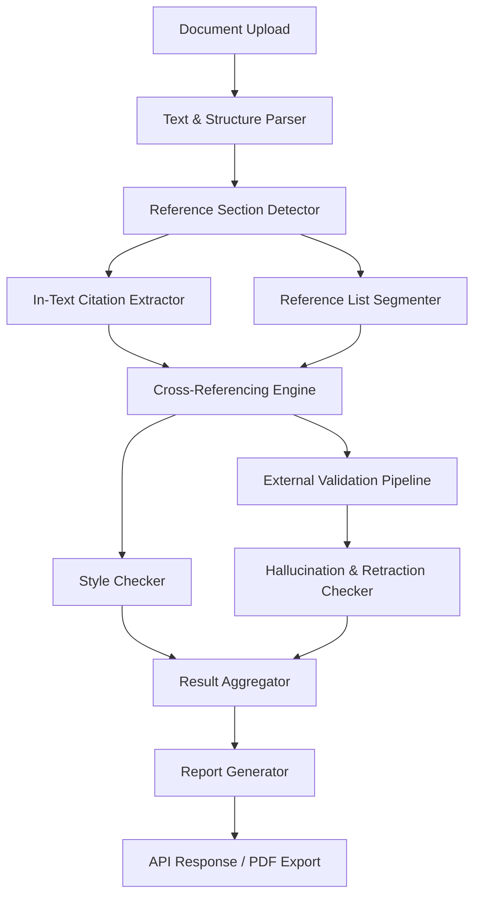
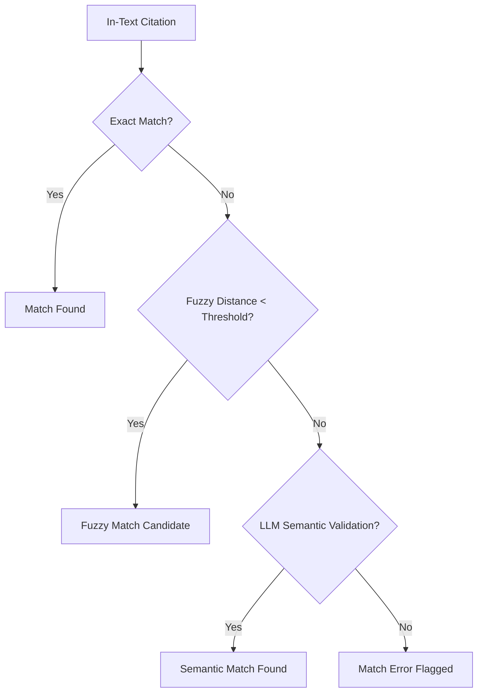

# AI/NLP Pipeline Design Document

This document outlines the detailed design of the Artificial Intelligence (AI) and Natural Language Processing (NLP) pipeline for CitePilot. CitePilot leverages advanced language models (LLMs) and deterministic rule engines to verify citation consistency, identify style errors, check retraction status, and detect hallucinated references.

---

## 1. Pipeline Overview

The CitePilot processing pipeline follows an asynchronous, queue-based architecture to handle documents of varying sizes (from short essays to multi-hundred-page dissertations) without blocking web requests.



---

## 2. Reference Section Detection & Extraction

Unlike rule-based systems that require a strict `"References"` heading, CitePilot uses a hybrid semantic-structural approach.

### 2.1 Detection Strategy
1. **Structural Segmentation**: The document parser outputs structural blocks (paragraphs, lists, headings).
2. **Semantic Classification**: An LLM-based classifier identifies sections containing lists of bibliographic metadata.
3. **Multi-List Detection**: For multi-chapter documents, the parser identifies multiple boundary sets and links them to the corresponding chapter scopes.

### 2.2 LLM Reference Detector Prompt
```json
{
  "system": "You are an expert academic document parser. Identify all starting and ending indices of reference lists/bibliographies in the provided document structure.",
  "prompt": "Analyze the following document structure and return a JSON list of objects containing the 'start_index', 'end_index', and 'type' (e.g., 'references', 'bibliography', 'works_cited') of each reference list found. Document: {document_text}"
}
```

---

## 3. In-Text Citation Extraction

CitePilot supports extraction across 9 major citation styles: APA 7th, APA 6th, Harvard, Vancouver, Chicago, MLA, IEEE, OSCOLA, and Turabian.

### 3.1 Extraction Pipeline
1. **Regular Expression Pre-Filter**: Matches bracketed patterns, parentheses, and year patterns to reduce token counts.
2. **Context-Aware LLM Extraction**: Extract in-text citation tokens with their precise document context. This prevents false positives such as identifying generic years (e.g. "the 2020 pandemic") as citations.

### 3.2 AI Extraction Prompt
```json
{
  "system": "You are an academic copyeditor. Extract all in-text citations from the text. For each citation, extract the exact citation string, the page/line number approximation, the context, and the matched format.",
  "prompt": "Extract all in-text citations from this text:\n\n\"{text_context}\"\n\nReturn JSON output matching this schema:\n{\n  \"citations\": [\n    {\n      \"text\": \"Smith (2020)\",\n      \"context\": \"This was first demonstrated by Smith (2020) in his primary study.\",\n      \"authors\": [\"Smith\"],\n      \"year\": 2020,\n      \"style\": \"APA\"\n    }\n  ]\n}"
}
```

---

## 4. Reference Parsing & Segmentation

Individual reference entries are extracted and parsed into structured JSON objects (authors, title, journal, volume, issue, pages, DOI, year).

### 4.1 Parser Specification
- **Input**: Raw text block of the references section.
- **Processing**: The text is chunked and analyzed by our fine-tuned FastAPI processor using structured outputs (JSON schema enforcement).
- **Schema**:
```json
{
  "authors": ["Author 1 Initial", "Author 2 Initial"],
  "year": 2021,
  "title": "Title of the Scholarly Article",
  "journal": "Journal of Academic Studies",
  "volume": "12",
  "issue": "3",
  "pages": "120-135",
  "doi": "10.1000/xyz123",
  "type": "journal_article"
}
```

---

## 5. Matching & Consistency Algorithm

Once in-text citations and reference list entries are extracted, they are matched using a multi-layered verification strategy:

| Layer | Method | Purpose |
|---|---|---|
| **Layer 1** | Deterministic Exact Match | Matches exact author-year or numeric tokens. |
| **Layer 2** | Fuzzy String Distance (Levenshtein) | Handles spelling typos and variants (e.g., "Smithe" vs "Smith"). |
| **Layer 3** | Semantic Match (LLM-based) | Checks complex matches (e.g., corporate authors, et al. variations, translations). |

### 5.1 Verification Flowchart


---

## 6. External Validation & Hallucination Detection

One of CitePilot's core differentiators is validating whether the cited papers actually exist in the real world.

### 6.1 Validation Pipeline
1. **Metadata Construction**: Use the parsed reference schema to form search queries.
2. **External Queries**: Search APIs in order: Crossref REST API → OpenAlex API → PubMed / DOI.org.
3. **Hallucination Flagging**: If no record is found in any registry and the reference matches patterns of generative AI hallucinations (e.g., plausible-sounding journal titles with incorrect volumes or matching author/year but wrong title), it is flagged.
4. **Retraction Watch Integration**: Cross-references DOI/PMID metadata against the Retraction Watch database to warn users of retracted literature.

---

## 7. Style Checking & Explanations

CitePilot runs style-specific rule engines alongside the AI layer to identify:
- Missing commas in parenthetical citations.
- Incorrect use of "&" vs "and" in parenthetical vs narrative citations.
- Inconsistent capitalization of titles in references.
- Mismatched ordering (alphabetical order issues).

### 7.1 Actionable Corrections
Instead of only flagging errors, CitePilot uses LLM synthesis to present a diff/correction showing:
- "Current Text" vs "Suggested Correction"
- Clear explanation of the style rule violated.

---

## 8. Performance Benchmarks

To ensure an excellent user experience, the AI/NLP pipeline is optimized for latency and accuracy:

- **Accuracy Target**: F1 Score $\ge 0.95$ for citation extraction.
- **Latency Target**:
  - Processing a 5,000-word document: $\le 10$ seconds.
  - Processing a 50,000-word document: $\le 45$ seconds (asynchronous queue).
- **Fallback Policy**: If OpenAI GPT-4o fails or experiences high latency, the queue switches to Claude 3.5 Sonnet, followed by deterministic fallback matching models to maintain base service.
