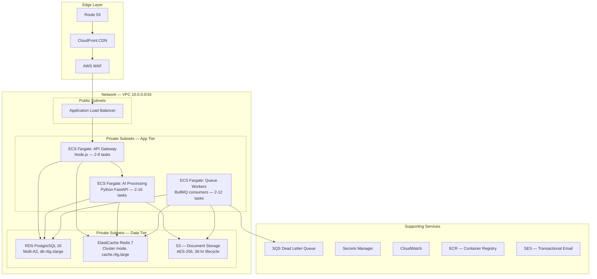
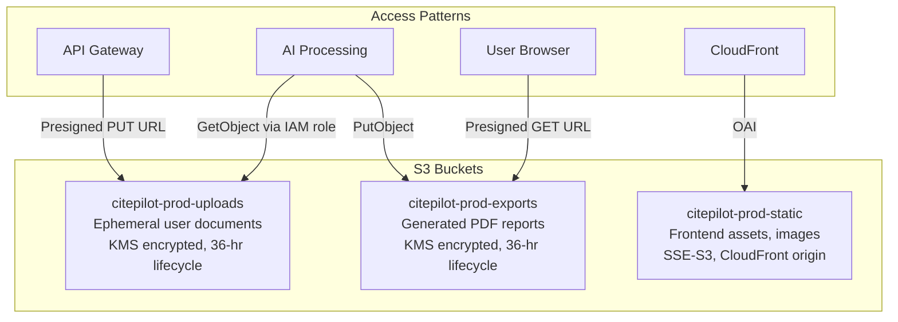

# 15 — Infrastructure & Deployment Architecture

> **Status**: Approved · **Owner**: Platform Engineering · **Last Updated**: 2026-07-15

---

## 1. Overview

CitePilot runs on AWS across three isolated environments (development, staging, production). The platform uses a containerised microservices architecture orchestrated by ECS/Fargate, backed by managed databases, object storage, and a Redis-backed queue layer. All infrastructure is defined as code via Terraform and deployed through GitHub Actions CI/CD pipelines.

### Design Principles

| Principle | Implementation |
|---|---|
| **Immutable Infrastructure** | Every deployment produces a new container image; no in-place mutations |
| **Least Privilege** | IAM roles scoped per service; no shared credentials |
| **Encryption Everywhere** | TLS 1.3 in transit, AES-256 at rest across all data stores |
| **Ephemeral Document Storage** | Uploaded documents auto-deleted after 36 hours via S3 lifecycle rules |
| **Cost Efficiency** | Fargate Spot for non-critical workloads; reserved capacity for databases |
| **Observable by Default** | Structured logging, distributed tracing, and metrics from day one |

---

## 2. AWS Service Map



### 2.1 Service Inventory

| AWS Service | Purpose | Configuration |
|---|---|---|
| **Route 53** | DNS management | Hosted zone for `citepilot.com`, health-check routing |
| **CloudFront** | CDN for Next.js static assets and API caching | Origin: ALB, TTL 86400s for static, 0 for API |
| **AWS WAF** | Web application firewall | Rate limiting, SQL injection, XSS rule groups |
| **ALB** | HTTPS termination, path-based routing | `/api/*` → API Gateway, `/*` → Next.js SSR |
| **ECS Fargate** | Container orchestration | Three service clusters (gateway, AI, workers) |
| **RDS PostgreSQL 16** | Primary relational database | Multi-AZ, 500 GB gp3, automated backups 7-day retention |
| **ElastiCache Redis 7** | Caching, rate limiting, BullMQ broker | Cluster mode enabled, 2 shards × 2 replicas |
| **S3** | Document uploads, PDF exports, static assets | Three buckets: `uploads`, `exports`, `static` |
| **SQS** | Dead letter queue for failed async jobs | 14-day message retention, alarm on depth > 50 |
| **ECR** | Private container image registry | Lifecycle policy: keep last 20 images per repo |
| **Secrets Manager** | API keys, DB credentials, JWT secrets | Automatic rotation every 30 days for DB creds |
| **SES** | Transactional email (verification, alerts) | Verified domain, DKIM/SPF configured |
| **CloudWatch** | Logs, metrics, alarms | Log groups per service, 30-day retention |

---

## 3. Network Architecture

### 3.1 VPC Design

```
VPC: 10.0.0.0/16 (65,536 IPs)
├── Public Subnets (ALB, NAT Gateways)
│   ├── 10.0.1.0/24  — us-east-1a
│   ├── 10.0.2.0/24  — us-east-1b
│   └── 10.0.3.0/24  — us-east-1c
├── Private Subnets — Application (ECS tasks)
│   ├── 10.0.10.0/24 — us-east-1a
│   ├── 10.0.11.0/24 — us-east-1b
│   └── 10.0.12.0/24 — us-east-1c
└── Private Subnets — Data (RDS, ElastiCache)
    ├── 10.0.20.0/24 — us-east-1a
    ├── 10.0.21.0/24 — us-east-1b
    └── 10.0.22.0/24 — us-east-1c
```

### 3.2 Security Groups

| Security Group | Inbound | Outbound |
|---|---|---|
| `sg-alb` | 443 from `0.0.0.0/0` | All to `sg-ecs-gateway` |
| `sg-ecs-gateway` | 3000 from `sg-alb` | 5432 to `sg-rds`, 6379 to `sg-redis`, 8000 to `sg-ecs-ai`, 443 to `0.0.0.0/0` |
| `sg-ecs-ai` | 8000 from `sg-ecs-gateway` | 5432 to `sg-rds`, 6379 to `sg-redis`, 443 to `0.0.0.0/0` (external APIs) |
| `sg-ecs-workers` | None | 5432 to `sg-rds`, 6379 to `sg-redis`, 443 to `0.0.0.0/0` |
| `sg-rds` | 5432 from `sg-ecs-*` | None |
| `sg-redis` | 6379 from `sg-ecs-*` | None |

### 3.3 NAT Gateway Strategy

Two NAT Gateways in `us-east-1a` and `us-east-1b` for high availability. Private subnets route `0.0.0.0/0` through the NAT gateway in their respective AZ with cross-AZ failover.

---

## 4. Container Strategy

### 4.1 Docker Images

All services use multi-stage Docker builds to minimise image size and attack surface.

| Service | Base Image | Final Image | Target Size |
|---|---|---|---|
| API Gateway (Node.js) | `node:20-alpine` | `node:20-alpine` | < 150 MB |
| AI Processing (FastAPI) | `python:3.12-slim` | `python:3.12-slim` | < 400 MB |
| Queue Workers (Node.js) | `node:20-alpine` | `node:20-alpine` | < 150 MB |
| Next.js Frontend | `node:20-alpine` | `node:20-alpine` | < 200 MB |

**Dockerfile — API Gateway (example)**:

```dockerfile
# Stage 1: Build
FROM node:20-alpine AS builder
WORKDIR /app
COPY package.json pnpm-lock.yaml ./
RUN corepack enable && pnpm install --frozen-lockfile
COPY . .
RUN pnpm build

# Stage 2: Production
FROM node:20-alpine AS runner
RUN addgroup -g 1001 -S appgroup && adduser -S appuser -u 1001 -G appgroup
WORKDIR /app
COPY --from=builder --chown=appuser:appgroup /app/dist ./dist
COPY --from=builder --chown=appuser:appgroup /app/node_modules ./node_modules
COPY --from=builder --chown=appuser:appgroup /app/package.json ./
USER appuser
EXPOSE 3000
HEALTHCHECK --interval=15s --timeout=5s --retries=3 \
  CMD wget --no-verbose --tries=1 --spider http://localhost:3000/health || exit 1
CMD ["node", "dist/server.js"]
```

### 4.2 ECS Task Definitions

| Service | CPU | Memory | Min Tasks | Max Tasks | Spot % |
|---|---|---|---|---|---|
| API Gateway | 512 | 1024 MB | 2 | 8 | 0% |
| AI Processing | 1024 | 2048 MB | 2 | 16 | 30% |
| Queue Workers | 512 | 1024 MB | 2 | 12 | 50% |
| Next.js Frontend | 512 | 1024 MB | 2 | 6 | 0% |

### 4.3 Health Checks

Every ECS service exposes a `GET /health` endpoint that returns:

```json
{
  "status": "healthy",
  "version": "1.4.2",
  "uptime": 84321,
  "dependencies": {
    "postgres": "connected",
    "redis": "connected"
  }
}
```

ALB health checks hit this endpoint every 15 seconds with a 5-second timeout. Two consecutive failures trigger task replacement.

---

## 5. CI/CD Pipeline

### 5.1 Pipeline Architecture

```mermaid
graph LR
    subgraph "Developer"
        PR["Pull Request"]
    end

    subgraph "GitHub Actions"
        LINT["Lint & Type Check"]
        TEST["Unit + Integration Tests"]
        SEC["Security Scan (Snyk)"]
        BUILD["Docker Build & Push"]
        DEPLOY_STG["Deploy → Staging"]
        E2E["E2E Tests (Playwright)"]
        APPROVE["Manual Approval Gate"]
        DEPLOY_PROD["Deploy → Production"]
    end

    PR --> LINT
    LINT --> TEST
    TEST --> SEC
    SEC --> BUILD
    BUILD --> DEPLOY_STG
    DEPLOY_STG --> E2E
    E2E --> APPROVE
    APPROVE --> DEPLOY_PROD
```



### 5.2 GitHub Actions Workflow

**File**: `.github/workflows/deploy.yml`

```yaml
name: CI/CD Pipeline
on:
  push:
    branches: [main]
  pull_request:
    branches: [main]

concurrency:
  group: ${{ github.workflow }}-${{ github.ref }}
  cancel-in-progress: true

jobs:
  lint-and-typecheck:
    runs-on: ubuntu-latest
    steps:
      - uses: actions/checkout@v4
      - uses: pnpm/action-setup@v4
      - uses: actions/setup-node@v4
        with:
          node-version: 20
          cache: pnpm
      - run: pnpm install --frozen-lockfile
      - run: pnpm lint
      - run: pnpm typecheck

  test:
    needs: lint-and-typecheck
    runs-on: ubuntu-latest
    services:
      postgres:
        image: postgres:16-alpine
        env:
          POSTGRES_DB: citepilot_test
          POSTGRES_USER: test
          POSTGRES_PASSWORD: test
        ports: ["5432:5432"]
      redis:
        image: redis:7-alpine
        ports: ["6379:6379"]
    steps:
      - uses: actions/checkout@v4
      - uses: pnpm/action-setup@v4
      - uses: actions/setup-node@v4
        with:
          node-version: 20
          cache: pnpm
      - run: pnpm install --frozen-lockfile
      - run: pnpm test:coverage
      - uses: actions/setup-python@v5
        with:
          python-version: "3.12"
      - run: pip install -r requirements.txt
      - run: pytest --cov=app --cov-report=xml

  security-scan:
    needs: lint-and-typecheck
    runs-on: ubuntu-latest
    steps:
      - uses: actions/checkout@v4
      - uses: snyk/actions/node@master
        env:
          SNYK_TOKEN: ${{ secrets.SNYK_TOKEN }}
      - uses: snyk/actions/python@master
        env:
          SNYK_TOKEN: ${{ secrets.SNYK_TOKEN }}

  build-and-push:
    needs: [test, security-scan]
    if: github.ref == 'refs/heads/main'
    runs-on: ubuntu-latest
    permissions:
      id-token: write
      contents: read
    steps:
      - uses: actions/checkout@v4
      - uses: aws-actions/configure-aws-credentials@v4
        with:
          role-to-arn: ${{ secrets.AWS_DEPLOY_ROLE_ARN }}
          aws-region: us-east-1
      - uses: aws-actions/amazon-ecr-login@v2
      - name: Build and Push Images
        run: |
          IMAGE_TAG=${{ github.sha }}
          for SERVICE in api-gateway ai-processing queue-workers frontend; do
            docker build -t $ECR_REGISTRY/citepilot-$SERVICE:$IMAGE_TAG -f services/$SERVICE/Dockerfile .
            docker push $ECR_REGISTRY/citepilot-$SERVICE:$IMAGE_TAG
          done

  deploy-staging:
    needs: build-and-push
    runs-on: ubuntu-latest
    environment: staging
    steps:
      - uses: actions/checkout@v4
      - uses: aws-actions/configure-aws-credentials@v4
        with:
          role-to-arn: ${{ secrets.AWS_DEPLOY_ROLE_ARN }}
          aws-region: us-east-1
      - name: Deploy to Staging
        run: |
          IMAGE_TAG=${{ github.sha }}
          aws ecs update-service --cluster citepilot-staging \
            --service api-gateway --force-new-deployment \
            --task-definition $(aws ecs register-task-definition \
              --cli-input-json file://ecs/api-gateway.json \
              --query 'taskDefinition.taskDefinitionArn' --output text)

  e2e-tests:
    needs: deploy-staging
    runs-on: ubuntu-latest
    steps:
      - uses: actions/checkout@v4
      - uses: actions/setup-node@v4
        with:
          node-version: 20
      - run: npx playwright install --with-deps chromium
      - run: npx playwright test
        env:
          BASE_URL: https://staging.citepilot.com

  deploy-production:
    needs: e2e-tests
    runs-on: ubuntu-latest
    environment:
      name: production
      url: https://citepilot.com
    steps:
      - uses: actions/checkout@v4
      - uses: aws-actions/configure-aws-credentials@v4
        with:
          role-to-arn: ${{ secrets.AWS_DEPLOY_ROLE_ARN }}
          aws-region: us-east-1
      - name: Deploy to Production (Rolling)
        run: ./scripts/deploy-production.sh ${{ github.sha }}
```

### 5.3 Deployment Strategy

| Environment | Strategy | Rollback |
|---|---|---|
| **Staging** | Replace all tasks immediately | Redeploy previous image tag |
| **Production** | Rolling update (min 50% healthy, max 200%) | Automatic rollback on health check failure via ECS circuit breaker |

Production deployments use ECS deployment circuit breaker with automatic rollback. If new tasks fail health checks, ECS stops the deployment and rolls back to the last stable task definition.

---

## 6. Environment Strategy

### 6.1 Environment Matrix

| Attribute | Development | Staging | Production |
|---|---|---|---|
| **AWS Account** | `citepilot-dev` (111111111111) | `citepilot-staging` (222222222222) | `citepilot-prod` (333333333333) |
| **Domain** | `dev.citepilot.com` | `staging.citepilot.com` | `citepilot.com` |
| **RDS Instance** | `db.t4g.medium`, single-AZ | `db.r6g.large`, single-AZ | `db.r6g.xlarge`, Multi-AZ |
| **Redis** | Single node, `cache.t4g.small` | Single node, `cache.r6g.large` | Cluster, 2 shards × 2 replicas |
| **ECS Tasks (per service)** | 1 | 2 | 2-16 (auto-scaled) |
| **OpenAI API** | GPT-4o-mini (cost savings) | GPT-4o | GPT-4o |
| **S3 Lifecycle** | 12-hour deletion | 36-hour deletion | 36-hour deletion |
| **WAF** | Disabled | Enabled (count mode) | Enabled (block mode) |
| **Log Retention** | 7 days | 14 days | 30 days |
| **Estimated Monthly Cost** | ~$350 | ~$800 | ~$2,800–$6,500 |

### 6.2 Environment Promotion Flow

```
Feature Branch → Dev (auto-deploy on merge to dev branch)
                   ↓
                Staging (auto-deploy on merge to main)
                   ↓
              Production (manual approval gate after E2E pass)
```

### 6.3 Feature Flags

Feature flags are managed via environment variables and a simple PostgreSQL-backed config table. Flags are evaluated server-side and cached in Redis for 60 seconds.

| Flag | Dev | Staging | Prod |
|---|---|---|---|
| `ENABLE_CROSSREF_VALIDATION` | true | true | true |
| `ENABLE_RETRACTION_CHECK` | true | true | true |
| `ENABLE_HALLUCINATION_DETECTION` | true | true | true |
| `ENABLE_MULTI_REFERENCE_LIST` | true | true | false (beta) |
| `MAX_CONCURRENT_AI_REQUESTS` | 5 | 20 | 50 |

---

## 7. Terraform Infrastructure as Code

### 7.1 Module Structure

```
infrastructure/
├── terraform/
│   ├── modules/
│   │   ├── vpc/
│   │   │   ├── main.tf
│   │   │   ├── variables.tf
│   │   │   └── outputs.tf
│   │   ├── ecs/
│   │   │   ├── main.tf
│   │   │   ├── service.tf
│   │   │   ├── task-definitions.tf
│   │   │   ├── autoscaling.tf
│   │   │   ├── variables.tf
│   │   │   └── outputs.tf
│   │   ├── rds/
│   │   │   ├── main.tf
│   │   │   ├── variables.tf
│   │   │   └── outputs.tf
│   │   ├── elasticache/
│   │   │   ├── main.tf
│   │   │   ├── variables.tf
│   │   │   └── outputs.tf
│   │   ├── s3/
│   │   │   ├── main.tf
│   │   │   ├── lifecycle.tf
│   │   │   ├── variables.tf
│   │   │   └── outputs.tf
│   │   ├── cloudfront/
│   │   │   ├── main.tf
│   │   │   ├── variables.tf
│   │   │   └── outputs.tf
│   │   ├── alb/
│   │   │   ├── main.tf
│   │   │   ├── variables.tf
│   │   │   └── outputs.tf
│   │   ├── waf/
│   │   │   ├── main.tf
│   │   │   ├── variables.tf
│   │   │   └── outputs.tf
│   │   └── monitoring/
│   │       ├── main.tf
│   │       ├── alarms.tf
│   │       ├── dashboards.tf
│   │       ├── variables.tf
│   │       └── outputs.tf
│   ├── environments/
│   │   ├── dev/
│   │   │   ├── main.tf
│   │   │   ├── terraform.tfvars
│   │   │   └── backend.tf
│   │   ├── staging/
│   │   │   ├── main.tf
│   │   │   ├── terraform.tfvars
│   │   │   └── backend.tf
│   │   └── production/
│   │       ├── main.tf
│   │       ├── terraform.tfvars
│   │       └── backend.tf
│   └── global/
│       ├── iam/
│       │   └── main.tf
│       ├── ecr/
│       │   └── main.tf
│       └── route53/
│           └── main.tf
```

### 7.2 Key Terraform Configuration

**S3 Document Bucket with 36-Hour Lifecycle**:

```hcl
resource "aws_s3_bucket" "document_uploads" {
  bucket = "citepilot-${var.environment}-uploads"

  tags = {
    Environment = var.environment
    Service     = "citepilot"
    DataClass   = "ephemeral-user-content"
  }
}

resource "aws_s3_bucket_server_side_encryption_configuration" "uploads_encryption" {
  bucket = aws_s3_bucket.document_uploads.id

  rule {
    apply_server_side_encryption_by_default {
      sse_algorithm     = "aws:kms"
      kms_master_key_id = aws_kms_key.document_encryption.arn
    }
    bucket_key_enabled = true
  }
}

resource "aws_s3_bucket_lifecycle_configuration" "uploads_lifecycle" {
  bucket = aws_s3_bucket.document_uploads.id

  rule {
    id     = "auto-delete-uploads"
    status = "Enabled"

    expiration {
      days = 0
    }

    filter {
      prefix = "uploads/"
    }

    # 36-hour expiry is achieved via S3 Intelligent-Tiering
    # combined with a Lambda that runs hourly to purge objects
    # older than 36 hours, since S3 lifecycle minimum is 1 day.
  }
}

resource "aws_s3_bucket_public_access_block" "uploads_block" {
  bucket = aws_s3_bucket.document_uploads.id

  block_public_acls       = true
  block_public_policy     = true
  ignore_public_acls      = true
  restrict_public_buckets = true
}
```

**36-Hour Cleanup Lambda** (since S3 lifecycle rules have a 1-day minimum granularity):

```hcl
resource "aws_lambda_function" "document_cleanup" {
  function_name = "citepilot-${var.environment}-document-cleanup"
  runtime       = "python3.12"
  handler       = "cleanup.handler"
  timeout       = 300
  memory_size   = 256

  filename         = data.archive_file.cleanup_lambda.output_path
  source_code_hash = data.archive_file.cleanup_lambda.output_base64sha256

  role = aws_iam_role.cleanup_lambda_role.arn

  environment {
    variables = {
      BUCKET_NAME     = aws_s3_bucket.document_uploads.id
      MAX_AGE_HOURS   = "36"
    }
  }
}

resource "aws_cloudwatch_event_rule" "hourly_cleanup" {
  name                = "citepilot-${var.environment}-hourly-cleanup"
  schedule_expression = "rate(1 hour)"
}

resource "aws_cloudwatch_event_target" "cleanup_target" {
  rule      = aws_cloudwatch_event_rule.hourly_cleanup.name
  target_id = "document-cleanup"
  arn       = aws_lambda_function.document_cleanup.arn
}
```

**ECS Auto-Scaling**:

```hcl
resource "aws_appautoscaling_target" "ai_processing" {
  max_capacity       = 16
  min_capacity       = 2
  resource_id        = "service/${aws_ecs_cluster.main.name}/${aws_ecs_service.ai_processing.name}"
  scalable_dimension = "ecs:service:DesiredCount"
  service_namespace  = "ecs"
}

resource "aws_appautoscaling_policy" "ai_cpu_scaling" {
  name               = "ai-cpu-scaling"
  policy_type        = "TargetTrackingScaling"
  resource_id        = aws_appautoscaling_target.ai_processing.resource_id
  scalable_dimension = aws_appautoscaling_target.ai_processing.scalable_dimension
  service_namespace  = aws_appautoscaling_target.ai_processing.service_namespace

  target_tracking_scaling_policy_configuration {
    target_value       = 65.0
    scale_in_cooldown  = 300
    scale_out_cooldown = 60

    predefined_metric_specification {
      predefined_metric_type = "ECSServiceAverageCPUUtilization"
    }
  }
}

resource "aws_appautoscaling_policy" "ai_queue_depth_scaling" {
  name               = "ai-queue-depth-scaling"
  policy_type        = "TargetTrackingScaling"
  resource_id        = aws_appautoscaling_target.ai_processing.resource_id
  scalable_dimension = aws_appautoscaling_target.ai_processing.scalable_dimension
  service_namespace  = aws_appautoscaling_target.ai_processing.service_namespace

  target_tracking_scaling_policy_configuration {
    target_value       = 10.0
    scale_in_cooldown  = 300
    scale_out_cooldown = 30

    customized_metric_specification {
      metric_name = "QueueDepth"
      namespace   = "CitePilot/BullMQ"
      statistic   = "Average"
      unit        = "Count"
    }
  }
}
```

### 7.3 State Management

| Item | Value |
|---|---|
| Backend | S3 + DynamoDB locking |
| State Bucket | `citepilot-terraform-state` (versioned, encrypted) |
| Lock Table | `citepilot-terraform-locks` |
| State per environment | Separate state files: `env:/{env}/terraform.tfstate` |

---

## 8. Auto-Scaling Policies

### 8.1 ECS Service Scaling

| Service | Scale Metric | Target | Scale-Out Cooldown | Scale-In Cooldown | Min | Max |
|---|---|---|---|---|---|---|
| API Gateway | CPU utilisation | 60% | 60s | 300s | 2 | 8 |
| API Gateway | Request count per target | 1000 req/min | 60s | 300s | 2 | 8 |
| AI Processing | CPU utilisation | 65% | 60s | 300s | 2 | 16 |
| AI Processing | Queue depth (custom) | 10 jobs | 30s | 300s | 2 | 16 |
| Queue Workers | Queue depth (custom) | 20 jobs | 30s | 300s | 2 | 12 |
| Frontend | CPU utilisation | 60% | 120s | 300s | 2 | 6 |

### 8.2 RDS Scaling

- **Read Replicas**: Auto-scaled via Aurora read replica auto-scaling (future migration path). Current Multi-AZ setup uses standby for failover only.
- **Storage**: gp3 volumes with auto-scaling enabled — starts at 500 GB, grows in 10% increments up to 2 TB.
- **IOPS**: Baseline 3000 IOPS, burstable to 16,000 IOPS via gp3.

### 8.3 ElastiCache Scaling

Redis cluster mode with 2 shards, each with 1 primary + 1 replica. Scaling approach:
- **Vertical**: Upgrade node type during maintenance window if memory utilisation exceeds 75%.
- **Horizontal**: Add shards if key distribution is uneven or throughput exceeds 25,000 ops/sec per shard.

---

## 9. Backup Strategy

### 9.1 Backup Matrix

| Resource | Backup Method | Frequency | Retention | RPO | RTO |
|---|---|---|---|---|---|
| **RDS PostgreSQL** | Automated snapshots | Daily + continuous WAL | 7 days (dev), 14 days (staging), 35 days (prod) | 5 minutes (PITR) | < 30 minutes |
| **RDS PostgreSQL** | Manual snapshots | Before each deployment | 90 days | 0 (snapshot time) | < 30 minutes |
| **ElastiCache Redis** | Automatic backups | Daily | 7 days | 24 hours | < 15 minutes |
| **S3 Documents** | No backup (ephemeral) | N/A | 36-hour lifecycle | N/A | N/A |
| **S3 Static Assets** | Cross-region replication | Continuous | Indefinite | Near-zero | < 5 minutes |
| **Terraform State** | S3 versioning | Every apply | 90 days (lifecycle) | 0 | < 5 minutes |
| **Secrets Manager** | Built-in versioning | On each rotation | Previous + current | 0 | Instant |
| **ECR Images** | Immutable tags | On each build | Last 20 images | 0 | < 5 minutes |

### 9.2 Disaster Recovery

| Scenario | Recovery Strategy | Expected RTO |
|---|---|---|
| Single AZ failure | Multi-AZ failover (RDS, ECS redistribution) | < 5 minutes |
| Database corruption | Point-in-time recovery to pre-corruption timestamp | < 30 minutes |
| Complete region failure | Restore from cross-region S3 backups + RDS snapshot copy | < 4 hours |
| Accidental deployment | ECS circuit breaker auto-rollback | < 5 minutes |
| Credential compromise | Secrets Manager immediate rotation + IAM key deactivation | < 15 minutes |

---

## 10. Document Storage Architecture

### 10.1 S3 Bucket Design



### 10.2 Upload Flow

1. Client requests presigned upload URL from API Gateway (`POST /api/v1/documents/upload-url`)
2. API Gateway generates presigned S3 PUT URL (expires in 15 minutes, max 25 MB)
3. Client uploads directly to S3 via presigned URL (bypasses API Gateway for large files)
4. S3 event notification triggers processing via SQS → BullMQ
5. AI Processing service retrieves document from S3, parses, and processes
6. Results stored in PostgreSQL; original document deleted after processing or after 36 hours, whichever comes first

### 10.3 Encryption Configuration

| Bucket | Encryption | Key Management |
|---|---|---|
| `uploads` | SSE-KMS (AES-256) | Customer-managed KMS key with annual rotation |
| `exports` | SSE-KMS (AES-256) | Customer-managed KMS key with annual rotation |
| `static` | SSE-S3 (AES-256) | AWS-managed key |

### 10.4 Lifecycle Policy Detail

| Object Prefix | Action | Timing |
|---|---|---|
| `uploads/*` | Delete (via Lambda) | 36 hours after creation |
| `exports/*` | Delete (via Lambda) | 36 hours after creation |
| `uploads/*` | Abort incomplete multipart | 24 hours |
| `static/*` | No expiry | Indefinite |

---

## 11. Cost Estimates

### 11.1 Production Monthly Cost Breakdown (Baseline: 10,000 MAU)

| Service | Configuration | Estimated Monthly Cost |
|---|---|---|
| **ECS Fargate** | ~20 tasks avg across services (0.5-1 vCPU, 1-2 GB each) | $850 |
| **RDS PostgreSQL** | db.r6g.xlarge, Multi-AZ, 500 GB gp3 | $680 |
| **ElastiCache Redis** | 2 shards × 2 nodes, cache.r6g.large | $520 |
| **ALB** | 1 ALB + data processing | $120 |
| **CloudFront** | ~500 GB transfer, 5M requests | $85 |
| **S3** | ~200 GB rotating storage + requests | $30 |
| **NAT Gateway** | 2 gateways + data processing (~200 GB) | $110 |
| **Route 53** | Hosted zone + queries | $5 |
| **WAF** | Web ACL + rules + requests | $45 |
| **Secrets Manager** | ~20 secrets | $8 |
| **CloudWatch** | Logs, metrics, alarms | $80 |
| **SES** | ~10,000 emails/month | $5 |
| **ECR** | ~5 GB image storage | $3 |
| **Lambda** | Cleanup function (~720 invocations/month) | $1 |
| **KMS** | 2 keys + API calls | $6 |
| **OpenAI API** | ~100,000 GPT-4o calls (est. 500 tokens avg) | $350 |
| **Data Transfer** | ~500 GB outbound | $45 |
| **Total (Baseline)** | | **~$2,943/month** |

### 11.2 Cost Scaling Projections

| MAU | ECS Tasks (avg) | RDS | OpenAI Calls | Est. Monthly Cost |
|---|---|---|---|---|
| 1,000 | 8 | db.r6g.large | 15,000 | ~$1,600 |
| 10,000 | 20 | db.r6g.xlarge | 100,000 | ~$2,950 |
| 50,000 | 45 | db.r6g.2xlarge | 500,000 | ~$5,800 |
| 100,000 | 80 | db.r6g.4xlarge | 1,000,000 | ~$9,500 |

### 11.3 Cost Optimisation Levers

| Strategy | Potential Savings | Trade-off |
|---|---|---|
| Fargate Spot for workers + AI | 50-70% on those tasks | Possible 2-minute interruption notices |
| RDS Reserved Instance (1-year) | 35-40% on RDS | Upfront commitment |
| ElastiCache Reserved Nodes | 30-35% on Redis | Upfront commitment |
| Savings Plans (Compute) | 20-30% on Fargate | 1-year commitment |
| GPT-4o-mini for simple checks | 90% reduction per call | Slightly lower accuracy for edge cases |
| Response caching (Redis) | Reduces OpenAI calls by ~30% | Stale results for identical documents |
| CloudFront caching | Reduces origin requests by ~60% | Cache invalidation complexity |

---

## 12. DNS & Certificate Management

### 12.1 DNS Records

| Record | Type | Value |
|---|---|---|
| `citepilot.com` | A (Alias) | CloudFront distribution |
| `www.citepilot.com` | CNAME | `citepilot.com` |
| `api.citepilot.com` | A (Alias) | ALB |
| `staging.citepilot.com` | A (Alias) | Staging ALB |
| `dev.citepilot.com` | A (Alias) | Dev ALB |
| `status.citepilot.com` | CNAME | Statuspage (Atlassian) |

### 12.2 SSL/TLS Certificates

- Managed by AWS Certificate Manager (ACM)
- Auto-renewal enabled
- Wildcard certificate: `*.citepilot.com`
- Minimum TLS 1.2 enforced; TLS 1.3 preferred
- CloudFront security policy: `TLSv1.2_2021`

---

## 13. Deployment Checklist

### Pre-Production Launch

- [ ] All Terraform modules applied and verified
- [ ] Multi-AZ RDS failover tested
- [ ] ECS auto-scaling load tested
- [ ] S3 36-hour lifecycle cleanup Lambda verified
- [ ] WAF rules tested (block mode)
- [ ] Presigned URL flow tested end-to-end
- [ ] Secrets rotation tested
- [ ] CloudFront cache invalidation tested
- [ ] Disaster recovery runbook tested (RDS PITR)
- [ ] DNS cutover plan documented
- [ ] SSL certificate validated
- [ ] CI/CD pipeline runs green on staging
- [ ] E2E test suite passes against staging
- [ ] Cost alerts configured in AWS Budgets ($5,000 threshold)
- [ ] CloudWatch alarms verified (CPU, memory, queue depth, error rate)
- [ ] On-call rotation established

---

*Document Version: 1.0 · Next Review: 2026-10-15*
