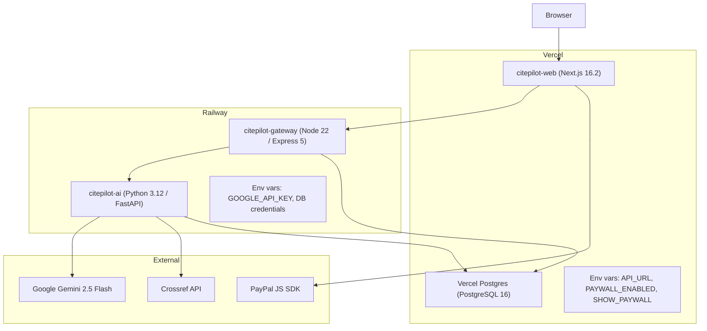

# 15 — Infrastructure & Deployment Architecture

> **Status**: Approved · **Owner**: Platform Engineering · **Last Updated**: 2026-08-11 · **Version**: 1.1.0

---

## 1. Overview

CitePilot runs on **Vercel + Railway** across development and production environments. There is no self-managed infrastructure: no EC2/ECS clusters, no VPCs, no Kubernetes, no Terraform. Deployments are platform-native (`vercel --prod`, Railway deploys) and the database is managed Vercel Postgres.

This supersedes the earlier AWS design (ECS/Fargate, RDS, ElastiCache, S3, CloudFront, WAF, Terraform) — see ADR-009 in `04-engineering-standards/18-architecture-decision-records.md`.

### Design Principles

| Principle | Implementation |
|---|---|
| **Zero self-managed servers** | Vercel (web) + Railway (AI service) handle compute, TLS, scale, and deploys |
| **Secrets as environment variables** | Vercel/Railway dashboards only — never committed; `trufflehog` scan in CI |
| **Ephemeral document handling** | Uploads held in AI-service memory during the audit; discarded — no object storage |
| **Sessionless by design** | No auth infrastructure, no sessions, no cookies; browser state only |
| **Smallest viable stack** | Every service added must prove necessity at MVP scale (see ADR-011) |

---

## 2. Platform Service Map


```mermaid
graph TB
    subgraph "Vercel"
        WEB["citepilot-web (Next.js 16.2)"]
        PG["Vercel Postgres (PostgreSQL 16)"]
        ENVV["Env vars: API_URL, PAYWALL_ENABLED, SHOW_PAYWALL"]
    end

    subgraph "Railway"
        GW["citepilot-gateway (Node 22 / Express 5)"]
        AI["citepilot-ai (Python 3.12 / FastAPI)"]
        ENVA["Env vars: GOOGLE_API_KEY, DB credentials"]
    end

    subgraph "External"
        GEMINI["Google Gemini 2.5 Flash"]
        CROSSREF["Crossref API"]
        PP["PayPal JS SDK"]
    end

    USER["Browser"] --> WEB
    WEB --> GW
    GW --> AI
    GW --> PG
    AI --> GEMINI
    AI --> CROSSREF
    AI --> PG
    WEB --> PP
```

### 2.1 Service Inventory

| Service | Location | Purpose | Configuration |
|---|---|---|---|
| **citepilot-web** | Vercel | Next.js frontend (landing, dashboard, terms, privacy) | Env: `API_URL` (gateway base), `PAYWALL_ENABLED`, `SHOW_PAYWALL` |
| **citepilot-gateway** | Railway | Express 5 API: routing, validation, proxying, paywall flags | Env: AI service URL, DB connection |
| **citepilot-ai** | Railway | FastAPI: parsing, citation extraction, matching, style, Crossref validation, exports | Env: `GOOGLE_API_KEY`, DB connection |
| **Vercel Postgres** | Vercel | PostgreSQL 16 via Drizzle; paywall flags + subscription mirrors (no document data) | Migrations in `supabase/migrations/` |
| **PayPal** | External | Professional subscription ($12.99/mo, plan `P-00697875B1151583ANJV3VOY`) | Client-side JS SDK; plan price must match docs |

---

## 3. Environments

| Environment | Web | Gateway / AI | Database | Purpose |
|---|---|---|---|---|
| **Production** | Vercel production domain | Railway (production branch) | Vercel Postgres production | Public availability |
| **Development** | Vercel preview deployments (per PR) | Railway (dev branch) | Vercel Postgres dev | Testing before merge |
| **Local** | `npm run dev` | `uv run uvicorn citepilot_ai.main:app --reload` | — (not required for audits) | Developer workstation |

All three environments are isolated: separate projects, separate env vars, separate API keys. Developers never share production credentials.

---

## 4. Deployment Process

### 4.1 Web (Vercel)

```bash
# From the monorepo root — Vercel Root Directory is already set to citepilot-web/
npx vercel --prod
```

- PR previews deploy automatically from GitHub integration.
- Production is a full re-build (`next build`) with static export for the landing pages.

### 4.2 AI Service (Railway)

```bash
# From citepilot-ai/
railway up
```

or trigger from the Railway dashboard on the `main` branch. Platform detects the project via Railpack (railway.json / pyproject.toml).

### 4.3 Gateway (Railway)

Same process as the AI service. The gateway is a thin Node service; its CORS allowlist (`citepilot-gateway/src/server.ts`) must include every frontend origin that calls it.

### 4.4 Database migrations

Drizzle migrations live in `supabase/migrations/*.sql` and are applied manually against production (documented in `06-operations/25-runbooks.md` §Database). Never run automatically as part of web deploys.

---

## 5. Network & Security

| Item | Implementation |
|---|---|
| **DNS / TLS** | `citepilot.com` + `www` → Vercel; certificates auto-issued/renewed. Railway serves the AI service on its own domain (CORS-gated). |
| **CORS** | Gateway allowlist: `https://citepilot.com`, `https://www.citepilot.com` (+ preview domains in dev) |
| **Secrets** | Environment variables only; rotation schedule: Gemini key 90 days, PayPal credentials 180 days |
| **Uploads** | Server-side validation: `.docx`/`.pdf`/`.txt`/`.rtf`/`.bib`, ≤ 50 MB, magic-byte/MIME checks. Virus scanning on roadmap. |
| **Headers** | Vercel/Railway managed TLS (1.2+); platform security headers |
| **DDoS** | Platform-managed edge protection (no custom WAF) |
| **Backups** | Vercel Postgres platform backups; restore test performed at least quarterly |

---

## 6. Scaling

No manual scaling configuration exists. Vercel scales the web frontend automatically; Railway scales the gateway and AI service. The practical bottleneck is the Gemini API (per-request quotas), not compute. A queue-based design (BullMQ + Redis) is explicitly roadmap (ADR-011) — do not introduce it without an ADR.

---

## 7. Failure Modes (see also `06-operations/27-disaster-recovery.md`)

| Failure | User impact | Recovery |
|---|---|---|
| AI service restart | In-flight audits fail | Re-upload (sessionless); platform restarts automatically |
| Gemini outage/quota | Audits fail with retry prompt | Reset/quota increase + key rotation; runbook exists |
| Crossref outage | Validation panels show "Crossref unavailable" | Automatic when API recovers; matching unaffected |
| Vercel Postgres outage | Paywall/subscription mirrors stale | Feature flags fall back to env vars; no audit data at risk |
| Vercel/Railway platform incident | Site degraded | Platform SLAs; status pages of each provider |

---

## 8. Cost Profile (monthly)

| Item | Approx. cost | Notes |
|---|---|---|
| Vercel (web + Postgres) | $20–40 | Hobby/Pro tier |
| Railway (gateway + AI) | $5–25 | Two services, low traffic |
| Google Gemini | ~$0.01–0.06 per audit | Model pricing per current rates |
| PayPal | 2.99% + $0.49 per payment | Platform fee |
| **Total fixed** | **~$25–65 + variable AI** | Full model in `01-discovery-strategy/05-business-model.md` |

---

## 9. Architecture Decision Records

| ADR | Topic |
|---|---|
| ADR-009 | Vercel + Railway hosting (supersedes AWS design) |
| ADR-010 | PayPal Subscriptions (supersedes Stripe design) |
| ADR-011 | Synchronous MVP (supersedes BullMQ/Redis design) |

See `04-engineering-standards/18-architecture-decision-records.md` for full text.