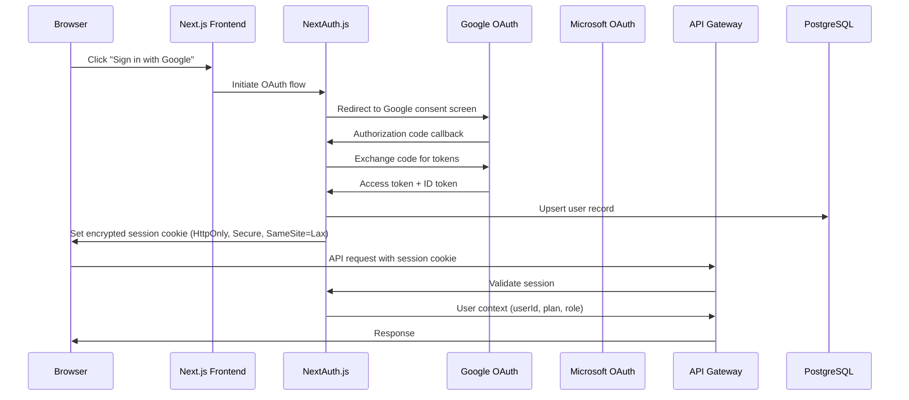
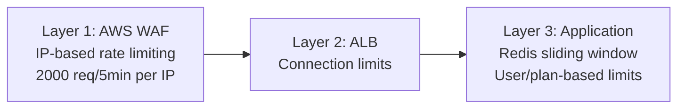
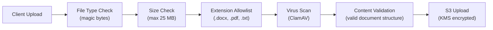

# 16 — Security Architecture

> **Status**: Approved · **Owner**: Security Engineering · **Last Updated**: 2026-07-15

---

## 1. Overview

Security is foundational to CitePilot. Users upload academic documents containing unpublished research, personal information, and intellectual property. This document defines the layered security architecture that protects data at every tier — from browser to database — and ensures compliance with GDPR and institutional data governance requirements.

### Security Principles

| Principle | Application |
|---|---|
| **Defence in Depth** | Multiple independent layers: WAF → ALB → application → database |
| **Least Privilege** | Every IAM role, service account, and database user scoped to minimum required permissions |
| **Zero Trust** | All inter-service communication authenticated; no implicit trust within VPC |
| **Data Minimisation** | Collect only what is needed; delete documents within 36 hours |
| **Encryption Everywhere** | AES-256 at rest, TLS 1.3 in transit — no exceptions |
| **Fail Closed** | On auth/authorisation failure, deny access; never fail open |

---

## 2. Authentication Architecture

### 2.1 Auth Flow — NextAuth.js



### 2.2 Authentication Providers

| Provider | Protocol | Use Case | Configuration |
|---|---|---|---|
| **Google** | OAuth 2.0 / OIDC | Primary social login for students/academics | `accounts.google.com`, prompt=consent |
| **Microsoft** | OAuth 2.0 / OIDC | Institutional users (Azure AD) | `login.microsoftonline.com/common` |
| **Email/Password** | Credentials provider | Users preferring direct registration | Argon2id hashing, email verification required |
| **SAML 2.0** (Enterprise) | SAML | Institutional SSO | Per-tenant IdP configuration |

### 2.3 Session Management

| Parameter | Value | Rationale |
|---|---|---|
| Session strategy | JWT (stateless) | Scalable across ECS tasks without shared session store |
| JWT signing algorithm | `ES256` (ECDSA P-256) | Shorter tokens, equivalent security to RSA-2048 |
| Access token lifetime | 15 minutes | Limits window of exposure for stolen tokens |
| Refresh token lifetime | 7 days | Balance between UX and security |
| Refresh token rotation | Enabled | Each refresh issues new refresh token; previous is invalidated |
| Cookie flags | `HttpOnly`, `Secure`, `SameSite=Lax`, `Path=/` | Prevents XSS access, CSRF protection |
| JWT claims | `sub`, `email`, `plan`, `role`, `iat`, `exp`, `jti` | Minimal claims; no PII beyond email |

### 2.4 JWT Token Structure

```json
{
  "header": {
    "alg": "ES256",
    "typ": "JWT",
    "kid": "citepilot-2026-07"
  },
  "payload": {
    "sub": "usr_a1b2c3d4e5f6",
    "email": "researcher@university.edu",
    "plan": "professional",
    "role": "user",
    "iat": 1752595200,
    "exp": 1752596100,
    "jti": "tok_x9y8z7w6v5u4"
  }
}
```

### 2.5 API Key Authentication (Professional & Institutional Plans)

For programmatic API access:

| Attribute | Value |
|---|---|
| Format | `cp_live_` + 48 random alphanumeric characters |
| Storage | SHA-256 hash stored in PostgreSQL; plaintext shown once at creation |
| Scoping | Per-key rate limits, allowed endpoints, IP allowlist (optional) |
| Rotation | Users can regenerate keys; old key invalidated immediately |
| Rate limit | 100 requests/minute per key (Professional), 500/minute (Institutional) |

---

## 3. Authorisation Model

### 3.1 Role-Based Access Control (RBAC)

| Role | Permissions | Assignment |
|---|---|---|
| `anonymous` | View marketing pages, pricing | Unauthenticated users |
| `free_user` | Upload documents (3/day), view results, basic matching | Free tier registration |
| `student` | Unlimited uploads, all styles, AI explanations | Student plan subscription |
| `professional` | All features + Crossref + retraction check + API access | Professional plan subscription |
| `institutional_user` | Same as professional, managed by institution | Institutional admin assignment |
| `institutional_admin` | User management, usage analytics, billing for institution | Institutional contract |
| `system_admin` | Full platform access, user management, feature flags | Internal staff only |

### 3.2 Resource-Level Authorisation

Every API endpoint enforces:

1. **Authentication check**: Valid JWT or API key
2. **Plan entitlement check**: Feature available on user's plan
3. **Ownership check**: User can only access their own documents and results
4. **Rate limit check**: Within plan's allocation

```typescript
// Middleware chain for protected routes
app.use('/api/v1/documents/:id',
  authenticate,          // Verify JWT / API key
  requirePlan('student'), // Minimum plan level
  requireOwnership,      // document.userId === req.user.id
  rateLimit,             // Plan-based rate limiting
  handler
);
```

---

## 4. Encryption Architecture

### 4.1 Encryption at Rest

| Data Store | Encryption Method | Key Management |
|---|---|---|
| **RDS PostgreSQL** | AES-256 via AWS KMS | Customer-managed CMK, annual auto-rotation |
| **S3 Document Uploads** | SSE-KMS (AES-256) | Customer-managed CMK, annual auto-rotation |
| **S3 PDF Exports** | SSE-KMS (AES-256) | Customer-managed CMK, annual auto-rotation |
| **ElastiCache Redis** | AES-256 at-rest encryption | AWS-managed key |
| **ECS Task Storage** | Encrypted EBS (ephemeral) | AWS-managed key |
| **CloudWatch Logs** | SSE-KMS | Customer-managed CMK |
| **Secrets Manager** | AES-256 | AWS-managed key |

### 4.2 Encryption in Transit

| Connection | Protocol | Configuration |
|---|---|---|
| Browser → CloudFront | TLS 1.3 | Security policy `TLSv1.2_2021`, HSTS enabled |
| CloudFront → ALB | TLS 1.2+ | Custom origin SSL protocol |
| ALB → ECS | TLS 1.2 | End-to-end encryption; containers terminate TLS |
| ECS → RDS | TLS 1.2 | `sslmode=verify-full` in connection string |
| ECS → ElastiCache | TLS 1.2 | In-transit encryption enabled |
| ECS → External APIs | TLS 1.2+ | Certificate pinning for OpenAI, Crossref |
| ECS → S3 | HTTPS | VPC endpoint (gateway) for private connectivity |

### 4.3 KMS Key Policy

```json
{
  "Version": "2012-10-17",
  "Statement": [
    {
      "Sid": "AllowKeyAdministration",
      "Effect": "Allow",
      "Principal": { "AWS": "arn:aws:iam::333333333333:role/citepilot-kms-admin" },
      "Action": ["kms:Create*", "kms:Describe*", "kms:Enable*", "kms:List*",
                 "kms:Put*", "kms:Update*", "kms:Revoke*", "kms:Disable*",
                 "kms:Get*", "kms:Delete*", "kms:ScheduleKeyDeletion",
                 "kms:CancelKeyDeletion"],
      "Resource": "*"
    },
    {
      "Sid": "AllowServiceEncryption",
      "Effect": "Allow",
      "Principal": { "AWS": "arn:aws:iam::333333333333:role/citepilot-ecs-task-role" },
      "Action": ["kms:Decrypt", "kms:GenerateDataKey", "kms:DescribeKey"],
      "Resource": "*"
    }
  ]
}
```

---

## 5. GDPR Compliance

### 5.1 Data Processing Overview

| Data Category | Legal Basis | Retention | Location |
|---|---|---|---|
| **Account data** (email, name) | Contractual necessity (Art. 6(1)(b)) | Until account deletion + 30 days | RDS (us-east-1) |
| **Uploaded documents** | Contractual necessity | 36 hours maximum | S3 (us-east-1), KMS encrypted |
| **Citation analysis results** | Contractual necessity | Until account deletion | RDS (us-east-1) |
| **Payment data** | Contractual necessity | Delegated to Stripe | Stripe infrastructure |
| **Usage analytics** | Legitimate interest (Art. 6(1)(f)) | 12 months, then aggregated | RDS (us-east-1) |
| **Server logs** | Legitimate interest | 30 days | CloudWatch (us-east-1) |
| **Cookies** | Consent (Art. 6(1)(a)) for non-essential | Session-length | Browser |

### 5.2 Data Subject Rights Implementation

| Right | Implementation | Response SLA |
|---|---|---|
| **Right of Access** (Art. 15) | `GET /api/v1/account/data-export` — generates JSON export of all personal data | 72 hours |
| **Right to Rectification** (Art. 16) | Account settings page; API: `PATCH /api/v1/account` | Immediate |
| **Right to Erasure** (Art. 17) | `DELETE /api/v1/account` — cascading delete of all data, S3 objects, logs pseudonymised | 72 hours |
| **Right to Portability** (Art. 20) | Same as Access — machine-readable JSON format | 72 hours |
| **Right to Restrict Processing** (Art. 18) | Account freeze flag; stops all processing, retains data | Immediate |
| **Right to Object** (Art. 21) | Opt-out of analytics via account settings | Immediate |

### 5.3 Data Protection Impact Assessment (DPIA) Summary

| Risk | Likelihood | Impact | Mitigation |
|---|---|---|---|
| Document data breach | Low | High | KMS encryption, 36-hr auto-deletion, VPC isolation |
| AI provider data leak (OpenAI) | Low | Medium | Zero-retention API agreement, no fine-tuning on user data |
| Employee accessing user documents | Low | High | No human access to S3 uploads; IAM deny policies; audit logging |
| Cross-border data transfer | Medium | Medium | AWS us-east-1 (for US users); EU region planned for EU users |

### 5.4 OpenAI Data Processing

- **API agreement**: OpenAI API data is not used for model training (zero-retention API)
- **Data sent**: Only extracted text chunks (not full documents), anonymised where possible
- **Processing record**: Every API call logged with timestamp, token count, and purpose
- **Sub-processor disclosure**: OpenAI listed as sub-processor in privacy policy

---

## 6. Rate Limiting

### 6.1 Rate Limit Strategy

Rate limiting is implemented at three layers:



### 6.2 Application-Level Rate Limits (Redis Sliding Window)

| Endpoint Category | Free | Student | Professional | Institutional |
|---|---|---|---|---|
| `POST /api/v1/documents/upload` | 3/day | 50/day | 200/day | 500/day |
| `POST /api/v1/documents/check` | 3/day | 50/day | 200/day | 500/day |
| `GET /api/v1/documents/*` | 60/min | 120/min | 300/min | 600/min |
| `POST /api/v1/auth/*` | 5/min | 5/min | 5/min | 5/min |
| `GET /api/v1/references/validate` | 10/day | 100/day | 500/day | 2000/day |
| API key endpoints | N/A | N/A | 100/min | 500/min |

### 6.3 Rate Limit Response

```http
HTTP/1.1 429 Too Many Requests
Content-Type: application/json
Retry-After: 42
X-RateLimit-Limit: 3
X-RateLimit-Remaining: 0
X-RateLimit-Reset: 1752595242

{
  "error": {
    "code": "RATE_LIMIT_EXCEEDED",
    "message": "Upload limit reached. Free accounts allow 3 uploads per day. Upgrade to Student plan for 50 uploads/day.",
    "retryAfter": 42,
    "upgradeUrl": "https://citepilot.com/pricing"
  }
}
```

---

## 7. OWASP Top 10 Mitigation

### 7.1 Mitigation Matrix (OWASP 2021)

| # | Vulnerability | Risk Level | Mitigation |
|---|---|---|---|
| **A01** | Broken Access Control | Critical | RBAC middleware on every route; ownership validation; default-deny; CORS restricted to `citepilot.com` |
| **A02** | Cryptographic Failures | Critical | TLS 1.3 in transit; AES-256-KMS at rest; no custom crypto; Argon2id for password hashing |
| **A03** | Injection | High | Parameterised queries via Prisma ORM (Node.js) and SQLAlchemy (Python); no raw SQL; input validation with Zod |
| **A04** | Insecure Design | High | Threat modelling during design; security review in PR checklist; principle of least privilege |
| **A05** | Security Misconfiguration | Medium | Terraform IaC ensures consistent config; S3 public access block; security headers (CSP, X-Frame-Options) |
| **A06** | Vulnerable Components | High | Snyk scanning in CI; Dependabot alerts; automated PR for critical CVEs; container image scanning |
| **A07** | Auth Failures | Critical | NextAuth.js handles session securely; account lockout after 5 failed attempts; MFA for admin accounts |
| **A08** | Software/Data Integrity | Medium | Docker image signing with Cosign; SBOM generation; Subresource Integrity (SRI) for CDN scripts |
| **A09** | Logging/Monitoring Failures | Medium | Structured logging for all auth events; CloudWatch alarms; Sentry error tracking; audit trail |
| **A10** | SSRF | Medium | URL allowlist for external API calls; no user-controlled URLs reach internal services; VPC endpoints |

### 7.2 Security Headers

All responses include:

```http
Strict-Transport-Security: max-age=63072000; includeSubDomains; preload
Content-Security-Policy: default-src 'self'; script-src 'self'; style-src 'self' 'unsafe-inline'; img-src 'self' data: https:; connect-src 'self' https://api.citepilot.com; frame-ancestors 'none'
X-Content-Type-Options: nosniff
X-Frame-Options: DENY
X-XSS-Protection: 0
Referrer-Policy: strict-origin-when-cross-origin
Permissions-Policy: camera=(), microphone=(), geolocation=(), payment=()
Cross-Origin-Opener-Policy: same-origin
Cross-Origin-Resource-Policy: same-origin
```

---

## 8. File Upload Security

### 8.1 Upload Validation Pipeline



### 8.2 Upload Security Controls

| Control | Implementation |
|---|---|
| **Allowed file types** | `.docx` (application/vnd.openxmlformats-officedocument.wordprocessingml.document), `.pdf` (application/pdf), `.txt` (text/plain) |
| **Magic byte validation** | Verify file header matches declared MIME type (prevents extension spoofing) |
| **Maximum file size** | 25 MB enforced at presigned URL generation and S3 bucket policy |
| **Filename sanitisation** | Strip path traversal characters; replace with UUID-based names: `{userId}/{uuid}.{ext}` |
| **Virus scanning** | ClamAV running as ECS sidecar; scans every upload before processing |
| **Document structure validation** | python-docx verifies OOXML structure; pdfplumber verifies PDF structure |
| **No execution** | Documents parsed in sandboxed containers with no shell access; no macro execution |
| **Presigned URL expiry** | PUT URLs expire after 15 minutes |
| **Content-Disposition** | `attachment` header on all download URLs (prevents browser rendering) |

### 8.3 Malicious Document Protections

| Threat | Mitigation |
|---|---|
| PDF JavaScript | pdfplumber does not execute JavaScript; PDF.js disabled in backend |
| DOCX macros | python-docx ignores VBA macros; files with macros (.docm) rejected |
| XML bomb (billion laughs) | XML parsing with `defusedxml`; entity expansion limits |
| Zip bomb | Maximum decompression ratio: 10:1; abort if exceeded |
| Path traversal in zip | Filename sanitisation; reject entries with `..` or absolute paths |

---

## 9. AWS Secrets Manager

### 9.1 Secrets Inventory

| Secret Name | Type | Rotation | Consumers |
|---|---|---|---|
| `citepilot/prod/db-credentials` | Username/password | 30-day auto-rotation | API Gateway, AI Processing, Workers |
| `citepilot/prod/redis-auth-token` | Auth string | 90-day manual | API Gateway, AI Processing, Workers |
| `citepilot/prod/jwt-signing-key` | ECDSA private key | Annual manual | API Gateway |
| `citepilot/prod/openai-api-key` | API key | On compromise | AI Processing |
| `citepilot/prod/stripe-secret-key` | API key | On compromise | API Gateway |
| `citepilot/prod/stripe-webhook-secret` | Webhook signing secret | On compromise | API Gateway |
| `citepilot/prod/nextauth-secret` | Encryption secret | Annual manual | Frontend |
| `citepilot/prod/google-oauth` | Client ID + secret | On compromise | Frontend |
| `citepilot/prod/microsoft-oauth` | Client ID + secret | On compromise | Frontend |
| `citepilot/prod/sentry-dsn` | DSN URL | Never (not sensitive) | All services |
| `citepilot/prod/datadog-api-key` | API key | Annual manual | All services |

### 9.2 Secret Access Pattern

```python
# ECS tasks retrieve secrets at startup via environment variable injection
# Task definition references Secrets Manager ARN:
{
    "containerDefinitions": [{
        "secrets": [
            {
                "name": "DATABASE_URL",
                "valueFrom": "arn:aws:secretsmanager:us-east-1:333333333333:secret:citepilot/prod/db-credentials"
            },
            {
                "name": "OPENAI_API_KEY",
                "valueFrom": "arn:aws:secretsmanager:us-east-1:333333333333:secret:citepilot/prod/openai-api-key"
            }
        ]
    }]
}
```

### 9.3 Rotation Strategy

- **Database credentials**: Automatic rotation every 30 days via Secrets Manager Lambda rotator. Uses multi-user rotation strategy (alternating between two DB users) for zero-downtime rotation.
- **JWT signing keys**: Manual rotation with 30-day overlap. Old key remains valid for verification during overlap window; new key used for signing.
- **API keys (OpenAI, Stripe)**: Rotated immediately upon any suspected compromise. Rotation runbook documented in incident response.

---

## 10. Audit Logging

### 10.1 Audit Event Categories

| Category | Events | Retention |
|---|---|---|
| **Authentication** | Login, logout, login failure, password change, MFA enroll/verify, OAuth grant | 12 months |
| **Authorisation** | Access denied, role change, plan upgrade/downgrade | 12 months |
| **Data Access** | Document upload, document download, results viewed, data export requested | 6 months |
| **Data Mutation** | Account created, account deleted, document deleted, settings changed | 12 months |
| **Admin Actions** | User suspended, feature flag changed, secret rotated, deployment triggered | 24 months |
| **Security Events** | Rate limit exceeded, WAF block, invalid token, suspicious IP, file scan failure | 24 months |

### 10.2 Audit Log Schema

```json
{
  "timestamp": "2026-07-15T16:30:00.000Z",
  "eventId": "evt_a1b2c3d4e5f6",
  "eventType": "auth.login.success",
  "category": "authentication",
  "actor": {
    "userId": "usr_x9y8z7w6v5u4",
    "email": "researcher@university.edu",
    "ip": "203.0.113.42",
    "userAgent": "Mozilla/5.0..."
  },
  "resource": {
    "type": "session",
    "id": "ses_m1n2o3p4q5r6"
  },
  "details": {
    "provider": "google",
    "mfaUsed": false
  },
  "outcome": "success",
  "service": "api-gateway",
  "environment": "production",
  "traceId": "trace_j7k8l9m0n1o2"
}
```

### 10.3 Audit Log Storage

- **Primary**: CloudWatch Logs with dedicated log group `/citepilot/prod/audit`
- **Long-term**: S3 export via CloudWatch Logs subscription filter, stored in `citepilot-prod-audit-logs` bucket with SSE-KMS encryption, 7-year retention for compliance
- **Search**: Logs indexed in CloudWatch Logs Insights for ad-hoc queries
- **Tamper protection**: S3 Object Lock (compliance mode) prevents deletion or modification of archived audit logs

### 10.4 Audit Query Examples

```sql
-- CloudWatch Logs Insights: Failed login attempts in last 24 hours
fields @timestamp, actor.email, actor.ip, details.reason
| filter eventType = "auth.login.failure"
| sort @timestamp desc
| limit 100

-- All actions by a specific user (for GDPR data access request)
fields @timestamp, eventType, resource.type, outcome
| filter actor.userId = "usr_x9y8z7w6v5u4"
| sort @timestamp desc

-- Security events in last hour
fields @timestamp, eventType, actor.ip, outcome, details
| filter category = "security"
| filter @timestamp > ago(1h)
| sort @timestamp desc
```

---

## 11. Network Security

### 11.1 AWS WAF Rules

| Rule Group | Priority | Action | Purpose |
|---|---|---|---|
| AWS Managed — Core Rule Set | 1 | Block | General web exploits |
| AWS Managed — Known Bad Inputs | 2 | Block | Log4j, path traversal, command injection |
| AWS Managed — SQL Injection | 3 | Block | SQL injection patterns |
| AWS Managed — Linux OS | 4 | Block | LFI, command injection |
| Custom — Rate Limiting | 5 | Block | 2000 requests per 5 minutes per IP |
| Custom — Geo Blocking | 6 | Block | Block sanctioned countries (configurable) |
| Custom — Bot Protection | 7 | Challenge | CAPTCHA for suspected bots on upload endpoints |

### 11.2 DDoS Protection

- **AWS Shield Standard**: Automatic protection against L3/L4 DDoS attacks (included)
- **CloudFront**: Absorbs volumetric attacks at edge locations
- **WAF Rate Limiting**: Application-layer rate limiting
- **ALB**: Connection draining and idle timeout configured

---

## 12. Vulnerability Management

### 12.1 Scanning Schedule

| Scan Type | Tool | Frequency | Scope |
|---|---|---|---|
| Dependency vulnerabilities (Node.js) | Snyk | Every CI run + daily | `package.json` / `pnpm-lock.yaml` |
| Dependency vulnerabilities (Python) | Snyk | Every CI run + daily | `requirements.txt` |
| Container image scanning | Amazon ECR scanning + Snyk Container | Every build | Docker images |
| Static application security testing (SAST) | Snyk Code | Every PR | Application source code |
| Infrastructure as code scanning | Snyk IaC + tfsec | Every PR modifying `*.tf` | Terraform files |
| Penetration testing | Third-party (annual) | Annually | Full application scope |
| SSL/TLS configuration | SSL Labs | Monthly | All public endpoints |

### 12.2 Vulnerability SLAs

| Severity | CVSS Score | Remediation SLA | Escalation |
|---|---|---|---|
| Critical | 9.0 – 10.0 | 24 hours | Immediate page to security lead |
| High | 7.0 – 8.9 | 7 days | Jira ticket, sprint commitment |
| Medium | 4.0 – 6.9 | 30 days | Jira ticket, backlog |
| Low | 0.1 – 3.9 | 90 days | Jira ticket, best-effort |

---

## 13. Incident Response Integration

Security events feed into the incident response system (see Document 26):

| Security Event | Alert Channel | Severity |
|---|---|---|
| 10+ failed logins from same IP in 5 minutes | PagerDuty + Slack | SEV3 |
| WAF blocking > 1000 requests/minute | PagerDuty + Slack | SEV2 |
| Successful login from previously unseen country (admin) | Slack | SEV4 |
| Secrets Manager access denied | PagerDuty | SEV2 |
| ClamAV detects malware in upload | PagerDuty + Slack | SEV2 |
| Elevated privilege escalation attempt | PagerDuty | SEV1 |
| Data exfiltration pattern detected (bulk downloads) | PagerDuty | SEV1 |

---

## 14. Compliance Checklist

### Pre-Launch Security Review

- [ ] All OWASP Top 10 mitigations implemented and tested
- [ ] Penetration test completed with no critical/high findings open
- [ ] GDPR privacy policy published and reviewed by legal counsel
- [ ] Data Processing Agreement (DPA) in place with OpenAI
- [ ] Cookie consent banner implemented with opt-in for non-essential cookies
- [ ] Data Subject Access Request (DSAR) workflow tested end-to-end
- [ ] Account deletion cascade verified (all data removed within 72 hours)
- [ ] S3 36-hour lifecycle deletion verified in staging
- [ ] WAF rules tested in block mode with no false positives on legitimate traffic
- [ ] Secrets Manager rotation tested for all secret types
- [ ] Audit logging verified for all event categories
- [ ] Security headers validated via securityheaders.com (A+ rating target)
- [ ] SSL Labs scan: A+ rating achieved
- [ ] Container images scanned with zero critical vulnerabilities
- [ ] IAM policies reviewed — no wildcard permissions
- [ ] VPC flow logs enabled for network forensics
- [ ] Incident response runbook reviewed and tabletop exercise completed

---

*Document Version: 1.0 · Next Review: 2026-10-15*
