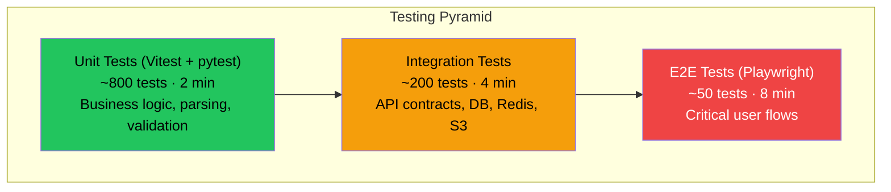
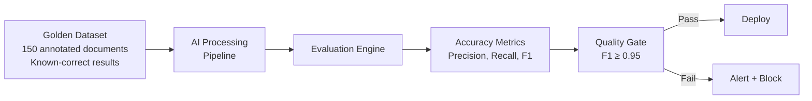
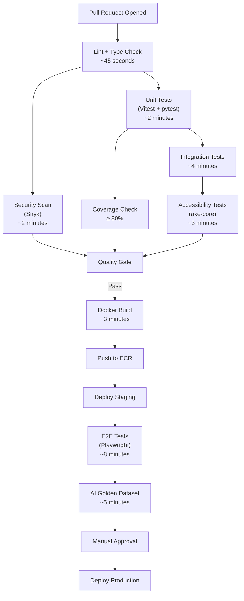

# 19 — Testing Strategy

> **Status**: Approved · **Owner**: Engineering · **Last Updated**: 2026-07-15

---

## 1. Overview

CitePilot's testing strategy ensures reliability across a system that combines deterministic logic (document parsing, API routing) with non-deterministic AI outputs (citation extraction, matching, explanation generation). The strategy defines test types, tools, coverage targets, and CI integration for every layer of the stack.

### Testing Principles

| Principle | Application |
|---|---|
| **Test the contract, not the implementation** | Assert on API responses and user-visible outcomes, not internal function calls |
| **AI outputs are validated, not hardcoded** | Use golden datasets, semantic similarity, and regression suites — not string equality |
| **Shift left** | Catch issues in unit tests before integration; catch in CI before staging |
| **Every bug gets a test** | When a bug is fixed, a regression test is added to prevent recurrence |
| **Tests must be fast** | Unit tests < 5 minutes; full CI pipeline < 15 minutes |

---

## 2. Testing Pyramid



| Layer | Tool | Target Count | Max Duration | Coverage Target |
|---|---|---|---|---|
| Unit Tests (Node.js) | Vitest | ~400 | 90 seconds | 85%+ line coverage |
| Unit Tests (Python) | pytest | ~400 | 90 seconds | 80%+ line coverage |
| Integration Tests | Vitest + pytest + Testcontainers | ~200 | 4 minutes | Critical paths 100% |
| E2E Tests | Playwright | ~50 | 8 minutes | Core user journeys |
| AI Output Tests | pytest (golden datasets) | ~150 | 5 minutes | 95%+ accuracy on golden set |
| Load Tests | k6 | ~10 scenarios | 10 minutes | Meet SLO targets |
| Security Tests | Snyk + custom | Continuous | Per CI run | Zero critical/high CVEs |
| Accessibility Tests | axe-core + Playwright | ~30 | 3 minutes | WCAG 2.1 AA compliance |

---

## 3. Unit Testing

### 3.1 Node.js — Vitest

**Configuration** (`vitest.config.ts`):

```typescript
import { defineConfig } from 'vitest/config';
import path from 'path';

export default defineConfig({
  test: {
    globals: true,
    environment: 'node',
    include: ['src/**/*.test.ts'],
    exclude: ['src/**/*.e2e.test.ts', 'src/**/*.integration.test.ts'],
    coverage: {
      provider: 'v8',
      reporter: ['text', 'json', 'html', 'lcov'],
      include: ['src/**/*.ts'],
      exclude: [
        'src/**/*.test.ts',
        'src/**/*.d.ts',
        'src/types/**',
        'src/generated/**',
      ],
      thresholds: {
        lines: 85,
        functions: 80,
        branches: 75,
        statements: 85,
      },
    },
    setupFiles: ['./src/test/setup.ts'],
    testTimeout: 10000,
  },
  resolve: {
    alias: {
      '@': path.resolve(__dirname, './src'),
    },
  },
});
```

**Example — Citation Matcher Unit Test**:

```typescript
import { describe, it, expect } from 'vitest';
import { matchCitationToReference } from '@/services/citation-matcher';

describe('matchCitationToReference', () => {
  const referenceList = [
    { id: 'ref1', authors: ['Smith', 'Jones'], year: 2023, title: 'AI in Education' },
    { id: 'ref2', authors: ['Smith'], year: 2021, title: 'Machine Learning Basics' },
    { id: 'ref3', authors: ['García', 'Lee', 'Chen'], year: 2023, title: 'NLP Advances' },
  ];

  it('should return exact match for single-author citation', () => {
    const result = matchCitationToReference(
      { authors: ['Smith'], year: 2021 },
      referenceList
    );
    expect(result).toEqual({
      status: 'matched',
      referenceId: 'ref2',
      confidence: 1.0,
    });
  });

  it('should return exact match for multi-author citation with et al.', () => {
    const result = matchCitationToReference(
      { authors: ['García'], year: 2023, hasEtAl: true },
      referenceList
    );
    expect(result).toEqual({
      status: 'matched',
      referenceId: 'ref3',
      confidence: 1.0,
    });
  });

  it('should return year_mismatch when author matches but year differs', () => {
    const result = matchCitationToReference(
      { authors: ['Smith', 'Jones'], year: 2022 },
      referenceList
    );
    expect(result).toEqual({
      status: 'year_mismatch',
      referenceId: 'ref1',
      confidence: 0.8,
      suggestion: 'Did you mean Smith & Jones (2023)?',
    });
  });

  it('should return no_match when citation has no corresponding reference', () => {
    const result = matchCitationToReference(
      { authors: ['Williams'], year: 2020 },
      referenceList
    );
    expect(result).toEqual({
      status: 'no_match',
      referenceId: null,
      confidence: 0,
    });
  });

  it('should handle accented characters in author names', () => {
    const result = matchCitationToReference(
      { authors: ['Garcia'], year: 2023, hasEtAl: true },
      referenceList
    );
    expect(result.status).toBe('matched');
    expect(result.referenceId).toBe('ref3');
  });
});
```

### 3.2 Python — pytest

**Configuration** (`pyproject.toml`):

```toml
[tool.pytest.ini_options]
testpaths = ["tests"]
python_files = ["test_*.py"]
python_classes = ["Test*"]
python_functions = ["test_*"]
addopts = [
    "--strict-markers",
    "--tb=short",
    "-q",
    "--cov=app",
    "--cov-report=term-missing",
    "--cov-report=xml:coverage.xml",
    "--cov-fail-under=80",
]
markers = [
    "unit: Unit tests (fast, no external dependencies)",
    "integration: Integration tests (requires services)",
    "ai: AI output validation tests (requires golden datasets)",
    "slow: Tests that take > 5 seconds",
]
filterwarnings = ["error", "ignore::DeprecationWarning"]

[tool.coverage.run]
source = ["app"]
omit = ["app/tests/*", "app/migrations/*", "app/scripts/*"]

[tool.coverage.report]
exclude_lines = [
    "pragma: no cover",
    "if TYPE_CHECKING:",
    "if __name__ == .__main__.",
]
```

**Example — Document Parser Unit Test**:

```python
import pytest
from app.parsers.docx_parser import DocxParser
from app.models.document import ParsedDocument


class TestDocxParser:
    """Unit tests for DOCX document parsing."""

    @pytest.fixture
    def parser(self):
        return DocxParser()

    @pytest.fixture
    def sample_docx(self, tmp_path):
        """Create a minimal test .docx file."""
        from docx import Document
        doc = Document()
        doc.add_paragraph("This is the body text (Smith, 2023).")
        doc.add_paragraph("Another citation (Jones & Lee, 2021).")
        doc.add_heading("References", level=1)
        doc.add_paragraph(
            "Smith, A. (2023). AI in education. Journal of Tech, 15(2), 45-60."
        )
        doc.add_paragraph(
            "Jones, B., & Lee, C. (2021). Machine learning. Publisher."
        )
        path = tmp_path / "test.docx"
        doc.save(str(path))
        return path

    def test_parse_extracts_body_and_references(self, parser, sample_docx):
        result: ParsedDocument = parser.parse(sample_docx)
        assert result.body_text is not None
        assert "Smith, 2023" in result.body_text
        assert len(result.reference_sections) == 1
        assert len(result.reference_sections[0].entries) == 2

    def test_parse_identifies_reference_heading(self, parser, sample_docx):
        result = parser.parse(sample_docx)
        assert result.reference_sections[0].heading == "References"

    def test_parse_rejects_empty_document(self, parser, tmp_path):
        from docx import Document
        doc = Document()
        path = tmp_path / "empty.docx"
        doc.save(str(path))
        result = parser.parse(path)
        assert result.body_text == ""
        assert len(result.reference_sections) == 0

    def test_parse_handles_missing_reference_section(self, parser, tmp_path):
        from docx import Document
        doc = Document()
        doc.add_paragraph("Body text only, no references section.")
        path = tmp_path / "no_refs.docx"
        doc.save(str(path))
        result = parser.parse(path)
        assert result.body_text is not None
        assert len(result.reference_sections) == 0
        assert result.warnings == ["No reference section detected"]
```

### 3.3 Coverage Enforcement

| Codebase | Tool | Line Coverage | Branch Coverage | Enforcement |
|---|---|---|---|---|
| Node.js (API Gateway) | Vitest + v8 | 85% | 75% | CI fails below threshold |
| Python (AI Processing) | pytest-cov | 80% | 70% | CI fails below threshold |
| React Components | Vitest + React Testing Library | 80% | 70% | CI fails below threshold |

Coverage reports are uploaded to Codecov on every PR. PRs that decrease coverage by more than 2% are flagged for review.

---

## 4. Integration Testing

### 4.1 Strategy

Integration tests validate interactions between components using real service instances via Testcontainers or CI service containers.

### 4.2 Service Dependencies

| Dependency | Test Approach | Configuration |
|---|---|---|
| PostgreSQL | GitHub Actions service container (`postgres:16-alpine`) | Test database with migrations applied |
| Redis | GitHub Actions service container (`redis:7-alpine`) | Ephemeral instance, flushed between tests |
| S3 | LocalStack in Docker | S3-compatible API on localhost |
| OpenAI API | Recorded HTTP fixtures (VCR.py / MSW) | Deterministic responses, no real API calls |
| Crossref API | Recorded HTTP fixtures | Real response snapshots |

### 4.3 Example — API Integration Test

```typescript
import { describe, it, expect, beforeAll, afterAll } from 'vitest';
import { createTestApp } from '@/test/create-test-app';
import { createTestUser, createAuthToken } from '@/test/helpers';

describe('POST /api/v1/documents/check', () => {
  let app: TestApp;
  let authToken: string;

  beforeAll(async () => {
    app = await createTestApp(); // Starts with real Postgres + Redis
    const user = await createTestUser(app.db, { plan: 'student' });
    authToken = await createAuthToken(user);
  });

  afterAll(async () => {
    await app.teardown();
  });

  it('should accept a valid document and return job ID', async () => {
    const response = await app.request
      .post('/api/v1/documents/check')
      .set('Authorization', `Bearer ${authToken}`)
      .send({
        text: 'According to Smith (2023), AI is transforming education.\n\nReferences\nSmith, A. (2023). AI in education. Journal of Tech, 15(2), 45-60.',
        style: 'apa7',
      });

    expect(response.status).toBe(202);
    expect(response.body).toMatchObject({
      jobId: expect.stringMatching(/^job_[a-z0-9]+$/),
      status: 'queued',
      estimatedWaitSeconds: expect.any(Number),
    });
  });

  it('should reject requests without authentication', async () => {
    const response = await app.request
      .post('/api/v1/documents/check')
      .send({ text: 'Some text', style: 'apa7' });

    expect(response.status).toBe(401);
    expect(response.body.error.code).toBe('UNAUTHORIZED');
  });

  it('should enforce rate limits for free tier', async () => {
    const freeUser = await createTestUser(app.db, { plan: 'free' });
    const freeToken = await createAuthToken(freeUser);

    // Exhaust free tier limit (3/day)
    for (let i = 0; i < 3; i++) {
      await app.request
        .post('/api/v1/documents/check')
        .set('Authorization', `Bearer ${freeToken}`)
        .send({ text: `Text ${i}`, style: 'apa7' });
    }

    const response = await app.request
      .post('/api/v1/documents/check')
      .set('Authorization', `Bearer ${freeToken}`)
      .send({ text: 'One more', style: 'apa7' });

    expect(response.status).toBe(429);
    expect(response.body.error.code).toBe('RATE_LIMIT_EXCEEDED');
  });

  it('should validate citation style parameter', async () => {
    const response = await app.request
      .post('/api/v1/documents/check')
      .set('Authorization', `Bearer ${authToken}`)
      .send({ text: 'Some text', style: 'invalid_style' });

    expect(response.status).toBe(400);
    expect(response.body.error.code).toBe('VALIDATION_ERROR');
  });
});
```

---

## 5. End-to-End Testing

### 5.1 Playwright Configuration

```typescript
import { defineConfig, devices } from '@playwright/test';

export default defineConfig({
  testDir: './e2e',
  fullyParallel: true,
  forbidOnly: !!process.env.CI,
  retries: process.env.CI ? 2 : 0,
  workers: process.env.CI ? 2 : undefined,
  reporter: [
    ['html', { open: 'never' }],
    ['json', { outputFile: 'e2e-results.json' }],
    ...(process.env.CI ? [['github'] as const] : []),
  ],
  use: {
    baseURL: process.env.BASE_URL ?? 'http://localhost:3000',
    trace: 'on-first-retry',
    screenshot: 'only-on-failure',
    video: 'retain-on-failure',
  },
  projects: [
    {
      name: 'chromium',
      use: { ...devices['Desktop Chrome'] },
    },
    {
      name: 'firefox',
      use: { ...devices['Desktop Firefox'] },
    },
    {
      name: 'mobile-chrome',
      use: { ...devices['Pixel 7'] },
    },
  ],
  webServer: process.env.CI ? undefined : {
    command: 'pnpm dev',
    url: 'http://localhost:3000',
    reuseExistingServer: !process.env.CI,
  },
});
```

### 5.2 Critical User Journeys

| Journey | Test File | Steps |
|---|---|---|
| **Free user upload** | `e2e/upload-free.spec.ts` | Sign up → paste text → select APA 7 → submit → view results → see matched/unmatched citations |
| **Paid user DOCX upload** | `e2e/upload-docx.spec.ts` | Sign in → upload .docx → select style → submit → wait for processing → view annotated results |
| **Citation style switching** | `e2e/style-switch.spec.ts` | Upload document → switch from APA 7 to Harvard → verify results update |
| **Crossref validation** | `e2e/crossref-validation.spec.ts` | Pro user → upload → enable Crossref check → verify external validation badges |
| **Account management** | `e2e/account.spec.ts` | Sign in → change plan → update profile → request data export → delete account |
| **Rate limit experience** | `e2e/rate-limit.spec.ts` | Free user → exhaust uploads → verify upgrade prompt shown |
| **PDF export** | `e2e/pdf-export.spec.ts` | Pro user → upload → view results → export PDF → verify download |
| **Institutional login** | `e2e/institutional-login.spec.ts` | SSO login → verify institutional dashboard → manage users |

### 5.3 Example — Upload Flow E2E Test

```typescript
import { test, expect } from '@playwright/test';

test.describe('Document Upload and Citation Check', () => {
  test.beforeEach(async ({ page }) => {
    // Authenticate via stored auth state
    await page.goto('/');
  });

  test('should check citations in pasted text and display results', async ({ page }) => {
    await page.goto('/check');

    // Paste document text
    const inputText = [
      'According to Smith (2023), AI is transforming education.',
      'This is supported by Jones and Lee (2021) who found similar results.',
      '',
      'References',
      'Smith, A. (2023). AI in education. Journal of Technology, 15(2), 45-60.',
      'Jones, B., & Lee, C. (2021). Machine learning in classrooms. Academic Press.',
    ].join('\n');

    await page.getByRole('textbox', { name: /paste your text/i }).fill(inputText);
    await page.getByRole('combobox', { name: /citation style/i }).selectOption('apa7');
    await page.getByRole('button', { name: /check citations/i }).click();

    // Wait for processing
    await expect(page.getByText(/processing/i)).toBeVisible();
    await expect(page.getByText(/results/i)).toBeVisible({ timeout: 30000 });

    // Verify results
    const matchedCitations = page.locator('[data-status="matched"]');
    await expect(matchedCitations).toHaveCount(2);

    // Verify colour coding
    const smithCitation = page.getByText('Smith (2023)').first();
    await expect(smithCitation).toHaveCSS('background-color', /rgb\(34, 197, 94\)|green/);
  });

  test('should detect unmatched citations', async ({ page }) => {
    await page.goto('/check');

    const inputText = [
      'According to Williams (2020), this citation has no reference.',
      '',
      'References',
      'Smith, A. (2023). A real reference. Journal, 1(1), 1-10.',
    ].join('\n');

    await page.getByRole('textbox', { name: /paste your text/i }).fill(inputText);
    await page.getByRole('combobox', { name: /citation style/i }).selectOption('apa7');
    await page.getByRole('button', { name: /check citations/i }).click();

    await expect(page.getByText(/results/i)).toBeVisible({ timeout: 30000 });

    const unmatchedCitation = page.locator('[data-status="no_match"]');
    await expect(unmatchedCitation).toHaveCount(1);
    await expect(unmatchedCitation).toContainText('Williams (2020)');
  });
});
```

---

## 6. AI Output Testing

### 6.1 Challenge

AI outputs are non-deterministic. The same input can produce slightly different citation extractions, match explanations, and corrections across runs. Traditional assertion-based testing (exact string match) is insufficient.

### 6.2 Golden Dataset Approach



### 6.3 Golden Dataset Structure

The golden dataset contains 150 manually annotated documents across all 9 citation styles:

| Style | Documents | Total Citations | Edge Cases |
|---|---|---|---|
| APA 7 | 25 | 380 | et al., multiple same-author-year (2023a, 2023b), secondary sources |
| APA 6 | 15 | 210 | Differences from APA 7 (6+ authors rule) |
| Harvard | 20 | 290 | Institutional variation, no & vs and consistency |
| Vancouver | 15 | 250 | Numeric references, superscript, sequential ordering |
| Chicago (Author-Date) | 15 | 220 | Footnotes vs in-text, ibid |
| Chicago (Notes-Bib) | 10 | 150 | Footnote extraction, shortened citations |
| MLA | 15 | 230 | Parenthetical vs narrative, page numbers |
| IEEE | 15 | 200 | Bracket numbers, sequential order |
| OSCOLA | 10 | 100 | Legal citations, case names, statutes |
| Turabian | 10 | 120 | Similar to Chicago, student-focused differences |

### 6.4 Evaluation Metrics

```python
import pytest
from pathlib import Path
from app.evaluation.golden_dataset import GoldenDatasetEvaluator


class TestAICitationExtraction:
    """Evaluate AI citation extraction against golden dataset."""

    @pytest.fixture(scope="session")
    def evaluator(self):
        dataset_path = Path("tests/golden_datasets/v2")
        return GoldenDatasetEvaluator(dataset_path)

    @pytest.mark.ai
    def test_citation_extraction_precision(self, evaluator):
        """Precision: of all citations the AI extracts, what % are real citations."""
        results = evaluator.evaluate_extraction()
        assert results.precision >= 0.96, (
            f"Citation extraction precision {results.precision:.3f} below threshold 0.96. "
            f"False positives: {results.false_positive_examples[:5]}"
        )

    @pytest.mark.ai
    def test_citation_extraction_recall(self, evaluator):
        """Recall: of all real citations, what % does the AI find."""
        results = evaluator.evaluate_extraction()
        assert results.recall >= 0.94, (
            f"Citation extraction recall {results.recall:.3f} below threshold 0.94. "
            f"Missed citations: {results.false_negative_examples[:5]}"
        )

    @pytest.mark.ai
    def test_citation_matching_accuracy(self, evaluator):
        """Accuracy of matching extracted citations to reference list entries."""
        results = evaluator.evaluate_matching()
        assert results.f1_score >= 0.95, (
            f"Citation matching F1 {results.f1_score:.3f} below threshold 0.95. "
            f"Mismatches: {results.mismatch_examples[:5]}"
        )

    @pytest.mark.ai
    def test_style_detection_accuracy(self, evaluator):
        """Accuracy of automatic citation style detection."""
        results = evaluator.evaluate_style_detection()
        assert results.accuracy >= 0.92, (
            f"Style detection accuracy {results.accuracy:.3f} below threshold 0.92"
        )

    @pytest.mark.ai
    def test_false_positive_rate_on_non_citations(self, evaluator):
        """Ensure years in running text are not flagged as citations."""
        results = evaluator.evaluate_false_positives()
        assert results.false_positive_rate <= 0.02, (
            f"False positive rate {results.false_positive_rate:.3f} exceeds 2% threshold. "
            f"Examples: {results.false_positive_examples[:5]}"
        )

    @pytest.mark.ai
    @pytest.mark.parametrize("style", [
        "apa7", "apa6", "harvard", "vancouver", "chicago_ad",
        "chicago_nb", "mla", "ieee", "oscola", "turabian",
    ])
    def test_per_style_f1_score(self, evaluator, style):
        """Each citation style must independently meet F1 threshold."""
        results = evaluator.evaluate_matching(style_filter=style)
        assert results.f1_score >= 0.90, (
            f"Style '{style}' F1 {results.f1_score:.3f} below 0.90"
        )
```

### 6.5 Regression Testing

When a bug is found in AI output:

1. Add the failing document to the golden dataset with correct annotations
2. Tag it with the bug ticket ID (e.g., `regression/BUG-142-et-al-threshold.json`)
3. Run regression suite — the new test must pass before merge
4. The regression dataset grows monotonically; tests are never removed

### 6.6 AI Drift Detection

A weekly scheduled CI job runs the full golden dataset evaluation and publishes results to a dashboard. If F1 drops below 0.93 (warning) or 0.90 (critical), an alert fires to the engineering Slack channel. This detects drift from OpenAI model updates or prompt regressions.

---

## 7. Load Testing

### 7.1 k6 Configuration

```javascript
// load-tests/citation-check.js
import http from 'k6/http';
import { check, sleep } from 'k6';
import { Rate, Trend } from 'k6/metrics';

const errorRate = new Rate('errors');
const checkDuration = new Trend('citation_check_duration');

export const options = {
  scenarios: {
    // Normal load: steady state
    steady_state: {
      executor: 'constant-arrival-rate',
      rate: 30,            // 30 requests per second
      timeUnit: '1s',
      duration: '5m',
      preAllocatedVUs: 50,
      maxVUs: 100,
    },
    // Peak load: 3x normal
    peak_load: {
      executor: 'ramping-arrival-rate',
      startRate: 30,
      timeUnit: '1s',
      stages: [
        { duration: '2m', target: 90 },   // Ramp to 3x
        { duration: '5m', target: 90 },   // Hold at 3x
        { duration: '2m', target: 30 },   // Ramp down
      ],
      preAllocatedVUs: 150,
      maxVUs: 300,
      startTime: '6m',
    },
    // Spike: sudden burst
    spike: {
      executor: 'ramping-arrival-rate',
      startRate: 30,
      timeUnit: '1s',
      stages: [
        { duration: '10s', target: 200 }, // Sudden spike
        { duration: '1m', target: 200 },  // Hold
        { duration: '30s', target: 30 },  // Recover
      ],
      preAllocatedVUs: 250,
      maxVUs: 500,
      startTime: '16m',
    },
  },
  thresholds: {
    http_req_duration: ['p(95)<3000', 'p(99)<8000'],   // 95th < 3s, 99th < 8s
    errors: ['rate<0.05'],                               // Error rate < 5%
    citation_check_duration: ['p(95)<15000'],            // Full check < 15s at p95
  },
};

const BASE_URL = __ENV.BASE_URL || 'https://staging.citepilot.com';
const AUTH_TOKEN = __ENV.AUTH_TOKEN;

const sampleDocument = `
According to Smith (2023), AI is transforming education in significant ways.
Jones and Lee (2021) support this finding with longitudinal data.
Furthermore, García et al. (2022) demonstrated improved outcomes.

References
Smith, A. (2023). AI in education. Journal of Technology, 15(2), 45-60.
Jones, B., & Lee, C. (2021). Machine learning in classrooms. Academic Press.
García, M., Chen, W., & Park, S. (2022). Educational outcomes with AI. Education Quarterly, 8(1), 12-28.
`;

export default function () {
  // Submit citation check
  const submitRes = http.post(
    `${BASE_URL}/api/v1/documents/check`,
    JSON.stringify({ text: sampleDocument, style: 'apa7' }),
    {
      headers: {
        'Content-Type': 'application/json',
        Authorization: `Bearer ${AUTH_TOKEN}`,
      },
    }
  );

  check(submitRes, {
    'submit status is 202': (r) => r.status === 202,
    'submit returns jobId': (r) => JSON.parse(r.body).jobId !== undefined,
  }) || errorRate.add(1);

  if (submitRes.status !== 202) return;

  const jobId = JSON.parse(submitRes.body).jobId;

  // Poll for results (max 30 seconds)
  let attempts = 0;
  let resultRes;
  do {
    sleep(2);
    resultRes = http.get(`${BASE_URL}/api/v1/documents/jobs/${jobId}`, {
      headers: { Authorization: `Bearer ${AUTH_TOKEN}` },
    });
    attempts++;
  } while (
    resultRes.status === 200 &&
    JSON.parse(resultRes.body).status === 'processing' &&
    attempts < 15
  );

  const completed = resultRes.status === 200 &&
    JSON.parse(resultRes.body).status === 'completed';

  check(resultRes, {
    'result status is 200': (r) => r.status === 200,
    'job completed': () => completed,
  }) || errorRate.add(1);

  if (completed) {
    checkDuration.add(attempts * 2000); // Approximate total wait time
  }
}
```

### 7.2 Load Test Targets (SLO Alignment)

| Metric | Target (p95) | Target (p99) | Measurement |
|---|---|---|---|
| API response time (submit) | < 500ms | < 1,500ms | Time to accept and queue document |
| Full citation check (end-to-end) | < 15s (5000 words) | < 30s (5000 words) | Submit to completed results |
| Concurrent users | 500 | 1,000 | Simultaneous active sessions |
| Throughput | 30 req/s (steady) | 90 req/s (peak) | Requests per second |
| Error rate | < 1% | < 5% | 4xx + 5xx responses |

### 7.3 Load Test Schedule

| Test Type | Frequency | Environment | Duration |
|---|---|---|---|
| Smoke test (10 VUs) | Every deployment to staging | Staging | 2 minutes |
| Load test (steady state) | Weekly (automated) | Staging | 10 minutes |
| Stress test (3x peak) | Before major releases | Staging | 20 minutes |
| Spike test | Before major releases | Staging | 5 minutes |
| Soak test (steady 24h) | Monthly | Staging | 24 hours |

---

## 8. Security Testing

### 8.1 Automated Security Scanning

| Tool | Scan Type | Frequency | Integration |
|---|---|---|---|
| **Snyk** (Open Source) | Dependency vulnerability scanning | Every CI run | GitHub Actions step; blocks on critical/high |
| **Snyk Code** | Static Application Security Testing (SAST) | Every PR | PR comment with findings |
| **Snyk Container** | Docker image vulnerability scanning | Every build | Blocks deployment on critical |
| **Snyk IaC** | Terraform misconfiguration detection | Every PR modifying `*.tf` | PR comment with findings |
| **tfsec** | Terraform security linting | Every PR modifying `*.tf` | Redundant check alongside Snyk IaC |
| **npm audit** | Node.js dependency audit | Every CI run | Advisory only (Snyk is authoritative) |
| **pip-audit** | Python dependency audit | Every CI run | Advisory only |

### 8.2 CI Security Gate

```yaml
# .github/workflows/security.yml
security-scan:
  runs-on: ubuntu-latest
  steps:
    - uses: actions/checkout@v4

    - name: Snyk Open Source Scan (Node.js)
      uses: snyk/actions/node@master
      env:
        SNYK_TOKEN: ${{ secrets.SNYK_TOKEN }}
      with:
        args: --severity-threshold=high

    - name: Snyk Open Source Scan (Python)
      uses: snyk/actions/python@master
      env:
        SNYK_TOKEN: ${{ secrets.SNYK_TOKEN }}
      with:
        args: --severity-threshold=high

    - name: Snyk Code (SAST)
      uses: snyk/actions/node@master
      env:
        SNYK_TOKEN: ${{ secrets.SNYK_TOKEN }}
      with:
        command: code test
        args: --severity-threshold=high

    - name: Snyk IaC
      uses: snyk/actions/iac@master
      env:
        SNYK_TOKEN: ${{ secrets.SNYK_TOKEN }}
      with:
        args: --severity-threshold=medium
        file: infrastructure/terraform/
```

### 8.3 Manual Security Testing

| Activity | Frequency | Performed By |
|---|---|---|
| Penetration testing | Annually | Third-party security firm |
| Threat modelling review | Each major feature | Engineering + Security lead |
| Auth flow review | Each auth change | Security lead |
| OWASP ZAP scan | Quarterly | Automated + Security lead review |

---

## 9. Accessibility Testing

### 9.1 Automated (axe-core + Playwright)

```typescript
import { test, expect } from '@playwright/test';
import AxeBuilder from '@axe-core/playwright';

test.describe('Accessibility Compliance', () => {
  const pages = [
    { name: 'Home', path: '/' },
    { name: 'Check Page', path: '/check' },
    { name: 'Results Page', path: '/results/sample' },
    { name: 'Pricing', path: '/pricing' },
    { name: 'Account Settings', path: '/account' },
    { name: 'Login', path: '/auth/signin' },
  ];

  for (const { name, path } of pages) {
    test(`${name} page should have no WCAG 2.1 AA violations`, async ({ page }) => {
      await page.goto(path);

      const results = await new AxeBuilder({ page })
        .withTags(['wcag2a', 'wcag2aa', 'wcag21a', 'wcag21aa'])
        .analyze();

      expect(results.violations).toEqual([]);
    });
  }

  test('Results page colour coding should meet contrast ratio', async ({ page }) => {
    await page.goto('/results/sample');

    const results = await new AxeBuilder({ page })
      .withTags(['wcag2aa'])
      .include('[data-status="matched"]')
      .include('[data-status="no_match"]')
      .include('[data-status="possible_match"]')
      .analyze();

    expect(results.violations.filter(v => v.id === 'color-contrast')).toEqual([]);
  });

  test('Upload form should be keyboard navigable', async ({ page }) => {
    await page.goto('/check');

    // Tab through form elements
    await page.keyboard.press('Tab');
    const firstFocused = await page.evaluate(() => document.activeElement?.getAttribute('name'));
    expect(firstFocused).toBeTruthy();

    // Should be able to submit with keyboard
    await page.getByRole('textbox', { name: /paste/i }).focus();
    await page.keyboard.type('Test text');
    await page.keyboard.press('Tab'); // Move to style selector
    await page.keyboard.press('Tab'); // Move to submit button
    await page.keyboard.press('Enter');

    // Verify submission triggered
    await expect(page.getByText(/processing|results|error/i)).toBeVisible({ timeout: 5000 });
  });
});
```

### 9.2 Accessibility Standards

| Standard | Target | Enforcement |
|---|---|---|
| WCAG 2.1 Level AA | Full compliance | CI gate — zero violations |
| Colour contrast ratio | ≥ 4.5:1 (normal text), ≥ 3:1 (large text) | axe-core check |
| Keyboard navigation | All interactive elements reachable | Playwright tab-order test |
| Screen reader | Semantic HTML, ARIA labels, live regions | Manual quarterly audit |
| Focus indicators | Visible on all interactive elements | Visual regression test |
| Reduced motion | `prefers-reduced-motion` respected | CSS media query + test |

---

## 10. CI Pipeline Configuration

### 10.1 Complete Pipeline



### 10.2 Quality Gates

| Gate | Condition | Action on Failure |
|---|---|---|
| **Lint** | Zero ESLint errors, zero Ruff errors | Block PR merge |
| **Type Check** | Zero TypeScript errors, zero mypy errors | Block PR merge |
| **Unit Test Coverage** | Node.js ≥ 85%, Python ≥ 80% | Block PR merge |
| **Security Scan** | Zero critical/high vulnerabilities | Block PR merge |
| **Integration Tests** | 100% pass rate | Block PR merge |
| **Accessibility** | Zero WCAG 2.1 AA violations | Block PR merge |
| **E2E Tests** | 100% pass rate (with 2 retries) | Block staging promotion |
| **AI Golden Dataset** | F1 ≥ 0.95 overall; ≥ 0.90 per style | Block production deployment |
| **Load Test (smoke)** | p95 < 3s, error rate < 5% | Warning (does not block) |

### 10.3 Test Environment Management

| Resource | Created | Destroyed | Isolation |
|---|---|---|---|
| Unit test DB | Per test file (in-memory) | After test file | Full isolation |
| Integration test DB | Per CI run (service container) | After CI run | Shared within run, migrations applied |
| Staging environment | Persistent | Never | Shared across PRs, reset nightly |
| E2E test accounts | Created in `beforeAll` | Cleaned in `afterAll` | Unique per test suite |

---

## 11. Test Data Management

### 11.1 Fixture Strategy

| Data Type | Storage | Generation |
|---|---|---|
| Sample documents (.docx, .pdf, .txt) | `tests/fixtures/documents/` | Hand-crafted covering all styles |
| Golden dataset annotations | `tests/golden_datasets/v2/` | Manually annotated, version-controlled |
| API response fixtures (OpenAI) | `tests/fixtures/api_responses/` | Recorded from real API calls (VCR pattern) |
| API response fixtures (Crossref) | `tests/fixtures/api_responses/` | Recorded from real API calls |
| User factory | `tests/factories/user.ts` | Programmatic generation per test |
| Document factory | `tests/factories/document.ts` | Programmatic generation per test |

### 11.2 Sensitive Data Handling

- No real user data in test fixtures
- All test documents contain synthetic academic content
- API response fixtures have real API keys redacted
- Golden dataset documents are original compositions — not copies of real papers

---

## 12. Testing Metrics & Reporting

### 12.1 Tracked Metrics

| Metric | Target | Dashboard |
|---|---|---|
| Unit test pass rate | 100% | GitHub Actions summary |
| Unit test coverage (Node.js) | ≥ 85% | Codecov PR comment |
| Unit test coverage (Python) | ≥ 80% | Codecov PR comment |
| Integration test pass rate | 100% | GitHub Actions summary |
| E2E test pass rate | 100% (after retries) | Playwright HTML report |
| AI extraction F1 | ≥ 0.95 | Custom dashboard (weekly trend) |
| CI pipeline duration | < 15 minutes | GitHub Actions |
| Flaky test rate | < 2% | Custom tracking |

### 12.2 Flaky Test Policy

- Tests that fail intermittently are tagged `@flaky` and investigated within 5 business days
- A test with > 3% flake rate over 30 days is quarantined (moved to a separate non-blocking suite)
- Root cause is identified and fixed; test is un-quarantined after 10 consecutive green runs
- Monthly flaky test review meeting

---

*Document Version: 1.0 · Next Review: 2026-10-15*
