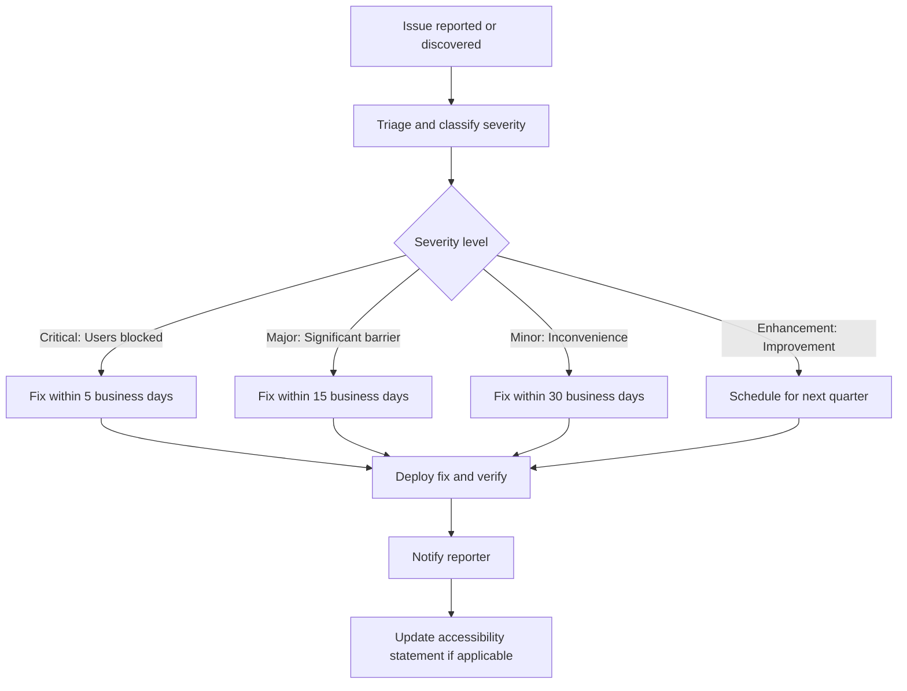

# Accessibility Statement

**CitePilot — AI-Powered Citation Consistency Checker**

**Effective Date:** July 14, 2026
**Last Updated:** July 14, 2026

---

## 1. Our Commitment to Accessibility

CitePilot is committed to ensuring that its citation consistency checking platform is accessible to all users, including people with disabilities. We believe that academic tools should be universally usable, regardless of ability. We actively work to meet or exceed accessibility standards and continuously improve the experience for all users.

This statement applies to the CitePilot web application at citepilot.com, including all user-facing pages: landing page, authentication flows, document upload, results view, account settings, help centre, and subscription management.

## 2. Conformance Level

CitePilot targets conformance with the **Web Content Accessibility Guidelines (WCAG) 2.1 at Level AA**. WCAG 2.1 is developed by the World Wide Web Consortium (W3C) Web Accessibility Initiative (WAI) and is the internationally recognised standard for web accessibility.

Level AA conformance means the Service satisfies all Level A and Level AA success criteria defined in WCAG 2.1. Where feasible, we also implement Level AAA criteria.

**Current conformance status:** Partially conforming. We are actively addressing known gaps and expect to achieve full Level AA conformance by Q4 2026. See Section 5 for known limitations.

## 3. Accessibility Features

The following accessibility features are implemented across the Service:

### 3.1. Perceivable

| Feature | Details |
|---------|---------|
| **Text alternatives** | All informational images, icons, and non-text content have descriptive `alt` text. Decorative images use empty `alt=""` attributes. Status icons (green/orange/red) include screen-reader-accessible text labels ("Matched," "Possible match," "No match"). |
| **Colour independence** | Colour is never the sole means of conveying information. All colour-coded results (green, orange, red) are supplemented with text labels, icons, and patterns. The results panel uses distinct icon shapes (checkmark, question mark, exclamation mark) alongside colour coding. |
| **Contrast ratios** | All text meets a minimum contrast ratio of 4.5:1 against its background (Level AA). Large text (18pt+) meets a minimum of 3:1. Interactive elements meet 3:1 contrast against adjacent colours. Both light and dark themes are tested for compliance. |
| **Text resizing** | The interface supports browser-level text resizing up to 200% without loss of content or functionality. Layouts reflow appropriately and no horizontal scrolling is required at 320px viewport width (1280px at 400% zoom). |
| **Captions and transcripts** | Any video content (tutorials, product demos) includes closed captions and text transcripts. |

### 3.2. Operable

| Feature | Details |
|---------|---------|
| **Full keyboard navigation** | All interactive elements (buttons, links, form fields, modals, dropdowns, tabs, and accordions) are fully operable using only a keyboard. No mouse-only interactions exist. |
| **Visible focus indicators** | All focusable elements display a clearly visible focus ring (3px solid outline with a 2px offset, using a high-contrast colour). Focus indicators are visible in both light and dark themes. Custom focus styles exceed the default browser indicators. |
| **Skip navigation** | A "Skip to main content" link is provided at the top of every page, visible on keyboard focus, allowing users to bypass repetitive navigation. Additional skip links for "Skip to results" and "Skip to reference list" are provided on the results page. |
| **No time limits** | The Service does not impose time limits on user interactions. Analysis processing uses asynchronous notifications rather than requiring the user to wait on a single page. |
| **No seizure-inducing content** | The Service does not contain flashing, blinking, or strobing content. Loading animations are subtle, low-frequency, and respect the `prefers-reduced-motion` media query. |
| **Touch targets** | All interactive elements have a minimum touch target size of 44×44 CSS pixels, meeting WCAG 2.1 Level AAA target size guidelines. |
| **Motion preferences** | Animations and transitions are automatically disabled or reduced when the user's operating system is configured with `prefers-reduced-motion: reduce`. |

### 3.3. Understandable

| Feature | Details |
|---------|---------|
| **Language declaration** | The HTML `lang` attribute is set correctly on all pages (`lang="en"`). |
| **Consistent navigation** | Navigation elements appear in the same relative order on every page. The primary navigation, breadcrumbs, and footer are consistent across all views. |
| **Form labels and instructions** | All form fields have associated `<label>` elements or `aria-label`/`aria-labelledby` attributes. Required fields are indicated both visually (asterisk) and programmatically (`aria-required="true"`). |
| **Error identification** | Form validation errors are displayed inline adjacent to the relevant field, described in text, and linked programmatically using `aria-describedby`. Errors are announced to screen readers via `aria-live="polite"` regions. |
| **Predictable behaviour** | No context changes occur on input (e.g., focus or selection) without prior warning. All actions that navigate away from the current page or submit data require explicit user activation (button click or Enter key). |

### 3.4. Robust

| Feature | Details |
|---------|---------|
| **Semantic HTML** | The Service uses semantic HTML5 elements (`<nav>`, `<main>`, `<article>`, `<section>`, `<aside>`, `<header>`, `<footer>`) to provide meaningful document structure. |
| **ARIA landmarks** | ARIA landmark roles (`banner`, `navigation`, `main`, `complementary`, `contentinfo`) are used to enable efficient screen reader navigation. |
| **ARIA live regions** | Dynamic content updates (e.g., analysis progress, result loading, status messages) use `aria-live` regions to announce changes to assistive technology users. Polite announcements are used for non-urgent updates; assertive announcements for errors and critical alerts. |
| **Valid HTML** | Pages pass W3C HTML validation without errors that would affect assistive technology parsing. |
| **Component accessibility** | Custom interactive components (dropdowns, modals, tabs, accordions, tooltips) follow the WAI-ARIA Authoring Practices Guide patterns and include appropriate roles, states, and properties. |

## 4. Assistive Technologies Supported

We test the Service with the following assistive technologies on a regular basis:

### 4.1. Screen Readers

| Screen Reader | Platform | Browser | Testing Frequency |
|---------------|----------|---------|-------------------|
| **NVDA** (2024.4+) | Windows | Chrome, Firefox | Every release |
| **JAWS** (2024+) | Windows | Chrome, Edge | Every release |
| **VoiceOver** | macOS (Sonoma+) | Safari | Every release |
| **VoiceOver** | iOS (17+) | Mobile Safari | Monthly |
| **TalkBack** | Android (14+) | Chrome | Monthly |

### 4.2. Other Assistive Technologies

| Technology | Testing Frequency |
|------------|-------------------|
| Keyboard-only navigation (no mouse) | Every release |
| Voice control (Windows Speech Recognition, macOS Voice Control) | Quarterly |
| Screen magnification (ZoomText, built-in OS zoom) | Quarterly |
| High contrast mode (Windows High Contrast, `forced-colors` media query) | Every release |
| Browser reader modes (Firefox Reader View, Safari Reader) | Quarterly |
| Switch access devices | Annually |

### 4.3. Browser Support

Accessibility testing is conducted on the following browsers:

| Browser | Minimum Version |
|---------|----------------|
| Google Chrome | 120+ |
| Mozilla Firefox | 120+ |
| Safari | 17+ |
| Microsoft Edge | 120+ |
| Mobile Safari (iOS) | 17+ |
| Chrome for Android | 120+ |

## 5. Known Limitations

We are aware of the following accessibility limitations and are actively working to resolve them:

| Area | Limitation | WCAG Criterion | Status | Target Resolution |
|------|-----------|----------------|--------|-------------------|
| PDF export | Exported PDF reports do not yet include tagged PDF structure for screen readers. The content is text-based and selectable but lacks programmatic reading order and alternative text for visual elements. | 1.3.1 Info and Relationships | In progress | Q3 2026 |
| Annotated document view | The annotated view that overlays colour-coded highlights on the original document text may not convey highlight boundaries clearly to screen reader users. An accessible alternative (list view with text descriptions) is available. | 1.3.1 Info and Relationships | Workaround available | Q4 2026 |
| Complex data tables | Results tables with sortable columns announce sort state changes, but the announcement may be delayed on JAWS in Chrome. Works correctly in other screen reader/browser combinations. | 4.1.3 Status Messages | Investigating | Q3 2026 |
| Drag-and-drop upload | The drag-and-drop file upload zone is not operable via keyboard. A fully accessible file picker button ("Browse files") is provided as an equivalent alternative directly adjacent to the drop zone. | 2.1.1 Keyboard | Workaround available | Accepted limitation |

## 6. Testing Methodology

Our accessibility testing combines automated, manual, and real-user testing:

### 6.1. Automated Testing

| Tool | Integration Point | Scope |
|------|-------------------|-------|
| **axe-core** (Deque) | CI/CD pipeline (GitHub Actions) — runs on every pull request | All rendered pages and components |
| **Lighthouse** (Accessibility audit) | CI/CD pipeline — runs on every deployment to staging | All public-facing pages |
| **eslint-plugin-jsx-a11y** | Development-time linting — runs on every code save | All React/JSX components |
| **Pa11y** | Scheduled weekly scans against production | Full site crawl of all user-facing routes |

Automated testing catches approximately 30–40% of accessibility issues. We treat it as a baseline, not a comprehensive solution.

### 6.2. Manual Testing

Every release undergoes manual accessibility testing that includes:

- **Keyboard navigation audit:** Tab through all interactive elements on every page; verify logical tab order, visible focus indicators, and keyboard operability of all controls.
- **Screen reader walkthrough:** Navigate the complete user flow (landing → register → upload → results → export) using NVDA on Windows and VoiceOver on macOS. Verify all content is announced correctly, dynamic updates are conveyed, and no information is lost.
- **Zoom testing:** Verify content is usable at 200% and 400% browser zoom on desktop, and test responsive layouts at 320px minimum viewport width.
- **Colour contrast verification:** Use the browser DevTools colour picker or the Colour Contrast Analyser (CCA) tool to spot-check any new design elements.
- **Form testing:** Verify all forms are completable with keyboard only, error messages are announced and associated with fields, and required fields are indicated programmatically.

### 6.3. Assistive Technology Testing

Dedicated assistive technology testing sessions are conducted:

- **Per release:** NVDA + Chrome, JAWS + Chrome, VoiceOver + Safari
- **Monthly:** VoiceOver on iOS, TalkBack on Android
- **Quarterly:** ZoomText, Windows High Contrast, Voice Control

### 6.4. Third-Party Audits

We commission an independent accessibility audit from a qualified third party annually. The audit covers:

- Full WCAG 2.1 Level AA conformance assessment
- Assistive technology compatibility testing
- Cognitive accessibility review
- Detailed remediation report with prioritised findings

The most recent third-party audit was conducted in June 2026. Previous audit reports are available upon request.

## 7. Feedback Mechanism

We welcome feedback on the accessibility of CitePilot. If you encounter an accessibility barrier, have suggestions for improvement, or need an accommodation, please contact us:

- **Email:** accessibility@citepilot.com
- **In-app:** Use the "Report accessibility issue" link in the footer of any page or in the Help menu
- **Support:** support@citepilot.com (include "Accessibility" in the subject line)

When reporting an accessibility issue, please include:

1. The page URL where you encountered the issue
2. A description of the problem and what you expected to happen
3. The assistive technology and browser you were using (e.g., "NVDA 2024.4 with Chrome 125 on Windows 11")
4. Screenshots or screen recordings if possible

We aim to acknowledge accessibility reports within 2 business days and provide a substantive response (including a timeline for resolution) within 10 business days.

## 8. Remediation Process

When an accessibility issue is reported or discovered:

**Severity definitions:**

| Severity | Definition | Example | SLA |
|----------|-----------|---------|-----|
| Critical | Users with disabilities are completely blocked from accessing core functionality | Login button not keyboard-accessible; results page not announced to screen readers | 5 business days |
| Major | Users with disabilities face significant barriers but have a workaround available | Sort function not keyboard-accessible but results can be filtered alternatively | 15 business days |
| Minor | An inconvenience that does not block functionality | Focus indicator slightly too faint on one component in dark theme | 30 business days |
| Enhancement | An improvement that would enhance the experience but is not a barrier | Adding additional ARIA description to clarify a complex interaction | Next quarterly release |

## 9. Applicable Standards and Regulations

This accessibility statement is informed by the following standards and regulations:

| Standard/Regulation | Jurisdiction | Relevance |
|---------------------|-------------|-----------|
| WCAG 2.1 Level AA | International | Primary accessibility standard we target |
| EN 301 549 | European Union | European standard for ICT accessibility; references WCAG 2.1 |
| Equality Act 2010 | United Kingdom | Prohibits discrimination against disabled persons in service provision |
| Section 508 (Revised) | United States | Federal accessibility requirements; references WCAG 2.0 Level AA |
| ADA (Americans with Disabilities Act) | United States | Prohibits discrimination in public accommodations, including websites |
| AODA (Accessibility for Ontarians with Disabilities Act) | Ontario, Canada | Requires WCAG 2.0 Level AA for web content |

## 10. Continuous Improvement

Accessibility is not a one-time project but an ongoing commitment. Our continuous improvement process includes:

- **Quarterly accessibility reviews:** A dedicated cross-functional review of new features and changes for accessibility compliance before release.
- **Annual third-party audit:** Independent assessment of the full Service against WCAG 2.1 Level AA.
- **Team training:** All frontend developers complete accessibility training upon onboarding and participate in annual refresher workshops. Training covers WCAG principles, assistive technology usage, and accessible coding patterns.
- **Design system:** Our component library includes built-in accessibility documentation and testing guidance for each component. New components are not approved for production use until they pass accessibility review.
- **User testing with disabled users:** We conduct usability testing sessions with users who rely on assistive technologies at least twice per year, incorporating their feedback directly into our product roadmap.

## 11. Contact

For questions about this accessibility statement or to report an accessibility issue:

- **Accessibility Team:** accessibility@citepilot.com
- **General Support:** support@citepilot.com
- **Website:** https://citepilot.com/accessibility

---

*© 2026 CitePilot Ltd. All rights reserved.*
