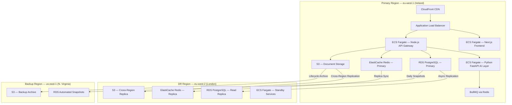
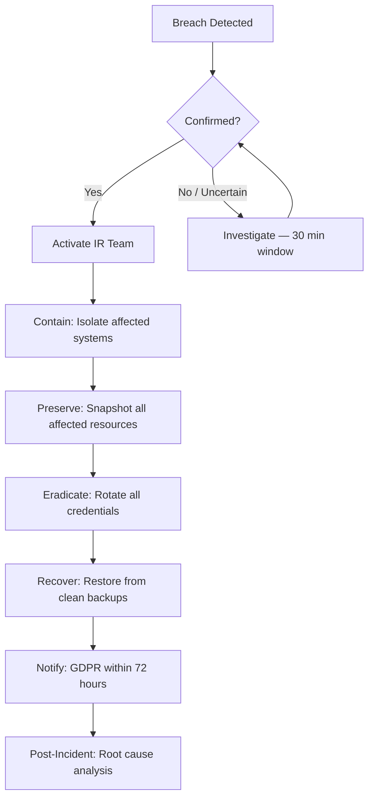
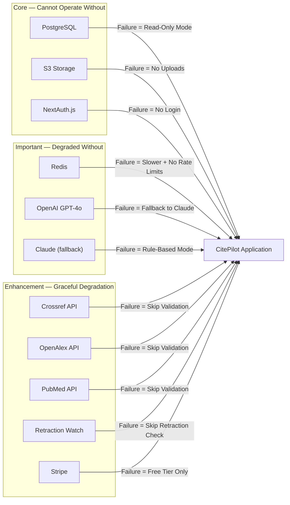

# 27 — Disaster Recovery Plan

> **Document ID**: CP-OPS-027
> **Version**: 1.0
> **Last Updated**: 2026-07-15
> **Owner**: Platform Engineering / SRE
> **Classification**: Internal — Restricted
> **Review Cadence**: Quarterly

---

## 1. Purpose & Scope

This document defines CitePilot's disaster recovery (DR) strategy, recovery procedures, and business continuity plan. It covers all production systems including the Next.js frontend, Node.js API gateway, Python FastAPI AI processing layer, PostgreSQL database, Redis cache, S3 document storage, and all third-party integrations (Stripe, Crossref, OpenAlex, PubMed, Retraction Watch).

The plan ensures that CitePilot can recover from partial or total infrastructure failures while maintaining data integrity and minimising user impact. All team members with on-call responsibilities must review this document quarterly and participate in DR drills.

---

## 2. Recovery Objectives

### 2.1 RTO / RPO Matrix

| System Component | RPO (Recovery Point Objective) | RTO (Recovery Time Objective) | Priority |
|---|---|---|---|
| PostgreSQL (primary database) | 1 minute | 15 minutes | P0 — Critical |
| S3 Document Storage | 0 (cross-region replication) | 5 minutes | P0 — Critical |
| Redis (session + rate limiting) | 15 minutes | 10 minutes | P1 — High |
| Redis (BullMQ job queue) | 30 minutes | 15 minutes | P1 — High |
| Next.js Frontend (CloudFront) | 0 (static assets cached) | 5 minutes | P1 — High |
| Node.js API Gateway (ECS) | N/A (stateless) | 10 minutes | P0 — Critical |
| Python FastAPI AI Layer (ECS) | N/A (stateless) | 10 minutes | P0 — Critical |
| Stripe Billing Integration | N/A (Stripe-managed) | 30 minutes | P2 — Medium |
| External APIs (Crossref, OpenAlex, PubMed) | N/A (external) | Graceful degradation | P3 — Low |
| Monitoring (Datadog + Sentry) | N/A | 60 minutes | P2 — Medium |

### 2.2 Availability Targets

| Tier | Target | Maximum Annual Downtime | Applies To |
|---|---|---|---|
| Tier 0 | 99.95% | 4 hours 22 minutes | Core citation checking pipeline |
| Tier 1 | 99.9% | 8 hours 45 minutes | User authentication, document upload |
| Tier 2 | 99.5% | 43 hours 48 minutes | PDF export, admin dashboard, analytics |
| Tier 3 | 99.0% | 87 hours 36 minutes | External API enrichment (Crossref, Retraction Watch) |

---

## 3. Infrastructure Architecture for DR

### 3.1 Production Topology



### 3.2 Multi-AZ Configuration

All production services run across a minimum of 2 Availability Zones within `eu-west-1`:

| Component | AZ Distribution | Failover Mechanism |
|---|---|---|
| ECS Fargate Tasks | 2 AZs, min 2 tasks per service | ALB health checks, automatic task replacement |
| RDS PostgreSQL | Multi-AZ deployment | Automatic failover to standby (60–120 seconds) |
| ElastiCache Redis | Multi-AZ with auto-failover | Replica promotion (< 30 seconds) |
| Application Load Balancer | 2+ AZs | AWS-managed, fully redundant |

---

## 4. Backup Strategy

### 4.1 PostgreSQL Database Backups

#### Automated Backups (AWS RDS)

| Parameter | Value |
|---|---|
| Backup Window | 02:00–03:00 UTC daily |
| Retention Period | 35 days |
| Backup Type | Automated snapshots + continuous WAL archiving |
| Point-in-Time Recovery | Yes — granularity to 1 second within retention window |
| Cross-Region Copy | Daily snapshot copy to `us-east-1` at 04:00 UTC |
| Encryption | AES-256 via AWS KMS (key alias: `citepilot/rds-backup`) |

#### Manual Snapshots

| Trigger | Retention |
|---|---|
| Pre-migration snapshot | 90 days |
| Pre-major-release snapshot | 60 days |
| Monthly compliance snapshot | 365 days |
| Quarterly DR drill snapshot | 90 days |

#### Logical Backups

A nightly `pg_dump` runs via an ECS scheduled task at 03:30 UTC, producing a compressed SQL dump uploaded to `s3://citepilot-db-backups-eu-west-1/logical/` with a 90-day lifecycle policy.

```bash
# Scheduled ECS task — runs nightly
pg_dump \
  --host=$RDS_ENDPOINT \
  --username=citepilot_backup \
  --format=custom \
  --compress=9 \
  --file=/tmp/citepilot_$(date +%Y%m%d_%H%M%S).dump \
  citepilot_production

aws s3 cp /tmp/citepilot_*.dump \
  s3://citepilot-db-backups-eu-west-1/logical/ \
  --sse aws:kms \
  --sse-kms-key-id alias/citepilot/s3-backup
```

### 4.2 S3 Document Storage Backups

| Feature | Configuration |
|---|---|
| Versioning | Enabled on `citepilot-documents-eu-west-1` |
| Cross-Region Replication | Real-time replication to `citepilot-documents-eu-west-2` |
| Lifecycle — Current Versions | Transition to S3 Intelligent-Tiering after 30 days |
| Lifecycle — Non-current Versions | Delete after 7 days (documents are transient per 36-hour policy) |
| Lifecycle — Backup Archive | Copy to `citepilot-archive-us-east-1` Glacier Deep Archive after 90 days |
| Encryption | SSE-S3 (AES-256) with bucket policy enforcing encryption |
| Object Lock | Not enabled (documents deleted within 36 hours per privacy policy) |

### 4.3 Redis Backup Strategy

#### ElastiCache Configuration

| Parameter | Value |
|---|---|
| Persistence | AOF (Append Only File) enabled, `appendfsync everysec` |
| Snapshot Schedule | Every 6 hours |
| Snapshot Retention | 7 days (28 snapshots) |
| Snapshot Window | 01:00–02:00 UTC |
| Multi-AZ | Enabled with automatic failover |
| Cluster Mode | Disabled (single-shard with replica) |

#### Data Classification in Redis

| Key Prefix | Data Type | Loss Impact | Recovery Strategy |
|---|---|---|---|
| `session:*` | User sessions | Low — users re-authenticate | Rebuild from NextAuth.js |
| `rate:*` | Rate limit counters | Negligible — counters reset | Self-healing on restart |
| `bull:*` | BullMQ job queue | Medium — in-flight jobs lost | Re-queue from PostgreSQL pending jobs table |
| `cache:crossref:*` | Crossref API cache | None — cache repopulates | Cold start, re-fetches on demand |
| `cache:validation:*` | Citation validation cache | None — cache repopulates | Cold start, re-fetches on demand |

### 4.4 Application Configuration & Secrets

| Item | Backup Location | Method |
|---|---|---|
| Environment variables | AWS Systems Manager Parameter Store | Versioned, encrypted with KMS |
| API keys & secrets | AWS Secrets Manager | Automatic rotation, versioned |
| Infrastructure as Code | GitHub repository (`citepilot-infra`) | Git history, branch protection |
| Docker images | Amazon ECR | Image tag immutability enabled |
| CI/CD pipelines | GitHub Actions (`.github/workflows/`) | Git-versioned |
| CloudFormation / Terraform state | S3 + DynamoDB state locking | Versioned, encrypted |

### 4.5 Backup Verification

| Check | Frequency | Method |
|---|---|---|
| RDS snapshot restore test | Monthly | Restore snapshot to isolated RDS instance, run schema validation queries |
| Logical backup restore test | Monthly | Restore `pg_dump` to test database, verify row counts and checksums |
| S3 cross-region object verification | Weekly | Compare object counts and checksums between source and replica buckets |
| Redis snapshot restore test | Monthly | Restore ElastiCache snapshot to test cluster, verify key counts |
| Full DR environment restore | Quarterly | Complete DR drill (see Section 8) |

---

## 5. Disaster Recovery Scenarios

### 5.1 Scenario Classification

| Severity | Description | Examples | Expected Frequency |
|---|---|---|---|
| S1 — Service Degradation | Single component failure, partial functionality impact | Single ECS task crash, cache miss spike | Weekly |
| S2 — Service Failure | Entire service unavailable, core functionality down | API gateway down, AI processing layer unresponsive | Monthly |
| S3 — Data Layer Failure | Database or storage layer failure | RDS primary failure, S3 bucket corruption | Annually |
| S4 — Region Failure | Entire AWS region unavailable | `eu-west-1` outage | Every 3–5 years |
| S5 — Security Incident | Data breach, unauthorised access, ransomware | Credential compromise, data exfiltration | Variable |

---

## 6. Recovery Procedures

### 6.1 S1 — Single Service Failure

**Symptoms**: Elevated error rates on a single service, health check failures, task restarts.

**Automatic Recovery**:
1. ALB health checks detect unhealthy tasks within 30 seconds
2. ECS replaces failed tasks automatically (desired count maintained)
3. CloudWatch alarm fires at 2+ task failures in 5 minutes
4. PagerDuty alert sent to on-call engineer

**Manual Intervention (if auto-recovery fails)**:

```bash
# 1. Check service status
aws ecs describe-services \
  --cluster citepilot-production \
  --services citepilot-api-gateway

# 2. Force new deployment (rolling restart)
aws ecs update-service \
  --cluster citepilot-production \
  --service citepilot-api-gateway \
  --force-new-deployment

# 3. Check task logs
aws logs tail /ecs/citepilot-api-gateway --since 15m --follow

# 4. If image is bad, roll back to previous task definition
aws ecs update-service \
  --cluster citepilot-production \
  --service citepilot-api-gateway \
  --task-definition citepilot-api-gateway:<PREVIOUS_REVISION>
```

**Estimated Recovery Time**: 2–10 minutes (automatic), 15 minutes (manual).

---

### 6.2 S2 — API Gateway Complete Failure

**Symptoms**: All API requests returning 5xx, ALB returning 503, zero healthy targets.

**Procedure**:

| Step | Action | Owner | Time |
|---|---|---|---|
| 1 | Acknowledge PagerDuty incident | On-call engineer | 0 min |
| 2 | Enable CloudFront custom error page (maintenance mode) | On-call engineer | +2 min |
| 3 | Check ECS service events for deployment failure | On-call engineer | +3 min |
| 4 | Verify RDS and Redis connectivity from a bastion host | On-call engineer | +5 min |
| 5 | If deployment failure: rollback to previous task definition | On-call engineer | +7 min |
| 6 | If infrastructure failure: redeploy service via Terraform | Platform engineer | +15 min |
| 7 | Verify health checks pass, disable maintenance mode | On-call engineer | +20 min |
| 8 | Monitor error rates for 30 minutes post-recovery | On-call engineer | +50 min |
| 9 | Write incident post-mortem within 48 hours | Incident commander | +48 hrs |

---

### 6.3 S3 — PostgreSQL Database Failure

#### 6.3.1 Multi-AZ Automatic Failover

RDS Multi-AZ handles primary instance failures automatically:

1. AWS detects primary instance failure
2. DNS endpoint (`citepilot-prod.xxxxxxx.eu-west-1.rds.amazonaws.com`) is remapped to standby
3. Failover completes in 60–120 seconds
4. Application connections reset and reconnect via connection pool retry logic

**Application-side configuration** (Node.js API gateway):

```javascript
// pg-pool configuration with failover resilience
const pool = new Pool({
  host: process.env.RDS_ENDPOINT,
  port: 5432,
  database: 'citepilot_production',
  max: 20,
  idleTimeoutMillis: 30000,
  connectionTimeoutMillis: 5000,
  // Retry logic handles brief DNS propagation during failover
  retry: {
    maxRetries: 5,
    initialDelayMs: 1000,
    maxDelayMs: 10000,
    backoffMultiplier: 2,
  },
});
```

#### 6.3.2 Point-in-Time Recovery (Data Corruption)

If data corruption is detected (e.g., bad migration, application bug writing invalid data):

```bash
# 1. Identify the last known good timestamp
# Review application logs and database audit trail

# 2. Restore to point-in-time (creates new RDS instance)
aws rds restore-db-instance-to-point-in-time \
  --source-db-instance-identifier citepilot-production \
  --target-db-instance-identifier citepilot-recovery-$(date +%Y%m%d) \
  --restore-time "2026-07-15T10:30:00Z" \
  --db-instance-class db.r6g.xlarge \
  --multi-az \
  --vpc-security-group-ids sg-xxxxxxxxx

# 3. Validate data integrity on recovery instance
psql -h citepilot-recovery-20260715.xxxxxxx.rds.amazonaws.com \
  -U citepilot_admin -d citepilot_production \
  -c "SELECT COUNT(*) FROM documents; SELECT COUNT(*) FROM citations; SELECT COUNT(*) FROM users;"

# 4. If validated, update application to point to recovery instance
# Update SSM Parameter Store
aws ssm put-parameter \
  --name "/citepilot/production/database/endpoint" \
  --value "citepilot-recovery-20260715.xxxxxxx.rds.amazonaws.com" \
  --type SecureString \
  --overwrite

# 5. Force ECS service redeployment to pick up new endpoint
aws ecs update-service \
  --cluster citepilot-production \
  --service citepilot-api-gateway \
  --force-new-deployment
```

**Estimated Recovery Time**: 25–45 minutes (PITR restore) + 10 minutes (validation and cutover).

#### 6.3.3 Cross-Region Restore (Region-Level DB Failure)

```bash
# 1. Identify latest cross-region snapshot in us-east-1
aws rds describe-db-snapshots \
  --region us-east-1 \
  --db-instance-identifier citepilot-production \
  --query 'DBSnapshots | sort_by(@, &SnapshotCreateTime) | [-1]'

# 2. Copy snapshot to DR region (eu-west-2) if not already there
aws rds copy-db-snapshot \
  --source-db-snapshot-identifier arn:aws:rds:us-east-1:ACCOUNT:snapshot:SNAPSHOT_ID \
  --target-db-snapshot-identifier citepilot-dr-restore \
  --region eu-west-2 \
  --kms-key-id alias/citepilot/rds-backup

# 3. Restore from snapshot in DR region
aws rds restore-db-instance-from-db-snapshot \
  --region eu-west-2 \
  --db-instance-identifier citepilot-dr-production \
  --db-snapshot-identifier citepilot-dr-restore \
  --db-instance-class db.r6g.xlarge \
  --multi-az
```

---

### 6.4 S4 — Full Region Failure

**Trigger**: AWS `eu-west-1` region becomes unavailable. All services, database, cache, and storage are inaccessible.

**Decision Authority**: CTO or VP Engineering must authorise regional failover. This is a high-impact operation with potential data loss up to the RPO window.

#### Regional Failover Runbook

| Step | Action | Owner | Target Time |
|---|---|---|---|
| 1 | Confirm regional outage via AWS Health Dashboard and independent monitoring | On-call engineer | 0 min |
| 2 | Escalate to incident commander, notify CTO | On-call engineer | +5 min |
| 3 | CTO authorises regional failover | CTO | +15 min |
| 4 | Promote RDS read replica in `eu-west-2` to standalone primary | Platform engineer | +20 min |
| 5 | Deploy ECS services in `eu-west-2` from ECR images | Platform engineer | +30 min |
| 6 | Create new ElastiCache Redis cluster in `eu-west-2` (warm start from snapshot or cold start) | Platform engineer | +35 min |
| 7 | Update Route 53 DNS records: `api.citepilot.com` → `eu-west-2` ALB | Platform engineer | +40 min |
| 8 | Update CloudFront origin to `eu-west-2` ALB | Platform engineer | +42 min |
| 9 | Update Stripe webhook endpoint to DR URL | Platform engineer | +45 min |
| 10 | Verify S3 cross-region replica bucket is serving documents | Platform engineer | +47 min |
| 11 | Run smoke tests against DR environment | QA engineer | +55 min |
| 12 | Update status page — service restored in DR region | Communications | +60 min |
| 13 | Monitor for 2 hours post-failover | On-call engineer | +180 min |

**Estimated Total Recovery Time**: 45–75 minutes from decision to authorise failover.

#### Failback Procedure (Return to Primary Region)

Failback occurs only after `eu-west-1` is confirmed stable for at least 24 hours:

1. Re-establish RDS replication from `eu-west-2` (now primary) back to `eu-west-1`
2. Allow replication to synchronise completely (monitor replication lag → 0)
3. Schedule maintenance window (low-traffic period, typically 02:00–04:00 UTC Sunday)
4. Enable maintenance mode on the application
5. Promote `eu-west-1` replica back to primary
6. Update DNS, CloudFront origin, and webhook endpoints back to `eu-west-1`
7. Verify all services healthy
8. Disable maintenance mode
9. Decommission `eu-west-2` standalone resources (keep replica infrastructure warm)

---

### 6.5 S5 — Security Incident / Data Breach

**Trigger**: Confirmed or suspected unauthorised access to production systems, data exfiltration, credential compromise, or ransomware.

#### Incident Response Procedure



#### Containment Actions

| Action | Command / Procedure | Owner |
|---|---|---|
| Revoke all API keys | Rotate all secrets in AWS Secrets Manager | Security engineer |
| Invalidate all user sessions | `FLUSHDB` on Redis session database (DB 0) | Platform engineer |
| Block external access | Update security group: deny all inbound on API ports | Platform engineer |
| Isolate compromised EC2/ECS | Detach from load balancer, attach forensic security group | Security engineer |
| Snapshot affected resources | Create EBS snapshots, RDS snapshot, export CloudTrail logs | Platform engineer |
| Rotate database credentials | Update RDS master password, application credentials | Security engineer |
| Rotate OpenAI / external API keys | Regenerate keys in provider dashboards, update Secrets Manager | Security engineer |
| Notify Stripe | Contact Stripe support if payment data potentially affected | CTO |

#### GDPR Breach Notification Requirements

| Requirement | Timeline | Responsible |
|---|---|---|
| Notify ICO (UK) / DPA (EU) | Within 72 hours of becoming aware | DPO / Legal |
| Notify affected users | Without undue delay if high risk to rights | DPO / Communications |
| Document the breach | Immediately — maintain breach register | DPO |
| Internal incident report | Within 5 business days | Incident commander |

---

## 7. Communication Plan

### 7.1 Incident Severity & Notification Matrix

| Severity | Internal Notification | External Notification | Status Page Update |
|---|---|---|---|
| S1 — Service Degradation | Slack `#incidents` | None | None (unless > 15 min) |
| S2 — Service Failure | Slack `#incidents` + PagerDuty escalation | None (unless > 30 min) | "Investigating" within 10 min |
| S3 — Data Layer Failure | PagerDuty + Slack + Email to engineering leadership | Status page + Twitter/X | "Identified" within 15 min |
| S4 — Region Failure | PagerDuty + Phone tree + Email to all stakeholders | Status page + Email to all users + Twitter/X | "Identified" within 10 min |
| S5 — Security Incident | Phone tree + Encrypted Slack channel `#security-ir` | Per legal/GDPR requirements | Only after legal approval |

### 7.2 Status Page

- **Provider**: Atlassian Statuspage (status.citepilot.com)
- **Components monitored**: Citation Checking, Document Upload, User Authentication, PDF Export, API Access, External Validations
- **Subscriber notifications**: Email and webhook for institutional customers

### 7.3 Stakeholder Contact List

| Role | Primary Contact | Backup Contact | Escalation Path |
|---|---|---|---|
| On-call Engineer | PagerDuty rotation schedule | Secondary on-call | → Platform Lead |
| Platform Engineering Lead | Direct phone | Slack DM | → VP Engineering |
| VP Engineering | Direct phone | Email | → CTO |
| CTO | Direct phone | Personal mobile | — |
| DPO (Data Protection Officer) | Direct phone | Email | → Legal counsel |
| Communications Lead | Slack DM | Email | → CEO |

---

## 8. DR Testing Program

### 8.1 Testing Schedule

| Test Type | Frequency | Scope | Duration | Participants |
|---|---|---|---|---|
| Backup restore verification | Monthly | Restore RDS snapshot + S3 objects to test environment | 2 hours | 1 platform engineer |
| Service failover drill | Monthly | Kill individual ECS service, verify auto-recovery | 1 hour | On-call engineer |
| Database failover test | Quarterly | Trigger RDS Multi-AZ failover in staging | 2 hours | Platform team |
| Redis failover test | Quarterly | Trigger ElastiCache replica promotion in staging | 1 hour | Platform team |
| Tabletop exercise | Quarterly | Walk through region failure scenario with full team | 3 hours | All engineering + leadership |
| Full regional failover drill | Semi-annually | Execute complete failover to `eu-west-2` in staging | 8 hours | Platform team + QA |
| Security incident simulation | Annually | Red team exercise with simulated breach response | Full day | Security + engineering + legal |

### 8.2 DR Drill Procedure

#### Pre-Drill

1. Schedule drill 2 weeks in advance; notify all participants
2. Create a fresh RDS snapshot of staging database
3. Verify DR region infrastructure is provisioned and current
4. Prepare drill observation checklist (time-to-detect, time-to-recover, steps followed)
5. Assign an observer who does not participate but records all actions and timestamps

#### During Drill

1. Inject failure scenario (pre-planned, only drill coordinator knows the scenario)
2. On-call engineer detects and responds using documented runbooks
3. Observer records all actions, decisions, and timestamps
4. Team executes recovery procedure
5. Verify service restoration via automated smoke tests
6. Measure actual RTO and RPO against targets

#### Post-Drill

1. Compare actual recovery times against RTO/RPO targets
2. Identify gaps in runbooks, tooling, or team knowledge
3. Update this document and all affected runbooks within 1 week
4. File drill report in `citepilot-infra` repository under `/dr-reports/`
5. Track remediation items as JIRA tickets with due dates

### 8.3 DR Drill Report Template

```markdown
## DR Drill Report — [Date]

**Scenario**: [Description of injected failure]
**Participants**: [Names and roles]
**Observer**: [Name]

### Timeline
| Time | Event | Action Taken |
|---|---|---|
| HH:MM | Failure injected | — |
| HH:MM | Alert received | Engineer acknowledged |
| HH:MM | Root cause identified | [Description] |
| HH:MM | Recovery initiated | [Procedure followed] |
| HH:MM | Service restored | Smoke tests passed |

### Results
| Metric | Target | Actual | Status |
|---|---|---|---|
| RTO | XX min | XX min | ✅ / ❌ |
| RPO | XX min | XX min | ✅ / ❌ |

### Findings
1. [Finding 1 — what worked well]
2. [Finding 2 — what needs improvement]

### Action Items
| Item | Owner | Due Date | JIRA Ticket |
|---|---|---|---|
| [Action] | [Name] | [Date] | CP-XXXX |
```

---

## 9. Business Continuity

### 9.1 Service Degradation Modes

When full recovery is not immediately possible, CitePilot operates in degraded modes to maintain core functionality:

| Mode | Trigger | Capabilities Retained | Capabilities Disabled |
|---|---|---|---|
| **Full Service** | Normal operation | All features | None |
| **Degraded — External APIs** | Crossref/OpenAlex/PubMed unavailable | Citation matching, AI explanations, document upload | Reference validation, retraction checking, hallucination detection |
| **Degraded — AI Processing** | OpenAI API unavailable, Claude fallback also down | Rule-based citation matching (reduced accuracy), document upload | AI explanations, smart false-positive reduction, hallucinated citation detection |
| **Degraded — Cache** | Redis unavailable | All features (slower performance) | Rate limiting reverts to application-level in-memory counters |
| **Read-Only Mode** | Database write failures | View existing results, download previous reports | New uploads, account changes, subscription changes |
| **Maintenance Mode** | Planned or emergency maintenance | Static maintenance page via CloudFront | All application features |

### 9.2 Circuit Breaker Configuration

External dependencies use circuit breaker patterns to prevent cascading failures:

```python
# Python FastAPI AI layer — circuit breaker for OpenAI
from circuitbreaker import circuit

@circuit(
    failure_threshold=5,
    recovery_timeout=60,
    expected_exception=OpenAIServiceError,
    fallback_function=use_claude_fallback,
)
async def analyze_citations_with_openai(document_text: str, style: str):
    """Primary AI analysis via OpenAI GPT-4o."""
    ...

@circuit(
    failure_threshold=3,
    recovery_timeout=120,
    expected_exception=ClaudeServiceError,
    fallback_function=use_rule_based_fallback,
)
async def use_claude_fallback(document_text: str, style: str):
    """Fallback AI analysis via Anthropic Claude."""
    ...

def use_rule_based_fallback(document_text: str, style: str):
    """Last-resort rule-based citation matching (reduced accuracy)."""
    ...
```

### 9.3 Data Durability Guarantees

| Data Type | Durability | Rationale |
|---|---|---|
| User accounts & subscriptions | 99.999999999% (S3 + RDS Multi-AZ + cross-region snapshots) | Critical business data |
| Citation check results | 99.99% (PostgreSQL Multi-AZ) | Results regenerable from source documents |
| Uploaded documents | 99.999999999% (S3 cross-region replication) — but deleted after 36 hours per privacy policy | Transient by design |
| BullMQ job state | Best-effort (Redis AOF) | Jobs re-creatable from pending jobs table in PostgreSQL |
| Rate limiting counters | Ephemeral (in-memory Redis) | Self-healing, no durability needed |

### 9.4 Dependency Failure Impact Analysis



---

## 10. Monitoring & Alerting for DR Readiness

### 10.1 Proactive DR Monitoring

| Check | Tool | Alert Threshold | Frequency |
|---|---|---|---|
| RDS replication lag (cross-region) | Datadog | > 5 minutes | Every 1 minute |
| RDS automated backup status | CloudWatch | Backup failed | After each backup window |
| S3 cross-region replication lag | CloudWatch | > 15 minutes | Every 5 minutes |
| ElastiCache replication lag | Datadog | > 10 seconds | Every 30 seconds |
| DR region ECS task definitions current | Custom Lambda | Primary ≠ DR revision | Daily at 06:00 UTC |
| ECR image availability in DR region | Custom Lambda | Missing image tag | On each production deploy |
| Secrets Manager last rotation | Custom Lambda | > 90 days since rotation | Daily |
| SSL certificate expiry | Datadog | < 30 days to expiry | Daily |

### 10.2 Runbook Freshness

All runbooks referenced in this document are stored in the `citepilot-infra` repository under `/runbooks/`. Each runbook includes a `last_verified` metadata field. A monthly automated check flags runbooks not verified in the past 90 days.

---

## 11. Roles & Responsibilities

| Role | Responsibilities |
|---|---|
| **On-Call Engineer** (rotating weekly) | First responder for all alerts; execute runbooks; escalate per severity matrix |
| **Incident Commander** (assigned per incident) | Coordinate response; make go/no-go decisions below S4; communicate status |
| **Platform Engineering Lead** | Own DR infrastructure; maintain runbooks; lead DR drills |
| **VP Engineering** | Approve S3-level recovery decisions; resource allocation for DR |
| **CTO** | Approve S4 regional failover; final authority on data loss trade-offs |
| **DPO** | Lead GDPR breach notification process; maintain breach register |
| **Communications Lead** | Draft user-facing communications; manage status page and social media |

---

## 12. Document Maintenance

| Activity | Frequency | Owner |
|---|---|---|
| Review and update this document | Quarterly | Platform Engineering Lead |
| Update after every production incident | Within 1 week of resolution | Incident Commander |
| Update after every DR drill | Within 1 week of drill | Drill Coordinator |
| Review backup retention policies | Semi-annually | Platform Engineering Lead + Legal |
| Verify all contact information | Monthly | On-Call Engineer |
| Review AWS region capacity and pricing | Annually | Platform Engineering Lead + Finance |

---

## Appendix A — Key AWS Resources

| Resource | Identifier | Region |
|---|---|---|
| Production RDS Instance | `citepilot-production` | `eu-west-1` |
| DR RDS Read Replica | `citepilot-dr-replica` | `eu-west-2` |
| Production ElastiCache | `citepilot-redis-prod` | `eu-west-1` |
| Document Storage (Primary) | `citepilot-documents-eu-west-1` | `eu-west-1` |
| Document Storage (Replica) | `citepilot-documents-eu-west-2` | `eu-west-2` |
| DB Backup Bucket | `citepilot-db-backups-eu-west-1` | `eu-west-1` |
| Archive Bucket | `citepilot-archive-us-east-1` | `us-east-1` |
| Production ECS Cluster | `citepilot-production` | `eu-west-1` |
| DR ECS Cluster | `citepilot-dr` | `eu-west-2` |
| KMS Key (RDS) | `alias/citepilot/rds-backup` | `eu-west-1` |
| KMS Key (S3) | `alias/citepilot/s3-backup` | `eu-west-1` |

## Appendix B — Recovery Command Quick Reference

```bash
# === RDS ===
# Force Multi-AZ failover (staging only — production is automatic)
aws rds reboot-db-instance --db-instance-identifier citepilot-staging --force-failover

# Restore point-in-time
aws rds restore-db-instance-to-point-in-time \
  --source-db-instance-identifier citepilot-production \
  --target-db-instance-identifier citepilot-pitr-$(date +%Y%m%d%H%M) \
  --restore-time "YYYY-MM-DDTHH:MM:SSZ"

# Promote read replica to standalone
aws rds promote-read-replica --db-instance-identifier citepilot-dr-replica

# === ElastiCache ===
# Create manual snapshot
aws elasticache create-snapshot \
  --replication-group-id citepilot-redis-prod \
  --snapshot-name citepilot-redis-manual-$(date +%Y%m%d)

# === ECS ===
# Force new deployment
aws ecs update-service --cluster citepilot-production --service SERVICE_NAME --force-new-deployment

# Rollback to previous task definition
aws ecs update-service --cluster citepilot-production --service SERVICE_NAME --task-definition TASK_DEF:PREVIOUS_REV

# === DNS ===
# Update Route 53 to DR region (use change-resource-record-sets with prepared JSON)
aws route53 change-resource-record-sets --hosted-zone-id ZONE_ID --change-batch file://dr-dns-failover.json
```

---

*This document is classified as Internal — Restricted. Distribution is limited to engineering, security, and executive leadership. Store securely and do not share externally.*
